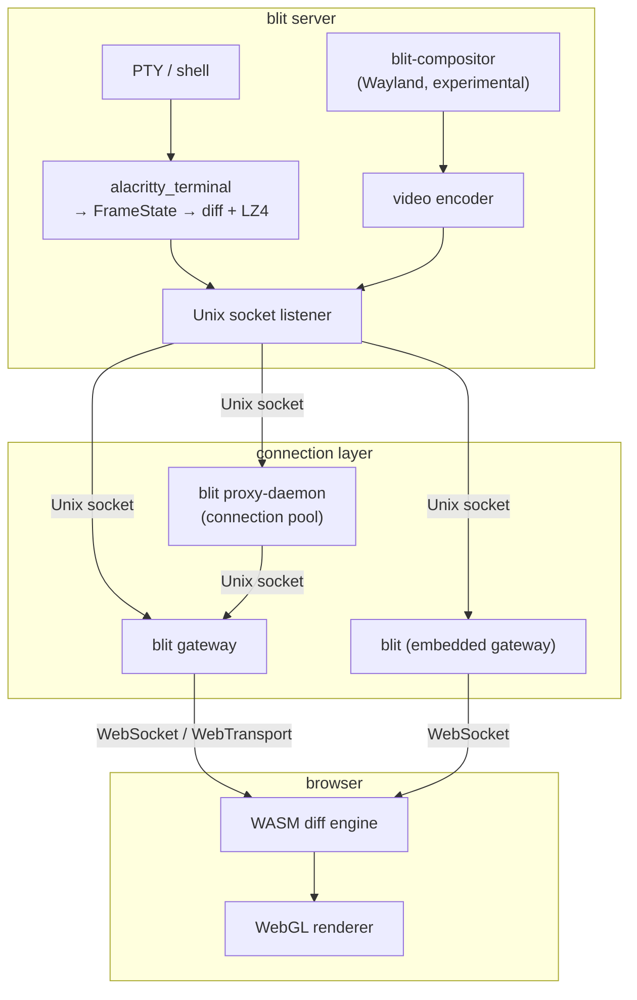
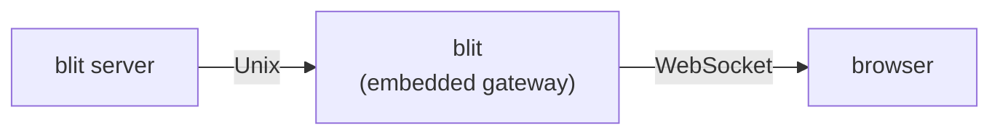
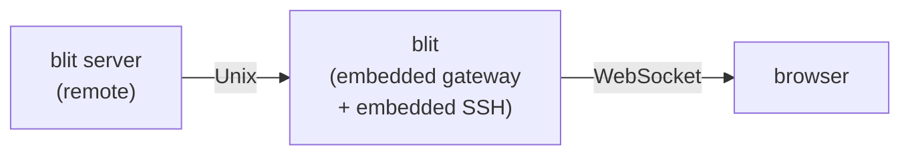
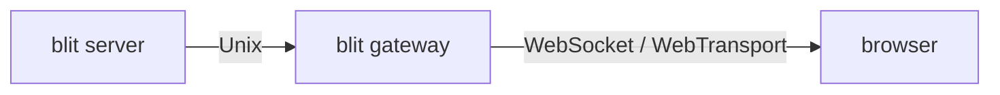
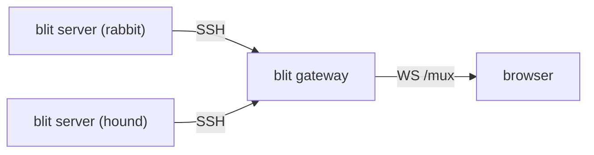
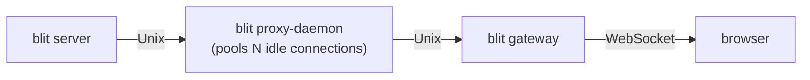
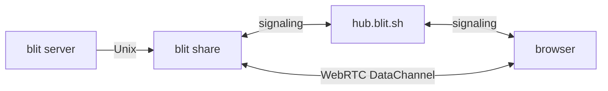
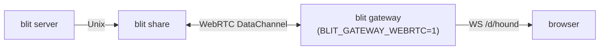

# Architecture

blit is a terminal streaming stack. The server parses PTY output into structured state, computes per-client binary diffs, and ships only the delta. The browser applies diffs in WASM and renders with WebGL. Keystrokes travel the reverse path with no queuing.

Detailed references:

- [docs/protocol.md](docs/protocol.md) — wire protocol, framing, opcode tables
- [docs/transports.md](docs/transports.md) — all transport options, topology diagrams, deployment patterns
- [docs/server.md](docs/server.md) — PTY lifecycle, compositor, frame pacing, server control
- [docs/frontend.md](docs/frontend.md) — WASM runtime, WebGL renderer, glyph atlas, input handling

---

## System overview



The server is the stateful half. It owns PTYs, scrollback, parsed terminal state, and per-client frame pacing. Everything above the Unix socket is stateless and restartable — PTYs survive gateway and proxy restarts.

---

## Crate map

| Crate                   | Directory                  | Kind          | Purpose                                                                                                              |
| ----------------------- | -------------------------- | ------------- | -------------------------------------------------------------------------------------------------------------------- |
| `blit-remote`           | `crates/remote/`           | lib           | Wire protocol: message builders/parsers, frame containers, state primitives, LZ4 compression                         |
| `blit-alacritty`        | `crates/alacritty-driver/` | lib           | Terminal parsing backend wrapping `alacritty_terminal`; snapshot generation, scrollback, title/mode tracking, search |
| `@blit-sh/browser`      | `crates/browser/`          | cdylib (WASM) | Applies compressed frame diffs, produces WebGL vertex data, manages glyph atlas                                      |
| `@blit-sh/core`         | `js/core/`                 | npm           | Framework-agnostic core: transports, workspace, connections, terminal surface, WebGL renderer                        |
| `@blit-sh/react`        | `js/react/`                | npm           | Thin React wrapper: context provider, hooks, `BlitTerminal` component                                                |
| `@blit-sh/solid`        | `js/solid/`                | npm           | Thin Solid wrapper: context provider, primitives, `BlitTerminal` component                                           |
| `blit-server`           | `crates/server/`           | lib           | PTY host and frame scheduler. Listens on Unix socket.                                                                |
| `blit-gateway`          | `crates/gateway/`          | lib           | WebSocket/WebTransport proxy with passphrase auth. Multi-destination, live remotes.                                  |
| `blit-proxy`            | `crates/proxy/`            | lib           | Connection pool and transparent proxy. One process, multiple upstream targets, pre-warmed pools.                     |
| `blit` (CLI)            | `crates/cli/`              | bin           | Browser client, agent subcommands, SSH/proxy/share transports, `remote` management, `server`/`share` subcommands     |
| `blit-webrtc-forwarder` | `crates/webrtc-forwarder/` | lib           | WebRTC bridge: signaling, STUN/TURN NAT traversal, peer-to-peer data channels                                        |
| `blit-fonts`            | `crates/fonts/`            | lib           | Font discovery and metadata (TTF/OTF `name`/`post`/`hmtx` table parsing)                                             |
| `blit-webserver`        | `crates/webserver/`        | lib           | Shared axum helpers: HTML serving, font routes, config WebSocket, remotes file                                       |
| `blit-compositor`       | `crates/compositor/`       | lib           | Experimental headless Wayland compositor (smithay): surface multiplexing, input injection                            |

Each Rust crate is a single `lib.rs` or `main.rs`. Larger crates (`blit-cli`, `blit-webrtc-forwarder`) use a small number of sibling files in the same directory.

### Dependency graph

```mermaid
graph TD
    remote[blit-remote] --> alacritty[blit-alacritty]
    remote --> browser[blit-browser]
    remote --> cli[blit-cli]
    remote --> forwarder[blit-webrtc-forwarder]
    remote --> compositor[blit-compositor]

    alacritty --> server[blit-server]
    compositor --> server
    server --> cli
    forwarder --> cli

    browser --> core[@blit-sh/core]
    core --> react[@blit-sh/react]
    core --> solid[@blit-sh/solid]
    solid --> ui[@blit-sh/ui]

    fonts[blit-fonts] --> webserver[blit-webserver]
    webserver --> gateway[blit-gateway]
    webserver --> cli
```

`blit-proxy` has no blit-specific dependencies — it depends only on tokio, tokio-tungstenite, and web-transport-quinn.

---

## Deployment topologies

See [docs/transports.md](docs/transports.md) for the full transport reference. The most common topologies:

### 1. Local (`blit open`)



`blit open` auto-starts `blit server` if needed, embeds a temporary gateway, and opens the browser. Everything runs in one user session.

### 2. Remote via SSH (`blit remote add host ssh:host && blit open`)



SSH remotes configured in `blit.remotes` are connected via an embedded SSH client (russh). The embedded client authenticates via ssh-agent and key files, resolves `~/.ssh/config`, and opens `direct-streamlocal` channels to the remote blit socket. Multiple channels share a single TCP+SSH connection per host.

### 3. Persistent gateway (`blit gateway`)



For a permanent deployment. The gateway handles browser auth (passphrase), serves the UI, and proxies binary frames. Destinations are configured via `blit.remotes` (live-reloaded, 0600); `BLIT_REMOTES` overrides the file path.

### 4. Multi-remote gateway



The gateway reads `blit.remotes` and connects to each remote via the embedded SSH client. The browser opens a **single** WebSocket to `/mux` and multiplexes all destination traffic over it using 2-byte channel ID prefixes (see [docs/protocol.md § Multiplexed WebSocket](docs/protocol.md#multiplexed-websocket-mux)). Each channel maps to one upstream connection. Session IDs are namespaced (`rabbit:1`, `hound:1`). The legacy `/d/<name>` endpoint (one WS per destination) is still supported for backward compatibility.

### 5. Proxy-accelerated gateway



Enabled by default on Unix (disable with `BLIT_PROXY=0`). Each browser WebSocket is handed a pre-warmed upstream connection from the pool instead of opening a fresh one. Useful when the upstream is remote (TCP, WS, WT) and connection setup latency is perceptible.

### 6. WebRTC share (`blit share`)



No gateway required. The forwarder advertises a passphrase-derived public key on the hub. The browser connects to the same channel using the same passphrase-derived key and is identified by a unique sessionId (UUID) assigned by the hub, so multiple consumers can connect concurrently. STUN/TURN handles NAT traversal.

### 7. Gateway-proxied WebRTC share (`BLIT_GATEWAY_WEBRTC=1`)



When `BLIT_GATEWAY_WEBRTC=1`, the gateway connects to `share:` remotes in `blit.remotes` as a WebRTC consumer and re-exposes them over its normal WebSocket/WebTransport path. The browser never touches WebRTC or the hub directly. The gateway appends `?proxiable=true` to `share:` URIs in the config WebSocket `remotes:` message so the browser knows to use `WS /d/<name>` instead of `createShareTransport`.

---

## Configuration files

Two files under `~/.config/blit/` (or `$XDG_CONFIG_HOME/blit/`) store persistent state:

### `blit.conf` — browser settings

`key = value` pairs. Written by the browser when `BLIT_STORE_CONFIG=1`. Read by the config WebSocket on connect. Settings include font family, theme, font size.

Special key: `target = <uri-or-name>` — sets the default connection target for all CLI subcommands and `blit open` when no destination is specified.

### `blit.remotes` — named remotes (mode 0600)

`name = uri` pairs, one per line. Contains passphrases for `share:` destinations and SSH host references, so permissions are restricted.

Managed with `blit remote add/remove/list/set-default`. Watched at runtime by `blit gateway` and the CLI's embedded gateway — changes are pushed live to all open `/config` WebSocket clients as `remotes:<text>` messages.

---

## Config WebSocket protocol

The `/config` endpoint is WebSocket-only (plain HTTP GET falls through to the SPA). After the passphrase handshake:

```mermaid
sequenceDiagram
    participant C as client (browser)
    participant S as server (gateway / CLI)

    C->>S: passphrase (text frame)
    S->>C: ok
    S->>C: remotes:&lt;blit.remotes contents&gt;
    S->>C: key=value  (zero or more blit.conf entries)
    S->>C: ready
    note over C,S: live updates follow
    S-->>C: remotes:&lt;new contents&gt;  (on blit.remotes change)
    S-->>C: key=value  (on blit.conf change)
    C-->>S: set key value  (write a browser setting)
```

The `remotes:` message carries the raw file text. The browser parses it as `name = uri` lines to build its destination list. URI types the browser handles:

| URI prefix                   | Meaning                                        | Browser action                    |
| ---------------------------- | ---------------------------------------------- | --------------------------------- |
| (no prefix)                  | Gateway-proxied destination                    | WebSocket to `/d/<name>`          |
| `share:`                     | WebRTC session (passphrase follows the colon)  | `createShareTransport(hub, pass)` |
| `share:` + `?proxiable=true` | Gateway-proxied WebRTC session                 | WebSocket to `/d/<name>`          |
| `ssh:`                       | SSH target (displayed only; routing via proxy) | WebSocket to `/d/<name>`          |
| `tcp:`                       | TCP target (displayed only; routing via proxy) | WebSocket to `/d/<name>`          |

`share:` destinations connect the browser directly to the hub via WebRTC. When `BLIT_GATEWAY_WEBRTC=1`, the gateway proxies them instead and appends `?proxiable=true` to the URI in the `remotes:` message, causing the browser to use `WS /d/<name>` instead.

---

## blit proxy-daemon protocol

`blit proxy-daemon` listens on a Unix socket (`$XDG_RUNTIME_DIR/blit-proxy.sock`, or `/tmp/blit-proxy.sock` as fallback) on Unix and a named pipe (`\\.\pipe\blit-proxy`) on Windows. Clients declare their upstream target before the blit protocol begins:

```mermaid
sequenceDiagram
    participant C as client (gateway / CLI)
    participant P as blit proxy-daemon
    participant U as upstream blit server

    C->>P: target &lt;uri&gt;\n
    P->>U: connect (pooled or fresh)
    P->>C: ok\n
    note over C,U: blit wire protocol flows transparently
    C-->>P: blit frames
    P-->>U: blit frames
    U-->>P: blit frames
    P-->>C: blit frames
```

After `ok`, the proxy copies bytes bidirectionally between the client and a pooled upstream connection. The proxy is protocol-transparent and version-agnostic.

Upstream URI formats accepted by the proxy:

| Scheme    | Example                                     | Notes                           |
| --------- | ------------------------------------------- | ------------------------------- |
| `socket:` | `socket:/run/blit/server.sock`              | Unix socket, no auth            |
| `tcp:`    | `tcp:host:3264`                             | Raw TCP, no auth                |
| `ws://`   | `ws://host:3264/?passphrase=secret`         | WebSocket, gateway auth         |
| `wss://`  | `wss://host:3264/?passphrase=secret`        | WebSocket+TLS, gateway auth     |
| `wt://`   | `wt://host:4433/?passphrase=s&certHash=aa…` | WebTransport/QUIC, gateway auth |

Passphrase and cert hash are embedded as query parameters in the URI so the pool can reconnect without additional configuration.

---

## URI scheme reference

All blit components share a common URI vocabulary for addressing blit server instances:

| URI                          | Where accepted                  | Meaning                                                         |
| ---------------------------- | ------------------------------- | --------------------------------------------------------------- |
| `local`                      | CLI, `blit.remotes`             | Local blit server (auto-start)                                  |
| `socket:/path`               | CLI, `blit.remotes`, BLIT_DEST. | Unix socket / named pipe                                        |
| `ssh:[user@]host[:/socket]`  | CLI, `blit.remotes`             | Embedded SSH (russh) + auto-install                             |
| `tcp:host:port`              | CLI, `blit.remotes`, BLIT_DEST. | Raw TCP                                                         |
| `ws[s]://host/?passphrase=…` | blit proxy-daemon upstream      | WebSocket (plain or TLS)                                        |
| `wt://host/?passphrase=…`    | blit proxy-daemon upstream      | WebTransport / QUIC                                             |
| `share:passphrase`           | CLI, `blit.remotes`             | WebRTC via hub; gateway proxies it when `BLIT_GATEWAY_WEBRTC=1` |
| `share:passphrase?hub=URL`   | `blit.remotes`                  | WebRTC via custom hub URL                                       |
| `proxy:uri`                  | CLI (`--on`)                    | Explicitly route through blit proxy-daemon                      |
| `name`                       | CLI (`--on`), blit.conf         | Named remote from blit.remotes                                  |

Set `BLIT_PROXY=0` to bypass proxy routing and connect directly for `ssh:`, `tcp:`, `ws:`, `wss:`, and `wt:` URIs.
