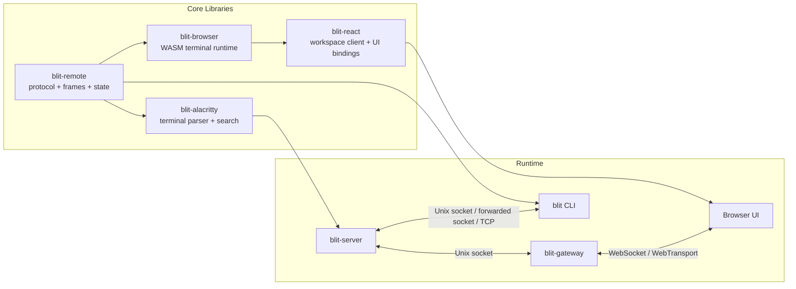

# blit

blit is a terminal streaming stack built for slow, lossy, high-latency networks.

It keeps remote shells usable where ordinary SSH starts to feel sticky: long-haul links, mobile hotspots, VPNs, satellite hops, flaky hotel Wi-Fi, and browser-only environments. The project ships as:

- `blit-server`: the PTY host and frame producer
- `blit-gateway`: the browser gateway over WebSocket and WebTransport
- `blit` / `blit-cli`: the end-user client, with browser and console modes
- `blit-react`: the embeddable React client and transport layer

## Why blit

- It streams terminal state as binary frame diffs instead of repainting the world on every keystroke.
- It multiplexes many PTYs behind one server and one browser UI.
- It separates the long-lived PTY host from the browser-facing gateway, so sessions can survive gateway restarts.
- It has a browser-first UX without giving up a console-mode client.
- It exposes the same transport and rendering stack for embedding in your own apps.

## What lives in this repo

| Component | Purpose |
| --- | --- |
| `server/` | `blit-server`, the PTY host and frame scheduler |
| `gateway/` | `blit-gateway`, the browser/Web transport bridge |
| `cli/` | `blit`, the end-user browser/console client |
| `web-app/` | The browser UI served by `blit-gateway` |
| `react/` | `blit-react`, the workspace-based React client library |
| `browser/` | `blit-browser`, the WASM terminal runtime |
| `remote/` | `blit-remote`, the wire protocol and frame/state primitives |
| `alacritty-driver/` | `blit-alacritty`, terminal parsing and search backed by `alacritty_terminal` |
| `fonts/` | Font discovery and metadata helpers |
| `webserver/` | Shared helpers for serving browser assets and font routes |
| `demo/` | Demo programs and test content |

## Quick start

### Local development shell

```bash
nix develop
```

If you use `direnv`, the repo already includes an `.envrc` for the flake and local `bin/` scripts.

### Local browser flow

```bash
# terminal 1
cargo run -p blit-server

# terminal 2
cargo run -p blit-cli
```

In browser mode, `blit` embeds a temporary gateway on a random loopback port, injects a one-time session token into the HTML, and opens the browser automatically. You do not need to run `blit-gateway` separately for this path.

### Local console flow

```bash
cargo run -p blit-cli -- --console
```

### Standalone gateway flow

```bash
# terminal 1
BLIT_PASS=secret cargo run -p blit-gateway

# terminal 2
cargo run -p blit-server
```

Then open `http://localhost:3264` and enter the passphrase.

### Remote host over SSH

```bash
blit myhost
blit user@myhost
blit --console myhost
```

For SSH targets, `blit` forwards the remote Unix socket over SSH and either:

- opens the browser with an embedded local gateway, or
- renders directly in the current terminal with `--console`

### Auto-reload development loop

```bash
nix develop
dev
```

`dev` uses `process-compose.yml` to rebuild browser assets and restart the main Rust binaries during development.

## Architecture



### The runtime split

`blit-server` is the stateful part. It owns PTYs, scrollback, titles, focus, and per-client frame pacing.

`blit-gateway` is the browser-facing part. It serves the web app, authenticates clients, upgrades to WebSocket, optionally enables WebTransport, and forwards framed binary messages to the server's Unix socket.

That split matters:

- PTYs can stay alive while the gateway restarts.
- The gateway can sit behind a reverse proxy or a TLS terminator.
- The CLI can reuse the same model locally by embedding a gateway only when it needs one.

### How a frame moves through the system

1. A PTY writes bytes.
2. `blit-server` feeds them into `blit-alacritty`, which tracks screen state, title changes, cursor position, modes, and scrollback.
3. The server compares the new frame against what a given client has already seen.
4. `blit-remote` encodes only the delta and attaches protocol metadata.
5. The gateway ships the message over WebSocket or WebTransport.
6. The browser or embedded client applies the update to a terminal state machine and renders it with WebGL/WASM.

### Why it stays responsive

blit is not just "terminal over WebSocket". It also:

- keeps explicit per-client state, so diffs are small
- uses binary protocol messages instead of JSON
- sends client metrics back to the server
- paces frame production based on backlog, render timing, and measured delivery
- separates the lead session from background previews
- supports scrollback frames and server-side title/scrollback search

## Core binaries

### `blit-server`

`blit-server` hosts PTYs and exposes them over a Unix socket.

It is responsible for:

- creating and closing PTYs
- tracking scrollback and titles
- keeping exited sessions readable
- handling focus, resize, mouse, and search messages
- producing client-specific frame updates

Examples:

```bash
blit-server
blit-server --socket /tmp/blit.sock
```

Environment:

| Variable | Default | Purpose |
| --- | --- | --- |
| `SHELL` | `/bin/sh` | Shell to spawn for new PTYs |
| `BLIT_SOCK` | `$XDG_RUNTIME_DIR/blit.sock` or `/tmp/blit.sock` | Unix socket path |
| `BLIT_SCROLLBACK` | `10000` | Scrollback rows per PTY |

### `blit-gateway`

`blit-gateway` serves the web app and proxies browser traffic to `blit-server`.

Features:

- passphrase auth
- static asset serving
- WebSocket transport
- optional WebTransport over QUIC/HTTP3
- self-signed cert generation for local QUIC
- injection of the live certificate hash into the served HTML
- font discovery routes for the browser UI

Examples:

```bash
BLIT_PASS=secret blit-gateway
BLIT_PASS=secret BLIT_ADDR=127.0.0.1:3264 blit-gateway
BLIT_PASS=secret BLIT_QUIC=1 blit-gateway
```

Environment:

| Variable | Default | Purpose |
| --- | --- | --- |
| `BLIT_PASS` | required | Browser passphrase |
| `BLIT_ADDR` | `0.0.0.0:3264` | HTTP/WebSocket listen address |
| `BLIT_SOCK` | `/run/blit/$USER.sock`, then `$XDG_RUNTIME_DIR/blit.sock`, then `/tmp/blit.sock` | Upstream server socket |
| `BLIT_CORS` | unset | CORS origin for font routes |
| `BLIT_QUIC` | unset | Set to `1` to enable WebTransport |
| `BLIT_TLS_CERT` | auto-generated when QUIC is enabled | TLS cert for WebTransport |
| `BLIT_TLS_KEY` | auto-generated when QUIC is enabled | TLS key for WebTransport |

### `blit`

`blit` is the user-facing client.

It has two main modes:

- browser mode: starts or connects to a gateway, opens a browser, and hands off to the web UI
- console mode: renders the terminal directly in the current terminal with the ANSI client

Examples:

```bash
blit
blit myhost
blit user@host
blit --console
blit --console myhost
blit --socket /path/to/blit.sock
blit --tcp host:9000
```

In browser mode, each tab gets its own connection to `blit-server`.

Environment:

| Variable | Default | Purpose |
| --- | --- | --- |
| `BLIT_SOCK` | `/run/blit/$USER.sock`, then `$XDG_RUNTIME_DIR/blit.sock`, then `/tmp/blit.sock` | Unix socket path |
| `BLIT_DISPLAY_FPS` | `240` | Advertised client display rate in console mode |

## Browser UI

The browser UI is not just a single terminal canvas. It is a multi-session client with:

- focusable session management
- Expose-style session switching
- search across titles and scrollback
- server font discovery
- palette and font selection
- reconnect handling
- a live status bar and optional debug stats

The web app is built from `web-app/` and served from `web-app/dist/index.html`.

## Embedding with `blit-react`

`blit-react` is the current embedding model. It is workspace-first.

The important idea is:

- a `BlitWorkspace` owns one or more connections
- each connection owns sessions
- each rendered terminal points at a `sessionId`, not a raw PTY id

This is the model the browser app uses, and it is the model to adopt everywhere.

### Minimal workspace example

```tsx
import {
  BlitTerminal,
  BlitWorkspaceProvider,
  WebSocketTransport,
  createBlitWorkspace,
  useBlitFocusedSession,
  useBlitSessions,
  useBlitWorkspace,
} from "blit-react";
import { useEffect, useMemo } from "react";

function EmbeddedBlit({ wasm, passphrase }: { wasm: any; passphrase: string }) {
  const transport = useMemo(
    () => new WebSocketTransport("wss://example.com/blit", passphrase),
    [passphrase],
  );

  const workspace = useMemo(
    () =>
      createBlitWorkspace({
        wasm,
        connections: [{ id: "default", transport }],
      }),
    [transport, wasm],
  );

  useEffect(() => () => workspace.dispose(), [workspace]);

  return (
    <BlitWorkspaceProvider workspace={workspace}>
      <TerminalScreen />
    </BlitWorkspaceProvider>
  );
}

function TerminalScreen() {
  const workspace = useBlitWorkspace();
  const sessions = useBlitSessions();
  const focusedSession = useBlitFocusedSession();

  useEffect(() => {
    if (sessions.length > 0) return;
    void workspace.createSession({
      connectionId: "default",
      rows: 24,
      cols: 80,
    });
  }, [sessions.length, workspace]);

  return (
    <BlitTerminal
      sessionId={focusedSession?.id ?? null}
      style={{ width: "100%", height: "100vh" }}
    />
  );
}
```

### The main React pieces

| API | Purpose |
| --- | --- |
| `createBlitWorkspace({ wasm, connections })` | Create a workspace with one or more transports |
| `BlitWorkspaceProvider` | Put the workspace, palette, and font settings in context |
| `useBlitWorkspace()` | Get the imperative workspace object |
| `useBlitWorkspaceState()` | Read the full reactive workspace snapshot |
| `useBlitConnection(connectionId?)` | Read one connection snapshot |
| `useBlitSessions()` | Read all sessions across the workspace |
| `useBlitSession(sessionId)` | Read one session by id |
| `useBlitFocusedSession()` | Read the currently focused session |
| `BlitTerminal` | Render one session by `sessionId` |

### Session creation and control

The workspace object handles lifecycle operations:

- `addConnection(...)`
- `removeConnection(connectionId)`
- `createSession({ connectionId, rows, cols, tag?, command?, cwdFromSessionId? })`
- `closeSession(sessionId)`
- `restartSession(sessionId)`
- `focusSession(sessionId | null)`
- `reconnectConnection(connectionId)`
- `search(query, { connectionId? })`
- `setVisibleSessions(sessionIds)`

### Built-in transports

`blit-react` ships transport implementations for the common deployment paths:

#### `WebSocketTransport`

For browser-to-gateway connections over WebSocket.

```ts
const transport = new WebSocketTransport("wss://example.com/blit", passphrase, {
  reconnect: true,
  reconnectDelay: 500,
  maxReconnectDelay: 10000,
  reconnectBackoff: 1.5,
});
```

#### `WebTransportTransport`

For QUIC/HTTP3 when the gateway exposes WebTransport.

```ts
const transport = new WebTransportTransport("https://example.com/blit", passphrase, {
  reconnect: true,
  serverCertificateHash: "...",
});
```

#### `createWebRtcDataChannelTransport`

For apps that already own a `RTCPeerConnection` and want to run blit over a data channel.

```ts
const transport = createWebRtcDataChannelTransport(peerConnection, {
  label: "blit",
  displayRateFps: 120,
  connectTimeoutMs: 10000,
});

await transport.waitForSync();
```

### Transport contract

If you want a custom transport, implement this interface:

```ts
interface BlitTransport {
  connect(): void;
  send(data: Uint8Array): void;
  close(): void;
  readonly status: ConnectionStatus;
  addEventListener(type: "message", listener: (data: ArrayBuffer) => void): void;
  addEventListener(type: "statuschange", listener: (status: ConnectionStatus) => void): void;
  removeEventListener(type: "message", listener: (data: ArrayBuffer) => void): void;
  removeEventListener(type: "statuschange", listener: (status: ConnectionStatus) => void): void;
}
```

### Other useful exports

- `PALETTES` for built-in terminal palettes
- `measureCell()` for layout work
- `buildInputMessage()`, `buildResizeMessage()`, and other protocol builders for custom clients
- `createGlRenderer()` for low-level rendering work
- `keyToBytes()` for terminal keyboard encoding

## Lower-level crates

### `blit-remote`

The shared protocol and frame/state crate. It provides:

- wire-format message builders and parsers
- frame/state containers
- callback rendering primitives
- search result constants and protocol flags

### `blit-alacritty`

The terminal parsing backend used by the server. It wraps `alacritty_terminal` and adds:

- snapshot generation
- scrollback frames
- title tracking
- mode tracking
- search with visible and scrollback context

### `blit-browser`

The WASM/browser runtime that applies updates and exposes the terminal used by the React layer.

### `blit-webserver`

Helpers for serving the built HTML and font routes from the gateway and embedded browser flows.

## Deployment

### NixOS

The flake exports a NixOS module that can manage both the server and one or more gateways.

```nix
# flake.nix
{
  inputs.blit.url = "github:indent-com/blit";
}

# configuration.nix
{ inputs, ... }: {
  imports = [ inputs.blit.nixosModules.blit ];

  services.blit = {
    enable = true;
    users = [ "alice" "bob" ];
    gateways.alice = {
      user = "alice";
      port = 3264;
      passFile = "/run/secrets/blit-alice-pass";
    };
  };
}
```

### systemd outside NixOS

```bash
sudo cp systemd/blit@.socket systemd/blit@.service /etc/systemd/system/
sudo systemctl daemon-reload
sudo systemctl enable --now blit@alice.socket
```

This gives you socket-activated `blit-server` instances per user.

### macOS with nix-darwin

```nix
{ inputs, ... }: {
  imports = [ inputs.blit.darwinModules.blit ];

  services.blit = {
    enable = true;
    gateways.default = {
      port = 3264;
      passFile = "/path/to/blit-pass-env";
    };
  };
}
```

## Building, testing, and publishing

### Browser assets

```bash
./bin/build-browser
```

### Test suite

```bash
nix run .#tests
```

### Nix packages

```bash
nix build .#blit-server
nix build .#blit-cli
nix build .#blit-gateway
nix build .#blit-server-deb
nix build .#blit-cli-deb
nix build .#blit-gateway-deb
```

### npm packages

```bash
nix run .#browser-publish -- --dry-run
nix run .#browser-publish
nix run .#react-publish -- --dry-run
nix run .#react-publish
```
