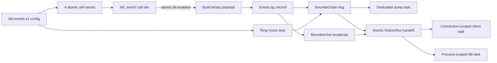

# Binary server events (`blit.events.v1`)

- **Status:** Implemented (`FEATURE_EVENTS`, feature bit 31)
- **Date:** 2026-08-21
- **Companion to:** [../protocol.md](../protocol.md),
  [../server.md](../server.md)

## Summary

The server owns one process-wide binary event journal. It is intended for
post-mortem diagnosis and short, targeted captures of hot paths that are too
expensive or too noisy for ordinary stderr logging.

The journal defaults to a 1 MiB contiguous byte ring and the low-throughput
lifecycle set. Event call sites use `blit_event!`; the macro checks one atomic
activation bit before it evaluates the payload expression. Disabled hot events
therefore do not allocate, format, lock the ring, or copy inspected bytes.

The same retained history can be dumped on demand, followed live through a
client connection, or written by a persistent server-side task. The history
and live handoff is ordered: for a history-enabled stream, a concurrent record
is in exactly one of the initial dump or the live stream, never silently
between them.

## Goals

- Keep a bounded, always-available diagnostic history in every server process.
- Make the disabled cost of high-volume events one atomic bit test, with no
  payload construction or shared lock acquisition.
- Activate individual event types, whole categories, the safe default set, or
  the complete catalog without restarting the server.
- Preserve raw protocol and PTY bytes when explicitly enabled, while keeping
  those expensive and sensitive events off by default.
- Support post-mortem dumps and live client/file capture through one stable,
  self-describing binary representation.
- Keep event production independent of slow clients and files. Observability
  must not become backpressure on the terminal, compositor, or network paths.
- Expose loss explicitly through counters, sequence gaps, and stream gap
  records instead of presenting an incomplete capture as complete.

## Non-goals

- **Not a replacement for stderr, metrics, or tracing spans.** The journal is
  a bounded forensic record, not the primary operator log or an aggregation
  system.
- **Not lossless under arbitrary load.** The ring overwrites old records and a
  slow live consumer can lag. Both cases are detectable.
- **Not durable unless a file stream is configured.** Ring contents disappear
  with the process and configuration changes are not persisted by the
  protocol.
- **Not a new authorization boundary.** Direct clients and extensions already
  have server-side filesystem/process authority and may inspect events. A
  transport that deliberately exposes a read-only subset still withholds the
  family.
- **Not a universal payload schema.** The common record header is stable;
  event-specific payloads remain compact binary structures owned by their
  event types.

## Architecture



`EventLog` is process-wide and stored in `AppState`. It owns four independent
activation words, the ring, a monotonic sequence allocator, one bounded Tokio
broadcast channel, and the registry of persistent file tasks. At most eight
detached file recordings run process-wide. Connection-local client stream tasks
remain in the connection handler and are capped at four per connection, so
disconnect cleanup cannot leave a task holding a dead outbox.

### Storage model

The ring is one fixed-size byte allocation rather than a queue of heap-owned
event objects. Every record begins with its complete length. Before an append,
whole oldest records are evicted until the new record fits; neither wrapping
nor shrinking can leave a partial retained record. Resizing builds a new ring
from oldest to newest, allowing its ordinary eviction rule to preserve the
newest records that fit.

Each accepted event receives a sequence before retention is attempted. An
oversized event therefore advances `next_sequence` and `dropped`, even though
it cannot enter the ring. If live receivers exist, that event is still sent to
them: retention capacity does not impose a smaller live-record limit.

Timestamps contain both process-monotonic nanoseconds and an approximate Unix
nanosecond value derived from the process-start wall clock. Sequence and
monotonic time define ordering; wall time exists for correlation with external
logs and may inherit ordinary wall-clock error.

### Activation and hot-path cost

An event id is also its bit index. `blit_event!` reads exactly one atomic word
and evaluates its payload expression only when the bit is set. This ordering is
intentional: full frame/PTY capture often allocates and copies more bytes than
the event header itself. `EventLog::record` then serializes the common header,
takes the ring mutex once, appends, and performs a non-awaiting broadcast send.

Configuration stores and event reads are allowed to race. A concurrent event
may observe either activation set, which is preferable to placing a global
configuration lock on every call site. Ring resizing is serialized by the same
mutex used for append and dump. Configuration replacement has a process-wide
revision and may be conditional on that revision; the comparison and mutation
share this same mutex.

The common 32-byte record header is encoded in a stack array and header plus
payload are copied directly into the wrapping ring. No heap-owned broadcast
record is built when the broadcast channel has no receivers. With receivers,
one `Arc<[u8]>` is allocated after retention and shared by all followers.

### Snapshot and live-stream ordering

Creating a stream locks the ring, subscribes to the broadcast channel, and
builds its history header before releasing the lock. Producers append and
broadcast while holding that lock; the broadcast operation itself never
awaits. Consequently, a concurrent record is either appended before the
snapshot and absent from the new receiver, or appended afterward and delivered
live. This is the central no-gap/no-duplicate handoff invariant.

The channel is bounded by record count. A receiver that falls behind gets an
explicit lost-record count and resumes at the oldest still-available live
record. Client streams encode that as `STREAM_GAP`; file streams insert the
synthetic record type `65535`. Stream I/O happens only in dedicated tasks and
never while holding the ring mutex.

Client tasks drain already-queued records into one `RECORD` message up to a
256 KiB soft byte limit (an individual larger record is sent alone). This
amortizes protocol envelopes and outbox entries without adding latency before
the first available record.

Standalone dump construction and configuration resize run on blocking tasks
because they can copy the entire configured capacity. Starting a stream builds
its bounded initial snapshot under the ring lock before handing subsequent I/O
to the stream task. File tasks receive a one-shot stop, drain already-queued
live records (including a final gap marker if necessary), and flush before
shutdown returns.

## Core invariants

1. Retained bytes contain only complete, length-valid records.
2. `used` never exceeds `capacity`; capacity is bounded from 4 KiB to below the
   maximum logical protocol message.
3. Event sequence numbers are process-wide, monotonic, and never reused.
4. A disabled macro call does not construct its payload or lock the ring.
5. A stream's history/live boundary neither drops nor duplicates a concurrent
   event.
6. A slow stream cannot block an event producer; any resulting loss is
   observable.
7. Live `EVENTS_RECORD` delivery is not itself logged, preventing recursive
   record generation. Other event-control replies remain inspectable.
8. Stable event ids are never renumbered or reused with a different meaning.
9. Live tails and detached recordings have explicit admission budgets; budget
   exhaustion is a correlated error, never an unbounded task or descriptor.

## Configuration

`blit events config` reads the current configuration revision, capacity,
retained byte/record counts, overwrite count, next sequence, and complete
256-bit activation set.

```bash
blit events config
blit events set --size 8388608 --events 'default,+frame.*,+pty.*'
blit events set --events 'all,-frame.write'
blit events set --if-revision 12 --events default --size 1048576
```

Selectors are evaluated left-to-right. They are `default`, `all`, `none`, an
exact catalog name, or `category.*`; `+` and `-` enable and disable. A spec
whose first selector has a sign starts from the low-throughput default.

Every successful replacement advances `revision`. `--if-revision X` applies a
replacement only if the revision is still `X`; otherwise it returns common
status `CONFLICT` and leaves both size and activations unchanged. A temporary
capture can therefore save configuration at revision `X`, enable/resize it,
then restore the saved values only if the capture's own returned revision is
still current. A successful set returns the exact revision created by that
replacement even if another update races with response delivery. The restore
therefore cannot erase a concurrent operator's change.

All settings are also available at startup:

| Variable                   | Default   | Meaning                                           |
| -------------------------- | --------- | ------------------------------------------------- |
| `BLIT_EVENTS_SIZE`         | `1048576` | Ring bytes; 4 KiB through just under 64 MiB       |
| `BLIT_EVENTS`              | `default` | Activation selector expression                    |
| `BLIT_EVENTS_FILE`         | unset     | Start a persistent server-side binary file stream |
| `BLIT_EVENTS_FILE_HISTORY` | `1`       | `0` starts the startup file at the next event     |
| `BLIT_EVENTS_FILE_APPEND`  | `0`       | `1` appends instead of truncating                 |

Invalid startup sizes fall back to 1 MiB. Invalid activation expressions are
reported and fall back to `default`.

## Event catalog

The stable event id is its activation-bit index. IDs 0–15 are the default
low-throughput set.

| IDs   | Names                                                                                                                                                      | Payload intent                                    |
| ----- | ---------------------------------------------------------------------------------------------------------------------------------------------------------- | ------------------------------------------------- |
| 0–15  | `server.*`, `task.*`, `client.*`, `config.change`, `stream.*`, `protocol.error`, `pty.create`, `pty.exit`, `pty.remove`, `pty.deadline`, `server.capacity` | Lifecycle and failures                            |
| 16–19 | `frame.read`, `frame.write`, `message.read`, `message.write`                                                                                               | Exact framed payloads and opcode/length summaries |
| 20–23 | `tick.*`, `session.lock`                                                                                                                                   | Scheduler passes, wakeups, and lock wait time     |
| 24–29 | `pty.read`, `pty.write`, `pty.parse`, `pty.snapshot`, `pty.resize`, `pty.input`                                                                            | PTY byte flow and terminal processing             |
| 30–34 | `compositor.*`, `surface.encode`, `surface.frame`, `audio.frame`                                                                                           | Compositor and media pipeline activity            |
| 35–43 | `fs.request`, `git.request`, `lsp.request`, `kv.request`, `net.request`, `process.request`, `extension.request`, `channel.request`, `client.control`       | Protocol-family dispatch                          |
| 44–47 | `outbox.queue`, `supervisor.event`, `connection.accept`, `server.error`                                                                                    | Delivery and server internals                     |

`pty.create` uses a fixed correlated payload for `CREATE2`:
`[connection_id:8][nonce:2][stage:1][status:1][pty_id:2]`. Stages are valid
request received (1), session mutex acquired (2), spawn begin (3), spawn end
(4), PTY registered (5), refused (6), and correlated reply physically written
(7). `connection_id` and `nonce` are present in every stage; `status` and
`pty_id` make success/refusal paths distinguishable.

The full names and ids live in `crates/remote/src/events.rs`. Unknown activation
bits round-trip through the protocol, allowing a new server catalog to be
configured by a generic client.

## Security and access

`frame.read`, `frame.write`, `pty.read`, and `pty.write` contain the inspected
bytes, not a text rendering. They can include terminal contents, clipboard
data, paths, environment values, and other secrets. The event family has the
same authority model as the rest of a direct server connection; read-only
share forwarders do not allow opcode `0xD0`. In-process extension endpoints
already have filesystem and process authority, so they advertise and accept the
event family under the same stream budgets instead of pretending the recorder
is an additional sandbox boundary.

## Dump format

A dump is self-describing and uses little-endian fields:

```text
[magic:"BLITEVT1":8]
[header_len:2 = 84][version:2 = 1]
[capacity:8][used:8][record_count:8][dropped:8][next_sequence:8]
[activations:4 * u64]
[records...]
```

Each retained record is complete even after wrapping:

```text
[record_len:4][event_type:2][flags:2]
[sequence:8][monotonic_ns:8][unix_ns:8][type_payload:N]
```

`record_len` includes the 32-byte record header. `sequence` increments for
every attempted record, including a record too large for the configured ring.
`dropped` counts oversize records and records overwritten or discarded during
a shrink. `unix_ns` is the process-start wall clock plus the monotonic offset;
ordering should use `sequence` or `monotonic_ns`.

A live file stream begins with a dump header. With history it contains the
retained records too; without history the header has zero used bytes and zero
records, followed by new records. Append mode starts another self-describing
header/history segment rather than appending unframed records to an old
segment. A lagged file task inserts synthetic type `65535` with `[lost:8]`.
Client streams report the same condition in an `EVENTS_STREAM_GAP` envelope.

## Protocol and tasks

Feature bit 31 advertises the direction-local `0xD0` envelope. Every request
starts `[0xD0][version:1 = 1][operation:1][nonce:2]`:

| Operation          | Body                                            |
| ------------------ | ----------------------------------------------- |
| `CONFIG_GET` (1)   | empty                                           |
| `CONFIG_SET` (2)   | `[expected_revision:8][size:8][activations:32]` |
| `DUMP` (3)         | empty                                           |
| `STREAM_START` (4) | `[target:1][flags:1][path_len:2][path:N]`       |
| `STREAM_STOP` (5)  | `[stream_id:4]`                                 |
| `STREAM_LIST` (6)  | empty                                           |

Targets are client `0` and server file `1`. Flags are history bit 0 and append
bit 1; append is invalid for a client target. Config changes are process-wide.
`expected_revision = u64::MAX` means unconditional replacement; any other value
is compared atomically and returns `CONFLICT` when stale. Stream ids are
process-wide and unique. Server-file streams persist after the requesting
client disconnects; client streams stop with their connection and can be
stopped only on that connection.

Server messages start `[0xD0][version:1 = 1][kind:1]`:

| Kind                 | Body                                                                                           |
| -------------------- | ---------------------------------------------------------------------------------------------- |
| `CONFIG` (1)         | `[nonce:2][revision:8][size:8][used:8][records:8][dropped:8][next_sequence:8][activations:32]` |
| `RESULT` (2)         | `[nonce:2][status:1][stream_id:4][detail:utf8]`                                                |
| `DUMPED` (3)         | `[nonce:2][dump:N]`                                                                            |
| `STREAM_STARTED` (4) | `[nonce:2][status:1][stream_id:4][detail:utf8]`                                                |
| `RECORD` (5)         | `[stream_id:4][count:2][complete records...]`                                                  |
| `STREAM_STOPPED` (6) | `[stream_id:4][status:1][detail:utf8]`                                                         |
| `STREAM_GAP` (7)     | `[stream_id:4][lost:8]`                                                                        |
| `STREAMS` (8)        | `[nonce:2][count:2][entries...]`                                                               |

Each `STREAMS` entry is
`[stream_id:4][state:1][flags:1][records:8][bytes:8][lost:8]`
`[path_len:2][error_len:2][path:N][error:M]`. States are running `1`, stopped
`2`, and failed `3`. Counters cover successfully written records/bytes and live
records lost before the synthetic gap marker. It enumerates process-scoped
server recordings, including a task that failed after start but has not yet
been stopped and removed.

Standalone `DUMP` requests run outside the connection reader; every live
client/file stream has its own dedicated Tokio task and broadcast receiver. A
connection may own four client tails and the process may own eight detached
file recordings. A slow stream can lag and report loss, but never blocks the
producer or the ring.

## Failure behavior

| Condition                                                      | Behavior visible to the operator                                                                                                                 |
| -------------------------------------------------------------- | ------------------------------------------------------------------------------------------------------------------------------------------------ |
| Ring lacks space                                               | Complete oldest records are evicted and `dropped` increases.                                                                                     |
| One record exceeds ring capacity                               | It is not retained, `dropped` increases, and active live streams still receive it.                                                               |
| Live receiver falls behind                                     | Client gets `STREAM_GAP`; file gets synthetic type `65535`, both with the lost count.                                                            |
| Resize shrinks below retained use                              | Newest complete records survive and every eviction increments `dropped`.                                                                         |
| Conditional config revision is stale                           | The replacement returns `CONFLICT`; size and activations remain unchanged.                                                                       |
| Invalid protocol request                                       | A correlated common-status error is returned when a nonce can be recovered.                                                                      |
| Invalid startup size                                           | Capacity falls back to 1 MiB.                                                                                                                    |
| Invalid startup activation expression                          | The error is written to stderr and activation falls back to `default`.                                                                           |
| Client-tail or server-file budget is exhausted                 | Start returns `BUDGET`; no task, receiver, or file descriptor is created.                                                                        |
| Server-file open, header/history write, or initial flush fails | Protocol start returns an error and no recording id; startup configuration reports stderr and records `server.error` when enabled.               |
| File write or final flush fails after start                    | `record list` reports `failed`, successful record/byte counters, live loss, and the error; `record stop` removes the task but returns the error. |
| Client disconnects                                             | Its stream tasks are aborted and removed; process-scoped file streams continue.                                                                  |
| Server shuts down                                              | `server.stop` is recorded, file tasks drain queued records, flush, and join.                                                                     |

Loss has two independent measures. The dump header's `dropped` count describes
retention loss in the ring. A stream gap describes delivery loss for one live
receiver. A capture can have either without the other, so consumers must not
merge the counters.

## Compatibility and evolution

- Feature bit 31 lets a client avoid sending this family to an older server.
  The v1 envelope is strictly decoded by a supporting server, without changing
  any existing opcode layout.
- `0xD0` is direction-local and was unused in both tables when assigned.
- Event ids are append-only. Decoders must preserve unknown ids as binary
  records, and activation bits outside the known catalog round-trip unchanged.
- `header_len` lets a future dump version add common metadata without moving
  the record section for a decoder that honors the length.
- A record's `flags` and type payload are available for compatible per-event
  growth. Changing the meaning of an existing id or common field requires a
  new dump/protocol version.
- Append-mode files contain consecutive self-describing dump segments.
  Readers should accept a new `BLITEVT1` header at a record boundary.

## Alternatives considered

**Text or JSON events.** Rejected for the hot path: formatting and escaping are
paid before retention, raw binary frames inflate substantially, and parsing
cost obscures the timings being diagnosed.

**A `VecDeque<Vec<u8>>` of records.** Simpler wrapping semantics, but it adds an
allocation per enabled event and makes the configured byte bound include
allocator behavior rather than one exact reservation.

**A fixed-record or lock-free ring.** Not adopted without measurements. The
variable-length byte ring preserves exact raw frames and compact richer
payloads under one byte budget. V1 first removes avoidable header and idle-live
allocations; a benchmark must demonstrate that another layout improves the
real hot path before trading those semantics away.

**Synchronous writes to every stream.** Rejected because a slow filesystem or
client would add latency and failure modes to PTY, compositor, and protocol
processing.

**An unbounded live channel.** Rejected because diagnostics must not turn a
slow consumer into unbounded server memory. The bounded broadcast plus explicit
gaps makes the tradeoff visible.

**A memory-mapped persistent ring.** Rejected for v1: it adds crash-consistency,
permissions, cleanup, and cross-platform concerns to the always-on path. An
ordinary file stream supplies opt-in durability without changing ring
semantics.

**One global activation lock.** Rejected because disabled events are the common
case. Four atomic `u64` words cover 256 stable ids on every supported target
without requiring wide atomic support.

## Validation

Tests cover ring wrapping, shrink preservation, disabled-event gating,
oversized live delivery, conditional configuration conflicts, client/file
admission budgets, file initialization and delayed-write status, activation
selectors, strict batched-record codecs, extension-endpoint access, and
correlated `CREATE2` stages through physical reply write. Framed connections
negotiate the feature, change configuration, and retrieve dumps. The full
remote, server, and CLI unit suites and strict Clippy are part of the
implementation verification.

## Operator workflow

```bash
blit events dump > /tmp/blit.events
blit events dump --output /tmp/blit.events
blit events tail > /tmp/live.events
blit events tail --output /tmp/live.events --from-now
ID=$(blit events record start /var/log/blit.events)
blit events record list
blit events record stop "$ID"
```

`dump` and `tail` always deliver bytes to the invoking client and default to
stdout; `--output` is therefore always a local path. `record` exclusively
manages detached server-side file tasks, making both path locality and client
lifetime explicit in the grammar. `record start` does not print an id until the
file header and requested history are written and flushed; `record list`
exposes later failures and counters, and `record stop` reports a delayed write
or final-flush failure.
