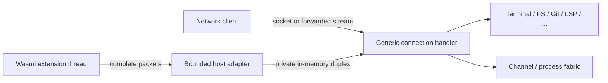
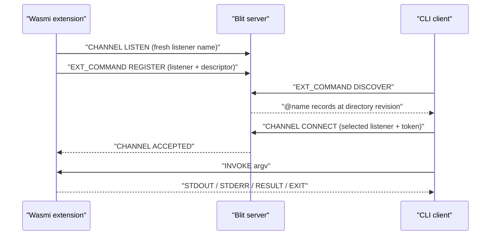

# RFC: Wasmi extensions, native channels, and processes

- **Status:** Proposed
- **Date:** 2026-08-05
- **Companion to:** [../protocol.md](../protocol.md),
  [kv.md](kv.md), [net.md](net.md)

## Summary

Blit should execute Rust extensions compiled to WebAssembly inside the server:

```bash
blit ext run --on prod extension.wasm arg1 arg2
```

The client addresses the module by its full BLAKE3 digest. The server admits it
without an upload when that digest is cached and asks for the module bytes only
on a cache miss. Uploaded modules are verified, validated, and stored in an
immutable persistent content-addressed cache; execution remains subject to the
server-wide running cap.

An extension may have a restart policy. The server supervises successive
Wasm attempts with bounded exponential backoff. With `--persist`, the desired
extension definition is durable and an attempt which was meant to be running
is launched again after a blit server restart.

An extension is an **in-process logical blit client**. It exchanges ordinary
blit packets with the same packet dispatcher as a network client, but does
not open a socket. Version 1 connects the existing generic connection handler
to an in-memory duplex stream; its private length framing is not visible to the
guest. The host ABI consists of packet send and receive, a
packet-or-monotonic-deadline wait for efficient timers, and direct clock and
entropy reads. It gets the generic connection handler's complete normal
initial burst, followed by its extension identity, and can use every blit
protocol family exposed to ordinary clients by that server.

This RFC also adds native **channels**: named connection points carrying
reliable bidirectional messages without terminal semantics.

A named persistent extension may advertise a discoverable command tree. The
CLI exposes it under an unambiguous `@name` namespace and carries each command
invocation over a normal channel.

It also adds a native **process** family for spawning non-PTY child processes,
streaming their stdout and stderr, writing stdin, and controlling their
lifecycle. Process operations are blit packets rather than Wasm host imports.

These are blit packet families, not Wasm-specific host functions. Browser,
CLI, native, and Wasmi clients all see the same semantics. RPC, streamed
results, notifications, and actor mailboxes are libraries over channels.

## Motivation

Blit already exposes terminals, compositor surfaces, filesystem sync, Git,
LSP, KV, and network relay through one version-stable protocol. Recreating
those operations as a large runtime-specific host API would produce two public
interfaces and two dispatch implementations. They would inevitably differ
in validation, cancellation, resource ownership, and new feature coverage.

Putting a real or loopback socket between the server and an embedded runtime
would avoid that duplication but preserve overhead and failure modes which
have no purpose in one process: socket buffers, connection setup,
authentication, and kernel scheduling. An in-memory duplex stream retains only
the small private length envelope needed to reuse the connection handler; it
does no system call and exposes only complete blit packets to the guest.

The packet is the useful boundary. A Wasm linear-memory crossing already
requires bounded bytes; using those bytes as a normal blit packet gives exact
client parity and reuses all existing codecs. The ordinary connection handler
dispatches it without a socket.

Terminals are not a suitable coordination primitive for extensions. Their byte
stream has presentation state, escape sequences, process semantics, and no
message boundaries. Extensions need named discovery, bidirectional messages,
cancellation, and backpressure without pretending to be processes attached to
PTYs.

## Goals

- Run Rust-produced core Wasm modules using Wasmi in the blit server.
- Upload a module only when the selected server lacks its BLAKE3 object.
- Supervise failed or completed attempts under an explicit restart policy.
- Optionally persist desired extension state across blit server restarts.
- Give an extension the same protocol surface as an equivalent remote client.
- Add server-native bidirectional channels.
- Let named persistent extensions contribute discoverable, namespaced CLI
  commands.
- Let clients spawn and control non-PTY server processes with flow-controlled
  stdin, stdout, and stderr streams.
- Keep the Wasm host ABI very small and versioned.
- Give each running extension attempt its own named OS thread.
- Bound extension-owned threads, guest memory, supervisor records, object
  storage, and in-process transport buffers at server scope.
- Make extension disconnect cleanup identical to client disconnect cleanup.
- Preserve the existing protocol rule: new feature bits and opcodes; no
  reinterpretation of old messages.

## Non-goals

- **No conventional guest operating-system environment.** Version 1 targets
  `wasm32-unknown-unknown` and exposes only `blit_v1`. It provides no filesystem
  preopens, sockets, standard streams, or second runtime ABI. Arguments arrive
  in `INIT`; output, channels, and subprocesses are packet operations.
- **No Component Model requirement.** The first Rust SDK targets a small core
  Wasm ABI. A future component adapter may wrap the same packet endpoint.
- **No live-instance checkpointing.** Persistent extensions start a fresh
  Wasmi instance after a server restart. Linear memory, stacks, open handles,
  channels, and in-flight requests are not snapshotted.
- **No server-native state or pubsub.** Retained shared data remains KV's job;
  live protocols and fan-out are libraries over channels.
- **No new durable message broker.** Channel and process streams have explicit
  windows. The connection handler retains its existing production-side
  backpressure behavior; extension-only transport buffers have explicit byte
  ceilings and a slow-consumer timeout.
- **No requirement that channel payloads use JSON.** Payloads are opaque
  bytes with descriptive metadata.
- **No client-side extension code.** Extension commands execute on the selected
  server. Their descriptors provide discovery and help, not a local executable
  or client-side argument validator.

The three advertised families are independently negotiable and may land in
separate implementation PRs. Channels and processes are useful to ordinary
clients without Wasm; processes have no dependency on channels. Only
extension-provided CLI commands require both the extension and channel
families. They remain in one RFC so the end-to-end extension contract is
reviewed in one place.

## Example extensions

These examples are intentionally more ambitious than "run a cron script." They
use only the small host ABI and ordinary Blit packet families; none requires a
new Wasm-specific import.

### `@ship`: a server-resident release conductor

```bash
blit --on prod @ship plan main
blit --on prod @ship deploy --environment eu-prod --revision 8c4f2d1
```

`ship` stays warm as a persistent extension. It inspects Git, runs tests and
deployment tools through `PROCESS_*`, streams a structured plan and live output
over the invocation channel, and records idempotency keys and the release ledger
in KV. Disconnecting cancels only the command; the supervised release policy can
decide whether the underlying operation should stop or continue. This is a
small, inspectable deployment service distributed as one Wasm object.

### `@workspace`: one query surface over Git, FS, and LSP

```bash
blit --on dev @workspace changed-symbols origin/main
blit --on dev @workspace impact crates/remote/src/git.rs
blit --on dev @workspace references ClientEndpoint
```

The extension keeps repository and language-server views warm, joins them with
filesystem search, and exposes higher-level questions as commands. The answer
can contain human-readable progress on stdout and a machine-readable JSON
`RESULT`. A browser UI can ask the same questions over channels without going
through the CLI grammar.

### `@session`: a terminal concierge which is not itself a terminal

```bash
blit --on lab @session start api -- cargo run -p api
blit --on lab @session wait api --for "listening on" --timeout 30s
blit --on lab @session send api "reload"
```

`session` creates and observes real Blit PTYs when a program needs terminal
semantics, but its own control plane is typed channel messages. It can name
sessions, wait on output conditions, report cwd and exit state, and coordinate
several terminals without forcing non-interactive clients to parse an
interactive terminal protocol. Lightweight session metadata survives attempts
in KV; PTY handles do not.

### `testgrid`: many isolated instances from one hash

```bash
blit ext run --on ci --restart always --persist --name test-unit testgrid.wasm unit
blit ext run --on ci --restart always --persist --name test-integration testgrid.wasm integration
blit ext run --on ci --restart always --persist --name test-web testgrid.wasm web
```

The module uploads once, but each extension gets its own ID, arguments, thread,
endpoint, processes, and restart history. Shards claim work through KV and send
live results to an aggregator over channels. An operator can restart one shard,
update a canary to a new hash, or compare revisions without disturbing the
others. This is the concrete reason module identity and extension identity must
be separate.

### `@switchboard`: application pubsub without a core topic service

```bash
blit --on prod @switchboard routes
blit --json --on prod @switchboard tap build.finished
```

Producers and consumers open channels to `switchboard`; payload-defined subjects,
filters, request IDs, and delivery acknowledgements are an SDK-level protocol.
The extension fans live messages out, while durable cursors or retained values
go to KV. A second implementation can choose different wildcard, replay, or
dead-letter semantics without adding opcodes or committing Blit to one pubsub
model.

### `@fleet`: extensions managing extensions

```bash
blit --on prod @fleet diff builder builder-canary
blit --on prod @fleet promote builder-canary --to builder
blit --on prod @fleet restart --revision-mismatch
```

Because an extension is a full logical client, `fleet` can list and control
other extensions. Promotion reads the canary's exact hash, combines it with
arguments supplied to the promotion command or stored in its own KV record,
then performs a revision-checked cache-hit update of the durable `builder`
record. Lifecycle discovery deliberately does not expose another extension's
stored arguments.
It can roll through a set of named instances, stop on health failure, and emit
one progress stream to the operator. The server still owns atomic definition
updates and lifecycle cleanup; the rollout strategy remains replaceable guest
code.

### `@incident`: a reproducible diagnostics bundle

```bash
blit --on prod @incident capture api --since 10m
```

The extension snapshots relevant Git identity, terminal cwd and screen state,
output from diagnostic processes it launches, server-visible task metadata, and
selected files, then streams a content-typed result. The same command can
simultaneously feed a browser over a second channel. Since the descriptor is
only presentation metadata, a newer definition can add richer collection logic
without requiring a new CLI release.

## Architecture



The current `handle_client` connection loop is already generic over an async
read/write stream. Version 1 runs it on the server half of
`tokio::io::duplex`; an adapter on the other half converts between its private
length-prefixed frames and the complete packets used by `blit_v1.send` and
`blit_v1.recv`. There is no socket, authentication pass, kernel buffer, or
kernel scheduling between the extension and server.

```rust
struct ConnectionOptions {
    origin: ConnectionOrigin,
    cancellation: CancellationToken,
    direct_frame_bytes: usize,
    fragment_chunk_bytes: usize,
    slow_consumer_timeout: Option<Duration>,
}
```

`ConnectionOrigin::Extension` supplies immutable bootstrap identity, selects
the 16 MiB frame cap as its direct threshold and 16 MiB minus the two-byte
fragment header as its fragment payload, and injects `EXT_INFO(INIT)`
immediately after `READY`. Network connections retain the ordinary 4 KiB
direct threshold and fragment policy used to interleave audio on slow links.
The in-process profile sends a logical message which fits the 16 MiB frame cap
directly. A larger message uses at most five `S2C_FRAGMENT` frames under the
protocol-wide 64 MiB logical-message ceiling; an exact 64 MiB message needs
four full 16 MiB-minus-2 chunks and one final eight-byte chunk. The guest SDK
performs the same reassembly as every other client, without exposing 4 KiB
transport tuning to extension code.

The read loop selects on the attempt cancellation token and exits through the
normal connection cleanup path. The supervisor awaits that cleanup before a
replacement attempt starts. It must not abort `handle_client`, which could
detach its writer task and leave connection-scoped filesystem syncs, Git
repositories, LSP attachments, KV subscriptions, relayed sockets, processes,
or channels alive past the attempt.

`handle_client` cleanup itself must close or abort **and then await** its writer
task before returning. Awaiting only the read loop is insufficient: the writer
may still own queued packet envelopes and their byte or object guards. During
endpoint teardown, channel and process cleanup drops queued terminal frames
rather than awaiting their delivery; the closing writer then drops those frames
and releases their guards. This ordering avoids a cleanup cycle while making a
returned handler a real barrier: no old writer, outbox allocation, family
reservation, or connection job survives into a replacement attempt.

Some existing request handlers also launch one-shot blocking work which today
may outlive a disconnected network handler after its reply sender is dropped.
Version 1 routes every server blocking job, regardless of connection origin,
through one wrapper which registers completion in a process-wide shutdown
registry; direct unregistered `spawn_blocking` from a packet handler is not
allowed. Network-origin jobs keep their current disconnect behavior: their
connection handler need not await them after the reply sender is dropped, and
they do not consume extension admission permits. Extension-origin jobs
additionally enter the connection job tracker: cooperative jobs receive the
attempt cancellation token, every spawned job registers its completion, and a
non-cancellable blocking library call is allowed to finish but remains joined.
`handle_client` cleanup does not complete, and the supervisor does not start a
replacement attempt, until that extension set is empty. This prevents a
crash-looping extension from accumulating searches or opens across attempts
without changing observable network-disconnect behavior. The shutdown
coordinator waits on the process-wide registry for both origins, so an orphaned
network job cannot hide from the global grace deadline.

The tracker is an admission boundary as well as a join set. The reader first
classifies the bounded opcode/kind envelope. Its narrow bypass lane contains
only cumulative ACKs for already-established streams, a family's explicit
nonce cancellation for an operation already registered by this endpoint, and
connection/attempt shutdown controls. Those packets continue through ordinary
dispatch immediately and never wait for a job permit. Other non-spawning
requests may dispatch immediately, but protocol ordering does not make them a
barrier for earlier asynchronous work: a client must wait for the correlated
success reply before sending any packet whose validity or meaning depends on a
spawn-capable request's effects. A spawn-capable request registers its normal
family operation before transferring the packet's ingress guard to a bounded
async admission record. That record waits for one per-endpoint and server-wide
active-job permit without holding a session, family, or dispatcher lock. Where
a family defines nonce cancellation, its request token can remove the record
before launch or cancel active cooperative work. The independent writer
continues to drain replies throughout.

This is deliberate completion concurrency, not a weakening of byte ordering:
the reader observes and classifies packets in connection order, but an admitted
native job may complete after a later independent request. A family with a
client-assigned object ID must reserve a bounded provisional generation during
registration so two pending creates cannot claim the same ID. It must then
either define pre-success operations on that generation or require clients to
await creation; the process family below chooses the latter. An implementation
must not silently rely on synchronous dispatch order for such a dependency.

The defaults allow 32 active and 32 pending records per extension endpoint,
128 active and 128 pending records server-wide, and 16 MiB/64 MiB of combined
pending-plus-active serialized request bytes at those scopes. A single maximum
C2S packet therefore always fits when the endpoint and global byte budgets are
otherwise empty. On launch, the byte guard transfers to the tracked job without
another request copy and remains held through completion and cleanup, including
a non-cancellable stuck call. If a spawn-capable request cannot reserve pending
count or byte capacity, it is not dispatched and the attempt ends as
`RESOURCE_LIMIT`; ordinary connection cleanup supplies any family terminal
outcomes it can, rather than inventing a family-local error. This is the
extension-only endpoint-resource exception to the protocol's per-request reply
guarantees: the guest observes endpoint closure and all outstanding operations
fail as connection errors, whether or not a particular family reply was already
queued. This keeps the reader's cancellation/control lane live, bounds both
admission tasks and native jobs, and does not change network-client behavior.

A native blocking call can be genuinely non-cooperative (for example a stuck
NFS, FUSE, kernel, or library operation), and Rust cannot safely kill its
thread. After guest/thread shutdown, a supervisor with such cleanup outstanding
remains visibly `STOPPING`, retains its running permit, name, and all guards,
and reports the stuck job and elapsed cleanup time in status. It has no cleanup
deadline and no replacement overlaps it. Repeated cancellation is idempotent;
the safe recovery for a permanently stuck call is a Blit process restart. A
killable helper-process boundary is future work, not an invariant this RFC
pretends the in-process server can provide.

### Transport backpressure and slow consumers

This RFC does not replace the network connection's tracked unbounded outbox or
change when a slow browser is disconnected. Network endpoints retain the
existing production-side terminal, surface, network-relay, and writer
backpressure. Changing that policy belongs in an all-client transport RFC.

Every family producer receives an origin-aware tracked outbox sender, never a
raw Tokio sender. Its network mode preserves today's enqueue and accounting
behavior. Its extension mode atomically reserves both serialized message bytes
and one queued-message slot before enqueue, holds both reservations until the
writer has fully written or dropped the message (and releases them if enqueue
fails), and cancels the attempt if either hard ceiling would be crossed. This
small sender-wrapper change is required because
several current connection-scoped families clone the raw outbox sender and
would otherwise bypass extension accounting.

The in-process duplex direction has capacity for one maximum-size frame plus
its private length field. Its server reader and writer are
independent tasks, just as they are for a socket: a writer waiting for the
guest to call `recv` does not stop the reader consuming requests accepted by
`send`. The extension connection additionally has a 64 MiB hard queued-egress
ceiling, equal to the maximum logical S2C message, and a 4,096-message ceiling.
One maximum message always fits in an empty queue, while a later message which
cannot fit, or a tiny-message burst which exhausts the count, is not enqueued
and cancels only that attempt as `SLOW_CONSUMER`. A full duplex output buffer
which makes no progress for 30 seconds has the same outcome. The queue never
exceeds either stated ceiling.
Closing the duplex wakes a blocked host call and runs ordinary connection
cleanup. A best-effort `EXT_EXIT` may reach followers, but cleanup never
depends on fitting it into the failed endpoint.

Channel and process data have their own credit windows. Each supervisor appends
`EXT_EVENT`, uncorrelated `EXT_INFO(STATUS)`, and `EXT_EXIT` records to one
bounded retained-output log in generation order. Every following logical
connection has a cursor into that log. One scheduler per logical connection
round-robins all followed extensions and is the only task allowed to admit
their output. Network mode tests the existing `outbox_backpressured` production
gate and pauses until it clears. Extension mode uses that endpoint's atomic
hard reservation. The slow follower endpoint is the direct cancellation target;
ordinary self-follow and attached-child ownership consequences still apply.

The scheduler has no private record queue. A paused scheduler retains only the
supervisor ID and next sequence and tests its endpoint gate before cloning or
serializing a record. If an implementation shares record storage instead, every
clone retains the same byte-budget guard through outbox write/drop. Evicting
such a record removes it from the discoverable ring but does not release its
charge until every admitted clone is written or dropped; those guards therefore
remain inside, rather than outside, the retention budget. Concurrent follows
cannot race a connection's gate, block packet dispatch, or create a second
unbounded buffer.
In particular, an attempt's `EXT_EXIT` cannot overtake its earlier events.
Correlated control replies bypass the log but remain finite and are ordered
before records caused by that request.

If retention evicts a follower's next record, replay resumes at the oldest
retained record; a jump in the common `output_sequence` reports every lost
record, while the correlated attach snapshot remains authoritative through its
stated sequence. This RFC does not close a network follower merely because its
transport is slow; the hard slow-consumer rule remains specific to an
extension's own in-process endpoint.

A guest which issues more than the finite in-process egress bound of
reply-producing requests without reading responses is itself a slow consumer.
The SDK event loop therefore drains and dispatches incoming packets between
batches of outgoing requests.

### Packet parity

An extension may form any valid C2S packet. The dispatcher validates and handles it
exactly as if it came from a network endpoint. If an operation is available to
an ordinary client, it is available to an extension; this includes existing
administrative operations. Changing the access model for all blit clients is
separate work and must not create a Wasm-only path.

## Lifecycle model

An **extension** is the stable supervised object created by
`EXT_RUN`. It has a 64-bit randomly allocated, non-zero `extension_id`, a module hash,
arguments, restart policy, enabled and desired-running state, definition
revision, and optional durable name. A transient ID is process-local; a
persistent extension retains its ID, revision, name, and lifecycle state across
server restarts. Allocation collision-checks the complete durable catalog and
live transient registry; zero remains the wire sentinel for unresolved/new/list
operations and is never assigned.

An **attempt** is one Wasmi instantiation of that extension. Attempts are
numbered monotonically from one. A running attempt has its own 32-bit
process-local, non-zero `task_id` and logical client endpoint. Task allocation
does not reuse an ID while it is live; zero is reserved for every non-`RUNNING`
snapshot. Destroying an attempt
therefore closes its connection-scoped subscriptions, filesystem/Git/LSP
handles, relays, native-channel listeners and connections, and `PROCESS_*`
children before the supervisor considers another attempt. An `EXT_RUN` without
`DETACH` also creates an attached child supervisor owned by that logical
connection. Endpoint cleanup recursively cancels and fully cleans those child
supervisors before it completes. This ownership relation is a tree because it
is established only when a new extension is created; attaching to or
controlling an existing extension does not acquire ownership.

PTYs created through
the existing `CREATE` or `CREATE2` family remain server-session objects, exactly
as they do when an ordinary network client disconnects; the extension must send
`CLOSE` when it wants to destroy one. Attempt cleanup does not invent
extension-only PTY ownership.

The distinction prevents a crash from changing the object clients follow:
attachments, status, retained output, and control target the stable
`extension_id`; events additionally identify the attempt and task which
produced them.

Restart policies are:

| Value | CLI          | Meaning                                            |
| ----- | ------------ | -------------------------------------------------- |
| 0     | `never`      | No automatic restart after an attempt return/failure |
| 1     | `on-failure` | Restart every attempt classified as a failure      |
| 2     | `always`     | Restart successful returns and classified failures |

Restart policy governs automatic restarts after an attempt ends. For restart
policy purposes, restoring still-desired persistent state after a server stop
or crash is not an automatic restart of a completed attempt: an interrupted
`never` attempt may therefore be instantiated by the next server, while a
`never` attempt which reached terminal `STOPPED` has already cleared desired
state and is not restored. For restart
accounting, `RETURNED` with code zero is successful and resets the
consecutive-failure counter before an `always` restart is scheduled.
`RETURNED` with a non-zero code, `TRAPPED`, `HOST_FAILURE`, `SLOW_CONSUMER`,
`PROTOCOL_VIOLATION`, and `RESOURCE_LIMIT` are failures. Each failure increments
the current counter, and its automatic restart uses normal backoff. Independently, reaching
60 continuous seconds in `RUNNING` resets the counter while that attempt is
live; if it later fails, that failure starts a new sequence at one. Thus
failure, quick success, failure also ends at one, not two. A guest which
repeatedly violates the protocol or fails to drain its own endpoint therefore
cannot create a hot restart loop. Exhaustion of the supervisor's running-attempt
permits leaves an extension in `QUEUED`; it is not a host failure and does not
affect restart accounting.

`CANCELLED`, `UPDATED`, and `SERVER_SHUTDOWN` are supervisor transitions rather
than successful or failed attempts and do not increment the failure counter.
`CANCEL`, owner disconnect, `DISABLE`, and `REMOVE` suppress restart. For a
persistent extension, `CANCEL` durably clears desired-running while leaving the
definition enabled, whereas `DISABLE` durably clears enabled while preserving
desired-running. A later `RESTART` sets desired-running, and `ENABLE` clears the
disabled gate; either starts a fresh attempt when both bits are set. This keeps
"stop until explicitly restarted" distinct from "administratively disabled",
and lets disable/enable preserve whether the extension was meant to run.

An explicit `RESTART` or `UPDATED` replacement makes a fresh attempt eligible
immediately when the extension is enabled and remains desired-running,
independently of its restart policy and without backoff; it starts when it
reaches the front of the running-permit queue. Server shutdown preserves both
bits and restores eligible persistent state after the next startup without
failure accounting. When `never`, or a successful `on-failure`, reaches
terminal `STOPPED`, the supervisor clears desired-running before reporting the
terminal state; otherwise a completed one-shot would unexpectedly run again
after a server restart.

`never` performs no automatic restart. `on-failure` restarts only the failures
defined above. `always` restarts both successful returns and failures; a
successful return does not increment the failure counter, but its automatic
restart still uses the base backoff. Invalid or corrupt modules and
deterministic instantiation or import failures do not produce retrying attempt
exits; they transition the supervisor to `BLOCKED`. After the object or host
condition is repaired, explicit `RESTART` revalidates an enabled `BLOCKED`
extension and makes it eligible again; if the condition remains, it returns to
`BLOCKED` without an automatic loop. `ENABLE` performs the same revalidation
for a persistent definition, including when it was already enabled. This gives
transient blocked extensions a recovery path.

`PERSIST` stores the extension definition with enabled and desired-running both
set. It implies `DETACH` and requires a unique durable name. Persistence does
not itself alter the restart policy: the common cross-server daemon form is
`--restart always --persist --name NAME`. If the server shuts down while a
persistent extension is enabled and desired-running, the shutdown ends its
current attempt without incrementing failure counters and a fresh attempt is
launched after the next server has initialized its registries.

## Wasm contract

### Module shape

The initial SDK targets `wasm32-unknown-unknown`. A module:

- defines exactly one 32-bit linear memory and exports it as `memory`;
- defines at most one table;
- declares no WebAssembly start function;
- exports `blit_main: () -> i32`;
- imports only `send`, `recv`, `wait`, `clock`, and `random` from module
  `blit_v1`.

Every per-attempt Wasmi `Config` disables the WebAssembly memory64 and
multi-memory proposals explicitly. Disabling Wasmi's Cargo default features is
separate and does not change these engine proposal flags. Upload-time validation
rejects additional or 64-bit memories, more than one table, a start section,
and all other imports before the object can enter the executable cache.
Per-attempt instantiation repeats the no-start check (for example with Wasmi's
`InstancePre::ensure_no_start`) before making the instance reachable. Guest code
executes only through `blit_main`. No Wasm runs before validation and
instantiation complete; during the private-bootstrap tail of `VALIDATING`, the
SDK entry wrapper may only receive the initial handshake, and an ordinary send
before `INIT` is rejected as an attempt protocol violation.

The same config selects `CompilationMode::Eager`, sets
`ignore_custom_sections(true)`, and enables the fixed
`EnforcedLimits::strict()`. Eager translation is
required: no function may first translate during `blit_main` after the shared
validation permit has been released. Strict limits bound parser and translator
amplification such as excessive functions, globals, parameters, results,
tables, memories, and element or data segments; the raw 64 MiB object cap alone
is not treated as a translation-memory bound.

Returning from `blit_main` ends the attempt. Its `i32` is the attempt exit
code. A trap or invalid host call ends the attempt with a structured failure
reason. Packet validation has network-client parity: a violation whose normal
outcome is connection close ends the attempt as `PROTOCOL_VIOLATION`, while a
family-local error closes only that handle or returns its normal status. The
supervisor then applies the extension's restart policy.

### Host ABI

```text
blit_v1.send(ptr: i32, len: i32) -> i32
blit_v1.recv(ptr: i32, capacity: i32) -> i32
blit_v1.wait(monotonic_deadline_ns: i64) -> i32
blit_v1.clock(kind: i32) -> i64
blit_v1.random(ptr: i32, len: i32) -> ()
```

`send` validates the range in exported memory and copies one complete blit
packet. It returns `0` when accepted, `-1` when the endpoint is closed or
closes while the call is pending, or `-2` for a zero-length packet or one over
the 16 MiB complete-packet cap. It never accepts transport framing: the first copied byte is the blit
opcode. A negative length, invalid pointer, integer overflow, or an
out-of-bounds linear-memory range is guest ABI misuse and traps the attempt
rather than returning an error code.

`recv` operates on the next complete server packet:

- zero means the logical endpoint is closed;
- a positive result `N <= capacity` means an `N`-byte packet was copied and
  removed from the mailbox;
- a positive result `N > capacity` means the packet needs `N` bytes; nothing was
  copied and the packet remains queued.

When no packet is available, `recv` parks the dedicated extension thread. A
negative capacity, integer overflow, or an invalid destination range traps the
attempt. The SDK keeps a reusable buffer and retries with `N` bytes only when
needed. `recv` never returns a negative value.

`wait` parks until either an incoming complete packet is available or an
absolute deadline in the `clock(1)` domain is reached. It does not dequeue a
packet. Return value 0 means deadline reached, 1 means `recv` can make progress,
and 2 means the endpoint is closed and its mailbox is empty. `i64::MAX` is the
conventional no-deadline value. At every initial check or wake, a non-empty
mailbox returns 1 before testing either deadline or closure; only an empty
mailbox returns 0 for a deadline at or before the current monotonic time, or 2
for closure. The guest has one execution thread and therefore one consumer, so no
other guest call can remove the packet between `wait` and `recv`. Cancellation
wakes `wait` as closed.

The SDK keeps its timers in a guest-side min-heap and passes the nearest
deadline to `wait`. A packet wake is dispatched before it resumes waiting for
the same timer; a deadline wake runs every due callback. `sleep` and operation
timeouts are consequently efficient without busy polling, and an idle timer
does not prevent the extension from servicing packets. Simple synchronous code
may still call blocking `recv` directly. The host implements both waits with a
park/condition primitive on the dedicated thread, not repeated clock reads.

`clock(0)` returns signed nanoseconds since the Unix epoch. `clock(1)` returns
nanoseconds from a monotonic clock with an unspecified origin. Realtime may
jump when the host clock is adjusted; monotonic values are suitable only for
differences and must not be persisted across server restarts. Any other kind
traps the attempt. A clock read is a direct synchronous host call: it does not
construct or dispatch a packet.

`random` fills the complete destination with bytes from the server operating
system's cryptographically secure random source. A zero length is a no-op.
Negative lengths, invalid ranges, or requests larger than 64 KiB trap the
attempt; the SDK chunks larger fills. Failure of the host entropy source ends
the attempt as `HOST_FAILURE`. Entropy is also a direct synchronous host call
and consumes no packet or mailbox capacity. Clock values must never be used as
an entropy substitute.

`send` may block until the adapter can copy its whole packet into the
extension-to-server path. This preserves ordering and backpressure without
busy polling. The connection handler's reader is independent of its writer, so
normal reply pressure never requires a `WOULD_BLOCK` ABI result; closing the
attempt wakes a pending call with `-1`.

Each direction of the in-process duplex has a capacity of 16 MiB plus the
private four-byte length field, equal to one maximum Blit frame. Every valid
packet therefore fits in an empty inbox. The in-process writer uses
`S2C_FRAGMENT` only when a logical S2C message exceeds that frame cap, with
chunks of at most 16 MiB minus the fragment opcode and flags rather than the
network writer's 4 KiB audio-oriented chunks. `recv` returns one complete
packet, and the SDK reassembles a fragment sequence before typed dispatch. The
host adapter uses an acknowledged single-slot handoff in each direction. A
producer reserves the slot before allocating and copying a packet, and that
reservation is not released merely because the consumer dequeued it: it stays
held until the packet has been fully written to the duplex or successfully
copied out by `recv`. An `N > capacity` receive keeps the same packet and
reservation in place. Thus a second maximum `Vec` cannot appear behind an
in-flight one, at most one additional frame exists per direction, and the full
32 MiB handoff storage is charged to the transport bounds below.

No separate argument, logging, or process imports are needed. Guest logs and
structured output are `EXT_EVENT` packets. Child processes and other Blit
facilities remain ordinary protocol operations.

### Bootstrap identity and arguments

Before the attempt becomes externally reachable, an exclusive bootstrap pump
uses the generic connection handler's shared initial-burst builder; the RFC
does not maintain a second, easily stale list of its packets. The pump follows
that complete normal burst with exactly one `EXT_INFO(INIT)`. It does **not**
enqueue the whole burst at once. The guest entry wrapper is allowed to run only
its handshake receiver, while the async pump reserves and writes at most one
bootstrap logical message at a time. It waits for that reservation to be
released before admitting the next; this is startup pacing outside packet
dispatch, so a maximum 64 MiB `LIST` fits the ordinary 64 MiB egress ceiling
without `READY` or `INIT` stacking behind it. The normal 30-second no-progress
rule still cancels a guest which does not drain bootstrap.

Version 1 must first change the shared builder to perform the checked size
preflight specified for `S2C_LIST` in the protocol and reserve the single
message before allocation. PTY creation/catalog mutation must maintain that
invariant for all clients, so an extension cannot encounter a multi-gigabyte
eager `LIST` assembled from legal per-entry lengths. An inconsistent fabricated
session fails bootstrap before allocation and the attempt reports
`HOST_FAILURE`. This is part of implementation phase 2 below, not a description
of the current eager builder. As specified in the protocol, nonce-bearing
`CREATE2(WANT_STATUS)` receives `CREATE_FAILED` when admission is refused. The
flag is used only after `HELLO` advertises `CREATE_STATUS`; legacy `CREATE`,
`CREATE_AT`, `CREATE_N`, and unflagged `CREATE2` retain their success-only
behavior and produce no creation packet on refusal.

Snapshot capture and installation of a gated extension `ClientState` are one
ordered session-state operation. While the snapshot streams, global
initial-state mutations are not dropped or serialized into an unbounded side
queue: each initial-state provider records a coalesced reconciliation key and
generation in the gated client, using the same bounded object-ID/state domain
as its normal snapshot. Deletions retain a generation-tagged tombstone in that
bounded slot. Repeated changes to one object overwrite its key rather than
append events. A future family cannot add a pre-`READY` global notification
unless it also supplies such a bounded snapshot/reconciliation operation.
Before `INIT` the endpoint owns no subscriptions or handles, so no unrelated
connection-scoped producer can target it.

After the normal burst reaches `READY`, the pump reserves `INIT`. Under the
same ordering lock it then publishes `RUNNING`, enqueues `INIT`, and freezes
the current reconciliation keys ahead of live delivery. The pump emits their
latest normal state/update or deletion packets one logical message at a time;
changes racing that catch-up coalesce again. When the set is empty, switching
to ordinary live delivery and releasing request dispatch is atomic with the
last generation check. Thus each mutation is represented either by the
initial snapshot, reconciliation, or live delivery, with no snapshot-to-live
gap; the structure remains bounded even if state churns. `INIT` remains ahead
of all reconciliation and live packets, and user code cannot run before the
SDK receives it. A raw guest which sends an ordinary request before receiving
`INIT` violates the extension protocol and ends the attempt; a request sent
after `INIT` may wait in the single bounded ingress handoff until catch-up has
finished.

`INIT` supplies the `extension_id`, definition revision, attempt, process-local
task ID, module hash, invocation name when present, attachment and persistence
flags, and the exact UTF-8 argument vector from `EXT_RUN`. No synthetic module
path or `argv[0]` is inserted. For a transient extension, revision is always 1
and the ID lasts for this server process. For a persistent extension, ID and
revision survive server restarts. Attempt increases on every Wasmi
instantiation; task ID is meaningful only in the current server process.

The `blit-guest` entry-point wrapper consumes the handshake and `INIT` before
calling user code, then exposes them as an immutable context:

```rust
let context = blit.context();
let id = context.extension_id;
let version = (context.definition_revision, context.module_hash);
let args: &[String] = &context.args;
let started = blit.monotonic_now();
let wall_time = blit.realtime_now();
let elapsed = blit.monotonic_now() - started;
```

The context also exposes `attempt`, `task_id`, `name: Option<String>`,
`detached`, and `persistent`. Protocol features come from the preceding
`HELLO`, just as they do for a network client. Identity and arguments therefore
require no extra host calls. The clock wrappers return a typed wall-clock time
and an opaque monotonic instant whose subtraction yields a duration; neither
requires a dispatcher round trip.

### Rust SDK

`blit-guest` wraps the five imports and re-exports the protocol codec surface:

```rust
#[blit::main]
fn main(mut blit: blit::Client) -> Result<(), Error> {
    let args = &blit.context().args;
    let request = blit_remote::msg_create2(/* ... */);
    blit.send(&request)?;
    let created = blit.recv_matching(/* ... */)?;
    // The same client can open native channels or any other blit family.
    Ok(())
}
```

For `wasm32-unknown-unknown`, the SDK selects and supplies the supported
`getrandom` custom-backend symbol using `blit_v1.random`; it pins and documents
compatible `getrandom` major versions so dependencies such as `rand` and
`uuid` need no JavaScript shim or secondary runtime adapter. Rust's standard
`HashMap` and `HashSet` remain non-randomized on this target; installing a
`getrandom` backend does not change their internal hasher. The SDK therefore
also provides explicitly entropy-keyed `blit::collections::HashMap` and
`HashSet` aliases for maps whose keys may be attacker-controlled.

Higher-level typed wrappers are libraries over packets. They are not host
bindings and can evolve independently:

```rust
let mut peer = blit.channels().connect("com.example.builder")?;
peer.send(postcard::to_allocvec(&request)?)?;
let reply = postcard::from_bytes(&peer.recv()?)?;
```

The low-level API remains available so an extension is never blocked on the SDK
having wrapped a newly added blit opcode.

The SDK also performs protocol housekeeping. In particular, typed terminal
subscriptions send `C2S_ACK` only after each logical `S2C_UPDATE` has been
applied or deliberately discarded. A guest using the raw packet API must do
the same; otherwise the terminal frame window eventually stops producing
updates. Channel and process wrappers likewise advance their family ACKs only
after application consumption.

### Dedicated execution thread

Each admitted extension attempt owns exactly one OS thread from per-attempt
translation through completion, never shared with another extension. The async
supervisor creates a fresh thread for each attempt;
autorestarts therefore get a new OS thread with the same extension-derived name.
An extension in `QUEUED`, `BACKOFF`, terminal `STOPPED`, or `BLOCKED`, or one
which is disabled or removed, owns no thread. At most one attempt and thread
exist for an extension at a time.

Wasmi execution never occurs on a server async executor thread and never
occurs under a server lock. The synchronous host adapter and the async duplex
connection bridge that dedicated thread to `handle_client`:

1. the supervisor privately reserves a non-zero `task_id`; the extension thread
   translates and instantiates the no-start module, then waits on a bootstrap
   latch without running guest code;
2. after instantiation succeeds, the supervisor starts `handle_client`, installs
   the exclusive bootstrap pump, arms the no-progress timer, and releases the
   latch so `blit_main` enters the SDK's handshake receiver; lifecycle remains
   `VALIDATING`, `task_id` remains externally zero, and ordinary user code and
   endpoint producers are still gated;
3. the shared generic initial-burst builder and pump stream the complete normal
   burst through `READY`, with one logical-packet bootstrap reservation at a
   time while the guest drains it; bounded generation keys coalesce state
   changes racing that snapshot;
4. after reserving the final `INIT`, the supervisor atomically publishes
   `RUNNING` with the reserved task ID and enqueues `INIT`; only receipt of
   `INIT` lets the SDK call user code, while the pump drains reconciliation
   keys ahead of live delivery and request dispatch before atomically releasing
   that ordering barrier;
5. `blit_v1.send` copies a complete packet into a bounded handoff; the async
   adapter writes its private length and bytes to the duplex stream;
6. the ordinary connection read loop dispatches it while its independent
   writer returns complete packets through the other duplex direction;
7. `blit_v1.recv`, or `blit_v1.wait` with no earlier timer, blocks the
   extension thread until the adapter has one complete packet, a deadline
   expires, or cancellation closes the stream;
8. fuel exhaustion returns control to the thread driver, which checks
   cancellation before replenishing the next slice;
9. on an ordinary `blit_main` return, the driver seals the guest send side, the
   adapter drains any packet for which `send` already returned `0` into the
   duplex, and then it shuts down the client write half so the handler consumes
   all buffered frames through EOF; it closes the unused client read half at
   the same time so the server writer cannot wait for a guest which has
   returned;
10. a trap or cancellation may instead abort both directions and discard a
   pending handoff; after either kind of completion the thread reports its
   outcome and exits, the supervisor publishes `STOPPING` with `task_id = 0`,
   and it awaits `handle_client` through normal connection cleanup while
   joining the reported extension-thread result;
11. only after the handler, writer, jobs, guards, and OS thread are gone does it
   report `EXT_EXIT`, release the running permit, and stop, wait in backoff, or
   queue the next attempt.

Thus `event(); return` cannot publish `EXT_EXIT` ahead of an event whose
`send` succeeded: normal half-close drains the accepted C2S handoff and the
handler before the exit record is created. There is deliberately no such
delivery promise after a trap, protocol violation, cancellation, or server
shutdown.
In this normal-return drain state only, loss of the extension-side read half
makes the in-process writer discard replies but does not cancel the handler's
C2S read before it reaches the orderly EOF. Network connection behavior is
unchanged.

The extension thread never waits for async connection cleanup. The supervisor
drives cancellation, thread completion, and handler completion concurrently so
none can retain the duplex endpoint another is waiting to observe as closed. It
does not block a Tokio worker while joining a still-running OS thread.

An empty receive parks the dedicated thread without consuming CPU; restart
backoff uses the async supervisor and consumes no extension thread. The server
reserves the thread and Wasmi resources before marking an attempt running. A
reservation or thread-spawn failure reports a structured host failure and never
panics the server.

Extension threads run at a best-effort background priority where the platform
offers a safe per-thread API. Failure to lower priority is diagnostic only.
The server never changes process-wide priority to implement this preference.

### Thread names

Extension thread names are diagnostic, not identity. The full logical name is:

```text
blit-ext:<label>#<short-extension-id>
```

`label` is chosen from the explicit invocation or durable name, then the module
hash prefix. User-controlled labels are converted to printable ASCII,
separators are collapsed, and path components, control characters, and secrets
are never included. The stable extension ID suffix distinguishes concurrent
transient instances of the same module.

A shared helper compacts that logical name for each platform while retaining
the component prefix and ID suffix. For example, a Linux-sized name might be
`blit-e:bui-7f2a`, while a platform allowing longer names can expose
`blit-ext:builder#7f2a`. Failure to set a descriptive OS name falls back to
`blit-ext` and does not prevent execution. The full logical name remains
available in server diagnostics and logs.

The same helper and `blit-<component>[-<role>][-<short-id>]` convention should
be used throughout blit. Long-lived explicit threads must be created with
`std::thread::Builder::name`; Tokio runtimes should use `thread_name` or
`thread_name_fn`. Existing named threads can retain compatible names, while
unnamed runtime workers and ad-hoc filesystem, Git, LSP, CLI-input, and child
reaper threads should be migrated as a mechanical follow-up. Thread names
must remain observational: protocol behavior never depends on them.

## Content-addressed execution

### Identity

A module object ID is the full 32-byte BLAKE3 digest of the exact Wasm
module bytes. It is rendered as 64 lowercase hexadecimal digits in paths and
human output. Truncation is not permitted for storage or wire identity.

Arguments and attachment mode are invocation properties. They do not affect
the module object hash.

### Cache

Raw modules are persisted under `$BLIT_WASM_CACHE`, otherwise the platform
cache directory followed by `blit/wasm/objects`. A conceptual path is:

```text
objects/ab/cdef...<remaining 62 hex digits>.wasm
```

Insertion is atomic:

1. stream into a uniquely named file in a dedicated cache `tmp/` namespace;
2. enforce the declared and actual size caps;
3. hash the received bytes and compare all 32 bytes;
4. validate the module and its allowed imports;
5. rename into the object path atomically, then acknowledge; an ordinary
   transient cache insertion need not wait for an fsync in version 1.

An existing valid object makes upload idempotently successful. Corrupt cache
entries are never executed. They are either deleted or placed in a diagnostic
quarantine which counts against the same disk budget and is evicted before any
valid object.

Version 1 never resumes upload temporaries after a process death. Before
admitting uploads or running ordinary GC at startup, the server scans `tmp/`
and deletes every orphan left by a crash. An orphan which cannot be deleted is
counted as one entry and charged by its rounded observed length; the cache
mutation path fails closed if the scan or accounting cannot complete or those
charges leave it over budget. It is never treated as a committed object.

The raw-object CAS is automatically bounded by both disk bytes and entry count.
Committed objects, quarantine entries, active temporary uploads, and
reservations count in both dimensions. At startup the server samples the cache
filesystem's allocation quantum when available, falls back to 4 KiB if it is
not reportable, and clamps the value to a minimum of 4 KiB. An object's byte
charge is its verified logical length rounded up to that quantum,
with an empty object charged one quantum. This is an accounting budget rather
than an assertion about physical blocks: compression, copy-on-write, directory
metadata, and filesystem implementation details can make actual disk use
different. The separate entry cap bounds inode and directory cardinality.

At `EXT_PUT(BEGIN)`, the server atomically reserves one entry and the object's
entire rounded byte charge before creating a temporary file. It
first evicts quarantine entries, then committed unpinned objects in
least-recently-used order until both reservations fit. No later accounting
adjustment is required: receiving more or fewer bytes than `total_size` is an
invalid upload and aborts before rename.
Per-endpoint and server-wide active-upload counts are reserved in the same
admission step. A refusal returns `EXT_PUT_STATUS(BUDGET, received = 0)` and
creates no file. A failed, aborted, or expired upload releases its active count,
entry, and byte reservations; final commit converts them into the immutable
object's charges.

The transient insertion rule does not weaken persistent definitions. Before a
persistent create or update transaction can commit, the server makes the
referenced object durable by syncing its contents and the
containing object directory (and any newly created directory entries). This
applies equally to a cache hit that was originally inserted by a non-durable
transient run. Cache-hit resolution atomically acquires a temporary CAS pin
before releasing the cache/eviction lock and holds it through the durability
barrier and definition transaction. Only after that barrier succeeds may the
definition database commit a reference to the object; commit converts the
temporary pin into the durable definition pin without an eviction window.
Failure releases the temporary pin, leaves a create uncommitted and an
update's old definition unchanged, and makes an otherwise-unreferenced object
an ordinary LRU candidate again. The atomically renamed module may therefore
remain as an unpinned transient cache entry and can be durability-synced by a
later persistent request.

Those failures have explicit protocol outcomes. A cache-hit persistent create
performs the object durability barrier before allocating an ID or committing a
name; sync or definition-database failure returns correlated
`EXT_STATUS(status = OTHER, phase = 0)` under the pre-resolution zero-field
rule, echoes the requested hash, and creates nothing. A cache-hit update returns
`OTHER` with the unchanged definition's full current snapshot and hash. A
creation which previously returned `NEED_OBJECT` already has a pending ID, so a
successful final upload still returns `EXT_PUT_STATUS(OK)` for the valid CAS
object; if the subsequent durability or definition commit fails, that pending
creation emits an ID-keyed terminal `STOPPED` status with the diagnostic, never
becomes persistent, and releases its reserved name, definition slot, arguments,
pin, and supervisor after normal terminal replay. Other compatible transient
waiters may still run the valid object. An update miss has no pending mutation;
its retried cache-hit `EXT_RUN(UPDATE)` reports `OTHER` as above. In every case
the unreferenced object becomes an ordinary unpinned LRU candidate only after
the request's temporary or pending pin is released, and a later persistent
request retries the durability barrier.

Every persistent definition pins its raw object whether it is enabled or
disabled. An active transient supervisor pins its raw object from successful
object resolution through terminal cleanup, including while `QUEUED`,
`RUNNING`, or `BACKOFF`; a pending creation pins it as soon as its upload
commits. For an update, the replacement object becomes durable first. CAS
eviction is serialized with the definition commit; once the committed
definition names the replacement, the new object is pinned and the old object
becomes eligible only if nothing else references it. Pins are derived from
committed definitions plus the live supervisor registry rather than duplicated
transactionally across the definition database and filesystem CAS. `REMOVE`
likewise makes an otherwise-unreferenced object eligible for eviction. A
finished transient extension leaves only an unpinned cache entry. Definitions
and supervisor records are not raw-CAS eviction candidates.

A successful object probe or attempt use marks the object most recently used.
The server persists LRU metadata, but correctness does not depend on persisting
every recent touch: after a crash it rebuilds the complete pin set from durable
definitions before deleting anything. Lost access-time updates can therefore
choose a less useful unpinned victim and cause a later re-upload, but cannot
break a persistent definition. Before serving requests at startup, GC deletes
quarantine entries and evicts unpinned objects in LRU order until usage is
within either budget or only pinned objects remain. GC also runs when reserving
bytes or entries and may run in the background; it never evicts a pinned object.

Version 1 has no cross-attempt translated-module cache. Each attempt creates a
fresh Wasmi `Engine`, validates and translates its object under the validation
semaphore, and drops the `Module` and its final `Engine` clone when the attempt
ends. This avoids relying on runtime-internal code reclamation from a long-lived
shared engine and gives translation memory the same lifetime as the attempt.
The raw CAS still avoids network upload; translated caching can be added after
profiling with an ownership and accounting scheme proven to release code.

### Miss and race behavior

`EXT_RUN` is the cache probe. For creation, a hit creates the extension. A miss
returns `NEED_OBJECT` and records a bounded pending extension. The miss is
encoded as `EXT_STATUS(status = OK, phase = NEED_OBJECT)`; `NEED_OBJECT` is a
run phase, not a status code. The client uploads chunks and does not resend
`EXT_RUN` after a successful final chunk; the server creates and starts the
pending extension automatically.

An update hit commits the replacement. An update miss also returns
`NEED_OBJECT`, but records no pending update and changes neither the definition
nor its current attempt. The client retains the original expected ID and
revision, uploads the object, refreshes the current record, and aborts with a
conflict if either value differs. If they still match, it retries
`EXT_RUN(UPDATE)` with a fresh nonce and the **original** expected tuple; it
never adopts a newer revision merely to make the retry pass. The server checks
that tuple again in the commit transaction. Thus a slow upload can populate the
CAS but cannot overwrite a concurrent update.

Uploads are single-flight per object hash. If several clients miss the same
object, the first accepted uploader supplies it and every compatible pending
extension starts after verification. A client whose `EXT_PUT` races after the
object has committed receives `ALREADY_HAVE` and stops sending. While another
upload is still in progress, a second `BEGIN` receives `CONFLICT`; its pending
creation waits for the owner rather than uploading duplicate bytes. An update
client simply retries its probe. If the owner fails or expires, waiting creates
receive a fresh `NEED_OBJECT` update and may compete to become the next
uploader. That update is
`EXT_INFO(STATUS, phase = NEED_OBJECT)`, keyed by `extension_id`, rather than a
second reply to the original run nonce.

An active upload expires after five minutes without an accepted chunk; every
accepted non-final chunk refreshes that idle deadline. Expiry aborts and deletes
the temporary file, releases all upload and CAS reservations, and notifies
still-live waiting creations with a fresh ID-keyed `NEED_OBJECT` so another
client may compete. Closing the owning endpoint performs the same abort
immediately rather than waiting for the timer. Independently, a pending creation has an absolute five-minute
deadline from its original `EXT_RUN`, not refreshed by upload traffic. Expiry
clears desired-running, emits terminal `EXT_INFO(STATUS, phase = STOPPED)` with
a diagnostic, and releases its definition/transient and argument reservations
after normal terminal replay handling. It has no `EXT_EXIT` because no attempt
was allocated. These defaults are startup settings
`BLIT_EXT_UPLOAD_TIMEOUT` and `BLIT_EXT_PENDING_TIMEOUT`.

## Extension wire family

Feature bit **11** (`FEATURE_EXTENSION`) advertises this family. It occupies
the free direction-local `0x90` through `0x94` block before Git's `0xA0`
block.

All integers are little-endian. `hash` is always 32 raw bytes. Strings are
UTF-8. Unless otherwise stated, `detail` is UTF-8, consumes the remainder, and
is capped at 4 KiB.

### Client to server

| Opcode | Name          | Layout                                                                                                                                                 |
| ------ | ------------- | ------------------------------------------------------------------------------------------------------------------------------------------------------ |
| `0x90` | `EXT_RUN`     | `[nonce:2][flags:1][restart:1][expected_extension_id:8][expected_definition_revision:8][hash:32][name_len:2][name:N][argc:2] repeated{[len:4][arg:M]}` |
| `0x91` | `EXT_PUT`     | `[nonce:2][flags:1][hash:32][offset:8][total_size:8][data:N]`                                                                                          |
| `0x92` | `EXT_CONTROL` | `[nonce:2][extension_id:8][action:1]`                                                                                                                  |
| `0x93` | `EXT_EVENT`   | `[kind:1][data:N]` — accepted from the current attempt endpoint under the drain rule below                                                              |
| `0x94` | `EXT_COMMAND` | `[kind:1][nonce:2][body...]`                                                                                                                           |

`EXT_RUN.flags`: bit 0 `DETACH`, bit 1 `PERSIST`, bit 2 `UPDATE`. `restart` is the
restart-policy value from [§ Lifecycle model](#lifecycle-model). `PERSIST`
requires `DETACH` and a non-empty, unique `name`. Without `PERSIST`, `name` may
be empty and is descriptive only. Unknown flags or restart values are
`INVALID`.
An extension name is UTF-8, at most 255 bytes, and contains no NUL or control
characters. The persistent and transient supervisor caps must sum to at most
65,535 and their worst-case `EXT_INFO(LIST)` encoding must fit the 64 MiB
logical-message ceiling; the server rejects incompatible startup settings.
Argument count is capped at 1024, each argument at 64 KiB, and their combined
UTF-8 bytes at 1 MiB. NUL has no special meaning.

For a new extension, `UPDATE` is clear and `expected_extension_id` must be
zero, as must `expected_definition_revision`. Creating a persistent extension
whose name already exists is `CONFLICT`. For an update, `DETACH`, `PERSIST`,
and `UPDATE` are all set; the supplied name, non-zero expected ID, and non-zero
expected revision must identify the current persistent definition. The hash,
arguments, and restart value describe its complete replacement definition.
Update behavior is specified in
[§ Instances and module versions](#instances-and-module-versions).

`EXT_PUT.flags`: bit 0 `BEGIN`, bit 1 `FINAL`. The first chunk has
`BEGIN`, offset zero, and begins a new upload. `total_size` is present on every
chunk to keep decoding fixed; it must be non-zero, match the first chunk, and
fit the module cap before any data is accepted. Chunks are contiguous and
cumulatively acknowledged. `FINAL` requires `offset + data.len() ==
total_size`, then triggers hash verification, validation, atomic cache
insertion, and pending-run start. A one-packet object sets both flags. The
protocol maximum module size is 64 MiB; `BLIT_EXT_MODULE_MAX` defaults to that
value and may only lower it. Clients should use 1 MiB chunks, so the object cap
is independent of the 16 MiB frame
cap. An oversized `BEGIN` receives `TOO_LARGE` before any bytes or disk-budget
reservation are accepted. Any other flag bit is `INVALID`.
An upload may also follow an update miss without a pending create; in that case
successful insertion only primes the CAS for the client's next update probe.

`EXT_CONTROL.action`:

| Value | Name      | Meaning                                                             |
| ----- | --------- | ------------------------------------------------------------------- |
| 1     | `CANCEL`  | Clear desired-running, suppress restarts, then cancel its attempt   |
| 2     | `ATTACH`  | Subscribe this connection to retained and future events             |
| 3     | `UNFOLLOW` | Stop this connection following without changing lifecycle state    |
| 4     | `STATUS`  | Request the current supervisor and attempt lifecycle record         |
| 5     | `RESTART` | Set desired-running, bypass backoff, and replace the current attempt |
| 6     | `ENABLE`  | Durably enable a persistent definition; start it if desired-running |
| 7     | `DISABLE` | Durably disable a persistent definition, then cancel its attempt    |
| 8     | `REMOVE`  | Durably remove a disabled persistent definition and retained output |
| 9     | `LIST`    | List visible extensions; requires `extension_id = 0`                |

Value 0 and values 10 through 255 are reserved. An unknown action receives the normal
`EXT_STATUS(status = INVALID)` reply and changes no state. Extending the action
set requires explicit feature negotiation.

Every control other than `LIST` receives one `EXT_STATUS` carrying the
request nonce. `LIST` receives `EXT_INFO(LIST)` below. A CLI name is resolved
through `LIST`; wire control continues to use unambiguous 64-bit IDs.
`RESTART` on a disabled persistent definition returns `CONFLICT`; the operator
uses `ENABLE` to restore the saved desired-running state. `REMOVE` requires the
definition to be disabled **and quiescent**: phase `STOPPED` or non-running
`BLOCKED`, with no attempt, endpoint, writer, ownership subtree, tracked job,
process/channel guard, or thread left. `DISABLE` is asynchronous after its
correlated reply, and the operator waits for that quiescent status before
removal. A premature `REMOVE` returns `CONFLICT` and changes nothing. Once
quiescent, one durable transaction deletes the definition, releases its object
pin and slot, and makes the name reusable before replying `OK`. The phase cannot
become terminal until the full cleanup barrier has been crossed, so old and new
owners of a recreated name never overlap.
`UNFOLLOW` affects only this connection's output cursor. It does not set the
extension's `DETACH` ownership flag or transfer an attached extension to server
ownership; closing its initiating connection still cancels it.

Lifecycle-changing controls, including a self-`CANCEL`, self-`RESTART`,
self-`DISABLE`, or self-`UPDATE`, are two-phase. Dispatch first validates and
durably commits any desired-state or definition change, enqueues the correlated
reply, and returns without awaiting teardown. The supervisor then performs
cancellation, replacement, and cleanup asynchronously. This preserves the
one-reply ordering rule and prevents a handler from waiting for its own
connection to exit. No replacement attempt becomes reachable until the old
handler, writer, jobs, ownership subtree, process/channel guards, and thread
have crossed the cleanup barrier.

`EXT_EVENT` is accepted only from the live in-process endpoint whose immutable
attempt generation matches the extension. Dispatch is enabled only after that
attempt has atomically published `RUNNING`. On ordinary return, this authority
remains valid solely while the sealed C2S half is drained through EOF, even if
the externally visible phase is already `STOPPING`; sealing makes a new guest
send impossible. This lets an event whose `send` returned success immediately
before `blit_main` returned survive the phase transition without authorizing a
stale endpoint after cleanup or replacement. The server derives and stamps
`extension_id`, definition revision, attempt, task ID, and output sequence; a
network endpoint cannot self-assert event identity. `kind` is 1 for stdout
bytes, 2 for stderr bytes, and 3 for a UTF-8 log record. Values 0 and 4 through
255 are reserved; sending one, invalid UTF-8 for kind 3, or more than 1 MiB of
event data is a protocol violation for that attempt. Because an older v1 server
deliberately rejects those values, a future C2S event kind requires a new
`HELLO` feature bit or equivalent explicit negotiation; bit 11 alone is
insufficient. Clients preserve negotiated future S2C event kinds as opaque
bytes in structured output and advance the output cursor. These are convenience
event streams, not terminals. Structured application communication should use
channels.

Client `EXT_COMMAND.kind` values:

| Kind | Name       | Body                                              |
| ---- | ---------- | ------------------------------------------------- |
| 1    | `REGISTER` | `[listener_id:4][descriptor_len:4][descriptor:N]` |
| 2    | `DISCOVER` | `[directory_revision:8][cursor:8]`                |

`REGISTER` is valid only from the running endpoint of a named persistent
extension, and `listener_id` must name a live channel listener owned by that
same endpoint. One extension has at most one advertised command listener; a
new registration atomically replaces the prior one. A zero-length descriptor
with `listener_id = 0` unregisters it. Registration receives
`EXT_INFO(COMMAND_REGISTERED)`.

Registration status is deterministic. Invalid origin (including a network
client), an unnamed or transient extension, or a listener owned by another
endpoint returns `PERMISSION`; outside the exact zero/zero unregister form, an
absent or already closed `listener_id`
returns `NOT_FOUND`; malformed descriptor or field combinations return
`INVALID`. A generation, attempt, or definition revision which becomes stale
during the publication recheck returns `CONFLICT`. Command-store admission
returns `BUDGET`. Each failure leaves the prior registration unchanged and
uses the current extension ID/revision when that identity still resolves.

Publication is bound to the exact `(endpoint generation, attempt,
definition_revision, listener generation)` observed during validation. The
channel registry and command directory recheck that tuple in one ordered,
non-awaiting critical section before publishing; no registry lock is held across
an await. A concurrent listener close, definition update, or endpoint teardown
therefore wins cleanly and the stale `REGISTER` fails without resurrecting an
old-revision advertisement. Replacing a record also atomically reserves its
bytes against the command-directory budget before releasing the old record; a
`BUDGET` failure leaves the old registration unchanged.

Any logical client may send `DISCOVER`. A first request uses revision and
cursor zero. The server atomically captures the live command records sorted by
durable-name UTF-8 bytes, copies their exact encoded bytes into an immutable
snapshot, and reserves one snapshot slot plus those bytes against server-global
command-directory budgets. Admission failure returns
`EXT_INFO(COMMANDS, status = BUDGET)` with the current directory revision, zero
cursor and records, and creates no snapshot. Each successful page contains at
most 32 records and the complete packet is at most 4 MiB. It returns a non-zero
process-local snapshot revision and an opaque `next_cursor`; zero means the list
is complete. A continuation repeats exactly the returned revision and cursor
with a fresh nonce.

Directory mutations affect new snapshots but do not invalidate an active one.
An endpoint has at most one snapshot: a new zero/zero request first releases
and then replaces it, and the server releases it after the final page, endpoint
close, or 30 seconds
without a successful continuation page. Only a successful continuation
refreshes that lease. The process-local directory revision starts at 1 and
increments only when the visible `command_record` bytes change; a byte-identical
registration is a no-op. A wrong, replaced, or expired revision/cursor receives
`EXT_INFO(COMMANDS)` with `status = CONFLICT`, the current directory revision,
zero cursor, and zero records. Attempt churn still changes the directory when
it removes or restores a live record, but cannot starve an enumeration already
in progress.

### Server to client

| Opcode | Name             | Layout                                                                                                                                                   |
| ------ | ---------------- | -------------------------------------------------------------------------------------------------------------------------------------------------------- |
| `0x90` | `EXT_STATUS`     | `[nonce:2][status:1][phase:1][flags:1][restart:1][extension_id:8][definition_revision:8][attempt:8][last_running_attempt:8][task_id:4][replay_from_sequence:8][output_sequence:8][next_start_unix_ms:8][hash:32][detail:N]` |
| `0x91` | `EXT_PUT_STATUS` | `[nonce:2][status:1][hash:32][received:8][detail:N]`                                                                                                     |
| `0x92` | `EXT_INFO`       | `[kind:1][body...]`                                                                                                                                      |
| `0x93` | `EXT_EVENT`      | `[extension_id:8][definition_revision:8][attempt:8][task_id:4][output_sequence:8][kind:1][data:N]`                                                       |
| `0x94` | `EXT_EXIT`       | `[extension_id:8][definition_revision:8][attempt:8][task_id:4][output_sequence:8][reason:1][code:i32][next_start_unix_ms:8][detail:N]`                  |

Server `EXT_INFO.kind` values:

| Kind | Name                 | Body                                                                                                                                   |
| ---- | -------------------- | -------------------------------------------------------------------------------------------------------------------------------------- |
| 1    | `INIT`               | `[extension_id:8][definition_revision:8][attempt:8][task_id:4][flags:1][hash:32][name_len:2][name:N][argc:2] repeated{[len:4][arg:M]}` |
| 2    | `LIST`               | `[nonce:2][status:1][count:2] repeated{extension_record}`                                                                              |
| 3    | `STATUS`             | `[extension_id:8][definition_revision:8][phase:1][flags:1][restart:1][attempt:8][last_running_attempt:8][task_id:4][output_sequence:8][next_start_unix_ms:8][hash:32][detail:N]` |
| 4    | `COMMAND_REGISTERED` | `[nonce:2][status:1][extension_id:8][definition_revision:8][detail:N]`                                                                 |
| 5    | `COMMANDS`           | `[nonce:2][status:1][directory_revision:8][next_cursor:8][count:2] repeated{command_record}`                                           |
| 6    | `REPLAY_DONE`        | `[extension_id:8][through_sequence:8]`                                                                                                |

`EXT_INFO(INIT).flags` and the flags stored in status and list records use bit
0 `DETACH`, bit 1 `PERSIST`, bit 2 `ENABLED`, and bit 3 `DESIRED_RUNNING`;
all other bits are zero. `UPDATE` describes an `EXT_RUN` operation and is never
part of an attempt's identity. Transient records always have `ENABLED` set
while their supervisor exists; their desired-running bit follows the same
runtime state machine but is not durable. A persistence gate may therefore
report both lifecycle bits set while preventing an attempt from starting.

An `extension_record` is:

```text
[extension_id:8][definition_revision:8][phase:1][flags:1][restart:1]
[attempt:8][last_running_attempt:8][task_id:4][output_sequence:8]
[next_start_unix_ms:8][hash:32][name_len:2][name:N]
```

`output_sequence` starts at one and is allocated for every produced
uncorrelated `EXT_INFO(STATUS)`, `EXT_EVENT`, and `EXT_EXIT`, including a record
which the bounded retention policy must drop. It is scoped to
`(boot_generation, extension_id)` and may restart
after a server restart because retained output is not durable. A correlated
`EXT_STATUS` and each list record carry the latest sequence included in their
atomic lifecycle snapshot, or zero before any output record; they do not
themselves allocate a sequence.

Only a successful `ATTACH` may set `EXT_STATUS.replay_from_sequence`; other
replies set it to zero. The handler atomically pauses that extension's follower
scheduler and captures the current lifecycle, latest output sequence `G`, oldest
retained sequence `R`, and next not-yet-admitted follower cursor. A first attach
starts at `R`. Repeated `ATTACH` resumes at `max(cursor, R)` and never rewinds or
duplicates records already admitted to the endpoint. The reply carries that
start sequence when it is at most `G`, otherwise zero.

After attempting every retained record through `G`, the scheduler emits
`EXT_INFO(REPLAY_DONE, through_sequence = G)` before admitting any record above
`G`. The marker is connection-local, is not retained, and does not allocate an
output sequence. If eviction removed all remaining historical records, the
marker still arrives: any expected sequence not observed through `G` is an
explicit gap rather than an indefinite wait. Records through `G` are historical
relative to the correlated snapshot; clients may render their events and
attempt history but must not use an older `STATUS` or `EXIT` to regress current
lifecycle. After the marker, the next eligible live sequence is `G + 1`; it too
may be absent under the bounded drop rule, in which case the next received
sequence reports the additional gap.

At most one replay marker is pending per `(connection, extension_id)`. Repeated
attaches coalesce it to the greatest captured `G`; such a marker completes every
earlier snapshot through that value. The scheduler retains only its cursor and
marker fields, not a copied replay. Any jump between expected and received
`output_sequence`, or from the last received sequence to `REPLAY_DONE`, reports
whole records evicted before delivery.

A `command_record` is:

```text
[extension_id:8][definition_revision:8][hash:32][name_len:2][name:N]
[listener_name_len:2][listener_name:M][listener_token:16]
[descriptor_len:4][descriptor:D]
```

Every extension-family `detail` field is UTF-8 capped at 4 KiB. Event payloads
follow their separate binary/UTF-8 rules and 1 MiB cap.

Only a live, successfully registered listener appears in `COMMANDS`. Its
namespace is the extension's unique durable `name`; the descriptor cannot
override it. Closing the listener, ending the attempt, disabling or removing
the extension, or dropping its endpoint removes the record and increments the
directory revision. The next attempt must register again. The server does not
retain a stale descriptor or queue invocations during restart or backoff.

`EXT_INFO(INIT)` is injected only into the extension's in-process endpoint
after `READY`; a network client never receives it merely by attaching.

### Request correlation and nonce lifetime

A nonce is scoped to one logical endpoint and one outstanding request. For
every recognized request kind in the table below with a decodable envelope, the
server emits exactly one correlated reply while that endpoint remains live.
The protocol-wide fatal-close exception, including extension tracked-job
admission overflow, may instead end every outstanding request with a connection
error. Unknown multiplexed kinds follow the skip rule and have no reply. The
client may reuse the nonce after receiving a correlated reply; lifecycle
following never reserves it.

| Request                          | One correlated reply           | Reporting after that reply                                               |
| -------------------------------- | ------------------------------ | ------------------------------------------------------------------------ |
| `EXT_RUN`                        | `EXT_STATUS`                   | `EXT_INFO(STATUS)`, `EXT_EVENT`, and `EXT_EXIT`, keyed by `extension_id` |
| one `EXT_PUT` chunk              | `EXT_PUT_STATUS`               | pending creations progress through ID-keyed lifecycle messages           |
| `EXT_CONTROL` except `LIST`      | `EXT_STATUS` snapshot          | later lifecycle records and `REPLAY_DONE` are ID-keyed                    |
| `EXT_CONTROL(LIST)`              | `EXT_INFO(LIST)`               | none                                                                     |
| `EXT_COMMAND(REGISTER)`          | `EXT_INFO(COMMAND_REGISTERED)` | directory changes are not pushed                                         |
| one `EXT_COMMAND(DISCOVER)` page | `EXT_INFO(COMMANDS)`           | every continuation is a new request with its own nonce                   |

For `EXT_RUN`, a create allocates and returns a new `extension_id` even on
`NEED_OBJECT`; an update returns the existing ID. A creation cache miss reports
`NEED_OBJECT` with revision 1 and zero
attempt/last-running/task/time/output fields. A
creation cache hit reports the newly committed supervisor in `QUEUED`; later
ID-keyed records report admission and execution.

Every successful non-update creation, including `NEED_OBJECT`, atomically
installs the requesting connection as a follower before its correlated reply is
enqueued. This closes the race between creation and its first ID-keyed status and
lets attached and detached `blit ext run` wait for progress without a separate
`ATTACH`. This implicit follower uses the correlated creation snapshot as a
replay boundary: the scheduler emits `REPLAY_DONE` through that snapshot's
`output_sequence` (normally zero) after the reply and before later live records.
It replays no pre-creation history. `UNFOLLOW` stops that cursor but does not
change ownership. `UPDATE`
does not implicitly add a follower; it preserves an existing cursor if present.
Cursor admission reserves one per-endpoint and server-global follower slot. A
creation which cannot reserve its implicit cursor returns `BUDGET` before
allocating an ID; a new `ATTACH` returns `BUDGET` with the current snapshot,
while repeated attach reuses its existing slot. `UNFOLLOW`, endpoint close, and final supervisor
destruction release the slot.

An update miss describes the requested operation rather than the current
attempt: it reports `NEED_OBJECT`, the requested hash and restart policy, the
current ID and definition revision, and zero attempt, task, time, replay, and
last-running/output fields. It records no pending update; the client uploads, verifies a
refreshed record against its unchanged original expected tuple, and retries
with that tuple and a new nonce. A committed or byte-identical update
reports `phase = 0`, the committed definition and revision, and zero attempt,
last-running, task, time, replay, and output fields. Old-attempt exit and replacement start
are later ID-keyed records.

If an update resolves the durable name but its expected ID/revision or current
state conflicts, the non-OK reply carries the current full lifecycle snapshot
and current hash so the client can refresh. An unresolved name uses the
pre-resolution zero-field rule below.

For a control whose ID resolves, success or a semantic error such as
`CONFLICT` returns the current atomic lifecycle snapshot after any durable state
change; `ATTACH` additionally sets its replay field as specified above.
`REMOVE`, after atomically deleting a quiescent definition, returns `phase = 0`,
echoes the removed ID, and zeros every other fixed field. A control for an
absent ID returns `UNKNOWN_ID`, echoes the requested ID, and likewise zeros the
remaining fixed fields. Pre-resolution run errors echo the requested hash but
otherwise use zero lifecycle fields. The hard family-disable replies remain the
all-zero exception described under deployment controls. These rules make every
non-OK envelope deterministic rather than leaving stale field contents.

On one endpoint, the correlated reply is enqueued before any uncorrelated
`EXT_INFO`, `EXT_EVENT`, or `EXT_EXIT` caused by that request.

Run phases:

Zero means no lifecycle phase and is used whenever no lifecycle record is
available, including a refusal before allocating or resolving an extension.

| Value | Name          | Meaning                                                  |
| ----- | ------------- | -------------------------------------------------------- |
| 1     | `NEED_OBJECT` | Object absent; one uploader should send it               |
| 2     | `VALIDATING`  | Validation, instantiation, or private bootstrap before publication |
| 3     | `QUEUED`      | Valid attempt waiting for an execution slot              |
| 4     | `RUNNING`     | `task_id` is live and its logical client exists          |
| 5     | `BACKOFF`     | Supervisor will start another attempt at the stated time |
| 6     | `STOPPED`     | No attempt is running or scheduled                       |
| 7     | `BLOCKED`     | Permanent condition requires object or operator work     |
| 8     | `STOPPING`    | Guest ended; connection-owned cleanup has not completed  |

Values 9 through 255 are reserved. A client preserves and renders an unknown
S2C phase without treating it as `RUNNING`; new phase semantics require explicit
feature negotiation.

In lifecycle snapshots, `attempt` is the highest attempt number already
allocated for that extension, or zero before the first; it is incremented and
persisted before per-attempt `VALIDATING`. Upload-time validation before an
attempt exists therefore has zero, while translation of an admitted attempt
has its newly allocated number. `last_running_attempt` is zero until an attempt
first reaches `RUNNING`, then records the greatest attempt number for which
`RUNNING` was atomically published; it is updated before any lossy lifecycle
notification and is persisted for a persistent definition. It never exceeds
`attempt` and does not reset on a definition update. `task_id` is non-zero only in `RUNNING` and is
zero in every other phase. `next_start_unix_ms` is non-zero only in `BACKOFF`;
`QUEUED` has zero because admission time is not predicted. `NEED_OBJECT`
before the first attempt has attempt, last-running attempt, task, and next-start
all zero. `STOPPED` and `BLOCKED`
retain the last allocated attempt number for diagnostics. `STOPPING` likewise
retains that attempt and describes outstanding cleanup. All three have zero task
and next-start fields. Output counters use checked arithmetic and never wrap; the
practically unreachable exhaustion of `u64` blocks that supervisor rather than
reusing a sequence.

`EXT_EXIT.reason` values are:

| Value | Name                 | Meaning                                           |
| ----- | -------------------- | ------------------------------------------------- |
| 0     | `RETURNED`           | `blit_main` returned                              |
| 1     | `TRAPPED`            | Wasm execution trapped                            |
| 2     | `CANCELLED`          | The owner or supervisor cancelled the attempt     |
| 3     | `UPDATED`            | A replacement definition superseded this attempt  |
| 4     | `SLOW_CONSUMER`      | The extension did not drain its endpoint          |
| 5     | `PROTOCOL_VIOLATION` | The extension sent an invalid packet sequence     |
| 6     | `HOST_FAILURE`       | The runtime or a host operation failed            |
| 7     | `SERVER_SHUTDOWN`    | The server is shutting down                       |
| 8     | `RESOURCE_LIMIT`     | Extension-origin host-work admission was exhausted |

Values 9 through 255 are reserved. A client preserves an unknown value in
structured output and treats the packet as a terminal attempt event.
Their restart classification is defined in
[§ Lifecycle model](#lifecycle-model). `EXT_EXIT.code` is a little-endian
signed `i32`: it is the `blit_main` return only for `RETURNED` and zero for
every other reason.
`next_start_unix_ms` is non-zero only when the supervisor has scheduled another
attempt.

Common family status values are reused: `OK`, `UNKNOWN_ID`, `NOT_FOUND`,
`PERMISSION`, `TOO_LARGE`, `BUDGET`, `INVALID`, `CANCELLED`, `OTHER`, and
`CONFLICT`.
`PERMISSION` and `BUDGET` retain their established values 4 and 6 from the
[common status registry](../protocol.md#common-status-registry). An
admission-rejected `EXT_RUN`
returns `BUDGET` with phase, ID, definition revision, attempt, task ID, and next
start all zero and echoes the requested hash; last-running attempt, flags, restart,
`replay_from_sequence`, and `output_sequence` are also zero, and no extension
or pending upload is created.
`EXT_PUT_STATUS` additionally defines family-local value 128 as
`ALREADY_HAVE`. It means
the verified object is already committed; `received` is its stored total size,
pending creations proceed, and the client must stop uploading. `OK` reports the
cumulative accepted `received` bytes. `CONFLICT` means another uploader owns
the still-uncommitted single flight and does not claim the object exists yet;
it reports `received = 0` and does not disturb that owner.

Every other non-OK upload reply sets `received = 0`; v1 never advertises a
resumable partial offset after an error. An oversized or malformed `BEGIN`
creates nothing. A non-owner chunk cannot affect another endpoint's flight. A
bad offset, changed `total_size`, invalid flags, premature/faulty `FINAL`, hash
mismatch, validation failure, or storage failure from the owning endpoint
aborts its flight, deletes the temporary file, and releases all reservations.
Hash mismatch and structural/import validation failure return `INVALID` to the
owner. Every uploader, transfer, hash-mismatch, or transient storage/budget
failure for which no hash-valid invalid object was established returns
still-live waiting creations to `NEED_OBJECT`; another uploader may possess the
requested bytes. Only structural/import validation of complete bytes whose
full BLAKE3 digest matched the requested hash instead terminates those pending
creations in `STOPPED` with a diagnostic and
releases their slots after terminal replay; because no executable object was
committed, a requested persistent definition never becomes durable. An update
miss has no pending definition and leaves its old definition unchanged. The
owner may start a fresh `BEGIN` after an abort. A chunk for no active or
committed hash returns `NOT_FOUND` without creating state.

### Attached lifecycle

Without `DETACH`, the initiating connection owns the extension. Disconnecting
or sending `CANCEL` stops the supervisor, suppresses any pending restart, and
cancels its current attempt. Ctrl-C in `blit ext run` sends `CANCEL`, waits a
short grace period for `EXT_EXIT`, and then closes.

With `DETACH`, phase `RUNNING` in either the correlated `EXT_STATUS` or a
later `EXT_INFO(STATUS)` is sufficient for the command to return
successfully. The extension remains server-owned until its restart policy stops
it, it is explicitly cancelled, or the server exits. Its output log is a
bounded byte ring across attempts, so a later `ATTACH` receives a current
correlated status followed by a retained suffix and live records while the
supervisor remains active. Retention evicts only whole oldest records. Output
sequence numbers let a follower detect any prefix or interval lost before it
caught up without another core data family.
Extension attempts have no wall-clock deadline; attached and detached execution
differ only in ownership and event following.

Every attempt has a 32-bit process-local `task_id`. Task IDs are not durable;
`extension_id` and `attempt` are the stable coordinates followed by clients.

### Restart backoff

Automatic restarts use full-jitter exponential backoff: 250 ms base, doubling
through a 30 second cap. The successful-return and 60-second stability resets
defined above both set the consecutive-failure counter to zero. `RESTART` is an explicit operator
action: it bypasses backoff and becomes eligible immediately, then starts when
a running permit is available. It does not erase historical attempt records. A
persistent supervisor stores its failure count and next eligible wall-clock
start time, so restarting blit cannot be used to bypass crash-loop backoff.

Failures which cannot improve by retrying transition to `BLOCKED` rather than
looping: missing or corrupt pinned object, unsupported host ABI, or a
deterministic instantiation/import error. An object repair followed by explicit
`RESTART`, a definition update, or explicit `ENABLE` causes revalidation.
Persistent definitions remain visible in `BLOCKED` until one of those actions
or removal. A transient `BLOCKED` supervisor is terminal but remains
addressable while its attached owner remains connected, and a detached one for
the **full** terminal replay lease even after every follower has received its
final status, so explicit `RESTART` has a real recovery window. Attached-owner
disconnect still performs ordinary recursive ownership cleanup and destroys it
immediately; terminal state never transfers ownership to the server. A
successful restart leaves the terminal state. Otherwise owner loss, explicit
cancellation, or detached lease expiry destroys it and releases its ID,
arguments, object pin, follower cursors, and transient slot. Running the module
again after that creates a new transient extension.

### Persistence across server restarts

Persistent definitions are durable desired state, separate from the Wasmi
instance. The server transactionally stores:

- stable extension ID and unique name;
- definition revision, object hash, arguments, and restart policy;
- separate enabled and desired-running bits;
- attempt counter, last-running attempt, consecutive-failure count, and next
  eligible start time.

Definitions live in `$BLIT_EXTENSION_PATH`, otherwise the platform state
directory followed by `blit/extensions.redb`. This is authoritative state,
not an evictable cache. The raw Wasm object remains in the separate
content-addressed cache and is pinned by every persistent definition, including
a disabled one.

The module object is made durable before the definition can commit. The server
persists an incremented attempt number before instantiation; a crash may leave
a gap, but must never reuse `(extension_id, attempt)`.

Startup ordering is safety-critical: load all definitions, reconstruct their
complete raw-object pin set, apply the persistent-execution gate, and run GC
only against unpinned objects. With the gate off, startup does not open, hash,
validate, translate, or instantiate any stored module; definitions become
immediately visible for recovery management. With the gate on, only enabled,
desired-running definitions admitted by the fair running queue proceed to
bounded CAS/hash/structural/import validation and per-attempt translation.
Disabled, stopped, and not-yet-admitted definitions remain cheap catalog
records until an action makes them eligible. A missing or corrupt referenced
object then leaves its definition visible in `BLOCKED`; it is neither deleted
nor retried in a loop.
If the definition database cannot be read, core Blit still starts, but
persistent execution, raw-CAS eviction, and new uploads fail closed because the
server cannot prove which objects are pinned.

`CANCEL` and `DISABLE` commit their durable state before cancelling an attempt,
so a crash cannot resurrect something the operator just stopped or disabled.
`REMOVE` is admitted only after the complete cleanup barrier defined above.
Normal server shutdown preserves enabled and desired-running without
recording an attempt failure. Abrupt server death is treated the same at the
next boot because an attempt has no durable successful exit record.

Cross-restart execution is consequently **at least once**, not exactly once.
The server can die after an extension performs an external side effect but before
it durably records the attempt's exit. Persistent extensions must make side
effects idempotent or store their own progress transactionally, for example in
KV. Blit does not checkpoint Wasm memory or try to infer whether a side effect
committed.

Arguments are stored verbatim. They should not contain secrets unless the
extension store gains an explicit encrypted-secret mechanism; references through
a separate secret facility are preferable. Retained output records are not
durable in the first version.

## Instances and module versions

Three identifiers answer different questions:

| Identifier                | Identifies                                        | Lifetime                 |
| ------------------------- | ------------------------------------------------- | ------------------------ |
| module hash               | exact Wasm bytes                                  | immutable CAS object     |
| `extension_id`            | one supervised extension and its configuration | stable for the extension |
| `(extension_id, attempt)` | one Wasmi instance                                | one execution attempt    |

Every non-`UPDATE` `EXT_RUN` creates a distinct extension and ID, even when
the hash, arguments, and descriptive name are identical. The same module
object can therefore back any number of isolated extensions without another
upload. Each extension has at most one running attempt; v1 has no replica-count
setting. Operators create replicas as separate extensions, for example
`worker-1`, `worker-2`, and `worker-3`, and manage them independently.

```bash
blit ext run --on prod --restart always --persist --name worker-1 worker.wasm queue-a
blit ext run --on prod --restart always --persist --name worker-2 worker.wasm queue-b
blit ext list --on prod
blit ext restart --on prod worker-1
```

Transient names are descriptive and need not be unique, so transient instances
are controlled by ID. Persistent names are unique durable handles and are the
normal operator-facing identity. Extensions which derive channel names or KV
prefixes per instance should include their `extension_id`; replicas must not
assume that a shared module hash implies shared identity.

Blit assigns no semantic version to a module and reads no version manifest.
The full module hash is its exact version identity. Different hashes coexist in
the CAS, and `blit ext list` and `blit ext status` show the full current hash and
`definition_revision`. Revision starts at 1, survives server restarts, and
increments whenever a persistent extension's hash, arguments, or restart
policy changes. Attempts report the revision they execute, so events and exits
remain attributable when an update overlaps observation of the old attempt.
Supervisor `STATUS` and `LIST` snapshots name the current committed definition;
an old attempt still in `STOPPING` remains distinguishable through the revision
stamped on its `EXT_EVENT` and eventual `EXT_EXIT`.

To run two versions concurrently, create two persistent extensions with
different names, such as `builder` and `builder-canary`. To replace one durable
extension in place, use:

```bash
blit ext update --on prod builder ./builder-v2.wasm arg1 arg2
```

This sends `EXT_RUN(UPDATE)` with the name, ID, and definition revision observed
by the CLI. The expected ID prevents an update from crossing a
remove-and-recreate race, and the expected revision prevents concurrent updates
from silently overwriting one another. An absent name is `NOT_FOUND`; an ID or
revision mismatch is `CONFLICT`. The server rechecks both in the same
transaction which commits the new definition, including after a cache miss.
The client and server handle an update as follows:

1. The client probes with `EXT_RUN(UPDATE)`. On `NEED_OBJECT`, it uploads and
   validates the replacement while the current attempt continues, then
   refreshes the extension record. It aborts if the ID or revision changed;
   otherwise it retries with the original expected ID and revision rather than
   adopting a concurrent writer's values.
2. The server atomically checks the expected ID and revision, stores the new
   hash, arguments, and restart policy, and
   increments the definition revision. Enabled and desired-running state are
   preserved.
3. If an attempt is running and the definition changed, it exits with
   `UPDATED`; the supervisor clears failure backoff and makes the new revision
   immediately eligible for the running-permit queue. A disabled or stopped
   extension merely records the new definition.

Submitting the exact current hash, arguments, and restart policy is an
idempotent success: it neither increments revision nor restarts an attempt. A
failed upload or validation leaves the old definition and attempt unchanged.
The old attempt's channels, processes, command listener, and endpoint close
normally before the new attempt becomes reachable. Its command advertisement
is removed as part of the definition commit, before the old attempt is asked to
exit. Command calls are never retried across that boundary.

V1 keeps no definition history and performs no automatic rollback. Rollback is
an ordinary update naming older Wasm bytes; it avoids upload only if that hash
is still in the CAS. Durable names cannot be renamed in place, because that
would break command namespaces and operator references; create the new name and
remove the old extension instead.

## Native channel family

Feature bit **12** (`FEATURE_CHANNEL`) advertises channels. The family uses the
direction-local `0x95` opcode with a one-byte sub-operation. `0x96` remains
free.

Channel IDs are 32-bit and scoped to one logical client.
Client-created IDs have bit 0 clear; server-created accepted-channel IDs have
bit 0 set. A previously unused client-created ID becomes reusable after its own
failed `OPENED`; a live ID remains reserved until final `CLOSED`. In
particular, a duplicate open's `OPENED(CONFLICT)` rejects only the second
request and does not release or alter the pre-existing generation. A
server-created ID cannot be reused until its final `CLOSED`.

Names are UTF-8, non-empty, at most 255 bytes, contain no control or NUL
characters, and are process-global. They are compared byte-for-byte without
Unicode normalization; clients should therefore use ASCII reverse DNS names
such as `com.example.builder`. Metadata and payloads are opaque bytes.

The server-generated `peer` field is printable ASCII and at most 255 bytes.
Its canonical v1 forms are `client:<16-lowercase-hex-connection-id>` for a
network-origin logical endpoint and
`ext:<16-lowercase-hex-extension-id>:<decimal-attempt>` for an extension
endpoint. It is stable only for that endpoint's lifetime in one server boot,
and consumers must display or compare it as opaque text rather than parse it
for authorization. The bound is checked before a pair is admitted.

Version 1 has no namespace reservation or per-name access rules. Any endpoint
may `LISTEN` or `CONNECT`; the first listener owns the name until it closes, and
a second listener receives `CONFLICT`. First-listener ownership is routing
state, never proof of identity. Peers use the server-supplied `peer` identity
rather than trusting the channel name.

Each successful `LISTEN` also receives an internal opaque 16-byte
`listener_token`, derived from the boot generation and a checked monotonic
listener generation and therefore never reused during that server boot. Counter
exhaustion refuses new listeners rather than wrapping. The token is not normally
exposed to the listener. A token-checked `CONNECT` atomically
requires both name and token to identify the same still-live listener; absence
returns `NOT_FOUND`, while a same-name/different-token listener returns
`CONFLICT`. No channel pair is created on mismatch. The token is an optimistic
generation binding, not an authority grant, and becomes invalid at server
restart.

### Bidirectional channels (`0x95`)

Every message begins `[0x95][kind:1][channel_id:4]`.

Client-to-server kinds:

| Kind | Name      | Body                                                        |
| ---- | --------- | ----------------------------------------------------------- |
| 1    | `LISTEN`  | `[flags:1][name_len:2][name:N][metadata_len:4][metadata:M]` |
| 2    | `CONNECT` | `[flags:1][name_len:2][name:N][metadata_len:4][metadata:M][optional...]` |
| 3    | `DATA`    | `[payload:N]`                                               |
| 4    | `ACK`     | `[bytes:8]` cumulative consumed payload bytes               |
| 5    | `CLOSE`   | `[reason:1]`                                                |

`LISTEN.flags` has no version-1 bits and must be zero. `CONNECT.flags` bit 0 is
`EXPECT_LISTENER_TOKEN` and appends `[listener_token:16]` after metadata; bits 1
through 7 must be zero. A bad flag/length combination receives
`OPENED(status = INVALID)` with a zero window, allocates no handle or listener,
and is followed by no `CLOSED`.
A `LISTEN` or `CONNECT` whose client-created ID has bit 0 set likewise returns
`INVALID`; an ID which is already live or terminally draining returns
`CONFLICT`. Both replies have zero window and empty peer/metadata, mutate
nothing, and are followed by no `CLOSED`.
`OPENED.status` reuses the
[common status values](../protocol.md#common-status-registry), including
`PERMISSION = 4`.
Listener, connected-handle, or reserved-window admission failure returns
`OPENED(status = BUDGET)` with the normal zero/empty failure fields and creates
nothing. Accepted and connector handles count against their respective
endpoint's connected-channel cap; listeners use the separate listener cap.
A connection from an endpoint to its own listener consumes two of that
endpoint's handle slots and one server-wide pair slot.

Server-to-client kinds:

| Kind | Name       | Body                                                                                 |
| ---- | ---------- | ------------------------------------------------------------------------------------ |
| 1    | `OPENED`   | `[status:1][window:8][peer_len:2][peer:N][metadata_len:4][meta:M][detail:D]`          |
| 2    | `ACCEPTED` | `[listener_id:4][window:8][peer_len:2][peer:N][metadata_len:4][meta:M]`               |
| 3    | `DATA`     | `[payload:N]`                                                                        |
| 4    | `ACK`      | `[bytes:8]` cumulative consumed payload bytes                                        |
| 5    | `CLOSED`   | `[reason:1][detail:N]`                                                               |

Channel close reasons are:

| Value | Name                 | Meaning                                               |
| ----- | -------------------- | ----------------------------------------------------- |
| 0     | `NORMAL`             | An endpoint explicitly completed the channel          |
| 1     | `CANCELLED`          | An endpoint explicitly cancelled the channel          |
| 2     | `PEER_GONE`          | The peer disappeared without a channel close          |
| 3     | `PROTOCOL_VIOLATION` | A malformed body, ACK, or window overrun closed it     |
| 4     | `SERVER_SHUTDOWN`    | The server is shutting down                            |

A client may put only `NORMAL` or `CANCELLED` in `CLOSE`; any other value is a
protocol violation for that handle. The server forwards that reason to both
ends of an explicit connected-channel close. It uses `PEER_GONE` when only the
surviving peer can receive `CLOSED`, and `PROTOCOL_VIOLATION` or
`SERVER_SHUTDOWN` for the corresponding server-initiated closure.
Values 5 through 255 are reserved; an unknown server reason still terminates
the channel and is preserved for diagnostics.
Every channel `detail` is UTF-8 capped at 4 KiB.

A listener owns a name until closed. `CONNECT` either fails once with
`OPENED(status != OK)` and zero window, or produces `OPENED(OK)` for the
connector and one `ACCEPTED` on the listener endpoint. The successful
connector reply carries the listener's server-assigned `peer` identity and
`LISTEN` metadata; `ACCEPTED` carries the connector's identity and `CONNECT`
metadata. A failed `OPENED` has empty peer and metadata, allocates no handle,
and is followed by no `CLOSED`; its remaining `detail` diagnoses the failure.
Thereafter the two channel IDs are a full-duplex message pair. Blit preserves
each non-empty `DATA` message boundary and orders messages per direction.

Before publishing a successful pair, the server serializes both success
notifications and, in stable endpoint-ID order without awaiting, reserves the
connector's `OPENED` and listener's `ACCEPTED` outbox capacity together with
the pair/window resources. Network endpoints retain their existing admission
semantics; an extension endpoint uses its hard byte/message reservation. If the
connector cannot reserve its notification, its slow endpoint is cancelled and
the pair is never created or reported to the listener. If the listener cannot
reserve, that slow endpoint is cancelled, the connector's already sufficient
reservation carries one `OPENED(status = CANCELLED)`, and no pair or
`ACCEPTED` is created. Once both reservations and the listener generation are
validated, publication and transfer of the notifications to their outboxes are
one non-awaiting commit. A later endpoint-close race follows ordinary pair
cleanup and gives any surviving peer `PEER_GONE`; it cannot leave a published
half-pair with an unreserved initial notification.

Every `LISTEN` on an endpoint which remains live receives exactly one `OPENED`;
hard outbox failure follows the cancellation exception below. On success it owns the
name; its reply has `OK`, zero window, and empty peer, metadata, and detail
because a listener is not a data endpoint. On failure it likewise receives a
zero window, allocates no listener, is followed by no `CLOSED`, and may reuse
the client-created channel ID after observing that failed `OPENED`, except when
`CONFLICT` reports a pre-existing generation which still owns the ID. Closing a
listener stops new connections and returns `CLOSED` on the listener ID, but
already accepted channels remain connected and close independently.
The server serializes and reserves a successful listener `OPENED` before it
publishes the name in the registry, then commits both without awaiting. If an
extension endpoint cannot make that hard outbox reservation, it is cancelled
as a slow consumer and no listener is published; a `CONNECT` can therefore
never observe a listener whose initial success reply was unreserved.

No-reply operations have explicit stale-handle behavior. `DATA`, `ACK`, or
`CLOSE` naming an absent, already-final, or terminally draining channel ID is
ignored; a repeated `CLOSE` is therefore idempotent. `DATA` or `ACK` naming a
live listener instead of a connected handle closes that listener with
`PROTOCOL_VIOLATION`. On a live connected handle, malformed data, invalid ACK,
or wrong-state use closes the pair with `PROTOCOL_VIOLATION` as defined below.
Connection ordering plus the rule that an ID is not reused before final
`OPENED`/`CLOSED` prevents an ignored stale packet from applying to a later
generation.

`peer` is the server-assigned display identity above, not a self-asserted string
from metadata. Passing more identity claims requires explicit server support.

Flow control is a cumulative byte window per direction, using payload bytes.
`OPENED` / `ACCEPTED` grants window `W`. An `ACK(C)` means the receiver has
consumed `C` total payload bytes, so the sender may advance its cumulative
sent count through `C + W`; exceeding that closes the channel. ACKs must be
monotonic, no greater than bytes sent, and exactly at a sent-message boundary.
All counters and window calculations use checked `u64` arithmetic and never
wrap. The receiver acks only after delivering or intentionally discarding
whole messages. Empty `DATA` is invalid, and at most 1,024 messages may be
unconsumed in either direction; reaching either the byte window or message cap
applies backpressure to a conforming sender. Receiving a 1,025th unconsumed
message, even when byte credit remains, closes that channel as
`PROTOCOL_VIOLATION`. Default window and maximum payload: 1 MiB. Metadata is
capped at 64 KiB.

There is no implicit broadcast and no retained channel data. Higher-level RPC
uses request IDs inside the opaque payload and cancellation by a normal
message or channel close.

## Extension-provided CLI commands

A running named persistent extension may contribute a command tree under its
durable name. The `@` prefix keeps remote extension commands separate from
Blit's built-in grammar. Transient extensions cannot advertise commands because
their descriptive names are neither unique nor durable:

```bash
blit ext commands --on prod
blit --on prod @builder --help
blit --on prod @builder build --release app
```

Connection and Blit-wide options must precede `@builder`. Every token after the
namespace is the command argument vector and is delivered verbatim, including
tokens beginning with `-`; no `--` separator is required. The sole exception is
a final `--help` following an advertised command path, which the CLI renders
from the descriptor without opening an invocation channel. A persistent extension
named `builder-canary` independently contributes `@builder-canary`, so
concurrent versions do not contend for one CLI namespace.

The control and data paths are deliberately separate:



Registration is live advertisement, not an install manifest. The extension
first listens on a fresh name, conventionally
`blit.cli.<extension_id>.<attempt>`, then registers that listener and its
descriptor through `EXT_COMMAND`. The server derives `@name`, extension ID,
definition revision, module hash, and the listener token from the
server-created extension endpoint and channel registry; the descriptor cannot
claim them. An unrelated endpoint may still squat on a raw channel name, but it
cannot register that listener as another extension's CLI surface or satisfy a
token-checked invocation discovered from the directory.

The descriptor is UTF-8 JSON, capped at 64 KiB like channel metadata, with this
initial shape:

```json
{
  "protocol": "blit.cli.v1",
  "summary": "Build and publish this workspace",
  "commands": [
    {
      "path": ["build"],
      "summary": "Build one target",
      "usage": "build [--release] TARGET",
      "options": [
        {
          "names": ["-r", "--release"],
          "takes_value": false,
          "help": "Build optimized artifacts"
        }
      ]
    }
  ]
}
```

`protocol`, `summary`, and `commands` are required. A command `path` is an
array of literal subcommand tokens; an empty path describes the namespace
root. `summary`, `usage`, `options`, and option `help` are presentation data.
Unknown fields are ignored so the descriptor can grow compatibly. The CLI
sanitizes control characters and never evaluates descriptor text or installs
shell code. It uses the descriptor for listing, help, and static shell
completion, but not for client-side argument validation: the extension remains
the authority on its arguments and errors.

The server rejects invalid UTF-8, invalid JSON, a protocol value other than
`blit.cli.v1`, or missing required fields with `INVALID`. It validates only the
discovery envelope and ownership; it does not interpret application options or
execute descriptor content.

`blit ext commands` discovers and prints the live directory. Root help
(`blit --help`) remains local and does not unexpectedly contact a server;
explicit `@name --help`, `blit ext commands`, and shell completion query the
selected server. A client may cache discovery by `(boot_generation,
directory_revision)`. A server restart or revision change invalidates that
cache. V1 completion covers advertised namespaces, command paths, and option
names only; dynamic, extension-executed completion is future work.

After discovery, the CLI connects to the advertised listener with
`CONNECT(EXPECT_LISTENER_TOKEN)` and the record's token. The server atomically
rejects a disappeared or replaced listener, so a post-discovery name squatter
cannot receive command arguments or impersonate `@name`. Each accepted channel
carries one invocation using `blit.cli.v1`. Every channel `DATA` payload begins
with a one-byte kind.

Client-to-extension payloads are:

| Kind | Name        | Body                                               |
| ---- | ----------- | -------------------------------------------------- |
| 1    | `INVOKE`    | `[flags:1][argc:2] repeated{[len:4][UTF-8 arg:N]}` |
| 2    | `STDIN`     | `[data:N]`                                         |
| 3    | `STDIN_EOF` | empty                                              |
| 4    | `CANCEL`    | empty                                              |

`INVOKE` must be the first payload. Its arguments are exactly the tokens after
`@name`; flag bit 0 means stdin will be streamed. Bits 1 through 7 must be zero;
setting one makes the known-kind payload malformed and closes the invocation
channel as a protocol error. Argument count, per-argument bytes, and combined
bytes use the same 1,024 / 64 KiB / 1 MiB caps as `EXT_RUN`. Without bit 0,
stdin is closed from the start. In addition, the complete encoded channel
`DATA` payload—kind, flags, count, every length field, and argument bytes—must
fit the channel's 1 MiB payload maximum. The CLI checks that exact encoded size
before connecting; an independently encoded oversized `INVOKE` is rejected by
normal channel payload validation.
With it, the CLI sends zero or more `STDIN` messages followed by one
`STDIN_EOF`.

Extension-to-client payloads are:

| Kind | Name     | Body                                           |
| ---- | -------- | ---------------------------------------------- |
| 1    | `STDOUT` | `[data:N]`                                     |
| 2    | `STDERR` | `[data:N]`                                     |
| 3    | `LOG`    | `[level:1][UTF-8 message:N]`                   |
| 4    | `RESULT` | `[content_type_len:2][content_type:N][data:M]` |
| 5    | `EXIT`   | `[code:i32][UTF-8 detail:N]`                   |

Output is not a PTY stream: the channel has no terminal state, resize, or input
mode and performs no escape-sequence interpretation. The CLI may copy `STDOUT`
and `STDERR` bytes to its own corresponding streams. `LOG.level` values 0
through 4 mean trace, debug, info, warning, and error; values 5 through 255 make
the known-kind body malformed and close the invocation channel as a protocol
error. An invocation may emit
any number of stream or log messages and at most one structured result, then
exactly one `EXIT`; no payload follows `EXIT`. The signed `i32` code has the
same native-CLI truncation caveat as `blit ext run`. `--json` exposes these frames
as structured CLI events rather than changing what the extension sends.

`RESULT.content_type` is a non-empty lowercase ASCII media type of at most 255
bytes. V1 requires exactly two components separated by one `/`; each component
starts with `a`–`z` or `0`–`9` and thereafter contains only those characters or
`!#$&^_.+-`. Parameters and wildcards are not accepted. Examples are
`application/json` and `application/octet-stream`. Its data is opaque bytes and
is bounded only by the channel payload maximum. An invalid content type makes
the known-kind body malformed.

An unknown `blit.cli.v1` payload kind or malformed body closes that invocation
channel as a protocol error; compatibility for a future command protocol uses
a new descriptor `protocol` value.

Normal channel windows provide backpressure in both directions. Closing the
client side is cancellation even if `CANCEL` could not be delivered. If the
extension attempt or listener disappears, the invocation fails and is never
automatically retried against a restarted attempt. One attempt may accept many
invocation channels, but it still has one Wasmi thread; its SDK event loop must
multiplex them or deliberately serialize work.

## Process family

Feature bit **13** (`FEATURE_PROCESS`) advertises non-PTY child-process
execution. The family occupies the free direction-local `0xC0` through
`0xC5` block. Git reserves `0xB5` through `0xBF`, so this RFC does not consume
that space.

This is a normal blit family. A Wasmi extension reaches it through `blit_v1.send`
and `blit_v1.recv`; a network client sends the same packets over its existing
transport. The server implementation is shared. When `FEATURE_PROCESS` is
advertised, every logical client may use it.

Process IDs are client-allocated 32-bit integers scoped to one logical
endpoint. A pending generation holds its ID until its own failed
`PROCESS_STARTED` is emitted or it becomes started; a started generation holds
it through its final `PROCESS_EXIT`. A conflicting spawn acquires no generation
and cannot infer the existing one's lifetime from its `CONFLICT` reply.
Integers are little-endian. Arguments and
environment values are arbitrary bytes without NUL; environment keys also
cannot contain `=`. That byte-preserving form applies on Unix. On Windows,
program paths, arguments, environment keys and values, and explicit cwd must be
valid UTF-8; the server converts them to the native wide-character process API
and returns `INVALID` for non-UTF-8 input. Stream payloads are unrestricted
bytes on every platform.

Admission of a decodable `PROCESS_SPAWN` atomically installs a bounded pending
generation for its process ID before the request waits for a tracked-job
permit. A duplicate spawn therefore receives `CONFLICT` even while the first
is pending. The client **must wait for `PROCESS_STARTED(status = OK)` before
sending `PROCESS_STDIN`, `PROCESS_OUTPUT_ACK`, or `PROCESS_CONTROL` for that
generation**. Before that success reply, stream packets are ignored and a
control receives `UNKNOWN_ID`; process control is not a pending-spawn
cancellation mechanism. A network client can abandon the operation by closing
its endpoint, and an extension can cancel its attempt or close its endpoint.
Failure, cancellation, or endpoint cleanup removes the pending generation and
makes the ID reusable only after its correlated spawn outcome has been emitted
or the endpoint is gone.

### Client to server

| Opcode | Name                 | Layout                                                                                                                                                                     |
| ------ | -------------------- | -------------------------------------------------------------------------------------------------------------------------------------------------------------------------- |
| `0xC0` | `PROCESS_SPAWN`      | `[nonce:2][process_id:4][flags:1][cwd_kind:1][src_pty_id:2][cwd_len:4][cwd:N][argc:2] repeated{[len:4][arg:M]}[envc:2] repeated{[key_len:2][key:K][value_len:4][value:V]}` |
| `0xC1` | `PROCESS_STDIN`      | `[process_id:4][offset:8][data:N]`                                                                                                                                         |
| `0xC2` | `PROCESS_OUTPUT_ACK` | `[process_id:4][stream:1][bytes:8]`                                                                                                                                        |
| `0xC3` | `PROCESS_CONTROL`    | `[nonce:2][process_id:4][action:1][value:4]`                                                                                                                               |

`PROCESS_SPAWN` executes `argv[0]` directly. It never invokes a shell;
clients which want shell parsing must explicitly run a shell with an argument
such as `-c`. A process ID already live or terminally draining receives
`PROCESS_STARTED(status = CONFLICT)` with zero windows and leaves that process
unchanged. `argc` must be non-zero. Argument count, per-argument bytes, and
combined bytes use the same caps as extension arguments. `envc` is capped at 256,
each environment key at 255 bytes, each value at 64 KiB, and combined key and
value bytes at 1 MiB. On Unix, duplicate keys are compared as exact bytes. On
Windows they are compared with the native environment's case-insensitive key
semantics after UTF-8 conversion, so spellings such as `Path` and `PATH` are
duplicates. Duplicate keys are `INVALID`.

Spawn flags are bit 0 `MERGE_STDERR` and bit 1 `CLEAR_ENV`; any other bit is
`INVALID`. Process replies reuse the common status values, including
`PERMISSION`. Process-count or stream-window reservation failure returns
`PROCESS_STARTED(status = BUDGET)` before creating a child. By default the child receives a small server-defined baseline
such as `PATH`, locale, and a temporary directory, plus the explicit
environment entries. `CLEAR_ENV` removes that baseline. The server never
implicitly forwards credentials, file descriptors, or `BLIT_*` variables.
Explicit environment entries replace baseline entries.

`cwd_kind` is 0 for the server's default directory, 1 for the explicit
`cwd`, and 2 for the current directory of `src_pty_id`. For kind 1, `cwd` is
non-empty, contains no NUL, and is at most 4 KiB; on Unix it is otherwise raw
path bytes, while Windows applies the UTF-8 rule above. Fields unused by the
selected kind must be empty or zero. Values 3 through 255 and any invalid
unused-field combination return `PROCESS_STARTED(status = INVALID)` with zero
windows. Resolving a terminal directory happens
atomically during spawn and does not attach the new process to that terminal.
For `cwd_kind = 2`, an unknown terminal or one without a current directory,
including an exited terminal, refuses the spawn with
`PROCESS_STARTED(status = NOT_FOUND)` and zero windows. The server must not
fall back to its default directory or interpret the empty relative path as an
absolute root.

`PROCESS_OUTPUT_ACK.stream` is 1 for stdout and 2 for stderr. It acknowledges total
payload bytes delivered to the application, not merely received by a socket.
When stderr is merged, `PROCESS_STARTED.stderr_window` is zero, the server sends
merged bytes only as `PROCESS_STDOUT`, and a stderr ACK is a protocol violation
for that process. Stream values other than 1 or 2 are the same violation.

Control actions are:

| Value | Name          | Meaning                                                    |
| ----- | ------------- | ---------------------------------------------------------- |
| 1     | `CLOSE_STDIN` | Deliver EOF after all accepted stdin bytes                 |
| 2     | `TERMINATE`   | Request platform-supported graceful tree termination       |
| 3     | `KILL`        | Force termination of the process tree                      |
| 4     | `SIGNAL`      | Send the platform signal in `value`, or report unsupported |

`value` must be zero except for `SIGNAL`. On Unix, `TERMINATE` sends `SIGTERM`
to the tracked process group; on Windows it sends `CTRL_BREAK` only when the
child was successfully placed in an eligible process group with a usable
console-control path. If that Windows path is unavailable, `TERMINATE` returns
`PROCESS_CONTROLLED(status = OTHER)` with detail and leaves the process
running—there is no generic graceful job-object operation. An accepted
`TERMINATE` waits the configured grace and then uses the forceful operation.
`KILL` is the portable forceful action: `SIGKILL` to the Unix group or
`TerminateJobObject` on Windows. Signal numbers for `SIGNAL` are deliberately
platform-specific.
The initial family has no detach operation. Action value 0 and values 5 through 255 are
reserved; an unknown action receives `PROCESS_CONTROLLED(status = INVALID)` and
does not affect the process. New actions require explicit feature negotiation.
For `SIGNAL`, a malformed or invalid native signal number returns `INVALID`;
a valid signal operation which the platform cannot provide returns `OTHER`
with an explanatory detail.

### Server to client

| Opcode | Name                 | Layout                                                                                          |
| ------ | -------------------- | ----------------------------------------------------------------------------------------------- |
| `0xC0` | `PROCESS_STARTED`    | `[nonce:2][status:1][process_id:4][stdin_window:8][stdout_window:8][stderr_window:8][detail:N]` |
| `0xC1` | `PROCESS_STDOUT`     | `[process_id:4][offset:8][data:N]`                                                              |
| `0xC2` | `PROCESS_STDERR`     | `[process_id:4][offset:8][data:N]`                                                              |
| `0xC3` | `PROCESS_STDIN_ACK`  | `[process_id:4][bytes:8]` — cumulative consumed stdin bytes                                     |
| `0xC4` | `PROCESS_EXIT`       | `[process_id:4][reason:1][code:u32][detail:N]`                                                  |
| `0xC5` | `PROCESS_CONTROLLED` | `[nonce:2][status:1][process_id:4][detail:N]`                                                   |

`PROCESS_STARTED` is the single reply to `PROCESS_SPAWN`. On failure,
`status != OK`, the windows are zero, no `PROCESS_EXIT` follows, and the ID is
released after that reply **unless** the status is `CONFLICT`. A conflicting
request owns no generation: the pre-existing pending generation releases the
ID after its own failed `PROCESS_STARTED` or promotes to a started generation,
which releases it only after `PROCESS_EXIT`.
Every `PROCESS_CONTROL` receives one
`PROCESS_CONTROLLED`; accepted control is serialized with process exit so the
reply precedes an exit caused by that action.
Every process-family `detail` is UTF-8 capped at 4 KiB.

Stdout and stderr each preserve byte order but have no relative ordering with
one another. They are raw bytes, not UTF-8 and not line-framed. Offsets begin
at zero. On the normal connected path, the server reads both OS pipes
concurrently. Direct-child exit is also the automatic cleanup point for the
rest of its non-detachable process tree: the server closes stdin, sends
`SIGTERM` to a remaining Unix process group (or force-terminates a remaining
Windows job, which has no generic graceful operation), and drains output during
the configured grace. It then force-kills anything still tracked and closes
its pipe readers instead of waiting forever for inherited FDs. After the direct
child is reaped and every already-accepted output frame is delivered or dropped
with the endpoint, it emits the single terminal `PROCESS_EXIT`; no stream data
follows it. The reason and code preserve the direct child's outcome, with a
detail when residual descendants had to be terminated; failure of Blit's wait,
pipe, or tree-cleanup machinery instead reports `HOST_FAILURE`. Exit reasons
are:

| Value | Name                 | Meaning                                               |
| ----- | -------------------- | ----------------------------------------------------- |
| 0     | `RETURNED`           | The child returned normally                           |
| 1     | `SIGNALLED`          | The child died from a platform signal                 |
| 2     | `KILLED`             | Blit force-killed the child or its process tree       |
| 3     | `PROTOCOL_VIOLATION` | Invalid stream sequencing forced process termination  |
| 4     | `HOST_FAILURE`       | Spawn, wait, or pipe handling failed after start      |

Values 5 through 255 are reserved. An unknown reason still terminates the
process record and is preserved for diagnostics.
`PROCESS_EXIT.code` is a little-endian `u32`. It is the native exit status for
`RETURNED`, the platform signal number for `SIGNALLED`, and zero for every
other reason.

### Flow control and ownership

The three stream windows are independent cumulative byte windows. The client
may send stdin through `acked_stdin + stdin_window`; the server may send each
output stream through its client ACK plus that stream's negotiated window.
The default window is 1 MiB for each active stream and one stream-data packet
may carry at most 256 KiB; a merged or closed stderr stream has a zero window.
The first `PROCESS_STDIN.offset` is zero, and every later value must equal the
total stdin payload bytes previously accepted from that endpoint; it does not
advance merely because a malformed packet was received.
The server advances `PROCESS_STDIN_ACK` only after the bytes have been accepted
by the child's stdin pipe. Stream data is non-empty, and at most 1,024
unacknowledged packets may exist on each stream; reaching the byte window or
packet cap applies backpressure to a conforming sender. Receiving a 1,025th
unacknowledged packet, even when byte credit remains, is a protocol violation
for that process. Every ACK is monotonic and no greater than the bytes actually
sent. Offsets, ACKs, and window arithmetic use checked `u64` operations and
never wrap.
An incorrect offset, invalid ACK, or window overrun is a protocol
violation for that process. Normal backpressure stops reading or writing the
corresponding OS pipe and lets the child block; it never creates an unbounded
server queue.

The no-reply stream operations are deterministic around teardown.
`PROCESS_STDIN` or `PROCESS_OUTPUT_ACK` for an absent, failed, exited, or
terminally draining process ID is ignored. On a live process, stdin after an
accepted `CLOSE_STDIN`, an ACK for an inactive merged-stderr stream, an invalid
stream number, or any other wrong-state stream operation terminates that
process and emits `PROCESS_EXIT(PROTOCOL_VIOLATION)`. While the process record
is live, a repeated `PROCESS_CONTROL(CLOSE_STDIN)` still receives its
correlated idempotent `OK`; controls on an absent or final process receive
`UNKNOWN_ID`. Waiting for successful `PROCESS_STARTED`, connection ordering,
and the no-reuse-before-final-reply rule together keep ignored stale operations
from crossing into a later process generation.

Every child belongs to its creating logical endpoint and, for an extension, to
the current attempt. Endpoint close, attempt cancellation, a trap, or accepted
`TERMINATE`/`KILL` closes stdin, gracefully terminates the tracked process group
or Windows job when requested, waits the configured grace where applicable,
and force-kills what that primitive still contains. After the kill point,
cleanup cancels pipe-reader tasks and closes Blit's pipe ends without waiting
for EOF, so an escaped descendant which inherited an output FD cannot stall a
control, endpoint teardown, or extension replacement. The server always
reaps the direct child. Normal direct-child exit applies the same residual-tree
and pipe-reader cleanup automatically, because version 1 has no detach mode; a
background descendant cannot keep a process record or its reservations alive.
A descendant which
deliberately escapes a POSIX process group is outside this guarantee unless the
deployment supplies a cgroup or equivalent containment. A restarted extension
attempt gets no handles to the previous attempt's children. Persistent
extensions must therefore assume that an interrupted subprocess side effect
can be repeated after restart.

Children run with the blit server's OS identity. Wasm isolation does not
sandbox a native child; deployments which need that separation must sandbox
the blit server or its process runner externally.

Programs requiring a controlling terminal continue to use the terminal
family. `PROCESS_*` is intentionally pipe-based; adding PTY flags here would
create two subtly different terminal APIs.

### SDK surface

The guest SDK presents Rust-shaped convenience without changing the host ABI:

```rust
let mut child = blit
    .process()
    .command("rg")
    .arg("needle")
    .cwd("/workspace")
    .spawn()?;

while let Some(event) = child.recv()? {
    match event {
        ProcessEvent::Stdout(bytes) => consume(bytes)?,
        ProcessEvent::Stderr(bytes) => report(bytes)?,
        ProcessEvent::Exit(status) => return status.into_result(),
    }
}
```

The SDK multiplexes process events with every other server packet and sends
ACKs only after the application consumes data. It does not attempt to make
`std::process::Command` work transparently on a core Wasm target.

## Server capacity and failure isolation

`EXT_RUN` has no resource-tuning fields, and clients cannot request or override
resource settings. The server applies installation-wide capacity and
containment policy uniformly to every extension. These settings, like the
feature gates below, are sampled once at server startup. Initial defaults are:

| Resource                                           |                         Default | Server setting                |
| -------------------------------------------------- | ------------------------------: | ----------------------------- |
| Concurrent running attempts and extension threads  | `min(4, max(1, logical CPUs-1))` | `BLIT_EXT_MAX_RUNNING`        |
| Persistent definitions, enabled or disabled        |                             128 | `BLIT_EXT_MAX_PERSISTENT`     |
| Active transient extension supervisors             |                             128 | `BLIT_EXT_MAX_TRANSIENT`      |
| Followed extensions per logical endpoint            |                             128 | `BLIT_EXT_FOLLOW_MAX_PER_CLIENT` |
| Follower cursors server-wide                        |                           4,096 | `BLIT_EXT_FOLLOW_MAX`         |
| Retained argument bytes across supervisors          |                         256 MiB | `BLIT_EXT_ARGUMENT_STORE_MAX` |
| Raw module object/upload                            |                          64 MiB | `BLIT_EXT_MODULE_MAX`         |
| Raw module objects on disk, including reservations |                           2 GiB | `BLIT_EXT_OBJECT_CACHE_MAX`   |
| Raw CAS entries, including temp/quarantine          |                           4,096 | `BLIT_EXT_OBJECT_CACHE_MAX_ENTRIES` |
| Active uploads per logical endpoint                 |                               4 | `BLIT_EXT_UPLOAD_MAX_PER_CLIENT` |
| Active uploads server-wide                          |                              32 | `BLIT_EXT_UPLOAD_MAX_ACTIVE`  |
| Active-upload idle timeout                          |                           5 min | `BLIT_EXT_UPLOAD_TIMEOUT`     |
| Pending-creation absolute timeout                   |                           5 min | `BLIT_EXT_PENDING_TIMEOUT`    |
| Concurrent module validations and translations     |                               2 | `BLIT_EXT_MAX_VALIDATING`     |
| Wasm linear memory per attempt                     |                         128 MiB | `BLIT_EXT_MEMORY_MAX`         |
| In-process duplex capacity, each direction          |                    16 MiB + 4 B | fixed by packet cap           |
| Host-adapter packet handoffs, both directions       |                          32 MiB | fixed by packet cap           |
| Queued extension egress ceiling                     |                          64 MiB | `BLIT_EXT_OUTBOX_MAX`         |
| Queued messages per extension endpoint              |                           4,096 | `BLIT_EXT_OUTBOX_MESSAGES_MAX` |
| Full-output no-progress timeout                     |                            30 s | `BLIT_EXT_OUTBOX_TIMEOUT`     |
| Active tracked jobs per extension endpoint           |                              32 | `BLIT_EXT_JOB_MAX_PER_CLIENT` |
| Active tracked jobs server-wide                      |                             128 | `BLIT_EXT_JOB_MAX`            |
| Pending tracked jobs per extension endpoint          |                              32 | `BLIT_EXT_JOB_PENDING_MAX_PER_CLIENT` |
| Pending tracked jobs server-wide                     |                             128 | `BLIT_EXT_JOB_PENDING_MAX`    |
| Pending + active request bytes per extension endpoint |                         16 MiB | `BLIT_EXT_JOB_BYTES_MAX_PER_CLIENT` |
| Pending + active request bytes server-wide           |                         64 MiB | `BLIT_EXT_JOB_BYTES_MAX`      |
| Retained output across all supervisors              |                          64 MiB | `BLIT_EXT_OUTPUT_RETAIN_MAX`  |
| Retained output per supervisor                      |                           4 MiB | fixed per-supervisor ceiling  |
| Terminal transient replay lease                     |                            30 s | `BLIT_EXT_TERMINAL_RETAIN`    |
| Final-record reserve for all transient supervisors  |              ~1.1 MiB at 128 | derived from configured transient/detail caps |
| One `EXT_EVENT` payload                             |                           1 MiB | fixed by the event family     |
| Command records and discovery snapshots             |                          64 MiB | `BLIT_EXT_COMMAND_STORE_MAX`  |
| Active command-discovery snapshots server-wide      |                             256 | `BLIT_EXT_COMMAND_SNAPSHOT_MAX` |
| Tables per attempt                                 |                               1 | fixed by the module model     |
| Aggregate table elements per attempt               |                          65,536 | `BLIT_EXT_TABLE_ELEMENTS_MAX` |
| Wasm instances per attempt                         |                               1 | fixed by the module model     |
| Wasmi value-stack bytes per attempt                |                         128 KiB | `BLIT_EXT_VALUE_STACK_MAX`    |
| Wasmi call depth per attempt                       |                           1,024 | `BLIT_EXT_CALL_DEPTH_MAX`     |
| Native stack per extension thread                  |                           2 MiB | `BLIT_EXT_STACK_SIZE`         |
| Fuel per driver slice                              |                       1,000,000 | `BLIT_EXT_FUEL_SLICE`         |
| Graceful server shutdown barrier                    |                            10 s | `BLIT_EXT_SHUTDOWN_GRACE`     |

`BLIT_EXT_MAX_RUNNING` is validated in the range 1 through 4. The terminal
record reserve is computed at startup from `BLIT_EXT_MAX_TRANSIENT` and the
fixed maximum encodings of the compact final status/exit records; 1.1 MiB is
the rounded planning value when the transient cap is 128, not a fixed reserve
after that cap changes.

Channels and processes likewise have uniform server policy and no client
resource-tuning fields:

| Resource                                      | Default | Server setting                       |
| --------------------------------------------- | ------: | ------------------------------------ |
| Channel listeners per logical endpoint        |      64 | `BLIT_CHANNEL_MAX_LISTEN_PER_CLIENT` |
| Channel listeners server-wide                 |   1,024 | `BLIT_CHANNEL_MAX_LISTENERS`         |
| Connected channel handles per logical endpoint |     64 | `BLIT_CHANNEL_MAX_PER_CLIENT`        |
| Connected channel pairs server-wide           |     128 | `BLIT_CHANNEL_MAX_CONNECTED`         |
| Reserved channel windows server-wide          | 256 MiB | `BLIT_CHANNEL_BUFFER_MAX`            |
| Child processes per logical endpoint          |      16 | `BLIT_PROCESS_MAX_PER_CLIENT`        |
| Child processes server-wide                   |      64 | `BLIT_PROCESS_MAX_RUNNING`           |
| Reserved process-stream windows server-wide   | 192 MiB | `BLIT_PROCESS_BUFFER_MAX`            |
| Grace before force-killing a process group/job |     2 s | `BLIT_PROCESS_KILL_GRACE`            |

A successful channel pair reserves both 1 MiB direction windows against the
channel byte budget before either handle becomes visible. A process spawn
reserves its active 1 MiB stdin/stdout/stderr windows before creating the child;
merged stderr reserves no separate stderr window. Admission which cannot
reserve a handle, count, or full window fails with `BUDGET` and creates nothing,
so dispatch never has to reject data already promised by an advertised window.
Storage remains lazy inside the reservation.

Closing a handle or reaping a process does not immediately release its count or
byte reservation. The object enters a draining terminal state until every
already-emitted channel/process frame, including its final `CLOSED` or
`PROCESS_EXIT`, has either been completely written by the endpoint writer or
dropped with that endpoint. Only then are its admission slot and reservation
released. In-flight payload therefore remains charged while it sits in the
network connection's intentionally unbounded generic outbox; a stalled writer
cannot repeatedly close objects and recycle the same budget into unbounded
family data. The per-window 1,024-message limits bound framing and queue-node
overhead, which remains implementation-dependent allocator overhead rather
than part of the payload-byte budget.

Transient supervisors and pending persistent creations retain their arguments
in memory and reserve the exact encoded bytes from the argument-store budget
before an ID or definition slot is committed. Committed persistent arguments
remain in `redb`, not in every in-memory catalog record. They are loaded and
charged only when an eligible attempt reaches admission, then released after
the ordered `INIT` packet owns its copy; a running guest's copy is already
inside its linear-memory limit. Thus even startup with more stored definitions
than the configured count loads lightweight names/hashes/state only and does
not materialize unbounded argument vectors. Under the defaults, 128 transient
plus 128 pending-or-running persistent definitions account for the 256 MiB
argument-store ceiling.

Live command records and immutable discovery-snapshot copies share the 64 MiB
command-store budget. Registration and first-page discovery reserve bytes and,
for discovery, one of 256 snapshot slots before publishing any state. Record
replacement, final page, lease expiry, and endpoint cleanup release the
corresponding guards. Directory revisions may churn, but old revisions remain
resident only while those global reservations fit.

The default count caps additionally bound stored channel metadata to about
80 MiB (64 MiB of listener metadata, 16 MiB across connected pairs, and under
64 KiB of bounded peer labels). The
channel and process window reservations add at most 448 MiB of server buffers;
kernel pipe storage and native child memory are separate. The process count
bounds only roots tracked by Blit: descendant count, address space, and a
child's ability to escape a process group require OS jobs, cgroups, rlimits, or
equivalent deployment containment. Wasmi does not sandbox native children.
Together with the four-running-attempt extension example below, the
server-visible buffer and metadata plan is about 2.09 GiB at simultaneous full
admission, before the explicitly unaccounted engine, allocator, kernel, and
child-process costs. A smaller host-derived running default produces a smaller
number.

The 128 MiB linear-memory default leaves room for the SDK to retain a complete
64 MiB logical response while receiving its current 16 MiB fragment and still
leaves space for ordinary guest state. With four running attempts—the default
ceiling only on a host with at least five logical CPUs—the
configured maxima account for approximately 776 MiB of linear memory, duplex
buffers, adapter handoffs, and native stacks. Their exact queued-egress maximum
is another 256 MiB, the server-global retained-output store is 64 MiB, the
terminal-record reserve is about 1.1 MiB at the default transient cap, two concurrent 64 MiB
validation/translation inputs add 128 MiB, retained argument vectors add 256
MiB, the command directory plus discovery snapshots add 64 MiB, and retained
tracked-job request storage adds 64 MiB, for about 1,609 MiB of explicitly
accounted major buffers.

That figure is a configuration-derived planning number, not an exact RSS
ceiling. Resident translated `Module` and `Engine` data, Wasmi value and table
storage, framing scratch space, allocator metadata and fragmentation, and
platform rounding of native stacks add memory not represented by those byte
limits. Tracked-job counts bound task/thread and queue-node cardinality, while
allocations made inside a native backend after it consumes the bounded request
remain backend costs rather than retained-request bytes. Their lifetime is
bounded by job permits, the validation semaphore, and running permits, but
Wasmi exposes no exact aggregate-RSS limiter. Startup diagnostics
must compute and report the extension subtotal, channel/process
reservation-and-metadata subtotal, combined plan, and unaccounted-runtime
caveat from the host's actual sampled defaults and configured overrides. The
1,609 MiB, 528 MiB, and roughly 2.09 GiB figures are the four-attempt/default-
other-settings example, not constants. Changing the transient cap also
recomputes and reports the compact terminal-record reserve. Diagnostics must
not present only per-attempt numbers or claim a hard process-memory envelope.

The output store is allocated on demand. Production first allocates the next
sequence, then evicts whole oldest records from that supervisor to its 4 MiB
ceiling and whole globally oldest records as needed to obtain a reservation
under the 64 MiB server budget. An evicted record already cloned into a network
outbox keeps its reservation until that writer writes or drops it. If those
guards leave insufficient space after every eligible ring record is evicted,
the new record is not retained or fanned out; its allocated sequence remains in
the supervisor's latest counter, so `REPLAY_DONE`, a lifecycle snapshot, or the
next delivered record exposes the gap. The producer never waits for retention
space and the store never exceeds either ceiling. Compact terminal records use
their separate reserve below, so this fallback cannot strand a transient
supervisor merely because followers pin ordinary history.

Uncorrelated `STATUS` and `EXT_EXIT` records are notifications and history, not
the authoritative read path: their current lifecycle effects are committed in
the supervisor before output admission, and `EXT_CONTROL(STATUS)` returns that
atomic snapshot through a correlated reply outside the retention ring. A
client whose own progress depends on observing a lifecycle condition must
refresh status rather than assume every notification is lossless. The CLI rule
below does so, including for persistent supervisors which have no transient
terminal-record reserve.

`BLIT_EXT_OUTBOX_MAX` values below the protocol's 64 MiB
logical-message ceiling are rejected at startup, because one maximum response
must always fit an empty extension egress queue. The fixed duplex and handoff
sizes likewise cannot be configured below one maximum frame; the queued-message
ceiling must be non-zero.

A pending persistent creation reserves a definition slot before the server
reports `NEED_OBJECT`; failed or expired creation releases it, and `REMOVE`
releases a committed slot. A transient supervisor counts from extension-ID
allocation through terminal cleanup, including `NEED_OBJECT`, `VALIDATING`,
`QUEUED`, `RUNNING`, `BACKOFF`, `STOPPING`, and the terminal replay lease in
`STOPPED` or `BLOCKED`. A terminal `STOPPED` transient keeps its final status
and, when an attempt existed, the preceding `EXT_EXIT`, until every current
follower has enqueued through them and its `REPLAY_DONE`, or the 30-second
terminal replay lease expires. A `BLOCKED` transient keeps the corresponding
compact record or records for the full lease to preserve its restart window.
These one or two compact records live
in the already-bounded supervisor record and are not eviction candidates in the
byte ring. At expiry, the connection scheduler advances each lagging cursor
past discarded history. For a network follower it enqueues the terminal records
and marker once despite the soft production gate. An extension follower must
still reserve its hard outbox budget; failure cancels that follower endpoint as
`SLOW_CONSUMER` instead of exceeding the ceiling. A `STOPPED` transient is
destroyed once the records and marker have been enqueued or the follower
endpoint has closed; a `BLOCKED` transient remains through the full lease as
specified above when detached, or until attached-owner cleanup. Their
output-sequence jump reports any discarded history.
Thus a slow
follower can delay transient-slot release only for the bounded lease, and a
network CLI does not miss its terminal outcome. If either admission class is
full, a new `EXT_RUN`
returns `BUDGET` before allocating an ID, recording a pending upload, or
changing durable state. `UPDATE` does not consume another definition slot.
If startup finds more stored persistent definitions than the configured cap,
it loads all of them so they remain visible and manageable, deletes nothing,
and refuses new persistent creations with `BUDGET` until the stored count is
below the cap. With `P` actually loaded persistent records, effective transient
admission is additionally capped at `min(configured_transient, 65_535 - P)` so
the unpaged wire count cannot overflow after a limit reduction. A database with
more than 65,535 definitions, or whose actual list encoding exceeds the logical
message cap, fails the extension subsystem closed with a recovery diagnostic;
core Blit starts, but it admits no extension mutation and deletes nothing.

If startup GC finds that pinned raw objects alone exceed either configured disk
byte or entry budget, it retains every pinned object and refuses new upload
reservations with `BUDGET` until both usages fall below budget. Lowering either
budget never deletes an object referenced by a persistent definition.

Running-attempt permits are server-global and fairly queued. An enabled,
desired-running extension for which no permit is available remains in `QUEUED`,
with no thread or Wasmi store and `next_start_unix_ms = 0`. Backoff, stopped,
and disabled extensions hold no running permit; `STOPPING` retains the old
permit until its cleanup barrier completes. Startup restoration obeys the same
cap, so excess eligible persistent definitions remain queued. An update or
explicit restart retains the old attempt's permit through cleanup, then releases
it and enters the replacement into the same fair queue; old and new attempts
never overlap.

Validation and translation are also fairly semaphore-bound. Upload-time
validation runs on a bounded blocking worker and retains no Engine. An
extension waiting to start has already acquired its running permit, remains in
`VALIDATING`, and owns no extension thread or Wasmi store. Once the semaphore is
granted, per-attempt validation and translation run on that attempt's named
extension thread, never on a Tokio executor worker; `RUNNING` begins only after
instantiation succeeds. Each attempt creates and drops its own Engine and
Module, so no unpinned translated-code cache grows between attempts.

Wasmi store limits enforce the single-memory, single-table, table-element, and
instance ceilings before an attempt reaches `RUNNING`. Because the module model
permits at most one memory and one table, Wasmi's per-resource byte/element
limits are also per-attempt aggregate limits. An initial requirement above a
ceiling is a deterministic blocked definition; later growth beyond a ceiling
fails according to Wasm memory or table-growth semantics. Wasmi value-stack
bytes and call depth are also fixed so guest recursion or operand growth traps
before it can exhaust the native extension-thread stack. Fixed packet sizes,
byte windows, the bounded in-process duplex, and the extension-only
queued-egress ceiling remain the transport invariants described above. Network
outbox behavior is unchanged.

Fuel bounds the interval between driver cancellation checks, not total
execution. The server replenishes it after every slice. Version 1 has no
lifetime fuel budget, calibrated CPU quota, or wall-clock deadline: a guest
which never blocks may continuously consume one native thread and roughly one
core until an operator cancels it. The default running cap leaves one logical
CPU unused where possible and never admits more than four attempts; best-effort
background thread priority further protects latency-sensitive server work. A
fuel-per-second quota should be added only after Wasmi throughput is calibrated
on supported targets, because fuel is an engine work unit rather than portable
CPU time.

Cancellation marks the endpoint first, wakes a blocked receive or wait, and refuses
new sends. A running fuel slice reaches cancellation at its next yield. Wasm
traps and ordinary host errors become structured attempt failures. Rust panics
do not: Blit's release profile uses `panic = "abort"`, so a panic in Wasmi or
host code terminates the server and cannot be caught at the extension-thread
boundary. Host callbacks must therefore validate fallible input and return
errors without panicking; changing the process-wide panic strategy is separate
work.

Server shutdown is coordinated, not a fixed sleep after detached connection
tasks. `C2S_QUIT`, SIGTERM, and ordinary server teardown trigger one broadcast
cancellation token observed by every logical endpoint, supervisor, and process
registry. The coordinator first stops new extension/process/channel admission
and restart scheduling, preserves persistent enabled/desired state without
recording failure, then cancels all attempts and endpoints, terminates their
process groups/jobs, and awaits the registered handler, writer, tracked-job,
family-guard, and extension-thread barriers. `SERVER_SHUTDOWN` lifecycle output
is best effort because a closing or slow follower may not receive it.

The coordinator waits up to the configured ten-second server grace for every
endpoint barrier and the process-wide blocking-job registry. If all complete,
shutdown is clean and ordinary runtime drop has no blocking work left to join.
If any extension- or network-origin blocking job or other non-cooperative
`STOPPING` work remains, it logs the exact known connection,
extension/attempt, and job identities after the persistent-state transactions
above are durable, flushes the diagnostic sink, and takes an explicit non-zero
`std::process::exit` path. It must **not** return through the ordinary CLI
runtime drop: Tokio waits indefinitely for a running `spawn_blocking` task when
that runtime is dropped, which would defeat the grace bound. Forced process
termination intentionally skips Rust destructors and ends every native thread;
the process never detaches the work or continues a new server generation. This
is the only safe bounded shutdown behavior for an unkillable in-process
syscall.

The server must validate all extension packets exactly as it validates
network packets. In-process origin is not trusted origin.

## Security posture and deployment controls

Wasmi is a memory- and fault-containment boundary, not a least-authority
sandbox. A running extension has the authority of a normal Blit endpoint: it
may send any valid C2S packet. Feature-gated families are available when
advertised, while ungated administrative packets such as `C2S_QUIT` remain
available. Children created by `PROCESS_SPAWN` run as the server OS user. That
execution authority is not new: an ordinary endpoint can already use
`CREATE2(HAS_COMMAND)` to execute an arbitrary command in a PTY. `PROCESS_*`
adds pipe-oriented semantics, and persistent extensions make such activity
durably restartable; neither adds privilege separation.

Anyone allowed to connect to Blit or install an extension must therefore be
trusted with the server's existing endpoint authority. Deployments needing a
stronger boundary isolate the Blit server and OS user. Persistent definitions
are durable code execution, so the extension database, object cache, and their
directories must be owner-only: mode `0700` directories and `0600` files on
Unix, and user-only ACLs where available. This RFC deliberately adds no
extension-specific capability system.

Durable extension execution is separately opt-in. The server must start with
`--allow-persistent-extensions` (or `BLIT_ALLOW_EXT_PERSIST=1`) to create,
update, enable, restart, or automatically restore a persistent extension.
Without that switch, transient extensions still work and feature bit 11 remains
advertised. Stored definitions are loaded and pin their objects, but no attempt
is restored; `LIST`, `STATUS`, `CANCEL`, `DISABLE`, and `REMOVE` remain
available so the catalog can be repaired. `ATTACH` and `UNFOLLOW` also remain
available because they change only the caller's observation cursor. Operations which could install or
start persistent code return `PERMISSION`, and both lifecycle bits are left
unchanged rather than silently disabled. An enabled, desired-running definition
which is held only by this gate reports `BLOCKED`, zero task ID, and a detail
which names the missing operator opt-in; a disabled or stopped definition
continues to report `STOPPED`.

This gate is also the recovery path for a bad persistent definition. For
example, an extension with `--restart always` which sends `C2S_QUIT` could
otherwise stop each new server process immediately:

```bash
# Start without --allow-persistent-extensions.
blit server
blit ext disable BAD_NAME
blit ext status BAD_NAME        # wait for quiescent STOPPED/BLOCKED
blit ext remove BAD_NAME        # optional; only after quiescence
# Restart with --allow-persistent-extensions after repair.
```

Deployments can hard-disable the new families at process startup, following
the existing `BLIT_LSP=0` precedent:

| Setting          | Effect                                                                                                                             |
| ---------------- | ---------------------------------------------------------------------------------------------------------------------------------- |
| `BLIT_EXT=0`     | omit feature bit 11, refuse `EXT_*`, and do not restore or start persistent attempts; definitions and CAS objects remain untouched |
| `BLIT_CHANNEL=0` | omit feature bit 12 and refuse new channel listeners and connections                                                               |
| `BLIT_PROCESS=0` | omit feature bit 13 and refuse process spawn/control; this does not disable command execution through PTYs                         |

The switches are sampled once at startup. Network and in-process endpoints
receive the same resulting `HELLO` feature mask. Every decodable disabled-family
request which normally has a reply still receives exactly one matching response
with `PERMISSION`: failed channel opens have zero window, failed process spawns
echo the client-allocated process ID with zero windows, and extension replies
use the normal response envelope for the requested kind. A refused `EXT_RUN`
echoes the requested hash with phase, IDs, revision, attempt, task, replay,
last-running attempt, output sequence, and time all zero; `EXT_PUT_STATUS` echoes the hash with
`received = 0`; `EXT_CONTROL` echoes
the requested extension ID when decodable; and `LIST` or `COMMANDS` returns
zero records and zero cursor. `PROCESS_CONTROLLED` likewise echoes a decodable
requested process ID. Beyond the correlation nonce, status, and fields
explicitly echoed here, every fixed reply field is zero. No handle or pending
operation is created. Fire-and-forget packets in a disabled family are dropped.

The family switches and every capacity setting in both tables also have
explicit `blit server` flags using kebab-case names; for example
`--no-extensions`, `--no-channels`, `--no-processes`, `--ext-max-running`,
`--channel-max-connected`, and `--process-max-running`. A command-line value
overrides its environment equivalent.
`BLIT_EXT=0` is a hard disable and therefore cannot be used to manage the
catalog; omit only the persistent-execution opt-in when recovery access is
needed.

## CLI behavior

```bash
blit ext run --on prod extension.wasm arg1 arg2
blit ext run --on prod --restart on-failure extension.wasm arg1
blit ext run --on prod --restart always --persist --name builder extension.wasm arg1
```

The canonical command grammar is
`blit ext run [RUN_OPTIONS] FILE [ARGS...]`. Every token
after `FILE` is passed verbatim as an extension argument, including tokens
beginning with `-`; no `--` separator is required. Extension-run options such as
`--detach`, `--restart`, `--persist`, `--name`, and connection options such as
`--on` must therefore appear before `FILE`.

The CLI:

1. refuses a non-regular or larger-than-64-MiB file before reading it, matching
   the protocol/module hard ceiling; a server configured lower may still
   return `TOO_LARGE`;
2. computes its full BLAKE3 digest;
3. sends `EXT_RUN`;
4. on `NEED_OBJECT`, uploads acknowledged chunks;
5. streams attached stdout/stderr/log events without allocating a PTY;
6. exits with the module code for `RETURNED`, or non-zero for other reasons.

`EXT_EXIT` and `--json` preserve the full signed `i32` module code. The CLI
passes a returned code to the native process-exit API, whose observable range
is platform-specific; Unix shells see only the low eight bits (`0` through
`255`). Callers which need the full value must consume the structured event
rather than the CLI process status.

`--restart` accepts `never` (the default), `on-failure`, or `always`.
`--persist` requires `--name`, implies `--detach`, and stores an enabled,
desired-running definition for future blit server processes. It receives
`PERMISSION` unless the selected
server was started with `--allow-persistent-extensions`; the CLI reports that
operator action directly. `--json` emits supervisor, attempt, and event records
as NDJSON envelopes.

The CLI records `last_running_attempt` from the correlated creation reply
(normally zero). While `blit ext run` is waiting for either current `RUNNING`,
a greater `last_running_attempt`, or pre-run `STOPPED`/`BLOCKED`, and while an
attached command later waits for terminal state,
it sends `EXT_CONTROL(STATUS)` with a fresh nonce on each one-second interval,
with at most one such request outstanding. The correlated snapshot
is authoritative and bypasses retained-output admission. Polling stops as soon
as the command's mode has an outcome. Consequently an evicted uncorrelated
transition—or a retention store pinned by unrelated stalled network
followers—cannot leave either a transient or persistent creation command
waiting forever.

An attached `on-failure` or `always` command follows successive attempts and
does not exit merely because one attempt failed. It exits when the supervisor
reaches `STOPPED` after completion or cancellation, reaches non-retrying
`BLOCKED`, or the connection fails. `BLOCKED` prints its diagnostic and exits
non-zero. `--detach` returns successfully after observing current `RUNNING` or
a `last_running_attempt` greater than its creation baseline; the latter proves
the transition even if its lossy notification was evicted before polling. If
the supervisor reaches `STOPPED` or `BLOCKED` with no such transition, it
instead reports the diagnostic and exits non-zero. A supervisor stuck in non-cooperative cleanup remains
`STOPPING`; attached CLI output shows its cleanup diagnostic rather than
pretending the cancellation or restart completed. The management surface is:

```bash
blit ext run [RUN_OPTIONS] FILE [ARGS...]
blit ext list
blit ext status SELECTOR
blit ext attach SELECTOR
blit ext update [UPDATE_OPTIONS] NAME FILE [ARGS...]
blit ext restart SELECTOR
blit ext enable SELECTOR
blit ext disable SELECTOR
blit ext remove SELECTOR
blit ext commands
```

`blit extension` is an alias for `blit ext`. The shorter top-level `blit run`
is an exact alias for `blit ext run`; help and documentation use the namespaced
form so creation and management are discoverable together.

`list` reports the ID, durable or descriptive name, definition revision, full
module hash, enabled and desired-running state, phase, attempt, and restart
policy, including `last_running_attempt` in structured output. A 64-bit
extension ID is rendered as exactly 16 lowercase hexadecimal
digits. `SELECTOR` is unambiguous: `id:<16-hex-digits>` selects an ID,
`name:<exact-name>` forces a persistent name, and any bare token is also an
exact persistent name. The CLI never guesses that a numeric-looking bare name
is an ID. A durable name which itself begins with `id:` is therefore addressed
with the `name:` form, and transient descriptive names are display-only—their
instances are selected with `id:`.

`update` is restricted to persistent names and uses
the replacement semantics in
[§ Instances and module versions](#instances-and-module-versions). Its options
and connection flags precede `NAME`, while every token after `FILE` is a new
stored extension argument. It preserves the current restart policy unless an
update option explicitly replaces it. `commands` lists the live `@name`
surfaces described in
[§ Extension-provided CLI commands](#extension-provided-cli-commands).

The local pathname is never sent as module identity. It may appear in local
diagnostics. Servers and peers see the invocation name when one was supplied
and the full content hash.

## Protocol compatibility

Clients check feature bits 11, 12, and 13 before sending these families. Older
clients ignore their S2C opcodes. Older servers do not advertise them, and
`blit ext run` reports that extension support is unavailable—whether because
the server build predates it or the operator disabled it—rather than attempting
an upload.
`blit ext commands` and `@name` dispatch require both extension bit 11 and
channel bit 12.

Kind-multiplexed envelopes have an explicit skip rule. Clients ignore an
unknown S2C kind under `EXT_INFO` or `0x95` as one complete packet. Servers
likewise ignore one complete packet with an unknown C2S kind under
`EXT_COMMAND` or `0x95`; it is not a connection-level protocol violation and
changes no handle state. A new C2S request kind which requires a reply must
have a new feature bit or other explicit negotiation, so a client never waits
on a server which can only skip it. A malformed payload for a known kind
remains `INVALID` or a family-local protocol violation as specified by that
family. Reserved action, phase, flag, reason, and event-kind values inside a
known v1 envelope follow their explicit family rules; the skip rule does not
turn them into unknown sub-operations.

Gateways, mux, proxy, WebRTC, WebSocket, and WebTransport forward the new
packets unchanged. Only the upstream blit server interprets them. The Wasm host
ABI is versioned independently through its import module name (`blit_v1`),
while the guest observes ordinary protocol features through `HELLO`.

The native channel IDs are per logical connection, so forwarding requires no
gateway-global allocation or rewriting.

## Rejected alternatives

### Per-feature Wasm host bindings

Bindings for terminals, FS, Git, LSP, KV, network relay, and every
future family duplicate the wire protocol and make Wasm support lag normal
clients. They also encourage runtime-specific validation and cleanup.
Packets give exact parity through the two packet imports; the only additional
version-1 imports are a packet-or-deadline wait plus direct clock and entropy
reads.

### Runtime-specific subprocess host imports

Adding a runtime-specific `proc_spawn` or `exec` import would couple extensions
to that runtime, expose process execution only to Wasm guests, and still require
blit-specific lifecycle glue. The process packet family provides the same
streaming operation to all clients without adding another Wasm import.

### Kernel loopback socket

A TCP or Unix loopback connection would reuse the handler but add kernel
buffers, scheduling, authentication, and socket failure modes. The selected
in-memory duplex path obtains the reuse without those costs.

### Direct packet-dispatch extraction in version 1

A reusable logical endpoint could eventually remove the private length prefix
and one in-memory copy. Today the connection loop closes over substantial
connection-scoped state, while it is already generic over an async stream.
Making that refactor a prerequisite expands the first implementation and risks
changing network-client backpressure. Version 1 therefore ships the duplex
adapter with a distinct in-process bulk profile. The guest ABI still exchanges
complete packets, so a later measured optimization does not change extensions.

### Nonblocking packet send

A `WOULD_BLOCK` result would require even the smallest guest to implement a
polling or callback scheduler around every send. With the selected duplex
adapter, the connection reader consumes requests independently from its writer,
and one maximum packet always fits in an empty direction. `send` can therefore
block for request-path capacity without waiting for the guest to call `recv`.
The SDK still interleaves response processing, and the finite queued-egress
ceiling classifies a guest which indefinitely refuses responses as a slow
consumer.

### Wasmi rather than Wasmtime

Wasmi is a pure-Rust interpreter, requires no JIT or executable-memory policy,
cross-compiles with Blit's existing toolchain, and is adequate for extensions
expected to spend most of their time on packet and process I/O. A representative
arm64 macOS release measurement with validation, fuel, limits, linking, and the
small host surface added about 0.9 MiB to a stripped executable when WAT
support was disabled.

Wasmtime offers higher compute throughput, a mature Component Model, and a
broader runtime surface, none of which this core-Wasm proposal requires, at
the cost of a larger compiler/JIT and dependency surface. The implementation
should use Wasmi with default features disabled and only `std` enabled; server
input is binary Wasm, not WAT. The packet ABI is runtime-neutral enough to
reconsider the engine if real extension workloads prove interpreter throughput
insufficient.

### Typed internal API exposed directly to Wasm

The server should have typed internal handlers, but exposing their Rust shape
as the guest ABI couples extensions to server implementation details and still
requires a serialization schema. The stable packet protocol is already that
schema. Rust SDK types can wrap it without becoming host ABI.

### JSON RPC as the universal boundary

JSON is convenient for debugging but expensive for bulk bytes, ambiguous for
integer widths, and a second protocol. Channel application payloads may use
JSON voluntarily; core client operations remain binary blit packets.

### Shared extension worker pool

A shared pool uses fewer native stacks for mostly idle extensions, but makes
thread-level profiling, crash attribution, debugger inspection, and resource
ownership less direct. Dedicated named threads are intentionally simpler to
operate. Blocked receives and deadline waits park without consuming CPU;
restart backoff owns no
extension thread at all.

## Implementation plan

1. **Thread naming.** Add the platform-aware shared naming helper, name blit's
   Tokio workers and currently unnamed explicit threads, and test sanitizing,
   compaction, and stable ID suffixes.
2. **In-process connection profile.** Run the existing generic connection
   handler over `tokio::io::duplex`, add extension origin/bootstrap metadata,
   independent direct-frame and fragment-chunk policy, cancellation through
   normal cleanup, complete framed-packet in-process writes, an origin-aware
   tracked outbox sender, extension-only byte/message egress accounting and
   timeout, a process-wide blocking-job shutdown registry, an extension
   connection job tracker with async endpoint/global pending and
   active admission plus a non-job dispatch lane, checked/reserved shared
   initial-list construction, negotiated `CREATE_FAILED` handling in both
   shipped clients, bounded fragment validation/reassembly in those clients,
   writer-task join barriers, a broadcast shutdown coordinator,
   explicit forced-process exit after the shutdown grace, startup-sampled
   feature gates, and disabled-family refusal without changing network outbox
   semantics.
3. **Native channels.** Implement the `0x95` channel registry, flow control,
   peer/metadata exchange, listener tokens, reserved-bit validation, atomic
   count/window admission, writer-drain accounting, listener and handle cleanup,
   and codecs.
4. **Processes.** Implement the `0xC0` through `0xC5` process family,
   per-stream flow control, atomic count/window admission, concurrent pipe
   draining, cancellable pipe readers, writer-drain accounting, platform string
   validation, tracked group/job cleanup, deployment gating, codecs, and
   protocol tests from a network client.
5. **Module objects.** Implement BLAKE3 run probe, chunk upload, validation,
   persistent CAS, pending-run single-flight, active-upload count/time bounds,
   allocation-quantum-rounded byte/entry reservations, persistent-reference
   durability barriers, transaction-scoped cache-hit pins, bounded concurrent
   translation, crash-safe pin reconstruction and LRU metadata, and mandatory
   raw-object LRU eviction.
6. **Supervisor.** Add stable extension/attempt identity, definition revisions,
   atomic update, complete exit classification, global admission and running
   caps, fair queuing, restart policy, backoff, durable desired state, startup
   restoration, a per-connection round-robin output scheduler, common output
   sequencing with replay completion, `STOPPING` diagnostics, retained-argument
   accounting, complete remove/update barriers, and crash-safe control.
7. **Wasmi host.** Add one named background-priority thread and fresh
   strictly configured eager Engine/Module per running extension attempt,
   bounded adapter buffers,
   explicit memory/table/value-stack/call-depth/native-stack containment,
   no-start validation, fuel-sliced cancellation yielding, direct clocks,
   packet-or-deadline waits, timer dispatch, and entropy, atomically ordered
   bootstrap/RUNNING latch, attempt lifecycle, and
   retained-output log/replay.
8. **Command directory.** Implement `EXT_COMMAND` registration and discovery,
   descriptor validation, generation-fenced live-listener ownership,
   server-global command/snapshot budgets, token-checked invocation, and the
   `blit.cli.v1` channel protocol.
9. **Rust SDK and CLI.** Add `blit-guest`, a Rust example extension,
   `blit ext run` and its `blit run` alias,
   process and command-provider wrappers, extension control and update commands,
   `@name` dispatch, help, listing, and static completion.

Each phase has a vertical protocol test with at least two logical clients.
The extension phases additionally verify cache hit (no upload), cache miss,
nonce release before later ID-keyed status changes, hash mismatch, invalid
imports, rejection of a start section, a 64-bit or additional memory, and a second table,
runaway-loop cancellation, cleanup after a trap, ordinary PTY survival across
attempt cleanup, connection-scoped handle and child cleanup before replacement,
restart policy,
every exit reason's failure/backoff classification, admission-cap rejection,
fair running-cap queuing, over-cap persistent-store startup, validation
semaphore fairness, raw-object byte/entry admission, allocation-quantum rounding
without commit-time overrun, tiny-BEGIN active-upload churn, upload expiry and
failure `received` values, automatic LRU order,
crash-mid-upload orphan-temp cleanup/fail-closed accounting, disabled
definition pinning, post-crash pin reconstruction, argument-store
admission, persistent create/update fsync fault injection (including a cache hit
first inserted as transient), cache-hit create/update pins racing concurrent
LRU admission and eviction, Engine/Module release after each attempt,
memory/table/stack ceilings,
crash-safe disable, persistence-gate
recovery, restoration under capacity after a fresh server process, INIT
ordering and contents, direct
realtime and monotonic clocks, `wait` packet/deadline/close priority,
`i64::MAX`, cancellation wake, timer dispatch, and no-lost-wakeup races,
entropy fill/error bounds and a `getrandom`/`rand` guest smoke test,
non-zero extension/task ID allocation and collision handling, multiple
extensions using one hash, implicit create following, persistent-name conflict, and update
cache-hit, cache-miss, no-op, expected-ID and expected-revision races including
an update miss which must retain its original tuple, revision,
cleanup, self-cancel/self-restart, disable-to-quiescent-remove-to-recreate,
stuck-job `STOPPING`, canonical success/error fields, reserved actions/phases,
and rollback cases. Feature-gate tests cover independent bit
suppression, one `PERMISSION` reply per nonce, dropped no-reply traffic, and no
persistent restoration under `BLIT_EXT=0` or without the persistence opt-in.
Multiplexed-family tests send unknown kinds in both directions and verify that
unknown nonce-bearing kinds receive no reply. In-process transport tests cover
an exact maximum-size direct frame, a 64 MiB logical message split into five
cap-compliant fragments, and rejection of empty chunks, reserved fragment bits,
too many fragments, a non-audio frame interleaved during reassembly, and a
fragment sequence which crosses 64 MiB. They also cover slow-consumer
cancellation, a successful final `send` followed immediately by normal return,
self-follow and attached-child consequences,
tracked-job drain before replacement, writer/outbox guard release before handler
return, endpoint/global tracked-job count and retained-byte saturation, a
maximum request which waits for and transfers its permit without a second copy,
the narrow ACK/nonce-cancel/shutdown bypass lane behind saturated pending work,
family cancellation before launch, `RESOURCE_LIMIT` on pending admission overflow, stuck jobs retaining
permits through cleanup, byte and tiny-message
slow-consumer bounds, concurrent mutation during bootstrap with no
snapshot-to-live gap, a maximum-size generic initial `LIST` paced before
`READY`/`INIT` without egress overflow, per-entry and aggregate `LIST` admission
at the exact boundary plus over-cap preflight without allocation, correlated
`CREATE2(WANT_STATUS)` refusal and legacy success-only refusal, pre-`INIT`
send rejection, delayed
translation with large initial state, `C2S_QUIT` and SIGTERM
shutdown with running attempts/children, and subprocess tests proving stuck
extension- and network-origin blocking jobs take the forced-exit path instead of hanging in Tokio runtime
drop; terminal replay expiry for network and
extension followers, normal cleanup, and unchanged network
fragmentation/backpressure behavior. Retained-output tests cover repeated attach,
replay completion after total eviction with no later event, snapshot/replay
boundaries, gaps, common sequence monotonicity, output dropped with an allocated
sequence when every evicted record remains pinned in network writers, many paused schedulers during
eviction, and the rule that historical status cannot regress the attach snapshot.
Channel tests also cover reserved flags, bounded canonical peer labels,
peer/metadata exchange, listener-token
match/mismatch and post-discovery squatting, message-count and payload bounds, checked ACK
arithmetic, listener close with surviving accepted handles, close-reason
validation and forwarding, absent/listener/wrong-state no-reply operations,
atomic LISTEN/CONNECT initial-notification reservation, failed LISTEN and CONNECT
ID reuse, self-connect handle accounting, zero-window failure, and repeated
close/reopen against a stalled writer without budget reuse. Command tests cover registration
ownership, update-vs-register and close-vs-register generation races, descriptor
parsing, name ordering, page record/byte bounds, global snapshot byte/count
admission, snapshot mutation isolation and expiry, disappearance and re-registration across
attempts, reserved invocation flags, output ordering, backpressure,
cancellation, result content-type validation, and the no-retry rule.
Process tests additionally cover binary output, independent stdout/stderr
ordering, backpressure, stdin EOF, missing `cwd_kind = 2` context, merged-stderr
window negotiation, explicit-cwd bounds, Windows case-insensitive duplicate env
keys, pending-ID conflicts, ignored/rejected per-ID operations before successful
`PROCESS_STARTED`, absent/final/wrong-state no-reply operations, packet-count and payload bounds, checked ACK arithmetic,
stdin offset progression, the 1,025th-packet violation, Windows UTF-8 rejection,
spawn failure, exit-reason/code encodings, signals
where supported, tracked group/job cleanup on endpoint loss, and repeated
spawn/exit against a stalled writer without budget reuse. A direct child which
exits after spawning a background descendant that retains stdout verifies
automatic residual-tree termination, bounded pipe closure, the root's preserved
exit code, and reservation release. Where supported, a
descendant which escapes while retaining a pipe FD verifies that explicit kill
and endpoint teardown still close readers, reap the direct child, and release
all guards.

CLI tests cover positional dash-prefixed arguments, the `blit run` alias,
`BLOCKED` exit behavior before and after detach, and selector parsing for bare
numeric names plus explicit `id:` and `name:` forms. They also pin retained
output with unrelated stalled followers and verify that correlated status
polling plus persisted `last_running_attempt` still resolves transient and
persistent run commands, including a run which enters and leaves `RUNNING`
between polls.
