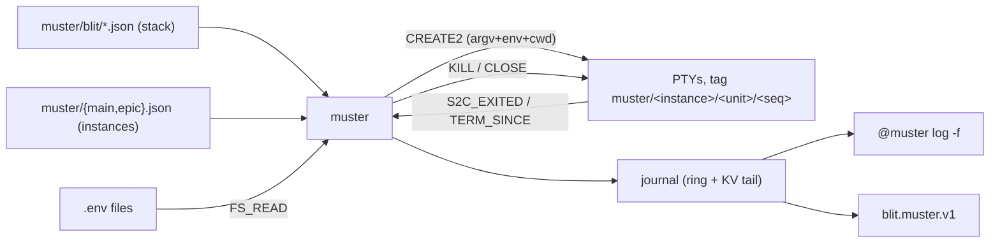

# RFC: Muster, a supervisor for units that run in terminals

- **Status:** Proposed
- **Date:** 2026-08-19
- **Companion to:** [extensions.md](extensions.md), [term-journal.md](term-journal.md),
  [fs-watch.md](fs-watch.md), [fs-read.md](fs-read.md), [fs-write.md](fs-write.md),
  [kv.md](kv.md), [net.md](net.md), [../protocol.md](../protocol.md),
  [../systemd-user-units.md](../systemd-user-units.md)

## Summary

`muster` reads `~/.config/blit/muster/` and supervises what it finds: starts by
declared dependency, restarts on crash or edit, journals every transition. Units
run as ordinary blit PTYs, so *supervised* and *attachable* are the same thing.
A subdirectory is a **stack** of templates; a top-level file naming one is an
**instance**, so a stack runs once per worktree with its own ports and sockets.

No protocol changes. `FEATURE_CREATE_EXEC` (argv + env on `CREATE2`) is what
makes it short.



**Chosen over three things that exist.** `session` supervises desktop entries
from `$XDG_DATA_DIRS/*/applications` with a stamped Wayland socket — no cwd, no
ordering, no terminal. A nested `systemd --user` works
([../systemd-user-units.md](../systemd-user-units.md)) but wants a wrapper, a
private runtime dir and a delegated scope, its children are not terminals, and
its journal is unreadable where the server's user is in neither
`systemd-journal` nor `adm`. [`process-compose.yml`](../../process-compose.yml)
is already this shape — it just cannot hand you the terminal a process runs in,
from a browser, on another machine, after the supervisor is replaced.

**Name.** To muster: to bring into service. A muster roll: the register of a
unit's members and the record of who answered. Collides with nothing in tree.

## Scope

Goals: one file per unit, no hidden enable-state; one stack many instances;
units are terminals; a checkable notion of *ready*; bounded jittered backoff;
argv + cwd + env, the same three knobs a process gets outside a terminal; a
journal that answers "why is this not running"; survive `blit ext update`.

| not doing | because |
| --- | --- |
| supervision outside terminals | `PROCESS` gives raw stdout with no terminal semantics — right for a daemon, wrong for the thing you attach to |
| socket/timer activation | a unit starts by intent, dependency, or hand |
| cgroups, limits, isolation, user switching | units run as the server's user |
| implicit shell | `command` is argv, `shell` is a separate field: the model is written down, not inferred from word count |
| expansion outside a stack | plain units and every env file are literal; substitution exists only in templates, only from declared parameters |
| systemd compatibility | vocabulary borrowed because it is in your fingers; semantics diverge where systemd's are a known trap |
| pane placement | BSP layout is the client's URL hash and `localStorage`; an extension can only make a terminal exist, named |

## Directory

```
~/.config/blit/muster/
  postgres.json          a unit
  path.env               not JSON: a file some units read
  blit/                  a stack
    stack.json             parameter declarations (reserved name, not a unit)
    server.json            a template
    gateway.json
  main.json              instance of blit → main/server, main/gateway
  epic.json              instance of blit → epic/server, epic/gateway
```

Resolved like `blit_config_dir()` (`$XDG_CONFIG_HOME`, else `$HOME/.config`),
overridable with `BLIT_MUSTER_DIR`.

- **An entry's name is its basename without `.json`**, unique because the
  filesystem says so. One rule for units, stacks and instances.
- Top-level file = unit, unless it has `"stack"` (an instance of one) or
  `"include"` (a directory of units adopted as they are); both at once is
  refused. Subdirectory = stack. Leading `.` ignored (editor litter:
  `.#api.json`). Nothing below the first level is read.
- Schema one level up, so it is not itself a unit:
  `blit @muster schema > ~/.config/blit/muster.schema.json`.
- JSON because `"$schema"` makes every editor a validator — completion, enum
  values, a squiggle under a typo — before the supervisor sees the file. It also
  makes unit files, journal, channel and `--json` one syntax: `@muster cat api |
  jq` composes both ways.
- `"$schema"` and `"//"` are accepted and ignored (JSON has no comments). Other
  unknown keys are a `doctor` warning — the editor is the fast path for typos,
  and a newer muster may know the key.

## Unit

```json
{
  "$schema": "../muster.schema.json",
  "description": "Postgres for the dev stack",
  "command": ["postgres", "-D", "/srv/pg"],
  "readyWhen": { "tcp": "127.0.0.1:5432" },
  "restartOnSuccess": true
}
```

| field | type | default | meaning |
| --- | --- | --- | --- |
| `description` | string | unit name | Shown by `list` and the panel. |
| `autostart` | bool | `true` | Start with the supervisor, and when the file appears. |
| `requires` | [string] | `[]` | Must be **ready** first; this stops when one leaves ready. Implies ordering. |
| `wants` | [string] | `[]` | Started alongside. Not waited for, not failed with, not ordered. |
| `after` | [string] | `[]` | Ordering only. |
| `command` | [string] | one of these | argv, exec'd directly. No shell, no rc files, no shell syntax. |
| `shell` | string | one of these | Command line for the server's login shell. Excludes `command`. |
| `cwd` | string | `~` | Absolute or `~`. Unset `CREATE2` cwd would inherit the *server's*. |
| `env` | object | `{}` | Overrides `envFile`, and everything the server derives. |
| `envFile` | string \| [entry] | `[]` | Read in order. Entry is a path or `{path, optional}`. |
| `type` | `simple`\|`oneshot` | `simple` | A `oneshot` is ready when it exits 0. |
| `readyWhen` | below | `"spawn"` | `simple` only. |
| `restartOnFailure` | bool | `true` | Retry a nonzero exit. |
| `restartOnSuccess` | bool | `false` | Retry a clean exit too. Both false = never retry. |
| `restartOnChange` | bool | `true` | Re-run on a change to this file, its template, or a watched `envFile`. |
| `restartDelay` | duration | — | Fixed delay, replacing the jittered backoff. |
| `keep` | number | `1` | Exited terminals retained from previous runs, oldest closed first. |
| `timeoutStart` | duration | `30s` | Budget for `readyWhen`. |
| `stopSignal` | string | `SIGTERM` | Sent to the process group. |
| `timeoutStop` | duration | `10s` | Grace before SIGKILL. |
| `startLimit` | number | `0` | Consecutive failures before `failed`. `0` = no limit. |

Duration: `"250ms"`, `"30s"`, `"5m"`, or a bare number of milliseconds. Exactly
one of `command`/`shell`; `CREATE2` refuses both as `INVALID`, and so does
`doctor`.

The three `restartOn*` are the three reasons to re-run: a crash, a clean exit,
an edit. Two default on — a supervisor that watches a directory and ignores what
it sees is worse than none, and the alternative to restarting a crash is a
stopped unit nobody noticed. `restartOnSuccess` is off because a process that
exits 0 usually meant it, and disagreeing produces a loop rather than an outage.

### `readyWhen`

| form | ready when |
| --- | --- |
| `"spawn"` | `S2C_CREATED_N` — the program resolved and `execve` ran |
| `{"delay": "2s"}` | wall clock |
| `{"path": "/tmp/blit-dev.sock"}` | path exists (`FS_READ` + `FS_READ_NO_CONTENT`, polled 250 ms) |
| `{"log": "listening on"}` | substring appears after start (`TERM_WAIT`, a server-side block) |
| `{"tcp": "127.0.0.1:5432"}` | `NET_OPEN` returns `NET_STATUS_OK` (polled 250 ms) |
| `{"http": "http://127.0.0.1:10001/"}` | `GET` answers below 500 — connect + status line, no TLS, no redirects, no body |
| `"manual"` | `blit @muster ready <unit>`, possibly from the unit itself |

`path` and `http` are v1 because four of the five probes in
`process-compose.yml` are `test -S`, `test -f`, or an HTTP GET; `tcp` is a worse
approximation of two of them, since a port binds before the thing behind it
serves. `log` takes its cursor with `SINCE_PROBE` at create — so the match is
text that arrives *after* the unit started, not whatever was already on screen —
and then arms one `TERM_WAIT`, which the server holds until the needle appears
or `timeoutStart` runs out. Nothing about `log` polls, so there is no window in
which a ready line can be printed and evicted between reads. `path`, `tcp` and
`http` do poll, and stop when the unit leaves `activating`.

### `command` versus `shell`

`command` is argv on the wire (`CREATE2_HAS_ARGV`), reaching `execve` untouched:
no quoting, no splitting, no `$`, no rc file. Default, because deciding between
two execution models by counting words in a string is the exact ambiguity `blit
terminal start` just removed.

`shell` is `$SHELL -lic` — the *login* shell, fish on a host where `$SHELL` is
fish. Use it for a pipeline, a redirection, an `&&`, or the rc file's
environment. Use `["sh", "-c", "…"]` as a `command` for POSIX regardless of who
the server's user is.

## Stacks and instances

`stack.json` declares parameters:

```json
{
  "description": "The blit dev stack",
  "vars": {
    "ROOT":  { "description": "checkout or worktree path", "required": true },
    "PORTS": { "description": "base of a 4-port block", "kind": "ports", "span": 4 }
  }
}
```

An instance binds them:

```json
{
  "stack": "blit",
  "vars": { "ROOT": "/src/blit/.claude/worktrees/epic", "PORTS": 10010 },
  "omit": ["website"],
  "autostart": false
}
```

| field | meaning |
| --- | --- |
| `stack` | subdirectory **or path** to instantiate; its presence makes this file an instance |
| `vars` | one per declared parameter; undeclared or missing-required fails the instance |
| `omit` | templates to skip; anything `requires`-ing an omitted unit fails to load, by name |
| `autostart` | default `true`; `false` holds the whole instance |

Units are `<instance>/<template>`, which reads as the path it is: the instance
groups, the template names. It sorts every unit of an instance together, and it
cannot collide with a plain unit, whose name is a filename and so carries no
separator. Inside a stack, `requires`/`wants`/`after` name templates
unqualified and always resolve within the same instance — a stack is
self-contained, with no syntax for reaching out of one.

### Definitions that live somewhere else

A dev stack belongs in the repository it starts, not in a copy under
`~/.config/blit` that drifts from it. So `stack` also accepts a path, and the
configuration directory holds a six-line pointer:

```json
// epic.json — instantiates a stack from a worktree
{ "stack": "/src/blit/.claude/worktrees/epic/.blit/muster", "vars": { "PORTS": 10010 } }

// work.json — adopts a directory of ordinary units
{ "include": "~/work/units" }
```

A bare word is a subdirectory; anything with a `/` or a leading `~` is a path.
There is no third syntax, and a subdirectory name containing a slash never meant
anything.

The two pointers differ in **naming**, which is the only thing that
distinguishes them and the reason both exist. An instance qualifies —
`epic/server` — which is what one stack running once per worktree wants. An
`include` does not: its units keep their own names, as though the files sat in
the configuration directory. Two includes offering one name is therefore
ambiguous rather than mergeable: first writer wins, `doctor` names both files,
and `omit` resolves it. An included directory holds units only; naming a stack
is what the other pointer is for.

`${STACK_DIR}` is the stack's own directory, and a relative `cwd` or `envFile`
in a template resolves against it. A stack at `<repo>/.blit/muster/` therefore
reaches its checkout with `"cwd": "../.."` and needs no `ROOT` parameter.

**Discovery never leaves the configuration directory.** Muster does not look for
`.blit/muster` in a repository, a cwd, or any ancestor: cloning a repository and
starting a server must not run its code. The pointer is an act someone took, and
it is the same act that already granted arbitrary execution — so this adds
reach, not privilege. What it does add is that **a branch switch changes what a
template says**, since the file is written by `git checkout` rather than by you,
and `restartOnChange` is on by default.

Each distinct external directory costs one `FS_SYNC`, shared between pointers
naming the same one and stopped when the last pointer goes away. A root added
mid-load is empty until its own updates arrive, which triggers another load — so
a new pointer costs one extra pass, not a missing stack.

Rejected: a `BLIT_MUSTER_PATH` of search roots, and auto-discovery from a cwd.
The first needs a cross-root naming scheme and a server restart to change; the
second is the one shape that turns cloning a repository into running it.

### Substitution

Only in a stack's templates, only in string values (never keys), only these:

| form | meaning |
| --- | --- |
| `${NAME}` | the parameter's value |
| `${NAME+N}` / `${NAME-N}` | integer offset; `NAME` must be an integer |

`${INSTANCE}`, `${STACK}` and `${STACK_DIR}` are always defined — the last is
the stack's own directory, which is what lets a repository-resident stack reach
its checkout without the instance restating a path it already named. Unknown
name, unclosed `${`, or
an offset on a non-integer fails **that instance** — naming file, JSON pointer
and variable — leaving other instances running. No empty-string fallback: a
parameter you forgot to bind should not silently produce `http://127.0.0.1:/`.

`${` is the only trigger, so a bare `$` is literal and a `shell` template can
still write `$BLIT_DEV_SOCK` and mean the shell's variable.

Arithmetic exists because a port block is what actually varies, and `bin/dev`
proves the shape: one integer, four ports at `BASE+0..3`, paths stamped with the
instance name.

### Port blocks

`kind: "ports"` + `span` buys two things:

- `PORTS=auto` at `instantiate` scans every instance's block, takes the next free
  base, and **writes the number into the file**. `auto` is never stored or
  re-resolved — an instance always says which ports it took, and says the same
  tomorrow.
- `doctor` reports overlapping blocks, which is the failure mode of several dev
  stacks and presents as `EADDRINUSE` in whichever one lost.

## Environment

Precedence, ascending: what the server derives → each `envFile` in order →
`env`. Files are read **at every start**, not at load. Relative `envFile` paths
resolve against `cwd`; a missing one fails the start unless `"optional": true`.

The merged map travels in `CREATE2_HAS_ENV`, applied last on top of everything
the server derives, and reaches `execve` as `envp` — never a command line. So
nothing appears in `ps`, `/proc/<pid>/cmdline`, or on disk, and an `envFile`
secret is as safe as `EnvironmentFile=`. Env files are never substituted; a
per-instance env file is a path built with `${INSTANCE}`.

Format — `KEY=VALUE`, parsed, never executed:

- `KEY` matches `[A-Za-z_][A-Za-z0-9_]*`; leading `export ` stripped.
- `#` starts a comment **only at line start**, so `PASSWORD=hunter2#3` works.
- Unquoted values run to end of line, trimmed. `'single'` literal; `"double"`
  unescapes `\n \r \t \\ \"`. Neither spans lines.
- No `$` expansion, no command substitution. Duplicate key: last wins.

That is the intersection of what dotenv tools accept, minus every construct they
disagree about. `doctor` reports unparseable lines by file and line, without
printing values.

### `PATH` is the sharp edge

A `command` unit runs no rc file, so `PATH` is the **server process's** — fine
from a terminal, wrong under a systemd unit where it is often coreutils,
findutils, grep, sed and nothing else. No `cargo`, no `pnpm`, no `node`. Fixes,
in order:

1. Set `PATH` in `env` or a shared `envFile`. The server resolves `command[0]`
   **against the child's own environment**, so an override changes which binary
   runs. One `path.env` listed by every unit is the whole fix.
2. Absolute `command[0]`.
3. `shell`, which runs the rc file and inherits nix profile, direnv and the
   rest — at the cost of a shell in the tree and your login shell's syntax.

`doctor` resolves `command[0]` against the unit's *effective* `PATH`.

## Example: the blit dev stack, once per worktree

`process-compose.yml` as a stack. Same graph, probes and restart policies, and
`bin/dev`'s `DEV_INSTANCE` mechanism falls out rather than being reimplemented.

`blit/server.json` — every hazard in one file:

```json
{
  "//": [
    "rm -f before the socket check: the old server's UnixListener::drop does not",
    "unlink, so readyWhen would pass on a stale socket while the new server is",
    "still bringing up its compositor, and dependents would connect to a dead one.",
    "restartOnSuccess stays false: the flock-based replacement exits 0 on purpose",
    "and retrying that loops forever. That is why one default is off.",
    "timeoutStop 15s so AudioPipeline::drop can kill dbus/pipewire/pw-cat in order.",
    "shell, not command, for the &&. $BLIT_DEV_SOCK is the shell's variable:",
    "only ${...} is ours."
  ],
  "description": "blit server (${INSTANCE})",
  "requires": ["build"],
  "cwd": "${ROOT}",
  "shell": "rm -f $BLIT_DEV_SOCK && exec ./target/profiling/blit server --verbose --socket $BLIT_DEV_SOCK --allow-persistent-extensions",
  "env": {
    "BLIT_DEV_SOCK": "/tmp/blit-dev-${INSTANCE}.sock",
    "BLIT_EXTENSION_PATH": "/tmp/blit-dev-${INSTANCE}-ext/extensions.redb"
  },
  "readyWhen": { "path": "/tmp/blit-dev-${INSTANCE}.sock" },
  "restartDelay": "2s",
  "startLimit": 5,
  "keep": 3,
  "timeoutStop": "15s"
}
```

`blit/gateway.json` — nine variables, one a live secret, no difference in
delivery:

```json
{
  "description": "Gateway on :${PORTS+1} (${INSTANCE})",
  "requires": ["build", "server"],
  "cwd": "${ROOT}",
  "command": ["./target/profiling/blit", "gateway"],
  "envFile": [{ "path": "${ROOT}/.env.local", "optional": true }],
  "env": {
    "BLIT_ADDR": "127.0.0.1:${PORTS+1}",
    "BLIT_QUIC_PUBLIC_ADDR": ":${PORTS+1}",
    "BLIT_SOCK": "/tmp/blit-dev-${INSTANCE}.sock",
    "BLIT_CORS": "*", "BLIT_PROXY": "0", "BLIT_QUIC": "1", "BLIT_STORE_CONFIG": "1"
  },
  "readyWhen": { "http": "http://127.0.0.1:${PORTS+1}/" },
  "restartOnSuccess": true
}
```

Eight templates in all. `ui.json` is `cwd: "${ROOT}/js/ui"`,
`["pnpm","exec","vite","--host","--port","${PORTS}"]`,
`readyWhen: {"log": "ready in"}`; `website.json` is the same shape on
`${PORTS+2}` and `extensions.json` on `${PORTS+3}`. `build.json` and
`js-deps.json` are `oneshot`s — which is how one keyword covers what
process-compose spells `process_completed_successfully` and `process_healthy`.
`browser-wasm.json` watches with
`readyWhen: {"path": "${ROOT}/crates/browser/pkg/blit_browser.js"}`. With
`server` and `gateway` above: `main` runs all eight, `epic` omits `website` and
runs seven. process-compose's ninth process, `share`, is conditional on an
environment variable being set at all — the shape `omit` replaces.

A new worktree is one command:

```bash
cd /src/blit/.claude/worktrees/epic
blit @muster instantiate blit "$(basename $PWD)" ROOT="$PWD" PORTS=auto
blit @muster start epic
```

`auto` took 10010 because 10000–10003 were spoken for, and wrote `10010` into
`epic.json`. Its gateway is `:10011`, its socket
`/tmp/blit-dev-epic.sock`, its terminals `epic/server` and so on in every
client's catalog.

Not everything wants a stack: a `postgres`/`migrate`/`api`/`stripe` set at top
level is four units, and nothing about them differs per instance.

## Phases

| phase | meaning |
| --- | --- |
| `stopped` | not running, nothing wanted |
| `waiting` | wanted; a `requires` is not ready |
| `activating` | PTY created, `readyWhen` unsatisfied |
| `running` | ready; dependents may proceed |
| `exited` | `oneshot` finished 0; counts as ready until the file changes |
| `backoff` | failed, retry armed |
| `failed` | gave up: no `restartOn*` applied, `startLimit` exhausted, invalid file, cycle |
| `held` | stopped by hand; ignores `autostart` until started or the supervisor restarts |

An instance has no phase — `list` shows a ready count, and a verb on it means
that verb on each unit in dependency order.

`activating` exists because "running" was a lie in `session`: the phase was set
when the spawn was *requested*, so a unit with a missing binary sat `running`
forever with no child. Muster sets `CREATE2_WANT_STATUS` and treats
`S2C_CREATE_FAILED` as a failed start.

| in | event | out | journal |
| --- | --- | --- | --- |
| `stopped` | autostart / `start` / a dependent needs it | `waiting` | `start` + cause |
| `waiting` | all `requires` ready | `activating` | `spawn` |
| `waiting` | a `requires` went `failed` | `failed` | `failed`, naming it |
| `activating` | `S2C_CREATE_FAILED`, or env unresolvable | `backoff` | `exit` + reason |
| `activating` | `readyWhen` satisfied | `running` | `ready` |
| `activating` | `timeoutStart` elapsed | `backoff` | `failed` (`timeout`) |
| `activating` | `S2C_EXITED`, `oneshot`, 0 | `exited` | `ready` |
| `running` | `S2C_EXITED` | `backoff`\|`stopped`\|`failed` | `exit` + code + reason |
| `running` | a `requires` left `running` | `waiting` | `stop` (`dependency:<unit>`) |
| `backoff` | deadline due | `activating` | `restart` + attempt |
| any | `stop` | `held` | `stop` (`command`) |
| any | file deleted | `stopped` | `unloaded` |

## Running a unit

**Spawn.** `FS_READ` each `envFile` (absolute, one shot, no sync), merge with
`env`, send one `CREATE2`: `tag = muster/<unit>@<instance>/<seq>`, cwd, merged
env, argv or command, `CREATE2_WANT_STATUS`. Guest SDK:
`CreateRequest { tag, argv, env, cwd, .. }`. Caps are the process family's
(`CREATE2_MAX_ARGC`, `_ARG_LEN`, `_ARG_BYTES`) — same `execve` at the far end.

A `cwd` that cannot be entered is no longer ignored: the child writes
`blit: cannot enter working directory: …` to the terminal and exits 1.

An unresolvable `command[0]` is **not** as precise, and an earlier draft of this
document was wrong about it. It claimed a refused create, reasoning that the
server resolves the program before forking. Measured, an absolute path that does
not exist produces a terminal that exits 1 having printed nothing: the resolver
passes an absolute path through unchecked, and the failure lands in the child.
A missing binary therefore looks exactly like a program that started and quit.
Only `@muster status`, which shows the run, and `doctor`, which resolves
`command[0]` itself, tell them apart.

**`FEATURE_CREATE_EXEC` is negotiated, not probeable.** A server without bit 29
does not skip an env block it does not know — it reads those bytes as command
text and shells them. Muster checks the `S2C_HELLO` features captured at
bootstrap and refuses to start any unit with `command`/`env` if absent, with
that reason journaled. No fallback to the legacy NUL-joined spelling: silently
running something other than what the file asked for is worth refusing over.

**Stop.** `C2S_KILL` with `stopSignal`, default mode (whole process group).
`C2S_KILL` does not escalate, so muster arms `timeoutStop` and sends SIGKILL
itself. `C2S_CLOSE` is not a stop verb — it removes the PTY, and its scrollback
is the reason the unit is stopped.

**Restart — always a new terminal.** Next `<seq>`, fresh `CREATE2`. Muster never
sends `C2S_RESTART`. It works — same `pty_id`, scrollback kept, spec replayed —
but it replays the spec the PTY was *created* with, so it cannot serve an
edit-restart. Using it only for crashes would make the two kinds behave
differently: one keeps your pane, the other swaps the terminal underneath it.
One always-true rule beats two half-true ones, and a client that follows the
unit rather than the terminal is correct in both.

**Retention** replaces the kept scrollback: `keep` exited terminals stay in the
session, oldest closed first past the limit. A crash loop leaves the last `keep`
runs side by side with their exit codes instead of one pane of concatenation,
and the run that broke is addressable — `blit terminal journal 17` reads it with
no archaeology. Per unit, because the units that want history are not the ones
that churn: a server crashing twice a day wants several, a watcher that exits on
every save wants none.

**Backoff.** `BACKOFF_BASE = 250ms`, doubling, `BACKOFF_MAX = 30s`, full jitter,
`HEALTHY_AFTER = 60s` resets the failure count — the same constants as the
server's extension supervisor and `session`, because a third set drifts.
`restartDelay` replaces the schedule with a fixed delay.

## Dependencies

Starting a unit starts the transitive closure of `requires` + `wants` in
topological order, within its instance. Independent units start concurrently:
one thread, but every wait is a deadline in one loop, so two instances never
wait on each other.

A `requires` dependent **stops when its dependency leaves `running`** and starts
again when it returns. Stronger than systemd's default, and what a dev stack
wants: recycle the database, everything above it recycles, in order, once.
`wants` and `after` never cascade. Stops walk the reverse order.

`requires` also implies ordering. systemd separating `Requires=` from `After=`
is the most common unit-file mistake there is; `wants` covers start-but-do-not-
wait and `after` covers order-without-requiring, so nothing is lost.

Cycles are refused at load — every member `failed`, a `cycle` event naming the
ring. A partially-started cycle is worse than a stopped one.

## Journal

Supervision events, not output: output is the terminal, and `blit terminal
journal <pty>` already reads it with exit codes and sequence cursors.

```json
{ "seq": 42, "ts": 1755600000180, "unit": "epic/gateway", "instance": "epic",
  "event": "spawn", "phase": "activating", "pty": 7,
  "detail": "./target/profiling/blit gateway",
  "envFiles": ["/src/blit/.claude/worktrees/epic/.env.local"], "envKeys": 9 }
{ "seq": 44, "ts": 1755600310114, "unit": "epic/gateway", "event": "exit",
  "phase": "backoff", "pty": 7, "exitCode": 101, "reason": "normal",
  "detail": "retry 1 in 250ms" }
```

| event | when |
| --- | --- |
| `loaded` / `changed` / `unloaded` | a file appeared and parsed / parsed differently / went away |
| `invalid` | did not parse, or a parameter did not bind; last good version stays in effect |
| `cycle` | dependency cycle, members named |
| `start` | intent recorded, before anything is spawned |
| `spawn` | `CREATE2` sent; pty id, env files read, key count |
| `ready` | `readyWhen` satisfied, or a `oneshot` exited 0 |
| `exit` | `S2C_EXITED`, code and `EXIT_REASON_*` |
| `restart` | a backoff deadline came due |
| `reaped` | a retained terminal closed to stay within `keep`; pty and exit code |
| `stop` / `failed` | signalled, with cause / gave up, with why |
| `adopted` | a live PTY reclaimed after the supervisor restarted |

`cause` ∈ `autostart`, `dependency:<unit>`, `command`, `file`, `crash`,
`policy`, `adopt`. The question the journal answers is "who asked for this", and
free text does not answer it reliably. Records carry `instance`, so
`@muster log -u epic` is a filter, not a grep.

**Environment values never appear.** `spawn` names the files and counts keys —
enough to diagnose "it did not pick up my `.env`", not enough to leak.

Storage: an in-memory ring, plus a durable tail in KV under
`ext/muster/log/<seq:016x>`, counter at `ext/muster/seq`. Prefix isolation is
convention — KV is flat and server-wide, shared with `tabs/`, `roots/`,
`ext/session/`. The durable tail is why `@muster log` still says why something
is down after a server restart.

The ring is sized so it is never the answer to "why is that not in the log":
bringing up a hundred units emits some hundreds of records, so it holds many
cold starts. It is bounded at all only because a unit crash-looping at the
250 ms floor emits records for as long as the supervisor lives.

## Channel

`blit.muster.v1`, one JSON object per message. Full state on every change, no
deltas — reconciling deltas against a client that missed one is a bug generator,
and the state is small.

```json
{ "type": "hello", "version": 1, "dir": "/home/…/.config/blit/muster" }
{ "type": "state",
  "instances": [ { "name": "epic", "stack": "blit", "ready": 0, "total": 7 } ],
  "units": [ { "name": "epic/gateway", "instance": "epic", "phase": "running",
    "pty": 7, "since": 1755600004902, "restarts": 1, "lastExit": 101,
    "requires": ["epic/build", "epic/server"] } ] }
{ "type": "event", "record": { … } }
```

Inbound is one bare line: `start|stop|restart|reload|resync|log <name>`, where
`<name>` is a unit or an instance. Acked before acting.

Flow control, one pending delivery: journal records queue (they answer a
question that will not repeat), `state` drops when out of credit (the next one
carries everything). Peers past 1 MiB are closed. No listener token, so any
client knowing the name can drive it — the same posture as `blit.session.v1`,
and as being able to open a terminal at all.

## CLI

```
blit @muster list                                   [--json]
blit @muster status NAME                            [--json]
blit @muster start|stop|restart NAME
blit @muster reload [NAME]
blit @muster ready UNIT
blit @muster log [-n N] [-u NAME] [--since SEQ] [-f] [--json]
blit @muster cat NAME
blit @muster env UNIT                               [--json] [--values]
blit @muster stacks                                 [--json]
blit @muster instantiate STACK INSTANCE [VAR=VALUE...]
blit @muster remove INSTANCE
blit @muster schema
blit @muster doctor                                 [--json]
```

`NAME` is a unit or an instance.

```
$ blit @muster list
NAME              PHASE     PTY  SINCE  RESTARTS  DESCRIPTION
postgres          running   4    3h     0         Postgres for the dev stack
main              —         -    41m    1         blit, 8/8 ready
  main/server     running   6    40m    1         blit server (main)
  main/gateway    running   7    40m    0         Gateway on :10001 (main)
epic              —         -    -      0         blit, 0/7 ready, held

$ blit @muster status epic/gateway
unit         epic/gateway
phase        backoff
pty          19       started 4s ago
runs         18       exit 101   ran 5m12s   ended 4s ago
             17       exit 101   ran 5m08s   ended 5m16s ago
             16       exit 0     ran 2h01m   ended 10m24s ago
```

The `PTY` column is the terminal id, so `blit terminal attach 7` picks up where
`@muster` stops. `S2C_LIST` renders an argv terminal shell-quoted rather than
blank, so a unit is identifiable in any client's catalog without asking muster.

- `env UNIT` resolves the environment as a start would, printing key names and
  which file each came from — "which of my three `.env` files won", and "which
  `PATH` will `command[0]` resolve against". Names only; `--values` opts in.
- `cat` prints the file verbatim: `env` values (you wrote them there) and
  `envFile` paths (not their contents).
- `instantiate` writes through `FS_WRITE` on the sync it already holds, resolving
  `auto` first, refusing to overwrite. `remove` stops, closes terminals, deletes.
- Human output is tab-separated; `--json` sends one `result` payload of
  `application/json` **instead of** the text — in plain mode the CLI writes a
  RESULT straight to stdout, so sending both prints the answer twice.
- `doctor` in one pass: parse errors with line and column, unknown keys, both
  `command` and `shell`, `requires` naming something absent or omitted, cycles, a
  `cwd` that is not a directory, a `command[0]` that does not resolve against the
  effective `PATH`, missing non-optional `envFile`s, unparseable env lines,
  unbound or undeclared parameters, and **overlapping port blocks**. Cheap enough
  to run on every `reload`.

## Watching

One `C2S_FS_SYNC`, `FS_SYNC_RECURSIVE | FS_SYNC_CONTENT`, `latency_ms = 200`,
everything below the second level dropped on arrival. Non-`*.json` and
leading-`.` are ignored.

`inline_max` is left at zero, which takes the server's own ceiling. Setting one
here would not mean "read at most this much" — it means a unit file larger than
it arrives with no content and is therefore `invalid`, which is a rule nobody
would guess. The same applies to the per-file cap on reading an `envFile` and to
the per-poll slice of `TERM_SINCE`; muster names none of them, because the
server already has an answer and a second one can only disagree.

`FS_SYNC` mirrors state rather than delivering events, which fits: a save
producing identical bytes is invisible and there is nothing to do. It also means
a half-written file can arrive — and JSON is unusually good at being obviously
incomplete, failing at the missing brace. **A file that does not parse never
displaces the one that did**: the unit keeps running, `invalid` carries the
error, `doctor` lists it. Never parsed at all = `failed`.

Editing a template re-resolves **every instance of that stack** — one save can
restart eight units across three worktrees. That is the sharp edge of
`restartOnChange` defaulting on, and two things keep it survivable: unparseable
files restart nothing, and the 200 ms settle window makes a save one event, not
one per keystroke. What remains is that a *valid* edit acts immediately, which is
the point — a unit whose file no longer describes it is a lie. Set
`"restartOnChange": false` per unit to wait for `@muster restart` instead. An
edit-restart is a restart like any other: new terminal, previous one retained.

`envFile`s are watched for every unit with `restartOnChange` — now most of them —
one metadata-only `FS_SYNC` per distinct path, since the hash in a metadata
record is change signal enough. Units sharing a file share the watch. An
`optional` file that does not exist cannot be synced (a canonicalized missing
root is `FS_STATUS_NOT_FOUND`); it is picked up at the next start.

`~` is not expanded by the FS family — muster resolves the directory from
`C2S_ENV_GET` matching `blit_config_dir()`, and expands `~` in `cwd`, `envFile`
and `readyWhen: {path}` itself.

## Surviving its own replacement

Bootstrap with `bootstrap_with_initial` and keep the whole initial burst — plain
`bootstrap()` discards it, and `S2C_LIST` arrives exactly once before `READY`
with no request to fall back on. The burst is
`HELLO, LIST, TITLE*, EXITED*, READY`, so keep the `EXITED` records too: they
are how a terminal that died while nobody was supervising is told apart from one
still running, and adopting a corpse as the live run parks it in `activating`
until `timeoutStart` and then replaces it. For the same reason adoption cannot
hang off `S2C_READY` — bootstrap consumes it, so it never reaches the loop.

Per unit, tags sort by `<seq>`: the highest **not-exited** is the live run,
failure count 0, `started_at` now so it re-earns `HEALTHY_AFTER`. The rest are
history, trimmed to `keep`. All exited = `stopped` (or `exited`, for a `oneshot`
that succeeded), and the next start takes the next seq, so a corpse is never
mistaken for the live run. Tags naming a vanished unit or
instance are closed outright.

**Only a `readyWhen` that describes the present may be re-run on an adopted
unit**: `path`, `tcp` and `http` ask the world a question and get today's
answer. `log`, `delay` and `spawn` describe a past event, and the evidence for
one — a line in a bounded ring, a moment that has passed — may be gone. A live
terminal is the evidence for those, so they adopt straight to `running`.
Re-running a `log:` probe instead stalls a healthy unit for `timeoutStart` and
then replaces it, which is precisely the restart storm adoption exists to
prevent.

So `blit ext update muster` replaces the supervisor while every instance keeps
running, journaling `adopted` rather than a restart storm. No KV process
references, no boot generation — the tag on a live PTY is the truth.

## Cost and dependencies

Idle: nothing sent; the loop parks in `wait_until` on the nearest deadline.
Per start: one `FS_READ` per `envFile`. Standing: one metadata-only `FS_SYNC`
per distinct watched `envFile`. `readyWhen` polling runs only during
`activating`. A `TERM_SINCE` probe and an `FS_READ` stat are both O(1)
server-side. Instances multiply units, not watches — a stack's templates are one
sync's worth of files however often instantiated.

Muster takes `serde_json` + `serde` derive, breaking the precedent that an
extension depends on `blit-guest` alone. Its JSON is nested, user-authored and
wrong often enough that the parse error is a feature: `doctor` saying *line 7,
column 3, expected string* is the product, and a hand-rolled reader that says
that well is a worse copy of a crate that exists. The same dependency emits
every `--json` payload and the journal, so the escaper a hand-rolled emitter
would need is already linked in either way. Measured under `wasm-opt -Oz` the
whole extension is **344 KB, 118 KB brotli**, against `session`'s 187 KB / 68 KB
and `systemd`'s 116 KB / 45 KB. Roughly a doubling, on an object that is downloaded
once and pinned by digest. If that number ever stops being worth it, the
fallback is a hand-rolled parser and a worse `doctor`, not a worse format.

## Security

- Writing `~/.config/blit/muster/` is arbitrary execution as the server's user —
  same as `~/.config/systemd/user`, same as opening a terminal. New: the blit
  protocol reaches that directory (`FS_WRITE`, `FS_UPLOAD`), which is also how
  `instantiate` works. `BLIT_FS_WRITE=0` closes it, at the cost of
  `instantiate`/`remove`.
- A pointer extends that reach to a directory outside, but not the privilege:
  writing the pointer is the same act, and only someone who could already run
  anything can perform it. What it does introduce is a **second writer** —
  `git checkout` — so a branch switch changes what a template says without
  anyone editing a file. Muster therefore never discovers a stack from a cwd or
  a repository layout; a pointer has to exist. Treat an external stack as code
  you have read, on the branches you run.
- Env files are expected to hold secrets. They reach the child as `envp` and
  nowhere else: not a command line, not `/proc/<pid>/cmdline`, not written to
  disk by muster, not journaled, not in `status`, not on the channel, not in
  `env` without `--values`.
- `C2S_ENV_GET` returns the server's environment verbatim, credentials included,
  with none of the `BLIT_*` filtering the PTY spawn path applies. Muster reads it
  for `HOME` and `XDG_CONFIG_HOME` and never echoes it.
- Off switch: do not run the extension. `BLIT_MUSTER_DIR` moves it, which is also
  how tests stay out of a real configuration.

## Top risks

- **`PATH` is the server's, not yours.** Exec-by-default runs no rc file, so a
  stack that works by hand can fail to resolve `cargo` — especially under a
  systemd-started server. Fix is one `path.env`, diagnosis is `doctor`, failure
  is a refused create naming the program. Still a surprise when porting.
- **`shell` is the login shell.** Bash idiom fails where `$SHELL` is fish.
  `["sh","-c",…]` is the portable spelling.
- **A stack multiplies blast radius, and `restartOnChange` is on.** One valid
  template edit restarts every instance; each is a new terminal, so an attached
  client is left watching a readable corpse. The hazard is a *good* edit — a bad
  one restarts nothing.
- **Retention costs scrollback.** `keep` × units × instances, each a buffer.
  Default 1 roughly doubles a stack at rest. `status` shows what is held.
- **`log:` readiness is armed once, not polled.** `TERM_WAIT` blocks
  server-side from a cursor taken at spawn, so there is no window in which a
  ready line can be printed and evicted between polls. Muster does not block on
  the reply — that would park its single loop for the whole of `timeoutStart` —
  so the answer arrives through the loop, guarded on the unit still being the
  run that armed it.
- **Cascade stops are stronger than systemd's** — bounded to one instance, which
  is what keeps it from being worse than it sounds.
- **Port blocks are allocated, not enforced.** `auto` picks a free base once;
  nothing stops a hand-edit colliding or a program binding outside its span.

## Future work

- Dependencies across stack boundaries. Omitted because a self-contained stack
  has no ambiguity, and a shared database between per-worktree stacks wants a
  decision about migrations first.
- `envFile` key subsets; a `passEnv` list forwarding named server variables.
- `stopCommand`, `reloadCommand`, `restartOnAbnormal` (signals, not exit codes).
- A stack fetched from a repository, pinned by digest like an extension module.
- Deriving instances from git worktrees: the list is enumerable, and
  `${ROOT}`/`${INSTANCE}` are exactly a worktree's path and name.
- A browser panel on `blit.muster.v1` — the reason the channel carries full
  state, an instance list and a live event stream rather than being a transport.
- ~~`TERM_JOURNAL_WAIT` instead of the `log:` poll.~~ Done, but not with that
  opcode: it waits on a *command record*, which only exists for a PTY whose
  shell emits OSC 133, and a unit exec'd directly emits none. `C2S_TERM_WAIT`
  is the wait on text that `log:` actually needed
  ([term-journal.md](term-journal.md)). Chasing it also found the
  per-connection wait cap at 32 — a supervisor arms one per unit, so at a
  hundred units it would have served the first 32 — now 4096, which is
  bookkeeping the lifecycle loop already scans rather than the delivery tick.
- Placing a unit's terminal in a pane, once a client exposes layout beyond its
  own URL hash.
