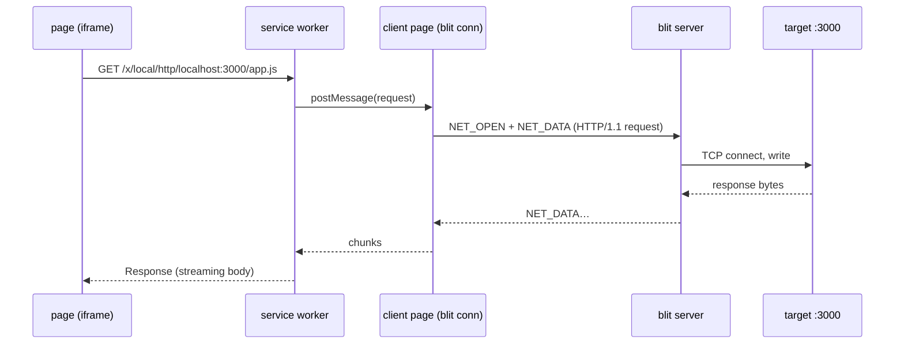

# RFC: TCP and UDP Relay (`NET_*`)

- **Status:** Implemented through PR 7 — the `NET_*` wire, the server's TCP
  and UDP relay, TLS termination with ALPN, `blit forward` with a spec list
  (`tcp/`, `udp/`, `tls/`), and `blit.forwards`. PRs 8–11, the browser path,
  are unstarted.
- **Date:** 2026-07-28
- **Companion to:** [../protocol.md](../protocol.md),
  [../transports.md](../transports.md), [kv.md](kv.md), [../ide.md](../ide.md)

## Summary

A **raw, bidirectional socket relay** on the blit server: the client
names a host and port, the server opens a socket, and the two ends
shuttle payload. Two socket kinds, chosen per open:

- **TCP** — an ordered byte stream, with half-close and byte-window
  credit. The default, and everything below assumes it unless UDP is
  named.
- **UDP** — a datagram flow, message-preserving, unacked, droppable
  ([§ UDP flows](#udp-flows)).

That is the whole primitive. There is no HTTP in it. The server does
not parse requests, does not know what a header is, and never fetches
anything on its own initiative — it opens sockets where it is told and
copies payload. Everything protocol-shaped lives in the client, which
is what makes the family general: an HTTP dev-server preview, an SSE
stream, a WebSocket upgrade, a Postgres connection, a DNS resolver, and
`ssh -L` are all the same handful of opcodes.

The first thing built on it is **port forwarding**, `blit forward`
([§ Client: `blit forward`](#client-blit-forward)) — TCP and UDP, plain,
with no TLS anywhere on that path. It is `ssh -L` over any blit
transport, plus the UDP case ssh has never had.

The motivating consumer is the browser: a **service worker** on the
gateway's own origin intercepts `fetch` for a reserved path prefix,
speaks HTTP/1.1 over a relayed stream, and hands back a `Response`
whose body streams. That makes a dev server on the blit host — or on
anything the blit host can reach but the browser cannot — loadable in
the tab, subresources and all, over the connection that is already
open and already authenticated. The service worker is
[§ Client: service worker](#client-service-worker); it is deliberately
**phase 2**, because the same wire has a far simpler first consumer
([§ Client: `blit forward`](#client-blit-forward)) that validates every
part of it without touching a browser.

**TLS is opt-in and TCP-only** ([§ TLS termination](#tls-termination)).
A service worker has no TLS stack and cannot get one, so reaching an
`https://` dev server from the tab requires the server to terminate —
with ALPN, so h2 is not walled off ([§ ALPN and h2](#alpn-and-h2)).
Leave the flag clear, as `tcp/` and `udp/` forwards always do, and the
relay is a pipe that has never heard of certificates: TLS the local
client speaks passes through end to end, opaque. Set it and the server
terminates, which `blit forward`'s `tls/` kind exposes for the case
worth having outside a browser — plaintext locally, TLS to the target.

## Non-goals

- **No server-side HTTP.** No request/response opcode, no server-side
  `reqwest`. A request/response family would be smaller on the wire and
  would break every streaming case (SSE, chunked upload, WebSocket
  upgrade, gRPC), and it would put an HTTP client's attack surface in
  the server. A byte relay has neither problem.
- **No server-initiated streams.** Only clients open. A server that can
  dial into a client is a different, much larger security question, and
  nothing wants it yet.
- **No reverse tunnel.** Exposing a client-side port on the server
  (`ssh -R`) is a separate RFC; the wire below leaves the direction bit
  unspoken rather than reserving space for it.
- **No h2 client in the server.** The wire negotiates ALPN and reports
  what it got; if a client asks for `h2` it owns HPACK and framing
  ([§ ALPN and h2](#alpn-and-h2)).
- **No DTLS, and no TLS on UDP.** The TLS flag is a TCP-only
  convenience for a client that cannot terminate for itself. A UDP
  client that wants DTLS or QUIC runs it end-to-end over the flow, and
  the relay stays ignorant — which is also the only arrangement in
  which its certificate checking means anything.
- **No reliability added to UDP.** Datagrams are relayed, dropped under
  pressure, and never retransmitted by the relay
  ([§ UDP flows](#udp-flows)). A tunnel that quietly makes UDP reliable
  is a tunnel that quietly breaks every protocol that chose UDP.

## Wire

**Feature bit 10** (`FEATURE_NET`) — the first free `S2C_HELLO` bit
(fs=6, git=7, lsp=8, kv=9; `FEATURE_KV` is
[crates/remote/src/kv.rs:47](../../crates/remote/src/kv.rs)). Opcodes
take the free `0x80` block in both directions (0x40 fs, 0x50 git, 0x60
lsp, 0x70 kv). Gateway, proxy, and mux forward them unmodified.

| Dir | Opcode | Name         | Layout                                                                |
| --- | ------ | ------------ | --------------------------------------------------------------------- |
| C2S | `0x80` | `NET_OPEN`   | `[stream_id:2][flags:1][port:2][host_len:2][host:N]` + TLS block      |
| C2S | `0x81` | `NET_DATA`   | `[stream_id:2][data:N]` — TCP only                                    |
| C2S | `0x82` | `NET_ACK`    | `[stream_id:2][bytes:8]` — cumulative, TCP only                       |
| C2S | `0x83` | `NET_CLOSE`  | `[stream_id:2][flags:1]`                                              |
| C2S | `0x84` | `NET_DGRAM`  | `[stream_id:2][payload:N]` — one datagram, UDP only                   |
| S2C | `0x80` | `NET_OPENED` | `[stream_id:2][status:1][alpn_len:1][alpn:N][detail_len:2][detail:N]` |
| S2C | `0x81` | `NET_DATA`   | `[stream_id:2][data:N]` — TCP only                                    |
| S2C | `0x82` | `NET_ACK`    | `[stream_id:2][bytes:8]` — cumulative, TCP only                       |
| S2C | `0x83` | `NET_CLOSED` | `[stream_id:2][reason:1][detail_len:2][detail:N]`                     |
| S2C | `0x84` | `NET_DGRAM`  | `[stream_id:2][payload:N]` — one datagram, UDP only                   |

All integers little-endian. `host` is UTF-8, non-empty, ≤ 255 bytes: a
DNS name or a literal address, **resolved on the server** — reaching
names the client cannot resolve is half the point.

Datagrams take their own opcode rather than riding `NET_DATA` under a
flag, because the two have incompatible reader contracts: a stream
reader may coalesce and re-split freely, a datagram reader may never do
either. One opcode carrying both is a bug that compiles — code that
merges two queued `NET_DATA` writes is correct under the stream
contract and destroys message boundaries under the datagram one.
Separate opcodes make that mistake impossible to make by omission.

**`NET_OPEN.flags`:** bit 0 `TLS` (terminate TLS toward the target;
relayed bytes are the plaintext stream), bit 1 `INSECURE` (skip
certificate and hostname verification — `INVALID` unless bit 0 is set,
`PERMISSION` unless server policy allows it, § Target policy), bit 2
`UDP` (open a datagram flow rather than a TCP stream; `INVALID`
combined with bit 0 or bit 1, § No DTLS). Unknown bits are `INVALID`,
not ignored: a client asking for a guarantee this server has never
heard of must not be told yes.

The **TLS block** is present iff bit 0 is set, and follows `host`:

```text
[sni_len:2][sni:N][alpn_count:1] repeated{ [proto_len:1][proto:N] }
```

Empty `sni` means "use `host`", the almost-always-right default;
`sni_len > 0` is for the cases where they differ. `alpn_count` may be
zero (offer no ALPN at all). No `NET_DATA` or `NET_DGRAM` may precede
the `NET_OPEN` for its id.

`TCP_NODELAY` is always set on relayed streams. There is no flag for it
— every consumer of a relayed interactive stream wants it, and one that
does not can batch its own writes.

### Stream ids are client-allocated

This diverges from the family precedent, where the server mints
`sync_id` / `repo_id` / `kv_id` and returns it in the reply. Those are
server-side resources with server-managed lifetimes and no reason to
exist before the server says so. A TCP stream is different: it is
client-initiated, and the client already knows the first bytes it wants
to send. Client-allocated ids let it send them **immediately**, in the
same batch as `NET_OPEN`, without waiting a round trip to learn the id.
The server buffers pre-handshake `NET_DATA` (bounded by the initial
window, § Pacing) and writes it once the socket — and the TLS handshake,
when asked for — is up. So `connect` + `TLS` + `send request` costs the
transport RTT the connection would have paid anyway, not two more.

Ids are 16-bit, drawn from **one space shared by TCP streams and UDP
flows** — a `stream_id` identifies a relayed socket, and which kind it
is was settled by its `NET_OPEN`. Sending `NET_DATA` on a UDP id, or
`NET_DGRAM` on a TCP one, is `INVALID`. The client allocates them
however it likes and **must not reuse one until it has seen
`NET_CLOSED`** for the previous occupant. A `NET_OPEN` naming a live id
is `INVALID` and does not disturb the live socket. Server-initiated ids
do not exist, so there is no odd/even split to arrange.

UDP opens are answered by `NET_OPENED` too, though there is nothing to
connect: the reply reports policy and resolution outcomes
(`PERMISSION`, `NOT_FOUND`) and otherwise `OK` once the server has a
bound socket. Pipelined `NET_DGRAM` before that reply is legal and
queued under the same cap as pipelined stream data.

On a failed open the server discards any pipelined `NET_DATA` and sends
exactly one `NET_OPENED` with the failure status; no `NET_CLOSED`
follows, because nothing was ever open. `NET_OPENED` with status `0` is
also exactly one per `NET_OPEN`, so a client's state machine is
`OPENING → OPEN → CLOSED` with a single entry to each.

### Statuses

`NET_OPENED.status` reuses [git.md](git.md)'s table where the semantics
overlap — `0`, `1`, `2`, `4`, `6`, `7`, `9` are that table verbatim — and
takes `3` and `5`, whose git meanings (`WRONG_TYPE`, `TOO_LARGE`) are
meaningless for a byte relay:

```text
0 OK
1 UNKNOWN_ID   stream_id unknown or already closed
2 NOT_FOUND    host did not resolve
3 REFUSED      connect refused, unreachable, or timed out
4 PERMISSION   target refused by policy (§ Target policy)
5 TLS          handshake or certificate verification failed
6 BUDGET       concurrent-stream or memory budget exhausted
7 INVALID      malformed request: unknown flags, empty host, live stream_id,
               INSECURE without TLS, TLS block absent with TLS set,
               UDP combined with TLS or INSECURE
9 OTHER        diagnostic in detail
```

`detail` carries a human-readable reason and is most valuable on `5`,
where "which certificate error" is the difference between a typo and a
self-signed dev server the user meant to trust. `NOT_FOUND` and
`REFUSED` are kept apart deliberately: they route to different fixes,
and collapsing them is how "why is my preview blank" becomes a
20-minute detour.

`NET_CLOSED.reason`:

```text
0 EOF        target closed cleanly (TCP)
1 RESET      connection reset by the target, or ICMP unreachable (UDP)
2 TIMEOUT    idle timeout (§ Budgets) — the normal end of a UDP flow
3 POLICY     closed by the server: policy reload, target revoked
4 BUDGET     retention or stream budget exceeded
5 SHUTDOWN   server or blit connection going away
```

A client-initiated full close (`NET_CLOSE` without `WRITE`) is still
answered with `NET_CLOSED`, so the id-reuse rule has one signal to wait
on regardless of who ended it.

`detail` on a UDP `NET_CLOSED` carries the flow's **drop counts**, both
directions. Drops are the one thing about a relayed UDP flow a user
cannot infer from the outside — "DNS is flaky through the tunnel" and
"the tunnel dropped 400 datagrams" are the same fact, and only one of
them is actionable. They ride the close rather than a periodic opcode
because a counter that needs its own message needs its own pacing, and
this family has enough of that already.

### Half-close

TCP only. `NET_CLOSE.flags` bit 0 `WRITE` shuts down the client's write
side (`shutdown(SHUT_WR)`, or the TLS `close_notify` when terminating);
the stream stays open for reading and the id stays live. Without the
bit, the stream is aborted in both directions and the socket is reset.
On a UDP flow the bit is `INVALID` — a datagram flow has no write side
to shut down and no FIN to carry the signal.

Half-close is not optional decoration. `Connection: close` with a
request body, and every protocol that signals end-of-input with FIN,
are unimplementable without it. The reverse direction is `NET_CLOSED`
with reason `0`: the target is done writing. A client that still has
data to send may keep sending after receiving it, until it closes its
own side.

### UDP flows

A UDP `NET_OPEN` binds an ephemeral socket on the server and
**connects** it to the resolved target, so it can only send there and
only receives from there. Every `NET_DGRAM` from the client is one
`send`; every `recv` is one `NET_DGRAM` back. There is no reordering,
no coalescing, no splitting: one message in, one message out, or
nothing at all.

**Payload is capped at 65507 bytes**, UDP's own maximum, which fits
inside the 64 KiB chunk cap with room to spare. An oversized
`NET_DGRAM` is dropped and counted, not truncated and not an error — a
truncated datagram is a corrupted one, and a stream-shaped error for a
single lost message would end a flow that is working.

**No credit, no ACK, drop instead.** `NET_ACK` does not apply to flows,
and this is the load-bearing decision of the section. Backpressure on a
datagram path is a contradiction: the only honest response to a full
queue is to discard, exactly as a router does. Drops are counted per
direction and reported at close.

The two directions drop differently, because only one of them has a
queue the relay owns:

- **Client → target** is a real bounded queue (256 datagrams or 1 MiB,
  whichever binds first) between the dispatch path and the flow's socket.
  When it fills, the **oldest** goes, because for nearly every UDP
  protocol the newest datagram is the useful one and a stale queue is
  latency with no payoff.
- **Target → client** cannot work that way: the outbox downstream of it
  is unbounded, so any queue the flow held would drain instantly and
  bound nothing. Instead the flow drops the datagram it just read when
  the connection is already congested (outbox above 2 MiB) — the
  **newest**, not the oldest, since the older ones are already gone. The
  congestion reading is advisory: this family accounts its own sends, but
  the sender decrements the shared counter for every family's messages,
  so mixed load biases it low and the check permissive.

Bounding that direction properly means bounding the outbox, which is a
change to every family's send path and not this one's to make.

**Idle timeout is mandatory** and defaults to 60 s (§ Budgets). UDP has
no FIN, so without one, every flow a client forgets is a socket the
server holds forever. This is the NAT-table rule, with NAT's constant.

**ICMP errors surface.** A connected UDP socket reports port-unreachable
as an error on the next operation; the server maps it to `NET_CLOSED`
reason `1`. Swallowing it is what makes a misconfigured forward look
like a hung one.

#### Reliable transport under an unreliable protocol

The blit wire is ordered and reliable ([../protocol.md](../protocol.md)),
so a relayed datagram that reaches the server **will** be delivered, in
order, however long that takes. Relaying UDP over it does not preserve
UDP's semantics — it preserves message boundaries while adding
retransmission and head-of-line blocking that the tunnelled protocol
did not ask for and cannot see.

For request/response traffic — DNS, NTP, SNMP, syslog, most of what
anyone forwards a UDP port for — this is fine and often better than
native. For anything running its own congestion control or loss
recovery, it is the TCP-over-TCP failure mode: QUIC over a relayed flow
will behave worse than QUIC over the same path natively, and worse
under loss than it does under none. The bounded queue and oldest-drop
policy bound the damage rather than fix it. Say so wherever a `udp/`
spec is documented; the alternative is that someone discovers it with a
video call.

The real fix is transport-level: **WebTransport datagrams** are
unreliable by design, and blit already speaks WebTransport
([../transports.md](../transports.md)). Mapping UDP flows onto them
would make the relay's semantics match the protocol's. It is out of
scope here because blit's framing is currently defined over ordered
reliable streams for every message, and carving out an unreliable path
touches the transport abstraction rather than this family — but
`NET_DGRAM` is deliberately shaped so that path is a transport change,
not a wire change: no sequence numbers, no acks, nothing that assumes
delivery.

### Pacing

TCP streams only; UDP flows are paced by dropping
([§ UDP flows](#udp-flows)). Both directions carry a **cumulative
byte-window credit**, the
[fs-watch.md](fs-watch.md) § Pacing scheme with bytes as the unit
rather than update ids: `NET_ACK.bytes` acknowledges every byte of that
stream's data delivered to the application so far, and the sender stops
producing when unacknowledged bytes reach the window (default 1 MiB per
stream). The counter is 64-bit — 32 bits wraps at 4 GiB, which a
long-lived relayed stream reaches, and wraparound reasoning in flow
control is a bug generator with no upside at 6 spare bytes.

Two caps matter more than the window:

- **`NET_DATA` payload ≤ 64 KiB.** Not the 16 MiB frame limit
  ([crates/gateway/src/lib.rs:399](../../crates/gateway/src/lib.rs)),
  and never `S2C_FRAGMENT`. Over WebSocket every blit message shares
  one ordered stream, so a chunk in flight is a chunk the next
  keystroke waits behind. 64 KiB bounds that wait to something
  invisible on any link fast enough to be worth relaying over;
  16 MiB would not be.
- **Aggregate window ≤ 4 MiB per connection**, so N streams cannot each
  claim 1 MiB and collectively drown the connection. Per-stream credit
  is allocated from the aggregate, and a stream that would exceed it
  simply gets a smaller window. The share is computed once at open and
  floored at two chunks, so with enough streams the shares no longer sum
  to the aggregate — the aggregate is therefore enforced as its own
  counter of outstanding bytes across the connection, and a reader stops
  when either gate closes.

An ack is only ever credit for bytes that were **sent**. One naming more
than that is not clamped, it closes the stream (`NET_CLOSED` reason `3`
POLICY): clamping it to `sent` reads as "everything delivered", which is
unlimited credit, and it was `sent - ack` saturating to zero that made
`NET_ACK.bytes = u64::MAX` a one-message request for the target's entire
stream.

The client→target direction is enforced too, and has to be: the queue
feeding the target is unbounded so the writer can never deadlock, so a
client that ignores its own send window — or that pipelines `NET_DATA`
behind an open to a host that will never answer, which no longer blocks —
would grow server memory without limit. Bytes past the per-stream window,
or past the connection's inbound total, end the stream with `NET_CLOSED`
reason `4` BUDGET. Refused rather than awaited: the check runs on the
dispatch loop, and waiting there for a target to drain is the head-of-line
stall this family exists to avoid.

Its aggregate is **16 MiB, not the 4 MiB above**, and the asymmetry is
forced rather than chosen. Outbound, the server produces and can park a
reader until credit frees, so 4 MiB holds and a stream merely waits.
Inbound the _client_ produces, and refusal is the only lever available on
the dispatch loop — so the ceiling has to be one every compliant client
stays under. A stream cannot make progress holding less than one maximum
chunk, and `NET_MAX_SOCKETS` × `NET_MAX_CHUNK` is 16 MiB; anything lower
would close the streams of a client that honored every per-stream window
it was given. Bounded and stated beats a figure that matches the other
direction and cannot hold.

The window is not what bounds server memory, because a client may
honestly ack every byte the instant it arrives and still not drain its
socket. What bounds it is the **outbox**: a stream reader stops pulling
from its target while the connection has more than 2 MiB queued and not
yet written. A datagram flow drops in that state ([§ UDP
flows](#udp-flows)); a stream has to wait, since discarding a byte of TCP
is not an option the protocol offers.

Head-of-line blocking is the real cost of this family and the chunk cap
only bounds it. Relay data must also **rank below the focused PTY** in
the server's frame scheduler ([../server.md](../server.md) § Preview
budgeting) — above background PTY previews, below the terminal the
human is typing into.

Accepting a `NET_OPEN` therefore **reaches nothing**. The DNS lookup, the
walk over resolved addresses, and any TLS handshake all run on the
stream's own task; the dispatch loop only creates the stream's channels,
records it, and moves on. That loop is the one reading `C2S_INPUT`, so an
open naming a slow or unreachable multi-address host would otherwise
stall the client's keystrokes for up to N×10 s + 10 s — and stall them
_before_ the scheduler ever got to rank anything. A consequence worth
having: the stream exists from the moment the open is accepted, so data a
client pipelines behind it waits in that stream's channel instead of
arriving to find no stream and being dropped. On WebTransport, where independent streams exist
([../transports.md](../transports.md)), the interference disappears;
that is the transport to prefer for a bulk relay, not a reason to
loosen the cap for the ones where it does not.

### No compression

Unlike the fs and kv families, `NET_DATA` is never LZ4'd. Relayed HTTP
bodies mostly arrive already content-encoded, TLS-terminated streams
carry whatever the application chose, and compressing an interactive
byte stream buys little while adding latency to every chunk on the path
that cares about it most. A client that wants compression negotiates it
end-to-end with the target — over HTTP, that is `Accept-Encoding`,
which works through a relay that does not know what HTTP is.

### ALPN and h2

`NET_OPEN` offers a protocol list; `NET_OPENED.alpn` reports what the
target selected (empty when no ALPN was offered or none was agreed).
That is the entire h2 story on the wire, and it is why the field exists
now rather than later: it is 1 byte plus the string, and retrofitting
protocol negotiation into an established family is not.

What it does **not** do is make h2 free for clients. A client that
offers `h2` must implement HPACK and h2 framing itself over the relayed
stream. Phase 2's service worker offers only `http/1.1`, and the
browser's own h2 is unreachable — `fetch` is being intercepted, not
proxied. The payoff for putting ALPN in now is that h2-only targets
(gRPC endpoints, some managed services) are reachable at the wire level
before any client speaks it, and that h2's trailers — which HTTP/1.1
cannot express, and which gRPC requires — are not walled off by a
design decision made today. An h2-speaking client also gets stream
multiplexing inside one relayed TCP stream, so concurrency there costs
no extra `NET` streams.

### TLS termination

Set `NET_OPEN_TLS` and the server terminates TLS toward the target; the
relayed bytes are the plaintext stream either way, so nothing downstream
of the flag changes. `rustls` 0.23 with the `ring` provider, built with
an explicit provider rather than the process default so an embedder that
never installed one still gets working TLS (EMBEDDING.md).

**SNI** is `sni` when set, otherwise `host` — the almost-always-right
default, with the override for the cases where they differ.

**ALPN is offered verbatim, in order, and never invented.** An empty
list offers no ALPN at all, which is _not_ the same as offering
`http/1.1`: substituting a protocol the client did not ask for changes
what the target speaks back, and a relay has no standing to make that
choice. `NET_OPENED.alpn` reports what was agreed.

**Verification is on, and skipping it is the operator's call.**
`NET_OPEN_INSECURE` is refused with `PERMISSION` unless the server was
started with `--allow-forward-insecure` (or `BLIT_ALLOW_FORWARD_INSECURE=1`).
Refused, not silently upgraded to verifying: a client that asked to skip
and got verification anyway would fail confusingly on the self-signed
cert it knew about, and one told its stream was checked when it was not
would be lied to. When it is permitted, identity checking is skipped but
signature verification still runs — skipping cryptography as well would
break handshakes rather than relax them.

A failed handshake is `NET_STATUS_TLS` with rustls's own message in
`detail`, because "which certificate error" is the difference between a
typo and a dev server the operator meant to trust. The handshake gets its
own 10 s timeout after the connect's: a target that accepts and then
stalls must fail with a status, not hang.

**A missing `close_notify` is an ordinary EOF**, not a reset. Plenty of
real servers close without the alert, and reporting it as `RESET` would
be wrong twice: the payload is complete as far as the relay can tell, and
the truncation risk that remains belongs to whatever framing the client
speaks — HTTP with a `Content-Length` catches its own short read. The
nuance is logged under `--verbose` and nowhere else, because a line per
connection is noise.

## Server

### Target policy

**Unrestricted by default; `--allow-forward` restricts.** With no pattern the
relay reaches whatever the host reaches, which is the useful default for a
server you run on your own machines and the one this project ships. Give
`blit server --allow-forward <pattern>` (repeatable, or `BLIT_ALLOW_FORWARD`)
and it becomes an allowlist — `host[:ports]`, where host is a name, a
`*.suffix` glob, an address, a CIDR block, or `*`, and ports is a
comma-separated list of `n` or `n-m` — with loopback still permitted so a dev
server always works.

An earlier revision defaulted to loopback-only, on the reasoning that an
unrestricted relay makes every authenticated client an arbitrary-egress proxy
positioned wherever the server sits. That reasoning is unchanged and still the
reason the flag exists; the default was inverted deliberately, because a relay
that refuses the internal hostname you actually wanted is a relay you fight
before you use. An operator exposing a server to clients they do not trust
should set patterns.

**Resolve once, check that address, connect to that address.** Never
re-resolve between the check and the connect: that gap is a DNS-rebinding
hole, and it is the only rebinding hole this design can actually close.

What it cannot close — and an earlier draft of this document wrongly
claimed it did — is a _name_ rule pointing somewhere unwelcome. Address
rules (literal, CIDR) match the resolved addresses; name globs match the
requested host, because there is nothing else for them to match. A name
glob therefore authorizes whatever that name currently resolves to,
which is precisely the grant an operator writing `*.svc.internal` is
asking for. An operator who wants the stricter thing writes a CIDR.
Both forms connect only to the address checked, so neither can be
switched under the relay mid-open.

`INSECURE` is gated by `--allow-forward-insecure` (or
`BLIT_ALLOW_FORWARD_INSECURE=1`). A client that asks to skip verification
without the flag is **refused** rather than quietly given a verified
stream: told its stream is unchecked when it is checked, or the reverse,
is worse than a clear `PERMISSION`.

A pattern that does not parse is dropped with a message on stderr — and if
_none_ of them parse, the relay reaches loopback only. An empty allowlist
that was asked for is not the same as no allowlist: an operator who
mistyped the flag should lose reachability, not gain the internet.

UDP is worth a sentence on **amplification**, mostly to say why the
usual alarm does not apply. Classic reflection needs a spoofed source:
the attacker asks a resolver a small question with the victim's address
on it, and the victim receives the large answer. This relay cannot do
that. It sends from the server's own address, its socket is
**connected** so it can never be aimed at a third party mid-flow, and
the reply travels back over the authenticated blit connection to
whoever asked. The amplified bytes land on the requester — which is the
definition of not a reflector.

What remains is ordinary egress: an authenticated client can make the
host emit UDP toward a permitted target. That is the same authority
`blit forward` grants over TCP, and the same allowlist bounds it. A
permitted-target list containing a public resolver is still a bad idea,
and `--allow-forward`'s documentation should say so.

The relay is reachable **only on an authenticated blit connection** —
the passphrase handshake in [../transports.md](../transports.md). No
HTTP endpoint on the gateway may expose it: an unauthenticated
`GET /x/...` that the gateway itself proxies would be an open relay,
and the service worker design ([§ Client: service worker](#client-service-worker))
is careful never to need one. Read-only clients get `PERMISSION` for
every `NET_OPEN`; a client that may not type into a terminal must not
be able to open sockets from the host instead.

### Budgets

- **256 concurrent sockets** per blit connection, streams and flows
  together; further opens get `BUDGET`. Per-stream buffering is bounded
  by the window and per-flow buffering by the queue, so the socket cap
  bounds total relay memory.
- **10 s connect timeout, 10 s TLS handshake timeout.** Both are
  failures with a status, not hangs. A UDP open has neither — there is
  nothing to wait for.
- **No idle timeout by default on a TCP stream.** SSE and WebSocket
  streams are idle by design and killing them is a bug, not hygiene;
  `--forward-idle-timeout` exists for operators who want one.
- **60 s idle timeout on a UDP flow, always on.** Not optional, for the
  reason in [§ UDP flows](#udp-flows): nothing else ever closes them.
  `--forward-udp-idle-timeout` adjusts it; zero is refused.
- **No datagram rate cap.** The bounded queue is the only brake, and it
  is the right one: a flow that outruns the connection drops, which is
  what the protocol expects. A rate limit on top would add a second,
  slower way to lose datagrams, a constant nobody can pick correctly for
  both DNS and a packet capture, and — since this relay cannot reflect
  (§ Target policy) — no security the allowlist does not already give.
- **Pre-handshake pipelined data** is capped at the initial window and
  discarded on a failed open.

TLS uses the versions already pinned in-tree — `rustls` 0.23 with
`ring`, `tokio-rustls` 0.26, `rustls-native-certs` 0.8 (see `cli`,
`webrtc-forwarder`, `upsidedown`). The `server` crate takes its first
TLS dependency here; nothing new enters the workspace.

## Client: `blit forward`

Phase 1, no browser in sight, and no TLS on this path at all — a
forwarded port carries whatever the local client sends, TLS included,
end-to-end and opaque to the relay.

```bash
blit forward 8080:localhost:3000                  # one TCP forward
blit forward 8080:localhost:3000 \
             5432:db.internal:5432 \
             udp/5353:resolver.internal:53        # a list, mixed kinds
blit --on prod forward 0:db.internal:5432         # ephemeral local port
```

**Specs are a list, and each element says what it is.** The grammar is
ssh's with a kind prefix:

```text
[kind/][bind_address:]local_port:host:host_port     kind ∈ {tcp, udp}, default tcp
```

A per-spec prefix rather than a global `--udp` flag, because one
invocation should be able to carry both kinds, and because the same
string has to work in a config file where a global flag has nowhere to
live. One grammar, one parser, both places.

**TCP:** a local listener, one stream per accepted connection, copy
both ways, half-close mapped to half-close. That is `ssh -L` over
**any** blit transport, including the WebRTC and uplink paths where
there is no SSH connection to hang a tunnel on
([../transports.md](../transports.md), [../uplink.md](../uplink.md)).

**UDP:** a local bound socket, and one flow **per distinct local source
address**, created on that source's first datagram and torn down by the
idle timeout — the NAT model, because it is the only one that
demultiplexes replies back to the right sender. `recv_from` gives the
source, the flow gives the reply path, `send_to` closes the loop. ssh
has no equivalent to this; `-w` needs TUN devices and root on both
ends. Local flows count against the same 256-socket budget, so a local
listener sprayed by many sources sheds the excess rather than the
server doing it.

Both exercise the whole wire — pipelined opens, half-close, credit,
drops, policy denials — under `nc`, `curl`, `psql`, and `dig`, where
failures are legible. Every phase-2 bug that is really a wire bug gets
found here instead of inside a service worker's console.

### Many forwards, one connection

Every spec in the list rides **one authenticated blit connection**,
sharing the 256-socket budget and the aggregate window (§ Budgets).
That is the structural advantage over N `ssh -L` processes: one
handshake, one credential, one place where backpressure is accounted,
and one thing to restart when the link drops. Reconnect re-establishes
every forward at once; the listeners never went away, so a client that
was mid-connection sees a reset rather than a refused connect.

**Bind to loopback by default.** A forward listener is unauthenticated
by construction — whatever can reach the socket gets the relay's reach,
with no passphrase in the way. Binding `0.0.0.0` therefore converts
blit's authenticated relay into an open one for everyone on the LAN and
quietly undoes § Target policy from the other end. The default is
`127.0.0.1`; widening it takes an explicit `bind_address` in the spec,
which is the sort of thing that should appear in a shell history.

**Bind everything before serving anything.** All listeners come up
first; if any bind fails — port in use, permission denied — nothing
runs and the exit code is nonzero. A set of five forwards where the
third silently did not come up is worse than a clean failure, because
it is discovered later, by something else, at a distance.

Target-policy denials cannot be caught that way: the server evaluates
them per `NET_OPEN`, so a spec naming a target the server will refuse
binds fine and fails on first use. That surfaces as a `PERMISSION`
diagnostic on stderr and closes that one connection — the other
forwards are unaffected. Probing every target at startup would mean
connecting to every target at startup, which is worse.

**Forwards cannot outlive their client.** Everything else in blit lives
on the server and clients are views ([../server.md](../server.md)) —
terminals survive a closed tab because the PTY is server-side. A
forward is the exception, and structurally so: its listening socket is
on the _client_ machine, so `Ctrl-C` ends it and there is nothing to
reattach to. A forward that survives its client is a server-side
listener, which is the reverse tunnel this RFC declines (§ Non-goals).
Worth saying plainly, because every other `blit` verb sets the opposite
expectation.

### A named list: `blit.forwards`

The same shape as `blit.remotes` ([../README.md](../../README.md),
[crates/webserver/src/config.rs](../../crates/webserver/src/config.rs)):
its own ordered file at `~/.config/blit/blit.forwards`, `name = spec`
per line, `#`-prefixed lines meaning **disabled but preserved**, mode 0600. `blit.conf` is a flat key→value map and cannot hold an ordered
list of anything, which is precisely why `blit.remotes` exists; forwards
have the same shape and get the same treatment rather than a second
convention.

```text
web   = 8080:localhost:3000
db    = 5432:db.internal:5432
dns   = udp/5353:resolver.internal:53
# old = 9090:localhost:9090
```

```bash
blit forward add web 8080:localhost:3000
blit forward list
blit forward rm web
blit forward --all          # start every enabled entry
```

Mirroring `blit remote add|list|set-default` keeps one mental model for
"named things blit remembers". Entries are per-target where it matters:
a forward is meaningless without knowing which server it resolves
against, so an entry may carry `--on`'s value as a prefix
(`prod:5432:db.internal:5432`) and otherwise uses the default target.

Deliberately **not** wired into `blit open`. Opening a browser and
opening listening sockets on the machine are different authorities, and
bundling them means a user who wanted a UI gets ports bound they never
asked for.

## Client: service worker

Phase 2. A `fetch` handler on the gateway's own origin, translating
intercepted requests into HTTP/1.1 over relayed streams.

A plain `Worker` cannot do this — it has `fetch`, but nothing routes
the page's requests through it. Only a service worker's `fetch` event
sees subresources: `<script>`, ``, CSS `url()`, iframe
navigations. Interception, not fetching, is the capability.



**Prefix.** `/x/{dest}/{http|https}/{host}:{port}/{path…}`. `dest` is
the gateway destination name, already the routing key for multi-server
gateways (`/d/{name}`, [../transports.md](../transports.md)) — without
it, "localhost:3000" is ambiguous the moment two servers are attached.
`https` sets the `TLS` flag with ALPN `http/1.1`.

### Clean paths inside an iframe

The prefix is only needed to _identify_ a target. Inside an iframe the
worker can identify it another way, and then the previewed app gets the
root of the origin: `/`, `/assets/app.js`, `/api/things` — the URLs it
actually emits, unrewritten. That removes the whole class of path-proxy
breakage (absolute URLs, root-relative assets, redirects to `/`).

The mechanism is per-client binding, and it scopes cleanly to iframes
because the worker can tell one:

- **`Client.frameType`** is `"nested"` for an iframe (the four values are
  `"auxiliary"`, `"top-level"`, `"nested"`, `"none"`). Clean-path
  resolution applies only to nested clients; a `"top-level"` request for
  `/` still serves the blit UI, which is non-negotiable.
- **`FetchEvent.clientId`** is the requesting client for subresources, so
  `clients.get(event.clientId)` yields the iframe and its binding.
- **`FetchEvent.resultingClientId`** is set on a navigation and empty for
  subresources, which is how a frame's own navigations resolve — a
  navigation has no `clientId`, being the client that is about to exist.

**The frame's URL is `/?blit-preview=…`, and the query is not laziness.**
Two constraints rule out anything tidier, both learned the hard way:

- A navigation's `Window.location` is the **request** URL. The HTML spec
  keeps it even across redirects, so a worker cannot answer a prefixed
  bootstrap navigation with a redirect to `/` and have the frame end up
  there. It ends up at the prefix, and an SPA router reads the prefix as
  its route.
- A frame whose URL **equals an ancestor's** is refused as recursive
  nesting. The blit UI is served at `/`, so a frame pointed at `/` never
  loads at all — it sits at `about:blank` with no error anywhere.

A query satisfies both: it differs from the parent's URL, so the frame
loads, and `pathname` is `/`, which is what client-side routers read. The
target is bound from that first request and every later one resolves by
client, so the query appears once and the app's own paths are clean from
then on. An app that reads unexpected query parameters is the residue;
that is a much smaller surface than one that routes on `pathname`.

Bindings are persisted (IndexedDB, keyed by client id) because a worker
may be killed at any time and the frame's URL no longer says what it is
bound to. **No request waits on that storage** — the read is raced
against a short timeout, since a hung `respondWith` on a navigation is a
frame stuck at `about:blank`, the least debuggable failure in the system.
A binding that is genuinely lost yields a plain-text frame saying so.

Two things this does not get for free, both worth building deliberately:

- **Cookies get worse, not better.** Under the prefix, a `Set-Cookie` with
  `Path=/x/local/http/localhost:3000/` was partitioned by path from the
  next target's. With clean paths every target's cookies are `Path=/` on
  one origin, so target A's cookies would be sent to target B. The worker
  synthesizes the upstream request anyway, so it owns a per-binding cookie
  jar and never forwards the browser's `Cookie` header. Skipping that
  silently is a data leak between previews. The jar tracks `HttpOnly` and
  **withholds those entries from the injected `document.cookie` shim**,
  which sends them upstream all the same: exposing them would give the
  previewed app a weaker cookie contract inside the preview than it has at
  its real origin, which is the one property the attribute exists for.
  Cookie writes the shim reports are attributed to the **sender's own**
  binding rather than to a target named in the message, so one preview
  cannot write into another's jar.
- **Non-window clients have no frame.** A worker started by the previewed
  app is a client with `frameType` `"none"`, and nothing walks from it to
  the iframe that owns it. Its binding is recorded when its _script_ is
  fetched — that request does come from the iframe's client.
- **Same-origin says nothing about who sent a message.** A previewed page
  runs on this origin too, so the worker checks that a `blit-passphrase`
  came from the app itself and not from a preview frame. Without that a
  hostile page could post a bogus one, which closes and clears the whole
  connection pool while leaving the pool authenticated — so no re-auth is
  ever requested and every preview 502s until the app is reloaded.
- **A previewed page cannot own a service worker**, and is told so: the
  frame reports no `navigator.serviceWorker`, so the usual
  `"serviceWorker" in navigator` guard is false and an app skips
  registration instead of failing at it. Its registration would reach
  _this_ origin rather than its dev server — a service-worker script fetch
  bypasses the controlling worker by spec, so it is never relayed — and
  `/sw.js` here is blit's own preview worker, which the app would then
  register at scope `/`. The shims keep a handle taken before the API is
  hidden, so hiding it from the page cannot cut them off from the worker
  they need.

And one thing that is not a caveat but a limit: **a same-origin iframe can
script its parent.** The previewed app sits on the gateway's origin, so it
can reach the blit UI's DOM, its `localStorage` — where the passphrase
lives ([js/ui/src/passphrase-storage.ts](../../js/ui/src/passphrase-storage.ts))
— and its connection. `sandbox` without `allow-same-origin` would fix that
by giving the iframe an opaque origin, but an opaque-origin client is not
controlled by the service worker, so the preview stops working entirely.
There is no arrangement of this design that previews untrusted content
safely; it previews _your own_ dev server. Untrusted content needs the
subdomain-per-target scheme and its wildcard DNS and TLS.

### Where the connection lives

Nothing can literally be shared: no transport blit uses — `WebSocket`,
`WebTransport`, `RTCDataChannel` — is transferable between a page and a
service worker. So "share the blit stream" is really a choice between
proxying over a message port and opening a second connection.

**Bridge (page owns the socket).** The worker picks a page client with
`clients.matchAll()`, sends the request over a per-request
`MessageChannel`, and streams chunks back. One credential, one socket,
one set of credit accounting — but the postMessage hop needs **its own
backpressure**, because the consumer's pull signal in the worker does
not reach the page. That is `NET_ACK` implemented a second time, in
JavaScript, on a hop that did not need to exist. It also inherits the
page's lifecycle: no live client is a `503`, a frozen background tab
stalls the pump, and a client dying mid-response must be retried
against another.

**Second connection (worker owns a socket).** Cheaper than it looks
here: `BlitConnection` is DOM-free — the one `navigator.clipboard` call
([js/core/src/BlitConnection.ts:3123](../../js/core/src/BlitConnection.ts))
sits inside a `try`/`catch`, and nothing in it or in
`WebSocketTransport` touches `window` or `document` — so a worker
bundle can import core and connect as-is. Flow control stays where the
RFC puts it, and there is no second protocol to debug.

Its cost is the credential and the lifetime. The passphrase lives in
`localStorage` under `blit-passphrase`
([js/ui/src/passphrase-storage.ts](../../js/ui/src/passphrase-storage.ts)),
which a service worker cannot read. Rather than migrate the secret to
IndexedDB — where it would be worker-reachable forever — the page
`postMessage`s it to the worker on registration and on every load: held
in worker memory only, so a worker that outlives every page fails
closed and waits for the next one. The gateway's auth throttle counts
failures and caps concurrent unauthenticated attempts
([crates/webserver/src/config.rs:42](../../crates/webserver/src/config.rs)),
so ordinary reconnects are unpenalized, but a worker that is repeatedly
killed and restarted must back off rather than reconnect per `fetch`.

**Recommendation: second connection.** The deciding factor is that the
bridge duplicates flow control while the second connection does not;
both share the "no page has loaded yet" failure, and neither escapes
the worker's lifetime. Whichever ships, `NET_DATA` on the wire is
identical — the choice is confined to the worker and one page module.

### Rejected: a worker owns the app's only connection

The tempting inversion — move _the_ connection into a worker and let
the whole app talk through it, so nothing is duplicated — does not
survive either candidate worker.

A **service worker** cannot hold it. Its lifetime is defined by event
handling: the spec lets a user agent terminate one that
"[h]as no event to handle", and nothing outside extendable events and
`waitUntil` extends that. An open WebSocket carrying terminal traffic
is not an event source in that sense, so the app's only connection
would be torn down at the user agent's discretion and re-established on
the next wake, behind a worker cold start. Blit survives reconnects by
design — state is server-side and clients are views
([../server.md](../server.md)) — but paying a full resync of every
subscribed surface on an idle timer, with keystroke echo queued behind
worker startup, is a worse tradeoff than any duplication it avoids.

A **shared worker** is the right owner in principle: persistent while
any page holds it, and shared across tabs. It cannot serve the service
worker, though — the HTML standard exposes the constructor as
`[Exposed=(Window,DedicatedWorker,SharedWorker)]`, with no service
worker scope on the list, so the relay would route worker → page →
shared worker: the bridge, plus a hop. It is also Baseline "newly
available" as of May 2026, which is not a floor blit can assume.

And most of the consolidation is already banked. `MuxTransport` carries
every destination over one socket, with a WebTransport upgrade
([../transports.md](../transports.md),
[js/core/src/transports/mux.ts](../../js/core/src/transports/mux.ts)),
so "one connection per tab" is already true. What a worker would add is
_cross-tab_ sharing, and because blit keeps its state on the server,
N tabs are N cheap connections the server already fans out. The relay
does not need that problem solved to ship.

**Reserve the prefix server-side.** `root_handler` currently answers
every non-WebSocket, non-font path with the SPA HTML
([crates/gateway/src/lib.rs:762](../../crates/gateway/src/lib.rs)), so
today a `/x/…` request that misses the worker renders the blit UI
inside the iframe. That failure mode is unreadable. The gateway must
answer `/x/` with a plain-text `503` explaining that the worker is not
installed. The worker script itself needs a route too — served at the
origin root with `Service-Worker-Allowed`, so its scope covers the
whole origin rather than a subdirectory.

That route is not free. Production `js/ui` builds through
`vite-plugin-singlefile` ([js/ui/vite.config.ts](../../js/ui/vite.config.ts)),
inlining everything into the one HTML blob the gateway serves as
`INDEX_HTML_BR`. A service worker cannot be inlined — it must be a
separate script at its own URL, with a JavaScript MIME type — so phase 2
adds a second Vite entry that is _not_ single-file and a second embedded
asset in the gateway alongside the index.

**Request translation.** `Host` is the target's, not the gateway's.
Response `Location` and `Set-Cookie` (`Path`, `Domain`) need rewriting
into the prefix. A `Location` naming the target — absolute, or the
protocol-relative `//host/path` form, which is an authority and not the
clean path it resembles — becomes a path, so the frame stays in the
preview. One naming anywhere else is **delivered unchanged** and the frame
follows it out of the relay, deliberately: a dev server that bounces you
to an identity provider should still get you there. The trade is worth
stating, because it is invisible — the browser resolves that redirect
itself, so a _remote_ target answering `Location: //localhost:9000`
reaches the viewer's own machine, not the server's. Streams are pooled per
`(dest, scheme, host, port)` and kept alive, so the connect and
handshake amortize across a page's worth of subresources instead of
being paid per request.

### What this cannot do

Worth stating plainly, because each one is a support question:

- **Foreign origins are not interceptable.** `http://host:3000/` typed
  into the address bar goes nowhere near the worker; blit does not
  serve that origin and cannot install anything on it. Everything must
  be rewritten onto the prefix, which means apps emitting absolute URLs
  break in the usual path-proxy ways. A subdomain-per-target scheme
  fixes that properly and needs wildcard DNS plus TLS — which is a
  different product than "nothing to configure".
- **Secure context required.** `http://localhost` and `127.0.0.1`
  qualify; HTTPS gateways qualify; a plain-HTTP LAN gateway at
  `http://192.168.1.5:8080` does not, and no amount of client work
  changes that.
- **Origins collapse.** Every proxied target shares the gateway's
  origin, so their cookies, `localStorage`, and CORS boundaries merge.
  Acceptable for a dev preview panel. Not a browser.
- **Not on the shared relay.** Shared sessions are served from
  `usd.blit.sh` ([../upsidedown.md](../upsidedown.md)), one origin for
  every tenant. Proxying arbitrary content there would put all of them
  in the same storage partition. The worker registers on gateways the
  user controls; on the relay origin, the feature is off.

## Phasing

| PR  | Scope                                                             | Depends |
| --- | ----------------------------------------------------------------- | ------- |
| 1   | `NET_*` in `blit-remote`: opcodes, parse/serialize, `FEATURE_NET` | —       |
| 2   | Server: TCP relay, policy, budgets, credit; no TLS yet            | 1       |
| 3   | `blit forward`: spec grammar, N listeners, TCP + e2e `nc`/`psql`  | 2       |
| 4   | Server: UDP flows, queues, drop accounting, idle timeout          | 2       |
| 5   | `udp/` specs (per-source flows) + e2e over `dig`                  | 3, 4    |
| 6   | `blit.forwards` + `blit forward add`/`list`/`rm`/`--all`          | 3       |
| 7   | TLS termination with ALPN, `INSECURE` gating, `tls/` specs        | 3       |
| 8   | `@blit-sh/core` client: stream API over `BlitConnection`          | 1       |
| 9   | Gateway: `/x/` 503, non-single-file worker entry + route          | —       |
| 10  | Service worker: HTTP/1.1 over relayed streams, pooling, rewriting | 8, 9    |
| 11  | Preview panel wiring in `js/ui`                                   | 10      |

PRs 1–6 are the whole port-forwarding feature: TCP and UDP, a list of
forwards, persistence, no TLS, no browser code, and nothing from the
`0x80` block left unexercised. PR 7 onward exists only to serve the
tab, and if it never ships, `blit forward` still justifies the family.
