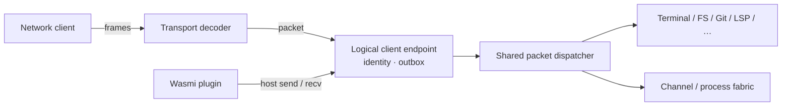

# RFC: Wasmi plugins, native channels, and processes

- **Status:** Proposed
- **Date:** 2026-08-05
- **Companion to:** [../protocol.md](../protocol.md),
  [kv.md](kv.md), [net.md](net.md)

## Summary

Blit should execute Rust plugins compiled to WebAssembly inside the server:

```bash
blit run --on prod plugin.wasm arg1 arg2
```

The client addresses the module by its full BLAKE3 digest. The server starts
it immediately when that digest is cached and asks for the module bytes only
on a cache miss. Uploaded modules are verified, validated, and stored in an
immutable persistent content-addressed cache.

A plugin may have a restart policy. The server supervises successive
Wasm attempts with bounded exponential backoff. With `--persist`, the desired
plugin definition is durable and an attempt which was meant to be running
is launched again after a blit server restart.

A plugin is an **in-process logical blit client**. It exchanges ordinary
blit packets with the same packet dispatcher as a network client, but does
not open a socket and does not use transport framing. Its complete host ABI
is a packet send operation and a blocking packet receive operation. It gets
the same initial `HELLO` / `LIST` / `READY` sequence and can use every blit
protocol family exposed to ordinary clients by that server.

This RFC also adds native **channels**: named connection points carrying
reliable bidirectional messages without terminal semantics.

It also adds a native **process** family for spawning non-PTY child processes,
streaming their stdout and stderr, writing stdin, and controlling their
lifecycle. Process operations are blit packets rather than Wasm host imports.

These are blit packet families, not Wasm-specific host functions. Browser,
CLI, native, and Wasmi clients all see the same semantics. RPC, streamed
results, notifications, and actor mailboxes are libraries over channels.

## Motivation

Blit already exposes terminals, compositor surfaces, filesystem sync, Git,
LSP, KV, and network relay through one version-stable protocol. Recreating
those operations as a large WASI-like host API would produce two public
interfaces and two dispatch implementations. They would inevitably differ
in validation, cancellation, resource ownership, and new feature coverage.

Putting a real or loopback socket between the server and an embedded runtime
would avoid that duplication but preserve overhead and failure modes which
have no purpose in one process: transport framing, socket buffers, connection
setup, authentication, and kernel scheduling.

The packet is the useful boundary. A Wasm linear-memory crossing already
requires bounded bytes; using those bytes as a normal blit packet gives exact
client parity and reuses all existing codecs. The server can dispatch the
packet directly.

Terminals are not a suitable coordination primitive for plugins. Their byte
stream has presentation state, escape sequences, process semantics, and no
message boundaries. Plugins need named discovery, bidirectional messages,
cancellation, and backpressure without pretending to be processes attached to
PTYs.

## Goals

- Run Rust-produced core Wasm modules using Wasmi in the blit server.
- Upload a module only when the selected server lacks its BLAKE3 object.
- Supervise failed or completed attempts under an explicit restart policy.
- Optionally persist desired plugin state across blit server restarts.
- Give a plugin the same protocol surface as an equivalent remote client.
- Add server-native bidirectional channels.
- Let clients spawn and control non-PTY server processes with flow-controlled
  stdin, stdout, and stderr streams.
- Keep the Wasm host ABI very small and versioned.
- Give each running plugin attempt its own named OS thread.
- Keep untrusted guest execution and slow consumers from exhausting the server.
- Make plugin disconnect cleanup identical to client disconnect cleanup.
- Preserve the existing protocol rule: new feature bits and opcodes; no
  reinterpretation of old messages.

## Non-goals

- **No parallel WASI API for blit operations.** Standard WASI facilities may
  optionally provide the plugin's own arguments, stdio, clocks, and randomness.
  Subprocess spawning uses the blit process family, not a private WASI
  extension.
- **No Component Model requirement.** The first Rust SDK targets a small core
  Wasm ABI. A future component adapter may wrap the same packet endpoint.
- **No live-instance checkpointing.** Persistent plugins start a fresh
  Wasmi instance after a server restart. Linear memory, stacks, open handles,
  channels, and in-flight requests are not snapshotted.
- **No server-native state or pubsub.** Retained shared data remains KV's job;
  live protocols and fan-out are libraries over channels.
- **No unbounded reliable queues.** Reliability always has an explicit byte
  window, timeout, or disconnection outcome.
- **No requirement that channel payloads use JSON.** Payloads are opaque
  bytes with descriptive metadata.

## Architecture



The current connection loop combines transport reading, client lifecycle,
and family dispatch. Implementation of this RFC first extracts a reusable
packet endpoint:

```rust
struct ClientEndpoint {
    client_id: u64,
    outbox: BoundedOutbox,
    cancellation: CancellationToken,
}

async fn dispatch_packet(
    state: &AppState,
    endpoint: &mut ClientEndpoint,
    packet: &[u8],
) -> DispatchOutcome;
```

A network connection reads one framed message and calls `dispatch_packet`.
A plugin's `blit_send` copies one message from linear memory into a
bounded in-process queue whose consumer calls the same function. Neither
path dispatches while holding a transport, plugin, or global registry
lock.

Every endpoint owns connection-scoped family state: filesystem syncs, Git
repositories, LSP attachments, KV subscriptions, relayed sockets, and native
channels. Dropping the endpoint invokes the same cleanup path
regardless of its adapter.

### Nonblocking dispatch and slow consumers

`dispatch_packet` must never wait for capacity in any endpoint outbox. Every
delivery uses a nonblocking `try_enqueue`; transport writers and plugin threads
drain their own queues independently. Channel and process data additionally
obey their credit windows.

If a packet still cannot be enqueued within the endpoint's aggregate byte
bound, the endpoint is a slow consumer and is closed. Closing is an
out-of-band state transition: it sets cancellation, closes both in-process
queues or the network transport, and runs normal endpoint resource cleanup. A
best-effort family-specific closed or lifecycle packet carrying
`SLOW_CONSUMER` may be sent when space exists, but correctness never depends
on fitting that final packet. Lifecycle packets such as `PLUGIN_EXIT` and
protocol errors follow this same rule rather than waiting for space. For a
plugin's own endpoint, this closes the attempt with the `SLOW_CONSUMER` exit
reason; connected channel and process peers observe their normal closed event.

`PLUGIN_EVENT` fan-out performs one independent `try_enqueue` per attached
client after recording the event in the bounded retained ring when retention
is enabled. One slow follower therefore closes only that follower and never
stalls the plugin or other followers. If that follower is the owner of a
non-detached plugin, the ordinary owner-disconnect rule then cancels the
plugin; detached plugins keep running.

This policy also breaks the apparent full-duplex deadlock. A plugin blocked in
`blit_v1.send` is not calling `recv`, but the endpoint task continues draining
the plugin-to-endpoint queue. If dispatch of one of those packets needs to send
back to a full plugin outbox—including through a channel connected to the same
plugin—`try_enqueue` closes the endpoint instead of blocking. Closing wakes
the blocked `send` with `-1` and cancels the attempt. No dispatcher, registry
lock, or peer endpoint waits for that plugin to call `recv`.

### Packet parity

A plugin may form any valid C2S packet. The dispatcher validates and handles it
exactly as if it came from a network endpoint. If an operation is available to
an ordinary client, it is available to a plugin; this includes existing
administrative operations. Changing the access model for all blit clients is
separate work and must not create a Wasm-only path.

## Lifecycle model

A **plugin** is the stable supervised object created by
`PLUGIN_RUN`. It has a 64-bit randomly allocated `plugin_id`, a module hash,
arguments, restart policy, desired state, and optional durable name. A
transient ID is process-local; a persistent plugin retains its ID and name
across server restarts.

An **attempt** is one Wasmi instantiation of that plugin. Attempts are
numbered monotonically from one. A running attempt has its own 32-bit
process-local `task_id` and logical client endpoint. Destroying an attempt
therefore closes all of its terminals, subscriptions, relays, listeners, and
channels before the supervisor considers another attempt.

The distinction prevents a crash from changing the object clients follow:
attachments, status, retained event output, and control target the stable
`plugin_id`; events additionally identify the attempt and task which
produced them.

Restart policies are:

| Value | CLI          | Meaning                                            |
| ----- | ------------ | -------------------------------------------------- |
| 0     | `never`      | One attempt only                                   |
| 1     | `on-failure` | Restart non-zero returns, traps, and host failures |
| 2     | `always`     | Restart every returned or failed attempt           |

Explicit stop, disable, removal, invalid/corrupt module state, and server
shutdown are not attempt failures. `on-failure` treats a zero return as
successful and transitions to stopped. Execution failures retain their
backoff; retrying does not change the invocation.

`PERSIST` stores the plugin definition and desired state. It implies
`DETACH` and requires a unique durable name. Persistence does not itself alter
the restart policy: the common cross-server daemon form is
`--restart always --persist --name NAME`. If the server shuts down while a
persistent plugin is desired-running, the shutdown ends its current
attempt without incrementing failure counters and a fresh attempt is launched
after the next server has initialized its registries.

## Wasm contract

### Module shape

The initial SDK targets `wasm32-unknown-unknown`. A module:

- exports linear memory as `memory`;
- exports `blit_main: () -> i32`;
- imports `send` and `recv` from module `blit_v1`.

Returning from `blit_main` ends the attempt. Its `i32` is the attempt exit
code. A trap, invalid host call, or rejected packet ends the attempt with a
structured failure reason. The supervisor then applies the plugin's restart
policy.

### Host ABI

```text
blit_v1.send(ptr: i32, len: i32) -> i32
blit_v1.recv(ptr: i32, capacity: i32) -> i32
```

`send` validates the range in exported memory and copies one complete blit
packet. It returns `0` when accepted, `-1` when the endpoint is closed or
closes while the call is pending, or `-2` for a zero-length or over-cap
packet. It never accepts transport framing: the first copied byte is the blit
opcode. A negative length, invalid pointer, integer overflow, or an
out-of-bounds linear-memory range is guest ABI misuse and traps the attempt
rather than returning an error code.

`recv` operates on the next complete server packet:

- zero means the logical endpoint is closed;
- a positive result `N <= capacity` means an `N`-byte packet was copied and
  removed from the mailbox;
- a positive result `N > capacity` means the packet needs `N` bytes; nothing was
  copied and the packet remains queued.

When no packet is available, `recv` parks the dedicated plugin thread. A
negative capacity, integer overflow, or an invalid destination range traps the
attempt. The SDK keeps a reusable buffer and retries with `N` bytes only when
needed. `recv` never returns a negative value.

`send` may block until its whole packet fits in the endpoint's inbound mailbox.
This preserves ordering and backpressure without busy polling.

Each in-process mailbox has a 16 MiB byte capacity, equal to the maximum Blit
logical-message size. Packets are never split, and every valid packet therefore
fits in an empty mailbox. There is no separate oversized-packet case.

No separate argument, logging, timer, or process imports are needed. After the
normal `HELLO` / `LIST` / `READY` handshake, the host
sends `PLUGIN_INFO(INIT)` containing plugin, attempt, task identity, and
arguments. Guest logs and structured output are `PLUGIN_EVENT` packets. Timers,
child processes, and other facilities can be ordinary protocol operations when
required.

### Optional WASI

WASI is useful for conventional guest self-environment: arguments, the guest's
stdin/stdout/stderr, clocks, and randomness. It is not another API for blit
operations. The initial `wasm32-unknown-unknown` SDK needs no WASI imports; a
later `wasm32-wasip1` target may link
[`wasmi_wasi`](https://docs.rs/wasmi_wasi/latest/wasmi_wasi/) for those
facilities. Version 1 defines no WASI filesystem preopens or sockets.

Standard WASI does not define arbitrary child-process spawning. Its CLI
proposal covers environment variables, arguments, stdio, and the current
process's exit, not `spawn` or `exec`; see the
[WASI proposal list](https://wasi.dev/releases). A private `proc_spawn`
import would be possible, but would duplicate blit's lifecycle and streaming
protocol. Plugins therefore launch child processes through `PROCESS_*`
packets, just like any other client.

### Rust SDK

`blit-guest` wraps the two imports and re-exports the protocol codec surface:

```rust
#[blit::main]
fn main(mut blit: blit::Client, args: Vec<String>) -> Result<(), Error> {
    let request = blit_remote::msg_create2(/* ... */);
    blit.send(&request)?;
    let created = blit.recv_matching(/* ... */)?;
    // The same client can open native channels or any other blit family.
    Ok(())
}
```

Higher-level typed wrappers are libraries over packets. They are not host
bindings and can evolve independently:

```rust
let mut peer = blit.channels().connect("com.example.builder")?;
peer.send(postcard::to_allocvec(&request)?)?;
let reply = postcard::from_bytes(&peer.recv()?)?;
```

The low-level API remains available so a plugin is never blocked on the SDK
having wrapped a newly added blit opcode.

### Dedicated execution thread

Each running plugin attempt owns exactly one OS thread, never shared with
another plugin. The async supervisor creates a fresh thread for each attempt;
autorestarts therefore get a new OS thread with the same plugin-derived name.
A plugin in `QUEUED`, `BACKOFF`, or terminal `STOPPED`, or one which is
disabled or removed, owns no thread. At most one attempt and thread exist for
a plugin at a time.

Wasmi execution never occurs on a server async executor thread and never
occurs under a server lock. The async logical endpoint and synchronous plugin
thread communicate through two bounded in-process queues:

1. the plugin thread instantiates the attempt and calls `blit_main`;
2. `blit_v1.send` copies a packet into the plugin-to-endpoint queue, blocking
   under its byte-window backpressure;
3. `blit_v1.recv` blocks the plugin thread on the endpoint-to-plugin queue
   until a packet arrives or cancellation closes it;
4. fuel exhaustion returns control to the thread driver, which checks
   cancellation before replenishing the next slice;
5. completion, trap, or cancellation destroys the attempt endpoint, reports
   `PLUGIN_EXIT`, and ends the thread; the async supervisor then stops, waits in
   backoff, or creates a fresh thread for the next attempt.

An empty receive parks the dedicated thread without consuming CPU; restart
backoff uses the async supervisor and consumes no plugin thread. The server
reserves the thread and Wasmi resources before marking an attempt running. A
reservation or thread-spawn failure reports a structured host failure and never
panics the server.

### Thread names

Plugin thread names are diagnostic, not identity. The full logical name is:

```text
blit-plugin:<label>#<short-plugin-id>
```

`label` is chosen from the explicit invocation or durable name, then the module
hash prefix. User-controlled labels are converted to printable ASCII,
separators are collapsed, and path components, control characters, and secrets
are never included. The stable plugin ID suffix distinguishes concurrent
transient instances of the same module.

A shared helper compacts that logical name for each platform while retaining
the component prefix and ID suffix. For example, a Linux-sized name might be
`blit-p:bui-7f2a`, while a platform allowing longer names can expose
`blit-plugin:builder#7f2a`. Failure to set a descriptive OS name falls back to
`blit-plugin` and does not prevent execution. The full logical name remains
available in server diagnostics and logs.

The same helper and `blit-<component>[-<role>][-<short-id>]` convention should
be used throughout blit. Long-lived explicit threads must be created with
`std::thread::Builder::name`; Tokio runtimes should use `thread_name` or
`thread_name_fn`. Existing named threads can retain compatible names, while
unnamed runtime workers and ad-hoc filesystem, Git, LSP, CLI-input, and child
reaper threads should be migrated as a mechanical follow-up. Thread names
must remain observational: protocol behavior never depends on them.

## Content-addressed execution

### Identity

A module object ID is the full 32-byte BLAKE3 digest of the exact Wasm
module bytes. It is rendered as 64 lowercase hexadecimal digits in paths and
human output. Truncation is not permitted for storage or wire identity.

Arguments and attachment mode are invocation properties. They do not affect
the module object hash.

### Cache

Raw modules are persisted under `$BLIT_WASM_CACHE`, otherwise the platform
cache directory followed by `blit/wasm/objects`. A conceptual path is:

```text
objects/ab/cdef...<remaining 62 hex digits>.wasm
```

Insertion is atomic:

1. stream into a temporary file under the cache directory;
2. enforce the declared and actual size caps;
3. hash the received bytes and compare all 32 bytes;
4. validate the module and its allowed imports;
5. fsync when configured, rename into the object path, then acknowledge.

An existing valid object makes upload idempotently successful. Corrupt cache
entries are quarantined or ignored and are never executed.

Wasmi's translated `Module` is cached in memory by:

```text
(object_hash, blit_host_abi_version, wasmi_engine_configuration)
```

Running attempts pin their raw and translated objects. An enabled persistent
plugin also pins its raw object, so a restart never depends on the original
uploader returning. An LRU may evict other translated modules and raw objects.

### Miss and race behavior

`PLUGIN_RUN` is the cache probe. A hit creates the plugin without
another request. A miss returns `NEED_OBJECT` and records a bounded pending
plugin. The miss is encoded as
`PLUGIN_STATUS(status = OK, phase = NEED_OBJECT)`; `NEED_OBJECT` is a run
phase, not a status code. The client uploads chunks and does not resend
`PLUGIN_RUN` after a successful final chunk; the server creates and starts the
pending plugin automatically.

Uploads are single-flight per object hash. If several clients miss the same
object, the first accepted uploader supplies it and every compatible pending
plugin starts after verification. A client whose `PLUGIN_PUT` races after the
object has committed receives `ALREADY_HAVE` and stops sending. While another
upload is still in progress, a second `BEGIN` receives `CONFLICT`; its pending
run waits for the owner rather than uploading duplicate bytes. If the owner
fails or expires, waiting runs receive a fresh `NEED_OBJECT` update and may
compete to become the next uploader. That update is
`PLUGIN_INFO(STATUS, phase = NEED_OBJECT)`, keyed by `plugin_id`, rather than a
second reply to the original run nonce. Pending plugins and partial uploads
expire.

## Plugin wire family

Feature bit **11** (`FEATURE_PLUGIN`) advertises this family. It occupies
the free direction-local `0x90` through `0x94` block before Git's `0xA0`
block.

All integers are little-endian. `hash` is always 32 raw bytes. Strings are
UTF-8. Unless otherwise stated, `detail` is UTF-8 and consumes the remainder.

### Client to server

| Opcode | Name             | Layout                                                                                         |
| ------ | ---------------- | ---------------------------------------------------------------------------------------------- |
| `0x90` | `PLUGIN_RUN`     | `[nonce:2][flags:1][restart:1][hash:32][name_len:2][name:N][argc:2] repeated{[len:4][arg:M]}`  |
| `0x91` | `PLUGIN_PUT`     | `[nonce:2][flags:1][hash:32][offset:8][total_size:8][data:N]`                                  |
| `0x92` | `PLUGIN_CONTROL` | `[nonce:2][plugin_id:8][action:1]`                                                             |
| `0x93` | `PLUGIN_EVENT`   | `[plugin_id:8][attempt:8][task_id:4][kind:1][data:N]` — only from the matching running attempt |

`PLUGIN_RUN.flags`: bit 0 `DETACH`, bit 1 `PERSIST`. `restart` is the
restart-policy value from [§ Lifecycle model](#lifecycle-model). `PERSIST`
requires `DETACH` and a non-empty, unique `name`. Without `PERSIST`, `name` may
be empty and is descriptive only. Unknown flags or restart values are
`INVALID`.
Argument count is capped at 1024, each argument at 64 KiB, and their combined
UTF-8 bytes at 1 MiB. NUL has no special meaning.

`PLUGIN_PUT.flags`: bit 0 `BEGIN`, bit 1 `FINAL`. The first chunk has
`BEGIN`, offset zero, and begins a new upload. `total_size` is present on every
chunk to keep decoding fixed; it must be non-zero, match the first chunk, and
fit the module cap before any data is accepted. Chunks are contiguous and
cumulatively acknowledged. `FINAL` requires `offset + data.len() ==
total_size`, then triggers hash verification, validation, atomic cache
insertion, and pending-run start. A one-packet object sets both flags. The
maximum module size is 16 MiB; clients should use 1 MiB chunks.

`PLUGIN_CONTROL.action`:

| Value | Name      | Meaning                                                             |
| ----- | --------- | ------------------------------------------------------------------- |
| 1     | `CANCEL`  | Stop the plugin, suppress restarts, then cancel its attempt         |
| 2     | `ATTACH`  | Subscribe this connection to retained and future events             |
| 3     | `DETACH`  | Stop this connection following without changing desired state       |
| 4     | `STATUS`  | Request the current supervisor and attempt lifecycle record         |
| 5     | `RESTART` | End the current attempt and schedule a new one immediately          |
| 6     | `ENABLE`  | Set a retained persistent plugin to desired-running                 |
| 7     | `DISABLE` | Durably clear desired-running before cancelling the current attempt |
| 8     | `REMOVE`  | Durably remove a disabled persistent definition and retained events |
| 9     | `LIST`    | List visible plugins; requires `plugin_id = 0`                      |

Every control other than `LIST` receives one `PLUGIN_STATUS` carrying the
request nonce. `LIST` receives `PLUGIN_INFO(LIST)` below. A CLI name is resolved
through `LIST`; wire control continues to use unambiguous 64-bit IDs.

`PLUGIN_EVENT.kind` reserves 1 for stdout bytes, 2 for stderr bytes, and
3 for a UTF-8 log record. These are convenience event streams, not terminals.
Structured application communication should use channels.

### Server to client

| Opcode | Name                | Layout                                                                                                                         |
| ------ | ------------------- | ------------------------------------------------------------------------------------------------------------------------------ |
| `0x90` | `PLUGIN_STATUS`     | `[nonce:2][status:1][phase:1][flags:1][restart:1][plugin_id:8][attempt:8][task_id:4][next_start_unix_ms:8][hash:32][detail:N]` |
| `0x91` | `PLUGIN_PUT_STATUS` | `[nonce:2][status:1][hash:32][received:8][detail:N]`                                                                           |
| `0x92` | `PLUGIN_INFO`       | `[kind:1][body...]`                                                                                                            |
| `0x93` | `PLUGIN_EVENT`      | `[plugin_id:8][attempt:8][task_id:4][sequence:8][kind:1][data:N]`                                                              |
| `0x94` | `PLUGIN_EXIT`       | `[plugin_id:8][attempt:8][task_id:4][reason:1][code:4][next_start_unix_ms:8][detail:N]`                                        |

Server `PLUGIN_INFO.kind` values:

| Kind | Name     | Body                                                                                                        |
| ---- | -------- | ----------------------------------------------------------------------------------------------------------- |
| 1    | `INIT`   | `[plugin_id:8][attempt:8][task_id:4][flags:1][argc:2] repeated{[len:4][arg:N]}`                             |
| 2    | `LIST`   | `[nonce:2][status:1][count:2] repeated{plugin_record}`                                                      |
| 3    | `STATUS` | `[plugin_id:8][phase:1][flags:1][restart:1][attempt:8][task_id:4][next_start_unix_ms:8][hash:32][detail:N]` |

A `plugin_record` is:

```text
[plugin_id:8][phase:1][flags:1][restart:1][attempt:8][task_id:4]
[next_start_unix_ms:8][hash:32][name_len:2][name:N]
```

`PLUGIN_INFO(INIT)` is injected only into the plugin's in-process endpoint
after `READY`; a network client never receives it merely by attaching.

`PLUGIN_RUN` receives exactly one nonce-correlated `PLUGIN_STATUS`, which
allocates and returns `plugin_id` even on a cache miss. That reply releases the
16-bit nonce. Later validation, queue, attempt, backoff, and stop transitions
are uncorrelated `PLUGIN_INFO(STATUS)` events keyed by `plugin_id`; attached
clients follow the ID and do not keep the original run nonce reserved. Each
non-`LIST` `PLUGIN_CONTROL` likewise receives exactly one `PLUGIN_STATUS`
snapshot with its own request nonce, after which later changes are ID-keyed
events. `PLUGIN_PUT` nonces live for one chunk acknowledgement, and the `LIST`
nonce lives through its single `PLUGIN_INFO(LIST)` reply. On a given endpoint,
the correlated reply is enqueued before any `PLUGIN_INFO` or `PLUGIN_EXIT`
caused by that request.

Run phases:

| Value | Name          | Meaning                                                  |
| ----- | ------------- | -------------------------------------------------------- |
| 1     | `NEED_OBJECT` | Object absent; one uploader should send it               |
| 2     | `VALIDATING`  | Bytes complete; hash and import validation               |
| 3     | `QUEUED`      | Valid attempt waiting for an execution slot              |
| 4     | `RUNNING`     | `task_id` is live and its logical client exists          |
| 5     | `BACKOFF`     | Supervisor will start another attempt at the stated time |
| 6     | `STOPPED`     | No attempt is running or scheduled                       |
| 7     | `BLOCKED`     | Permanent condition requires object or operator work     |

Exit reasons distinguish returned, trapped, cancelled, slow consumer, protocol
violation, host failure, and server shutdown. `code` is the `blit_main` return
only for `RETURNED`; it is zero for other reasons.
`next_start_unix_ms` is non-zero only when the supervisor has scheduled another
attempt.

Common family status values are reused: `OK`, `NOT_FOUND`, `TOO_LARGE`,
`INVALID`, `CANCELLED`, `OTHER`, and `CONFLICT`.
`PLUGIN_PUT_STATUS` additionally defines value 12 as `ALREADY_HAVE`. It means
the verified object is already committed; `received` is its stored total size,
the pending run proceeds, and the client must stop uploading. `OK` reports the
cumulative accepted `received` bytes. `CONFLICT` means another uploader owns
the still-uncommitted single flight and does not claim the object exists yet;
it reports `received = 0`.

### Attached lifecycle

Without `DETACH`, the initiating connection owns the plugin. Disconnecting
or sending `CANCEL` stops the supervisor, suppresses any pending restart, and
cancels its current attempt. Ctrl-C in `blit run` sends `CANCEL`, waits a
short grace period for `PLUGIN_EXIT`, and then closes.

With `DETACH`, phase `RUNNING` in either the correlated `PLUGIN_STATUS` or a
later `PLUGIN_INFO(STATUS)` is sufficient for the command to return
successfully. The plugin remains server-owned until its restart policy stops
it, it is explicitly cancelled, or the server exits. Its event log is a bounded
byte ring across attempts, so a later `ATTACH` receives a retained suffix
followed by live events. Plugin attempts have no wall-clock deadline; attached
and detached execution differ only in ownership and event following.

Every attempt has a 32-bit process-local `task_id`. Task IDs are not durable;
`plugin_id` and `attempt` are the stable coordinates followed by clients.

### Restart backoff

Automatic restarts use full-jitter exponential backoff: 250 ms base, doubling
through a 30 second cap. An attempt which remains running for 60 seconds
resets the consecutive-failure counter. `RESTART` is an explicit operator
action and schedules immediately; it does not erase historical attempt
records. A persistent supervisor stores its failure count and next eligible
wall-clock start time, so restarting blit cannot be used to bypass crash-loop
backoff.

Failures which cannot improve by retrying transition to `BLOCKED` rather than
looping: missing or corrupt pinned object, unsupported host ABI, or a
deterministic instantiation/import error. An object repair, definition update,
or explicit `ENABLE` causes revalidation.

### Persistence across server restarts

Persistent definitions are durable desired state, separate from the Wasmi
instance. The server transactionally stores:

- stable plugin ID and unique name;
- object hash, arguments, and restart policy;
- enabled/desired-running state;
- attempt counter, consecutive-failure count, and next eligible start time.

Definitions live in `$BLIT_PLUGIN_PATH`, otherwise the platform state
directory followed by `blit/plugins.redb`. This is authoritative state,
not an evictable cache. The raw Wasm object remains in the separate
content-addressed cache but is pinned by every enabled definition.

The module object is made durable before the definition can commit. On server
startup, definitions are loaded and validated before any attempt starts.

`DISABLE` and `REMOVE` commit their durable state before cancelling an
attempt, so a crash cannot resurrect something the operator just stopped.
Normal server shutdown preserves desired-running without recording an attempt
failure. Abrupt server death is treated the same at the next boot because an
attempt has no durable successful exit record.

Cross-restart execution is consequently **at least once**, not exactly once.
The server can die after a plugin performs an external side effect but before
it durably records the attempt's exit. Persistent plugins must make side
effects idempotent or store their own progress transactionally, for example in
KV. Blit does not checkpoint Wasm memory or try to infer whether a side effect
committed.

Arguments are stored verbatim. They should not contain secrets unless the
plugin store gains an explicit encrypted-secret mechanism; references through
a separate secret facility are preferable. Retained stdout/stderr events are
not durable in the first version.

## Native channel family

Feature bit **12** (`FEATURE_CHANNEL`) advertises channels. The family uses the
direction-local `0x95` opcode with a one-byte sub-operation. `0x96` remains
free.

Channel IDs are 32-bit and scoped to one logical client.
Client-created IDs have bit 0 clear; server-created accepted-channel IDs have
bit 0 set. An ID is not reused until its `CLOSED` event has been observed.

Names are UTF-8, non-empty, at most 255 bytes, contain no control or NUL
characters, and are process-global. They are compared byte-for-byte without
Unicode normalization; clients should therefore use ASCII reverse DNS names
such as `com.example.builder`. Metadata and payloads are opaque bytes.

Version 1 has no namespace reservation or per-name access rules. Any endpoint
may `LISTEN` or `CONNECT`; the first listener owns the name until it closes, and
a second listener receives `CONFLICT`. First-listener ownership is routing
state, never proof of identity. Peers use the server-supplied `peer` identity
rather than trusting the channel name.

### Bidirectional channels (`0x95`)

Every message begins `[0x95][kind:1][channel_id:4]`.

Client-to-server kinds:

| Kind | Name      | Body                                                        |
| ---- | --------- | ----------------------------------------------------------- |
| 1    | `LISTEN`  | `[flags:1][name_len:2][name:N][metadata_len:4][metadata:M]` |
| 2    | `CONNECT` | `[flags:1][name_len:2][name:N][metadata_len:4][metadata:M]` |
| 3    | `DATA`    | `[payload:N]`                                               |
| 4    | `ACK`     | `[bytes:8]` cumulative consumed payload bytes               |
| 5    | `CLOSE`   | `[reason:1]`                                                |

Server-to-client kinds:

| Kind | Name       | Body                                                                    |
| ---- | ---------- | ----------------------------------------------------------------------- |
| 1    | `OPENED`   | `[status:1][window:8][detail_len:2][detail:N]`                          |
| 2    | `ACCEPTED` | `[listener_id:4][window:8][peer_len:2][peer:N][metadata_len:4][meta:M]` |
| 3    | `DATA`     | `[sequence:8][payload:N]`                                               |
| 4    | `ACK`      | `[bytes:8]` cumulative consumed payload bytes                           |
| 5    | `CLOSED`   | `[reason:1][detail:N]`                                                  |

A listener owns a name until closed. `CONNECT` either fails once with
`OPENED(status != OK)` or produces `OPENED(OK)` for the connector and one
`ACCEPTED` on the listener endpoint. Thereafter the two channel IDs are a
full-duplex message pair. Blit preserves each `DATA` message boundary and
orders messages per direction.

`peer` is a server-assigned logical-client identity suitable for display, not a
self-asserted string from metadata. Passing more identity claims requires
explicit server support.

Flow control is a cumulative byte window per direction, using payload bytes.
`OPENED` / `ACCEPTED` grants window `W`. An `ACK(C)` means the receiver has
consumed `C` total payload bytes, so the sender may advance its cumulative
sent count through `C + W`; exceeding that closes the channel. The receiver
acks only after delivering or intentionally discarding messages. Default
window and maximum payload: 4 MiB. Metadata is capped at 64 KiB.

There is no implicit broadcast and no retained channel data. Higher-level RPC
uses request IDs inside the opaque payload and cancellation by a normal
message or channel close.

## Process family

Feature bit **13** (`FEATURE_PROCESS`) advertises non-PTY child-process
execution. The family occupies the free direction-local `0xC0` through
`0xC5` block. Git reserves `0xB5` through `0xBF`, so this RFC does not consume
that space.

This is a normal blit family. A Wasmi plugin reaches it through `blit_v1.send`
and `blit_v1.recv`; a network client sends the same packets over its existing
transport. The server implementation is shared. When `FEATURE_PROCESS` is
advertised, every logical client may use it.

Process IDs are client-allocated 32-bit integers scoped to one logical
endpoint. An ID cannot be reused until a failed `PROCESS_STARTED` or final
`PROCESS_EXIT` has been received. Integers are little-endian. Arguments and
environment values are arbitrary bytes without NUL; environment keys also
cannot contain `=`. Paths are server-native byte paths on Unix and valid UTF-8
paths on Windows. Stream payloads are unrestricted bytes.

### Client to server

| Opcode | Name              | Layout                                                                                                                                                                     |
| ------ | ----------------- | -------------------------------------------------------------------------------------------------------------------------------------------------------------------------- |
| `0xC0` | `PROCESS_SPAWN`   | `[nonce:2][process_id:4][flags:1][cwd_kind:1][src_pty_id:2][cwd_len:4][cwd:N][argc:2] repeated{[len:4][arg:M]}[envc:2] repeated{[key_len:2][key:K][value_len:4][value:V]}` |
| `0xC1` | `PROCESS_STDIN`   | `[process_id:4][offset:8][data:N]`                                                                                                                                         |
| `0xC2` | `PROCESS_ACK`     | `[process_id:4][stream:1][bytes:8]`                                                                                                                                        |
| `0xC3` | `PROCESS_CONTROL` | `[nonce:2][process_id:4][action:1][value:4]`                                                                                                                               |

`PROCESS_SPAWN` executes `argv[0]` directly. It never invokes a shell;
clients which want shell parsing must explicitly run a shell with an argument
such as `-c`. `argc` must be non-zero. Argument count and
combined bytes use the same caps as plugin arguments. `envc` is capped at 256,
each environment key at 255 bytes, each value at 64 KiB, and combined key and
value bytes at 1 MiB. Duplicate keys are `INVALID`.

Spawn flags are bit 0 `MERGE_STDERR` and bit 1 `CLEAR_ENV`. By default the
child receives a small server-defined baseline such as `PATH`, locale, and a
temporary directory, plus the explicit environment entries. `CLEAR_ENV`
removes that baseline. The server never implicitly forwards credentials, file
descriptors, or `BLIT_*` variables. Explicit environment entries replace
baseline entries.

`cwd_kind` is 0 for the server's default directory, 1 for the explicit
`cwd`, and 2 for the current directory of `src_pty_id`. Fields unused by the
selected kind must be empty or zero. Resolving a terminal directory happens
atomically during spawn and does not attach the new process to that terminal.
For `cwd_kind = 2`, an unknown terminal or one without a current directory,
including an exited terminal, refuses the spawn with
`PROCESS_STARTED(status = NOT_FOUND)` and zero windows. The server must not
fall back to its default directory or interpret the empty relative path as an
absolute root.

`PROCESS_ACK.stream` is 1 for stdout and 2 for stderr. It acknowledges total
payload bytes delivered to the application, not merely received by a socket.
When stderr is merged, `PROCESS_STARTED.stderr_window` is zero, the server sends
merged bytes only as `PROCESS_STDOUT`, and it rejects stderr ACKs.

Control actions are:

| Value | Name          | Meaning                                                    |
| ----- | ------------- | ---------------------------------------------------------- |
| 1     | `CLOSE_STDIN` | Deliver EOF after all accepted stdin bytes                 |
| 2     | `TERMINATE`   | Request portable graceful termination of the process tree  |
| 3     | `KILL`        | Force termination of the process tree                      |
| 4     | `SIGNAL`      | Send the platform signal in `value`, or report unsupported |

`value` must be zero except for `SIGNAL`. `TERMINATE` and `KILL` are the
portable operations; signal numbers are deliberately platform-specific.
The initial family has no detach operation.

### Server to client

| Opcode | Name                 | Layout                                                                                          |
| ------ | -------------------- | ----------------------------------------------------------------------------------------------- |
| `0xC0` | `PROCESS_STARTED`    | `[nonce:2][status:1][process_id:4][stdin_window:8][stdout_window:8][stderr_window:8][detail:N]` |
| `0xC1` | `PROCESS_STDOUT`     | `[process_id:4][offset:8][data:N]`                                                              |
| `0xC2` | `PROCESS_STDERR`     | `[process_id:4][offset:8][data:N]`                                                              |
| `0xC3` | `PROCESS_ACK`        | `[process_id:4][bytes:8]` — cumulative consumed stdin bytes                                     |
| `0xC4` | `PROCESS_EXIT`       | `[process_id:4][reason:1][code:4][detail:N]`                                                    |
| `0xC5` | `PROCESS_CONTROLLED` | `[nonce:2][status:1][process_id:4][detail:N]`                                                   |

`PROCESS_STARTED` is the single reply to `PROCESS_SPAWN`. On failure,
`status != OK`, the windows are zero, no `PROCESS_EXIT` follows, and the ID is
immediately reusable. Every `PROCESS_CONTROL` receives one
`PROCESS_CONTROLLED`; accepted control is serialized with process exit so the
reply precedes an exit caused by that action.

Stdout and stderr each preserve byte order but have no relative ordering with
one another. They are raw bytes, not UTF-8 and not line-framed. Offsets begin
at zero. The server reads both OS pipes concurrently, delivers all accepted
output, observes both EOFs and the child wait result, and only then emits the
single terminal `PROCESS_EXIT`; no stream data follows it. Exit reasons
distinguish returned, signalled, killed, protocol violation, and host failure.
`code` is meaningful only for a normal return or a platform signal.

### Flow control and ownership

The three stream windows are independent cumulative byte windows. The client
may send stdin through `acked_stdin + stdin_window`; the server may send each
output stream through its client ACK plus that stream's negotiated window.
An incorrect offset, decreasing ACK, or window overrun is a protocol
violation for that process. Normal backpressure stops reading or writing the
corresponding OS pipe and lets the child block; it never creates an unbounded
server queue.

Every child belongs to its creating logical endpoint and, for a plugin, to
the current attempt. Endpoint close, attempt cancellation, or trap closes
stdin, gracefully terminates the process group or Windows job, waits a short
server-defined grace period, and force-kills the remainder.
The server reaps every child. A restarted plugin attempt gets no handles to
the previous attempt's children. Persistent plugins must therefore assume
that an interrupted subprocess side effect can be repeated after restart.

Children run with the blit server's OS identity. Wasm isolation does not
sandbox a native child; deployments which need that separation must sandbox
the blit server or its process runner externally.

Programs requiring a controlling terminal continue to use the terminal
family. `PROCESS_*` is intentionally pipe-based; adding PTY flags here would
create two subtly different terminal APIs.

### SDK surface

The guest SDK presents Rust-shaped convenience without changing the host ABI:

```rust
let mut child = blit
    .process()
    .command("rg")
    .arg("needle")
    .cwd("/workspace")
    .spawn()?;

while let Some(event) = child.recv()? {
    match event {
        ProcessEvent::Stdout(bytes) => consume(bytes)?,
        ProcessEvent::Stderr(bytes) => report(bytes)?,
        ProcessEvent::Exit(status) => return status.into_result(),
    }
}
```

The SDK multiplexes process events with every other server packet and sends
ACKs only after the application consumes data. It does not attempt to make
`std::process::Command` work transparently on a core Wasm target.

## Failure isolation

There are no per-plugin resource settings, execution budgets, or wall-clock
deadlines. `PLUGIN_RUN` carries no execution-tuning fields.

Fixed packet sizes, byte windows, and bounded outboxes are protocol and
dispatcher invariants described with their respective families. Wasmi must
also be configured so guest memory, tables, and instances cannot exhaust the
server. Fuel metering supplies yield points for cancellation, not a total
execution budget. These containment details are not plugin-visible or
configurable per invocation.

Cancellation marks the endpoint first, wakes a blocked receive, and refuses
new sends. A running fuel slice reaches cancellation at its next yield. Host
panics are caught at the plugin thread boundary and reported as `HOST_FAILURE`;
they must not unwind into server code.

The server must validate all plugin packets exactly as it validates
network packets. In-process origin is not trusted origin.

## CLI behavior

```bash
blit run --on prod plugin.wasm arg1 arg2
blit run --on prod --restart on-failure plugin.wasm arg1
blit run --on prod --restart always --persist --name builder plugin.wasm arg1
```

The command grammar is `blit run [RUN_OPTIONS] FILE [ARGS...]`. Every token
after `FILE` is passed verbatim as a plugin argument, including tokens
beginning with `-`; no `--` separator is required. Blit run options such as
`--detach`, `--restart`, `--persist`, `--name`, and connection options such as
`--on` must therefore appear before `FILE`.

The CLI:

1. reads the file under a configurable local size cap;
2. computes its full BLAKE3 digest;
3. sends `PLUGIN_RUN`;
4. on `NEED_OBJECT`, uploads acknowledged chunks;
5. streams attached stdout/stderr/log events without allocating a PTY;
6. exits with the module code for `RETURNED`, or non-zero for other reasons.

`PLUGIN_EXIT` and `--json` preserve the full signed `i32` module code. The CLI
passes a returned code to the native process-exit API, whose observable range
is platform-specific; Unix shells see only the low eight bits (`0` through
`255`). Callers which need the full value must consume the structured event
rather than the CLI process status.

`--restart` accepts `never` (the default), `on-failure`, or `always`.
`--persist` requires `--name`, implies `--detach`, and stores desired state for
future blit server processes. `--json` emits supervisor, attempt, and event
records as NDJSON envelopes.

An attached `on-failure` or `always` command follows successive attempts and
does not exit merely because one attempt failed. It exits when the supervisor
reaches `STOPPED`, is cancelled, or the connection fails. `--detach` returns
after `RUNNING`. The management surface is:

```bash
blit plugin list
blit plugin status NAME_OR_ID
blit plugin attach NAME_OR_ID
blit plugin restart NAME_OR_ID
blit plugin enable NAME_OR_ID
blit plugin disable NAME_OR_ID
blit plugin remove NAME_OR_ID
```

The local pathname is never sent as module identity. It may appear in local
diagnostics. Servers and peers see the invocation name when one was supplied
and the full content hash.

## Protocol compatibility

Clients check feature bits 11, 12, and 13 before sending these families. Older
clients ignore their S2C opcodes. Older servers do not advertise them, and
`blit run` reports an upgrade requirement rather than attempting an upload.

Kind-multiplexed envelopes have an explicit skip rule. Clients ignore an
unknown S2C kind under `PLUGIN_INFO` or `0x95` as one complete packet. Servers
likewise ignore one complete packet with an unknown C2S kind under `0x95`; it is
not a connection-level protocol violation and changes no handle state. A new
C2S request kind which requires a reply must have a new feature bit or other
explicit negotiation, so a client never waits on a server which can only skip
it. A malformed payload for a known kind remains `INVALID` or a family-local
protocol violation as specified by that family.

Gateways, mux, proxy, WebRTC, WebSocket, and WebTransport forward the new
packets unchanged. Only the upstream blit server interprets them. The Wasm host
ABI is versioned independently through its import module name (`blit_v1`),
while the guest observes ordinary protocol features through `HELLO`.

The native channel IDs are per logical connection, so forwarding requires no
gateway-global allocation or rewriting.

## Rejected alternatives

### Per-feature Wasm/WASI bindings

Bindings for terminals, FS, Git, LSP, KV, network relay, and every
future family duplicate the wire protocol and make Wasm support lag normal
clients. They also encourage runtime-specific validation and cleanup.
Packets give exact parity through two imports.

### WASI or WASIX subprocess spawning

Standard WASI currently describes the guest's CLI environment and exit, not
portable child-process creation. Adopting a runtime-specific `proc_spawn`
extension would couple plugins to that runtime, expose process execution only
to Wasm guests, and still require blit-specific lifecycle glue.
The process packet family provides the same streaming operation to all clients
without adding another Wasm import. Optional WASI remains useful for the
plugin's own constrained environment.

### Loopback or in-memory fake socket

A duplex stream could feed the existing connection handler and is a useful
prototype, but it preserves framing, handshake transport machinery, and
writer tasks solely to move data within one process. Extracting packet
dispatch is the intended architecture. The plugin still receives the
normal logical handshake from its endpoint.

### Typed internal API exposed directly to Wasm

The server should have typed internal handlers, but exposing their Rust shape
as the guest ABI couples plugins to server implementation details and still
requires a serialization schema. The stable packet protocol is already that
schema. Rust SDK types can wrap it without becoming host ABI.

### JSON RPC as the universal boundary

JSON is convenient for debugging but expensive for bulk bytes, ambiguous for
integer widths, and a second protocol. Channel application payloads may use
JSON voluntarily; core client operations remain binary blit packets.

### Shared plugin worker pool

A shared pool uses fewer native stacks for mostly idle plugins, but makes
thread-level profiling, crash attribution, debugger inspection, and resource
ownership less direct. Dedicated named threads are intentionally simpler to
operate. Blocked receives park without consuming CPU; restart backoff owns no
plugin thread at all.

## Implementation plan

1. **Thread naming.** Add the platform-aware shared naming helper, name blit's
   Tokio workers and currently unnamed explicit threads, and test sanitizing,
   compaction, and stable ID suffixes.
2. **Packet endpoint refactor.** Extract logical client creation, packet
   dispatch, bounded outbox, identity propagation, and common disconnect.
3. **Native channels.** Implement the `0x95` channel registry, flow control,
   identity, cleanup, codecs, and CLI protocol tests.
4. **Processes.** Implement the `0xC0` through `0xC5` process family,
   per-stream flow control, concurrent pipe draining, process-tree cleanup,
   codecs, and protocol tests from a network client.
5. **Plugin objects.** Implement BLAKE3 run probe, chunk upload, validation,
   persistent CAS, pending-run single-flight, and cache eviction.
6. **Supervisor.** Add stable plugin/attempt identity, restart policy,
   backoff, durable desired state, startup restoration, and crash-safe control.
7. **Wasmi host.** Add one named thread per running plugin attempt, bounded
   endpoint queues, Wasmi containment, fuel-based cancellation yielding,
   attempt lifecycle, and event retention.
8. **Rust SDK and CLI.** Add `blit-guest`, a Rust example plugin, `blit run`,
   process wrappers, and plugin control commands.

Each phase has a vertical protocol test with at least two logical clients.
The plugin phases additionally verify cache hit (no upload), cache miss,
nonce release before later ID-keyed status changes, hash mismatch, invalid
imports, runaway-loop cancellation, cleanup after a trap, restart policy,
backoff persistence, crash-safe disable, and restoration after a fresh server
process. Multiplexed-family tests send unknown kinds in both directions.
Process tests additionally cover binary output, independent stdout/stderr
ordering, backpressure, stdin EOF, missing `cwd_kind = 2` context, merged-stderr
window negotiation, spawn failure, signals where supported, and
process-tree cleanup on endpoint loss.

## Open questions

- Should persistent object eviction be automatic by default or operator-only
  until access-time accounting is proven reliable across crashes?

None of these questions changes the central boundary: plugins are logical
clients, and their host ABI exchanges ordinary blit packets.
