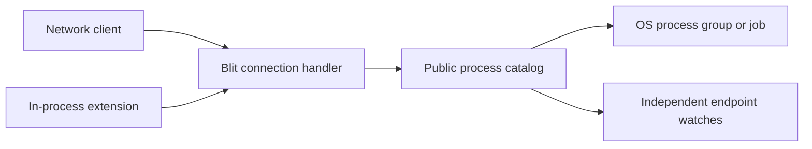

# RFC: Native non-PTY processes

- **Status:** Protocol, server, and low-level Rust packet helpers implemented;
  integrated native-client and extension SDKs pending
- **Date:** 2026-08-05

## Summary

Add a native Blit packet family for starting non-PTY child processes, writing
stdin, receiving binary stdout and stderr, listing server-visible children,
watching their streams, and controlling their complete lifecycle. The protocol
is available to every logical client. A network client uses its existing
transport; an in-process extension uses the same packets without a socket.

Every successfully started child receives a public, server-boot-scoped
`process_ref`. Any process-capable endpoint can list children and concurrently
watch one under an endpoint-local process ID. There is deliberately no
cross-client capability or confidentiality boundary inside this family.

Ordinary processes remain owned by their creating endpoint and are terminated
when it disappears. An opt-in detachable process instead survives with zero or
more watchers and remains discoverable by `process_ref`. Both forms are
flow-controlled and independent of Wasmi, extensions, or native channels.



## Goals

- Preserve arbitrary stdin, stdout, stderr, argument, and environment bytes
  where the host platform permits them.
- Give every client the same packet API and lifecycle behavior.
- Give every process-capable client server-global discovery, observation, and
  control of native children.
- Let an explicitly detachable process survive a client reconnect or extension
  attempt restart without replaying unbounded output.
- Bound process counts, watches, queued stream payload, packet counts,
  arguments, environment data, and catalog replies.
- Make endpoint close reliably terminate and reap ordinary owned children.
- Support Unix process groups and Windows jobs without hiding platform-specific
  signaling behavior.

## Non-goals

- **No implicit shell.** The server executes `argv[0]` directly.
- **No terminal emulation.** Programs needing a controlling terminal continue
  to use `CREATE2(HAS_COMMAND)` and the PTY family.
- **No server-restart persistence.** The catalog and its references never
  survive a restart. Orderly shutdown terminates tracked children; an unclean
  server death can leave OS processes behind unless the deployment supplies
  cgroups, jobs, parent-death signaling, or equivalent containment.
- **No output replay.** Output produced before a watch begins, or while no
  endpoint watches a process, is drained and discarded. Lifetime offsets expose
  the exact gap but do not recover its bytes.
- **No per-client process privacy or control boundary.** Discovery, streams,
  the stdin-writer role, and lifecycle controls are available to every endpoint
  allowed to use the family. The single-writer rule coordinates byte offsets;
  it is not authorization.
- **No privilege boundary.** Children run as the Blit server OS identity.
- **No new top-level CLI command in version 1.** This RFC defines a protocol and
  client-library surface; a future `blit exec` command can be designed on top.
- **No dependency on extensions.** Extension support is one consumer, not an
  implementation prerequisite.

## Wire protocol

Feature bit **13** (`FEATURE_PROCESS`) advertises non-PTY child-process
execution. The family occupies the free direction-local `0xC0` through `0xC7`
block. Git reserves `0xB5` through `0xBF`, so this RFC does not consume that
space.

This is a normal Blit family. A Wasmi extension reaches it through
`blit_v1.send` and `blit_v1.recv`; a network client sends the same packets over
its existing transport. The server implementation and public catalog are
shared. When `FEATURE_PROCESS` is advertised, every logical client may use it.

Two identifiers have intentionally different scopes:

- `process_id` is a client-allocated 32-bit alias scoped to one logical
  endpoint. It routes that endpoint's stream and control packets and may name a
  different child on another endpoint.
- `process_ref` is a server-allocated, nonzero 64-bit generation reference.
  It is public, unique for the current server boot, and never reused while a
  live or retained record exists. Pair it with `S2C_HELLO.boot_generation` when
  storing it across reconnects. It is not an OS PID or an authorization value.

A pending spawn holds its local process ID until its failed `PROCESS_STARTED`
is written or it becomes the creator's first watch. A live watch holds its
local ID until `UNWATCH` reaches the endpoint writer, endpoint loss, or final
`PROCESS_EXIT`. A successful watch of a retained final result holds its local ID
only through the `PROCESS_WATCHED` reply. Conflicting requests acquire no slot.

Integers are little-endian. Arguments and environment values are arbitrary
bytes without NUL; environment keys also cannot contain `=`. That
byte-preserving form applies on Unix. On Windows, program paths, arguments,
environment keys and values, and explicit cwd must be valid UTF-8; the server
converts them to the native wide-character process API and returns `INVALID`
for non-UTF-8 input. Stream payloads remain unrestricted bytes. A catalog
`argv0` preserves the validated bytes from its spawn request.

Admission of a decodable `PROCESS_SPAWN` first reserves a server generation,
an endpoint slot, and the exact retained request bytes, then atomically installs
the pending generation for its local process ID before waiting for the
process-family spawn semaphore. A duplicate local ID therefore receives
`CONFLICT` even while the first spawn is pending. Capacity failure receives
correlated `PROCESS_STARTED(status = BUDGET)` without installing the ID.

The client **must wait for `PROCESS_STARTED(status = OK)` before sending
`PROCESS_STDIN`, `PROCESS_OUTPUT_ACK`, or `PROCESS_CONTROL` for that local
ID**. Before that success reply, stream packets are ignored and a control
receives `UNKNOWN_ID`; process control is not a pending-spawn cancellation
mechanism. A network client can abandon the operation by closing its endpoint,
and an extension can cancel its attempt or close its endpoint. Failure,
cancellation, or endpoint cleanup removes the pending generation and makes the
local ID reusable only after its correlated spawn outcome has been emitted or
the endpoint is gone.

The `process_ref` becomes catalog-visible only after the OS child starts and its
record is installed. Endpoint loss cancels a queued spawn. An OS spawn already
in flight may finish; a successfully started detachable child then enters the
catalog without a watcher even if its creator never receives
`PROCESS_STARTED`. A successfully started ordinary child whose owner has gone
is terminated and reaped instead.

### Client to server

| Opcode | Name                 | Layout                                                                                                                                                                     |
| ------ | -------------------- | -------------------------------------------------------------------------------------------------------------------------------------------------------------------------- |
| `0xC0` | `PROCESS_SPAWN`      | `[nonce:2][process_id:4][flags:1][cwd_kind:1][src_pty_id:2][cwd_len:4][cwd:N][argc:2] repeated{[len:4][arg:M]}[envc:2] repeated{[key_len:2][key:K][value_len:4][value:V]}` |
| `0xC1` | `PROCESS_STDIN`      | `[process_id:4][offset:8][data:N]`                                                                                                                                         |
| `0xC2` | `PROCESS_OUTPUT_ACK` | `[process_id:4][stream:1][bytes:8]`                                                                                                                                        |
| `0xC3` | `PROCESS_CONTROL`    | `[nonce:2][process_id:4][action:1][value:4]`                                                                                                                               |
| `0xC4` | `PROCESS_LIST`       | `[nonce:2]`                                                                                                                                                                |
| `0xC5` | `PROCESS_WATCH`      | `[nonce:2][process_id:4][process_ref:8][flags:1]`                                                                                                                          |

`PROCESS_SPAWN` executes `argv[0]` directly. It never invokes a shell; clients
which want shell parsing must explicitly run a shell with an argument such as
`-c`. A local process ID already pending, watched, or terminally draining
receives `PROCESS_STARTED(status = CONFLICT)` and leaves its existing generation
unchanged.

`argc` must be nonzero and is capped at 1,024; each argument is capped at
64 KiB and their combined bytes at 1 MiB. `envc` is capped at 256, each
environment key at 255 bytes, each value at 64 KiB, and combined key and value
bytes at 1 MiB. On Unix, duplicate keys are compared as exact bytes. On Windows
they are compared with the native environment's case-insensitive key semantics
after UTF-8 conversion, so spellings such as `Path` and `PATH` are duplicates.
Duplicate keys are `INVALID`.

Spawn flags are bit 0 `MERGE_STDERR` and bit 1 `DETACHABLE`; any other bit is
`INVALID`. Process replies reuse the common status values, including
`PERMISSION`. Process-count or stream-window reservation failure returns
`PROCESS_STARTED(status = BUDGET)` before creating a child.

The child inherits the complete server process environment. Explicit entries
add to it and replace inherited entries with the same key. There is no flag
which clears or filters that environment. Unix PTY creation additionally
rewrites terminal, compositor, desktop-bus, and audio variables; those
terminal-specific rewrites do not apply to native pipe children.

`PROCESS_LIST` returns one point-in-time catalog snapshot. It does not allocate
an endpoint process slot or subscribe the caller. Entries are sorted by
`process_ref` and include every started live generation plus detachable final
records retained during their configured TTL. Pending OS spawns are not listed.
An ordinary process has no reconnect retention and leaves the catalog when
terminal cleanup releases its live generation.

`PROCESS_WATCH` attaches the requesting endpoint to a public generation under
the supplied endpoint-local `process_id`. An unknown or expired `process_ref`
is `NOT_FOUND`; a local ID already in use is `CONFLICT`; a live-watch endpoint
limit is `BUDGET`. Several endpoints may concurrently watch the same process,
and each has independent stdout and stderr credit, packet accounting, and
outbox reservations. A watch does not transfer ordinary-process ownership.

Exactly one live watch may write stdin. The creator's initial watch receives
that role. `PROCESS_WATCH.flags` bit 0 `STDIN` explicitly requests it; any other
flag bit is `INVALID`. A watch without `STDIN` is always read-only for stdin. A
request with `STDIN` atomically acquires a vacant role, while a request made
while another watch holds it, or after stdin stops accepting, receives
`CONFLICT` and creates no watch. Releasing the writer and publishing a later
`STDIN` watch serialize at the process record. Existing read-only watches are
not silently promoted, so a monitor can never become writer by accident.

The record lookup, local-ID reservation, state snapshot, expiry check, and
publication of a live watch have one linearization point. A successful
`PROCESS_WATCHED(state = RUNNING)` is queued before any stdout, stderr, stdin
ACK, control, or exit event using the new local ID. If its bounded outbox
reservation fails, the watch is not published and the endpoint's existing
slow-consumer policy applies. The client must wait for that successful running
reply before sending stream or control packets under the new local ID.

A retained detachable final result is also watchable. It returns
`PROCESS_WATCHED(state = EXITED)` and creates no persistent live watch; no
separate `PROCESS_EXIT` follows. Reading the result neither consumes it nor
refreshes its retention timer.

`cwd_kind` is 0 for the server's default directory, 1 for the explicit `cwd`,
and 2 for the current directory of `src_pty_id`. For kind 1, `cwd` is nonempty,
contains no NUL, and is at most 4 KiB; on Unix it is otherwise raw path bytes,
while Windows applies the UTF-8 rule above. Fields unused by the selected kind
must be empty or zero. Values 3 through 255 and any invalid unused-field
combination return `PROCESS_STARTED(status = INVALID)` with zero windows and
`process_ref = 0`.

Resolving a terminal directory happens atomically during spawn and does not
attach the new process to that terminal. For `cwd_kind = 2`, an unknown terminal
or one without a current directory, including an exited terminal, refuses the
spawn with `PROCESS_STARTED(status = NOT_FOUND)`. The server must not fall back
to its default directory or interpret the empty relative path as an absolute
root.

`PROCESS_OUTPUT_ACK.stream` is 1 for stdout and 2 for stderr. Its value is an
absolute lifetime cursor. A new process starts at zero. A new watch implicitly
retires the prefix below its `stdout_next` or `stderr_next` snapshot floor,
which can include bytes emitted before that watch or discarded with no
watchers. Above that floor, the client advances ACK only after delivering
payload to its application, not merely receiving it from a socket.

When stderr is merged, the creator's `PROCESS_STARTED.stderr_window` and every
watcher's `PROCESS_WATCHED.stderr_window` are zero. The server sends merged
bytes only as `PROCESS_STDOUT`; a stderr ACK is invalid for that watch. Stream
values other than 1 or 2 are also invalid.

Control actions are:

| Value | Name          | Meaning                                                    |
| ----- | ------------- | ---------------------------------------------------------- |
| 1     | `CLOSE_STDIN` | Deliver EOF after all accepted stdin bytes                 |
| 2     | `TERMINATE`   | Request platform-supported graceful tree termination       |
| 3     | `KILL`        | Force termination of the process tree                      |
| 4     | `SIGNAL`      | Send the platform signal in `value`, or report unsupported |
| 5     | `UNWATCH`     | Remove caller's watch and release its stdin role if held   |

Every current watcher may issue every control action, including
`CLOSE_STDIN`; this is an explicit part of the shared-access model, not an
ownership transfer. Only the current stdin writer may send `PROCESS_STDIN`.
`value` must be zero except for `SIGNAL`.

On Unix, `TERMINATE` sends `SIGTERM` to the tracked process group. On Windows it
sends `CTRL_BREAK` only when the child was successfully placed in an eligible
process group with a usable console-control path. If that path is unavailable,
`TERMINATE` returns `PROCESS_CONTROLLED(status = OTHER)` with detail and leaves
the process running; there is no generic graceful job-object operation. An
accepted `TERMINATE` waits the configured grace and then uses the forceful
operation. `KILL` is the portable forceful action: `SIGKILL` to the Unix group
or `TerminateJobObject` on Windows. Signal numbers for `SIGNAL` are deliberately
platform-specific.

On Unix, supervisors needing a per-process grace period send
`SIGNAL(SIGTERM)`, run their own timer, and then send `KILL`; `TERMINATE`
deliberately uses the server-wide grace. Windows may not provide the requested
`SIGNAL`, so a custom graceful timeout is not generally expressible there
without an application-specific shutdown mechanism.

`UNWATCH` is valid for ordinary and detachable processes. It stops admitting
new stream and ACK packets under that endpoint-local ID, quiesces its watcher
dispatch, and orders `PROCESS_CONTROLLED(OK)` after every process packet already
committed to that endpoint. No packet for that local process ID follows the
reply. Accepted stdin remains queued to the child. The local ID, endpoint slot,
and outbox budget remain charged until the committed frames and cutoff reply
are written or dropped; endpoint close forces that drop.

`UNWATCH` removes only the caller's view. Other watchers and the child continue.
If the caller is the stdin writer, the role becomes vacant once that watch
stops admitting stream packets; a later successfully published running watch
with the `STDIN` flag atomically acquires it. Already accepted stdin remains
ordered and queued.
For an ordinary child, the creator remains its lifecycle owner even after
unwatching and its later endpoint loss still terminates the child. For a
detachable child, removing the last watcher leaves the child running while its
output is drained and discarded. `UNWATCH` and exit serialize: either the
cutoff wins and no exit uses that local ID, or terminalization wins and the
control receives `UNKNOWN_ID` after the ordered exit path.

Action value 0 and values 6 through 255 are reserved. An unknown action receives
`PROCESS_CONTROLLED(status = INVALID)` and does not affect the process. New
actions require explicit feature negotiation. For `SIGNAL`, a malformed or
invalid native signal number returns `INVALID`; a valid signal operation which
the platform cannot provide returns `OTHER` with explanatory detail.

### Server to client

| Opcode | Name                 | Layout                                                                                                                                                                                                                                             |
| ------ | -------------------- | -------------------------------------------------------------------------------------------------------------------------------------------------------------------------------------------------------------------------------------------------- |
| `0xC0` | `PROCESS_STARTED`    | `[nonce:2][status:1][process_id:4][process_ref:8][stdin_window:8][stdout_window:8][stderr_window:8][detail:N]`                                                                                                                                     |
| `0xC1` | `PROCESS_STDOUT`     | `[process_id:4][offset:8][data:N]`                                                                                                                                                                                                                 |
| `0xC2` | `PROCESS_STDERR`     | `[process_id:4][offset:8][data:N]`                                                                                                                                                                                                                 |
| `0xC3` | `PROCESS_STDIN_ACK`  | `[process_id:4][bytes:8][stdin_state:1]` — cumulative consumed stdin bytes and current state                                                                                                                                                       |
| `0xC4` | `PROCESS_EXIT`       | `[process_id:4][reason:1][kill_cause:1][code:u32][detail:N]`                                                                                                                                                                                       |
| `0xC5` | `PROCESS_CONTROLLED` | `[nonce:2][status:1][process_id:4][detail:N]`                                                                                                                                                                                                      |
| `0xC6` | `PROCESS_LISTED`     | `[nonce:2][status:1][revision:8][count:2] repeated{[process_ref:8][state:1][flags:1][pid:4][argv0_len:4][argv0:N]}[detail:remainder]`                                                                                                              |
| `0xC7` | `PROCESS_WATCHED`    | `[nonce:2][status:1][process_id:4][process_ref:8][state:1][stream_state:1][stdin_received:8][stdin_acked:8][stdout_next:8][stderr_next:8][stdin_window:8][stdout_window:8][stderr_window:8][exit_reason:1][kill_cause:1][exit_code:u32][detail:N]` |

`PROCESS_STARTED` is the single reply to `PROCESS_SPAWN`. On success,
`process_ref` is nonzero and the creator's initial watch receives the advertised
windows. Its nonzero stdin window implicitly marks that initial watch as the
stdin writer; `PROCESS_STARTED` has no separate stream-state field. On failure,
`process_ref` and all windows are zero, no `PROCESS_EXIT` follows, and the
request acquires no generation. A conflicting local process ID remains owned by
its pre-existing endpoint slot; every other failed request leaves the requested
local ID free after the reply.

Successful spawn publication atomically reserves and queues
`PROCESS_STARTED(OK)` before the initial watch can emit stdout, stderr, stdin
ACK, control, or exit packets. Pipe and wait completions which race publication
are held behind that reply. Every endpoint uses a hard frame-and-byte-bounded
process outbox for this step. Overflow closes the endpoint rather than silently
dropping a correlated reply or advancing a cursor. If the endpoint disappears
before publication completes, ordinary ownership cleanup kills the child,
while a successfully started detachable child remains cataloged without a
watcher.

`PROCESS_LISTED` is the single reply to `PROCESS_LIST`. On success, `status` is
`OK`, `revision` is the current server-boot-local catalog revision, entries are
strictly increasing by `process_ref`, and `detail` is empty. Duplicate or
out-of-order references are invalid. The revision increments whenever a
generation becomes visible, changes from running to retained exited state, or
leaves the catalog. It lets clients cheaply detect that two snapshots differ;
it is not a durable cursor and does not create a subscription.

Each list entry's `state` is 1 `RUNNING` or 2 `EXITED`. `flags` uses the spawn
flag bits `MERGE_STDERR` and `DETACHABLE`; other bits are invalid. `pid` is the
direct child's native process ID. A retained final entry keeps the original PID
only as informational identification: the OS may already have reused that
number, and clients must never use it as control authority. `argv0` is the exact
binary first argument retained at spawn. Environment entries and remaining
arguments are never included. On failure, revision and count are zero and
bounded UTF-8 `detail` explains the refusal. A catalog too large for `count` or
the maximum list frame is refused rather than partially presented as a complete
snapshot. Version 1 caps a successful reply at 4,096 entries and 8 MiB;
overflow receives `status = BUDGET`, zero revision and count, and a bounded
explanation.

`PROCESS_WATCHED` is the single reply to `PROCESS_WATCH`. It echoes the
request's local process ID and public `process_ref`, including on failure.
`state` is 1 `RUNNING` or 2 `EXITED`; zero is reserved for failure.
`stream_state` uses bit 0 `STDIN_ACCEPTING`, bit 1 `STDIN_CLOSING`, bit 2
`STDIN_CLOSED`, bit 3 `STDOUT_OPEN`, bit 4 `STDERR_OPEN`, and bit 5
`MERGED_STDERR`, and bit 6 `STDIN_WRITABLE`; bit 7 is invalid. Exactly one
stdin-state bit is set on success. `STDIN_WRITABLE` requires
`STDIN_ACCEPTING` and a nonzero stdin window; every watch without that bit has a
zero stdin window. A read-only running watch may still report
`STDIN_ACCEPTING`, because the process pipe accepts bytes from its writer. On
failure, state, stream state, counters, windows, and exit fields are zero except
bounded UTF-8 `detail`.

On a running success, exit fields are zero. On an exited success,
`STDIN_CLOSED` is set, `STDIN_WRITABLE` and the output-open bits are clear,
windows are zero, the exit fields contain the retained final result, and no
separate `PROCESS_EXIT` follows. A terminal watch acquires no live subscription
and does not refresh or consume the result's retention period. Final-record
expiry and watch serialize on the same record: if expiry wins, the request is
`NOT_FOUND`; if the watch wins, its frozen reply remains valid even if the timer
expires while the endpoint writer is sending it.

`stdin_received` is the lifetime byte count accepted from the successive stdin
writers, while `stdin_acked` is the prefix written to the child pipe. The former
is the current writer's next valid `PROCESS_STDIN.offset`; the latter is the
cumulative ACK and its window base. Accepted stdin continues toward the child
in order when its writer disappears, so `stdin_acked <= stdin_received`. For a
watch with `STDIN_WRITABLE`, the normal
`stdin_received <= stdin_acked + stdin_window` credit bound also holds. A
read-only watch has a zero stdin window and treats both counters as lifetime
observations.

A `STDIN_CLOSING` or `STDIN_CLOSED` snapshot advertises a zero stdin window but
may retain an earlier accepted gap inside the process's reserved stdin capacity.
A closed child pipe can therefore leave `stdin_received > stdin_acked`,
explicitly reporting bytes the server accepted but could not write.

`stdout_next` and `stderr_next` count all bytes read from the pipes, including
bytes emitted before a watch and bytes discarded with no watchers. They become
the new watch's initial cumulative ACK floors and the exact offsets of its first
possible output packets. Output byte debt and the 1,024-packet counters are
watch-local and reset for each new watch. `STDOUT_OPEN` and `STDERR_OPEN` each
exactly match a nonzero negotiated output window. `MERGED_STDERR` implies
`STDERR_OPEN` clear plus zero `stderr_next` and `stderr_window`; merged bytes
advance stdout only.

Pipe reads, stdin-write completions, watcher removal, new watches, and
terminalization serialize at the record. At watch publication, every completion
is either reflected in `PROCESS_WATCHED` or emits an event after it. At
unwatching, every completion is either committed before the cutoff or reflected
only in the process-lifetime counters; none can emit an old-local-ID packet
afterward.

`PROCESS_STDIN_ACK.stdin_state` is 1 `ACCEPTING`, 2 `CLOSING`, or 3 `CLOSED`;
zero and values 4 through 255 are reserved. Current watchers receive an ACK
whenever the written prefix advances or the state changes, so the byte cursor
may repeat on a state-only update. A read-only watch may observe an ACK beyond
the `stdin_received` value in its original snapshot after the current writer
accepts more data; this advances lifetime observation, not local write credit.
Accepted `CLOSE_STDIN` moves to `CLOSING` while buffered input drains and then
`CLOSED`; its first state update precedes the correlated
`PROCESS_CONTROLLED(OK)`. If the child closes its read end unexpectedly, the
server emits `CLOSED` without terminating an otherwise live process.

Every `PROCESS_CONTROL` receives one `PROCESS_CONTROLLED`. Accepted control is
serialized with process exit so the reply precedes an exit caused by that
action. Every process-family `detail` is UTF-8 capped at 4 KiB.

Stdout and stderr each preserve byte order but have no relative ordering with
one another. They are raw bytes, not UTF-8 and not line-framed. Offsets begin at
zero. On the normal path, the server reads both OS pipes concurrently.

Direct-child exit is also the automatic cleanup point for the rest of its
tracked process tree. The server closes stdin, sends `SIGTERM` to a remaining
Unix process group (or force-terminates a remaining Windows job, which has no
generic graceful operation), and drains output during the configured grace. It
then force-kills anything still tracked and closes its pipe readers instead of
waiting forever for inherited FDs. After the direct child is reaped and every
already-accepted output frame is delivered or dropped with each watcher, the
server emits one terminal `PROCESS_EXIT` per current watch. No stream data
follows that watch's exit.

For a detachable process, the same terminal outcome is frozen in the public
catalog for later `PROCESS_WATCH`; for an ordinary process it is removed after
its terminal delivery drains. The reason, kill cause, and code preserve the
direct child's outcome, with detail when residual descendants had to be
terminated. Failure of Blit's wait, pipe, or tree-cleanup machinery instead
reports `HOST_FAILURE`.

Exit reasons are:

| Value | Name                 | Meaning                                              |
| ----- | -------------------- | ---------------------------------------------------- |
| 0     | `RETURNED`           | The child returned normally                          |
| 1     | `SIGNALLED`          | The child died from a platform signal                |
| 2     | `KILLED`             | Blit force-killed the direct child                   |
| 3     | `PROTOCOL_VIOLATION` | Invalid stream sequencing forced process termination |
| 4     | `HOST_FAILURE`       | Spawn, wait, or pipe handling failed after start     |

Values 5 through 255 are reserved. An unknown reason still terminates the
process record and is preserved for diagnostics.

`PROCESS_EXIT.kill_cause` distinguishes Blit-initiated force kills:

| Value | Name                | Meaning                                             |
| ----- | ------------------- | --------------------------------------------------- |
| 0     | `UNSPECIFIED`       | No more specific Blit force-kill cause is known     |
| 1     | `CLIENT_KILL`       | An accepted `PROCESS_CONTROL(KILL)` was responsible |
| 2     | `OWNER_LOST`        | A non-detachable owning endpoint closed             |
| 3     | `TERMINATE_TIMEOUT` | Graceful termination exceeded its grace             |
| 4     | `SERVER_SHUTDOWN`   | Orderly Blit shutdown forced the child to exit      |

For `KILLED`, zero is allowed when no listed cause applies; values 5 through
255 are reserved and an unknown value is preserved for diagnostics. For every
other exit reason, `kill_cause` must be zero. The same reason/cause validation
applies to exit fields inside `PROCESS_WATCHED(state = EXITED)`.
`PROCESS_EXIT.code` is a little-endian `u32`: native exit status for `RETURNED`,
platform signal number for `SIGNALLED`, and zero for every other reason.

### Flow control and ownership

The three process streams use cumulative byte windows. Stdin accounting is
process-wide and only the current stdin writer receives its 1 MiB window. Every
other watch has zero stdin credit. Each watcher has independent stdout and
stderr ACK floors, windows, and 1,024-packet limits. The default window is
1 MiB for every active stream. A merged or closed stderr stream has a zero
window.

One stream-data packet may carry at most 256 KiB. The current server emits
stdout and stderr in packets of at most 32 KiB so the connection writer can
fairly reconsider ordinary bulk traffic between process packets. The larger
protocol limit remains available for client stdin and future implementations.
Once a slow write activates transport fragmentation, audio may also interleave
within one packet.

For a new spawn, the creator is the stdin writer and its first
`PROCESS_STDIN.offset` is zero. A later watch with the `STDIN` flag which
atomically acquires a vacant writer role starts at
`PROCESS_WATCHED.stdin_received`. Every accepted value must equal the total
stdin bytes previously accepted over the process lifetime. A well-formed packet
is ignored and receives the current cumulative stdin ACK if it comes from a
read-only watch, carries an already-stale offset, exceeds current credit, or
arrives after the shared packet allowance fills. It does not kill the child,
consume credit, or advance `stdin_received`. A malformed stdin packet evicts
its watcher and applies the endpoint policy; it also never kills the shared
child.

The server advances `PROCESS_STDIN_ACK` only after bytes have been accepted by
the child pipe. Stream data is nonempty, and at most 1,024 unacknowledged
packets may exist on each stream. A frame remains outstanding while its end
offset is greater than the corresponding cumulative ACK; a partial ACK does not
release its packet slot. Offsets, ACKs, and window arithmetic use checked `u64`
operations and never wrap.

Output ACK validation is local to one watch. Its value must remain between the
watch's snapshot floor and the absolute cursor sent on that watch. One
watcher's ACK never creates credit or retires packets for another watcher.

A slow watcher must not stall the child or its peers. If a watcher exhausts its
credit or hard endpoint outbox while the process continues producing output,
the server kicks and closes that endpoint rather than blocking the process-wide
pipe reader behind it. Endpoint cleanup removes all of its watches and applies
ordinary-owner consequences where relevant. Watchers on other endpoints
continue at their own cursors. If no watcher remains, the server keeps draining
the pipe, discards bytes, and advances lifetime offsets.

The no-reply stream operations are deterministic around teardown.
`PROCESS_STDIN` or `PROCESS_OUTPUT_ACK` for an absent, failed, exited, or
terminally draining local process ID is ignored. Read-only and stale stdin is
ignored as specified above. Stdin after accepted `CLOSE_STDIN` is also ignored
because it may already have been in flight from the writer. An ACK for an
inactive merged-stderr stream, an invalid stream number, or an impossible
cursor fails that watch; it never mutates another watcher's credit.

While the process is live, repeated `PROCESS_CONTROL(CLOSE_STDIN)` requests are
idempotent `OK`. Controls on an absent or final local process ID receive
`UNKNOWN_ID`. Waiting for successful `PROCESS_STARTED` or `PROCESS_WATCHED`,
connection ordering, and no local-ID reuse before the final reply keep stale
operations from crossing into a later endpoint-local generation.

A non-detachable child belongs to its creating logical endpoint and, for an
extension, to the current attempt. Peer watches do not transfer that ownership.
Owner endpoint close, attempt cancellation, or a trap closes stdin, terminates
the tracked group or job, waits the configured grace where applicable, and
force-kills what that primitive still contains. Every peer watcher then receives
the resulting ordered exit if its endpoint remains available.

A detachable child belongs to the server-wide catalog. Its creator is merely
its first watcher. Endpoint close, attempt cancellation, a trap, or `UNWATCH`
removes only the affected watches without closing stdin or terminating the
child. Removing the stdin writer also releases that role; the next successful
running watch which requests `STDIN` acquires it at the lifetime offset in
`PROCESS_WATCHED`. A later endpoint discovers the same live `process_ref`
through `PROCESS_LIST`. Frames already admitted to a departed endpoint are
written there or dropped with it and are never replayed.

Process-lifetime wait and pipe tasks plus generation and stream state are
server-owned. Watch dispatchers, local IDs, per-watch output credit, and outbox
guards belong to endpoints. Watch removal quiesces that dispatch before freeing
the local ID, while the child and other watches continue independently.

If a detachable child exits, current watchers receive the ordinary ordered
`PROCESS_EXIT` and the server also freezes its final state by `process_ref`.
Delivery does not consume or refresh the retained result. If it exits with no
watcher, the catalog retains only flags, PID, `argv0`, final offsets, reason,
kill cause, code, and bounded detail. Every retained final record starts its
expiry timer at terminalization and remains listable and watchable until that
original deadline. Live children and retained finals both consume the
server-wide generation budget, so retention cannot create an unbounded
tombstone table.

After any kill point, cleanup cancels pipe-reader tasks and closes Blit's pipe
ends without waiting for EOF, so an escaped descendant which inherited an
output FD cannot stall a control, endpoint teardown, or extension replacement.
The server always reaps the direct child. Normal direct-child exit applies the
same residual-tree and pipe-reader cleanup automatically. Detachability extends
the direct child's endpoint lifetime, not that of an arbitrary background
descendant. A descendant which deliberately escapes a POSIX process group is
outside this guarantee unless the deployment supplies a cgroup or equivalent
containment.

A restarted extension attempt gets no implicit local process IDs. It can list
the public catalog and watch a surviving detachable process by `process_ref`.
If it did not persist that boot-scoped reference, it must rediscover and
identify the generation from its catalog metadata before deciding whether a
subprocess side effect can be repeated. Orderly server shutdown terminates every
remaining detachable process with `kill_cause = SERVER_SHUTDOWN`, reaps it, and
discards all catalog and retained-final state.

Children run with the Blit server's OS identity. Wasm isolation does not
sandbox a native child; deployments which need that separation must sandbox
the Blit server or its process runner externally.

Programs requiring a controlling terminal continue to use the terminal family.
`PROCESS_*` is intentionally pipe-based; adding PTY flags here would create two
subtly different terminal APIs.

### Client helpers and planned SDK surface

The implemented `blit-remote` layer provides `ProcessCommand` packet building,
catalog/list and watch packet helpers, `ProcessChild` stream accounting, and
event decoding. These helpers are transport-neutral: the embedding client still
allocates nonces and endpoint-local process IDs, multiplexes packets over its
existing link, and sends ACKs after application consumption.

The intended integrated native-client and extension SDK convenience API remains
planned; it does not change the packet protocol:

```rust
let (process_ref, mut child) = client
    .process()
    .command("rg")
    .arg("needle")
    .cwd("/workspace")
    .spawn()?;

while let Some(event) = child.recv()? {
    match event {
        ProcessEvent::Stdout(bytes) => consume(bytes)?,
        ProcessEvent::Stderr(bytes) => report(bytes)?,
        ProcessEvent::Exit(status) => return status.into_result(),
    }
}
```

A reconnecting client lists the catalog, chooses a public reference, allocates a
fresh local process ID, and watches it:

```rust
let processes = client.processes().list()?;
let mut child = client.processes().watch(processes[0].process_ref)?;
```

The SDK multiplexes process events with every other server packet and sends
ACKs only after the application consumes data. The extension SDK does not try
to make `std::process::Command` work transparently on a core Wasm target.
Marking a command detachable changes only its owner-loss lifetime; it creates no
secret and does not hide the child from other clients.

## Capacity and backpressure

Clients cannot tune resources per spawn. The server samples uniform policy at
startup:

| Resource                                                                 | Default | Server setting                        |
| ------------------------------------------------------------------------ | ------: | ------------------------------------- |
| Pending spawns, live watches, and unwatched owned processes per endpoint |      16 | `BLIT_PROCESS_MAX_PER_CLIENT`         |
| Process generations server-wide                                          |      64 | `BLIT_PROCESS_MAX`                    |
| Concurrent OS spawn calls server-wide                                    |       8 | `BLIT_PROCESS_MAX_SPAWNING`           |
| Pending and live watches server-wide                                     |   1,024 | `BLIT_PROCESS_MAX_WATCHERS`           |
| Concurrent watches on one live process                                   |      64 | `BLIT_PROCESS_MAX_WATCHERS_PER_CHILD` |
| Retained spawn-request bytes per endpoint                                |  16 MiB | `BLIT_PROCESS_REQUEST_MAX_PER_CLIENT` |
| Retained spawn-request bytes server-wide                                 |  64 MiB | `BLIT_PROCESS_REQUEST_MAX`            |
| Reserved process-stream windows server-wide                              | 192 MiB | `BLIT_PROCESS_BUFFER_MAX`             |
| Queued process frames per endpoint                                       |  65,536 | `BLIT_PROCESS_OUTBOX_MAX_FRAMES`      |
| Queued process bytes per endpoint                                        |  64 MiB | `BLIT_PROCESS_OUTBOX_MAX_BYTES`       |
| Grace before force-killing a process group/job                           |     2 s | `BLIT_PROCESS_KILL_GRACE`             |
| Detachable exited-result retention                                       |   5 min | `BLIT_PROCESS_DETACHED_RESULT_TTL`    |

The wire additionally caps one successful catalog snapshot at 4,096 entries
and 8 MiB. Those fixed limits have no server setting.

The global watcher default is the product of the per-endpoint and server-wide
process limits. The outbox defaults scale with the smaller of those limits.
They cover 1,024 packets on each active stream for the default watches, plus
correlated-reply headroom. Explicit watcher or outbox settings replace those
derived values. Exceeding either outbox hard bound closes the endpoint; it never
silently drops a committed process packet or advances that watcher's cursor.

Server-wide generation counts include pending, running, terminally draining,
unwatched detachable, and retained final records. Each endpoint count includes
pending spawns, every live or draining watch, and ordinary owned children whose
creator has unwatched them. The creator's automatic watch uses one slot; its
ownership is not counted again while that watch exists. `UNWATCH` releases the
local watch only after the endpoint writer drains or drops the cutoff, but an
ordinary child continues to consume one endpoint slot because its lifetime is
still tied to that endpoint. A running `PROCESS_WATCH` returns `BUDGET` without
changing the child if it cannot reserve an endpoint, server-wide watcher, or
per-child watcher slot. Pending spawns reserve their creator watch against the
server-wide watcher limit before invoking the OS. A terminal-result watch uses
only its bounded local-ID/reply guard. `PROCESS_LIST` consumes no process slot.
The server-wide watcher limits count pending creator watches and live bindings
which can still receive process output. Once `UNWATCH` or terminalization
removes a binding from fan-out, its small cutoff/exit guard is instead bounded
by the endpoint outbox and the lifecycle-frame write deadline while the local
ID continues to count against that endpoint.

Spawn admission reserves a generation slot and exact request bytes before
publishing a pending local ID. The pending task waits on the process-family
spawn semaphore and remains registered with endpoint cleanup. It then reserves
every active 1 MiB process stream window before creating the child; merged
stderr has no separate reservation. Admission which cannot reserve every
required count, byte, and window returns `BUDGET` and creates nothing. Storage
within a stream reservation remains lazy. Request-byte reservations are
released after `PROCESS_STARTED` is queued or the endpoint closes. The record
retains bounded `argv0` catalog metadata until the generation leaves the
catalog.

Independent output windows multiply with watchers, but their queued bytes and
frames remain charged to the corresponding endpoint outboxes. A watcher which
cannot keep its bounded window moving causes its endpoint to close rather than
converting its credit exhaustion into process-wide buffering. That endpoint's
other watches close with it. The server-wide stream reservation continues to
bound process-owned stdin and pipe state; endpoint outbox limits bound each
fan-out copy.

Reaping the direct child does not immediately release its generation or stream
reservation. The process enters terminal draining until every already-emitted
frame and final `PROCESS_EXIT` has either been written or dropped for every
watch. Every lifecycle frame which carries such a cleanup guard has a fixed
10-second socket-write deadline. A stalled endpoint is closed when that
deadline or an outbox bound is reached, so it cannot keep a generation
indefinitely while repeatedly recycling one reservation into unbounded queued
data.

An unwatched live detachable generation keeps its server-wide generation and
stream reservations. Once detachable terminalization and watcher drain finish,
stream reservations are released, but its compact final record keeps the
server-wide generation slot until the retention timer expires. Successful
terminal watches neither consume nor refresh that timer. The generation limit
therefore also bounds retained tombstones.

The default per-endpoint limit of 16 is an interactive-client default, not a
promise that one supervisor can watch every child. Pending, crash-looping, and
draining watches can make an otherwise valid spawn or watch return `BUDGET`.
Supervisors must treat that as expected backpressure. Version 1 has no
per-endpoint override. An operator needing a larger supervisor raises
`BLIT_PROCESS_MAX_PER_CLIENT` for the whole server or shards work across logical
endpoints.

The 192 MiB default is the maximum payload-window reservation for 64 children
with three active 1 MiB streams. Kernel pipe buffers, native child memory,
descendant count, and address space are outside that byte budget. Operators
needing hard descendant or memory containment must use jobs, cgroups, rlimits,
or equivalent OS facilities around the Blit server.

## Cleanup and shutdown

On Unix, process children integrate with Blit's existing server-wide
`waitpid(-1)` backstop instead of racing it with an independent `wait()`. The
spawn path excludes the backstop across OS child creation and insertion into
the shared owned-child set. The backstop can therefore never reap a new PID
while it still appears unowned. It parks the exact wait status, and the process
wait path atomically consumes any parked status while deregistering under the
same lock order. The registry removes entries before PID reuse can expose stale
status. A fast-exit test races immediate child exit and the backstop against
registration and still requires the exact `RETURNED` or `SIGNALLED` result,
never an `ECHILD`-derived `HOST_FAILURE`.

Each endpoint owns a bounded registry of pending spawns and process watches;
the server owns the public child catalog. Every queued or active spawn task is
registered before it can create a child. Endpoint cleanup stops local admission,
cancels queued spawns, drops that endpoint's process output frames, and
quiesces each watch dispatcher before releasing its local ID. If one of those
watches held the stdin-writer role, cleanup clears it atomically; a later
running watch may explicitly request it.

For a detachable generation, endpoint cleanup removes only the endpoint's
watches and preserves bounded stdin already accepted for ordered delivery. For
an ordinary generation owned by the closing endpoint, it closes stdin,
terminates the tracked group or job, force-kills after the configured grace,
closes Blit pipe ends, reaps the direct child, and awaits associated tasks
before the connection handler returns. Peer watches do not keep an ordinary
child alive. Closing pipe ends does not wait for EOF from an escaped descendant.

A queued task observes cancellation before invoking the OS. An already-active
spawn call may finish after its endpoint closes. A successful detachable spawn
atomically installs the child in the public catalog without a watcher; a
successful ordinary child is immediately terminated and reaped. A failed spawn
releases its generation and reservations. No reply must fit a closed endpoint.

Ordinary server shutdown first stops new process admission, listing, and
watching, then closes logical endpoints through the same cleanup path. Shutdown
context uses `SERVER_SHUTDOWN`, rather than `OWNER_LOST`, for any direct child it
must force-kill. It finally terminates and reaps the detachable catalog and
discards retained finals. This RFC does not add a server-wide forced-exit
deadline or change cleanup for pre-existing non-process blocking jobs.

## Security and deployment

`PROCESS_SPAWN` is remote command execution as the Blit server OS user. This is
authority parity with the existing `CREATE2(HAS_COMMAND)` terminal operation,
not a sandbox or least-authority boundary. Anyone allowed to use the family
must be trusted with that server identity. Deployments needing stronger
separation isolate the server or place process execution behind an external
sandbox.

The public catalog intentionally supplies no cross-client confidentiality or
control isolation. Every process-capable network client and in-process extension
can list native children, see their `argv0` and PID, watch future stdout and
stderr, explicitly request the single stdin-writer role when it is vacant,
close stdin, send signals, terminate or kill them, and remove its own watch.
`process_ref` is only stable identity within one server boot; possession grants
nothing that `PROCESS_LIST` would not reveal.

Catalog replies never include environment entries or remaining arguments.
That omission reduces accidental disclosure in ordinary UI and logs, but it is
not a security boundary: a process-capable client can already execute code as
the server user, and inherited child environments may contain the server's
credentials. Operators must not expose the process family to mutually untrusted
tenants.

`BLIT_PROCESS=0` or `--no-processes` omits feature bit 13. A decodable disabled
`PROCESS_SPAWN` receives `PROCESS_STARTED(status = PERMISSION)` with zero
reference and windows. Decodable `PROCESS_LIST` and `PROCESS_WATCH` receive
`PROCESS_LISTED(status = PERMISSION)` and
`PROCESS_WATCHED(status = PERMISSION)` in their failure shapes. A decodable
`PROCESS_CONTROL` receives `PROCESS_CONTROLLED(status = PERMISSION)`.
Fire-and-forget stream packets are dropped. No ID, child, watch, or reservation
is created. The switch and capacity settings are sampled once at startup;
`--no-processes` takes precedence over the environment enable switch.

## Protocol compatibility

Clients send this family only when `HELLO` advertises feature bit 13. Older
servers leave the bit clear, and older clients ignore the S2C opcodes under the
existing unknown-opcode rule. Gateways, mux, proxy, WebRTC, WebSocket, and
WebTransport forward packets unchanged; only the upstream Blit server
interprets them.

The family uses the common status registry in [the protocol](../protocol.md).
Its direction-local `0xC0` through `0xC7` block does not overlap existing Git
allocations or the extension/channel proposal. A Wasmi extension can use it
through the ordinary packet ABI once both independently negotiated features are
available; neither RFC changes the other ABI.

Public references are meaningful only with the `boot_generation` advertised by
the same `S2C_HELLO`. After a restart, clients discard cached references and
list again.

## Implementation

1. Add feature negotiation, packet codecs, strict field validation, endpoint
   slot reservation, count/window admission, public generation references,
   catalog snapshots, and disabled-family replies.
2. Implement concurrent pipe I/O, checked stream accounting, multi-watcher
   fan-out with independent output credit, single-writer stdin handoff,
   slow-endpoint eviction, writer-drain guards, shared-reaper status parking,
   pending-spawn cancellation, and Unix process-group cleanup.
3. Add detachable catalog lifetime, discarded-output accounting, public final
   records, repeatable terminal watches, expiry, and shutdown cleanup.
4. Implement Windows UTF-8 conversion, case-insensitive environment-key
   validation, process groups, job ownership, signaling fallbacks, and pipe
   cleanup.
5. Add low-level Rust command, child, list, and watch helpers. Integrated native
   client and extension convenience SDKs remain pending and require no new Wasm
   host import.

Current codec tests cover packet shapes, size and field validation, binary wire
values, Windows UTF-8 and environment-key validation, list and watch shapes,
exit shapes, and transport-neutral command/child accounting. Server tests cover
binary stdout/stderr, output credit, pending-ID conflict and cancellation,
cross-endpoint catalog listing, concurrent watches and independent ACKs,
unwatch and endpoint cleanup, retained final retrieval and expiry, single-writer
stdin and peer ACK observation, stdin EOF and merged stderr, spawn-failure
budget reuse, invalid live ACK cleanup, complete inherited environments,
late-opened Unix descriptor hygiene, bounded process-outbox overflow and fair
writer scheduling, disabled-family replies, and a framed connection. Windows CI
additionally runs real job-backed spawn/output/exit, endpoint-shutdown, and
descendant-containment lifecycle tests. Unix lifecycle tests also cover a
same-process-group descendant which closes its pipes and ignores graceful
termination after the direct child exits.

On Apple hosts, spawn-time descriptor hygiene uses the normal `/dev/fd`
directory to avoid scanning a potentially large descriptor limit. An unusual
chroot without `/dev/fd` falls back to a full numeric hard-limit sweep, which is
correct but can make process creation substantially slower.

Outstanding validation includes missing `cwd_kind = 2` context, explicit-cwd
bounds at the server, child-initiated stdin closure, the 1,025th-packet boundary
with partial ACKs, stdin-writer handoff races, platform signals and Windows
console control, detachable server shutdown, and oversized catalog refusal.
These are protocol requirements, not claims about the current automated test
suite. Descendants which deliberately escape the server's process group or job
remain outside the protocol's containment guarantee.
