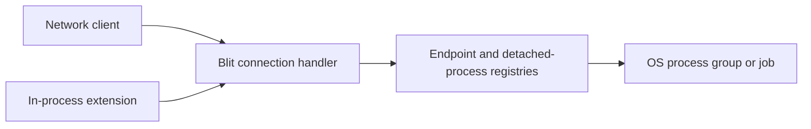

# RFC: Native non-PTY processes

- **Status:** Proposed
- **Date:** 2026-08-05

## Summary

Add a native Blit packet family for starting non-PTY child processes, writing
stdin, receiving binary stdout and stderr, and controlling the complete child
lifecycle. The protocol is available to every logical client. A network client
uses its existing transport; an in-process extension uses the same packets
without a socket.

Ordinary processes are connection-scoped. An opt-in detachable process can
survive a logical endpoint and later bind to another endpoint through an
unguessable bearer token. Both forms are flow-controlled and independent of
Wasmi, extensions, or native channels.



## Goals

- Preserve arbitrary stdin, stdout, stderr, argument, and environment bytes
  where the host platform permits them.
- Give every client the same packet API and lifecycle behavior.
- Let an explicitly detachable process survive a client reconnect or extension
  attempt restart without replaying unbounded output.
- Bound process counts, queued stream payload, packet counts, arguments, and
  environment data.
- Make endpoint close reliably terminate and reap ordinary owned children.
- Support Unix process groups and Windows jobs without hiding platform-specific
  signaling behavior.

## Non-goals

- **No implicit shell.** The server executes `argv[0]` directly.
- **No terminal emulation.** Programs needing a controlling terminal continue
  to use `CREATE2(HAS_COMMAND)` and the PTY family.
- **No server-restart persistence.** Tokens and registry state never survive a
  restart. Orderly shutdown terminates tracked children; an unclean server death
  can leave OS processes behind unless the deployment supplies cgroups, jobs,
  parent-death signaling, or equivalent containment.
- **No detached-process discovery or output replay.** Adoption requires the
  bearer token. Output produced while no endpoint is bound is drained and
  discarded, with offsets exposing the gap.
- **No privilege boundary.** Children run as the Blit server OS identity.
- **No new top-level CLI command in version 1.** This RFC defines a protocol and
  client-library surface; a future `blit exec` command can be designed on top.
- **No dependency on extensions.** Extension support is one consumer, not an
  implementation prerequisite.

## Wire protocol

Feature bit **13** (`FEATURE_PROCESS`) advertises non-PTY child-process
execution. The family occupies the free direction-local `0xC0` through
`0xC6` block. Git reserves `0xB5` through `0xBF`, so this RFC does not consume
that space.

This is a normal blit family. A Wasmi extension reaches it through `blit_v1.send`
and `blit_v1.recv`; a network client sends the same packets over its existing
transport. The server implementation is shared. When `FEATURE_PROCESS` is
advertised, every logical client may use it.

Process IDs are client-allocated 32-bit integers scoped to one logical
endpoint. A detachable generation additionally has a client-allocated,
non-zero 128-bit `adopt_token`, unique among live and retained detached
generations. The token is an opaque 16-byte bearer secret with no integer
endianness: clients generate it with a cryptographically secure RNG, do not log
it, and persist it before spawning if they need crash recovery. Non-detachable
spawns carry an all-zero token. A
pending generation holds its process ID until its own failed
`PROCESS_STARTED` is emitted or it becomes started. A bound running generation
holds the local ID until its detach reply is written or dropped, endpoint loss,
or final `PROCESS_EXIT`. A terminal adoption holds its requested ID only through
the `PROCESS_ADOPTED` reply. A conflicting request acquires no generation and
cannot infer the existing one's lifetime from its `CONFLICT` reply.
Integers are little-endian. Arguments and
environment values are arbitrary bytes without NUL; environment keys also
cannot contain `=`. That byte-preserving form applies on Unix. On Windows,
program paths, arguments, environment keys and values, and explicit cwd must be
valid UTF-8; the server converts them to the native wide-character process API
and returns `INVALID` for non-UTF-8 input. Stream payloads are unrestricted
bytes on every platform.

Admission of a decodable `PROCESS_SPAWN` first reserves a process-generation
slot and the exact retained request bytes, then atomically installs the pending
generation for its process ID before waiting for the process-family spawn
semaphore. A duplicate spawn therefore receives `CONFLICT` even while the
first is pending. Capacity failure receives correlated
`PROCESS_STARTED(status = BUDGET)` without installing the ID. The client **must
wait for `PROCESS_STARTED(status = OK)` before
sending `PROCESS_STDIN`, `PROCESS_OUTPUT_ACK`, or `PROCESS_CONTROL` for that
generation**. Before that success reply, stream packets are ignored and a
control receives `UNKNOWN_ID`; process control is not a pending-spawn
cancellation mechanism. A network client can abandon the operation by closing
its endpoint, and an extension can cancel its attempt or close its endpoint.
Failure, cancellation, or endpoint cleanup removes the pending generation and
makes the ID reusable only after its correlated spawn outcome has been emitted
or the endpoint is gone.

The server reserves a non-zero adopt token at the same atomic admission point.
A token already attached, detached, pending, or retained after exit returns
`PROCESS_STARTED(status = CONFLICT)` and creates nothing. Detachability starts
only when the OS child has started. Endpoint loss cancels a queued spawn; an OS
spawn already in flight may finish, and a successfully started detachable
generation then moves to the detached registry even if the client never
observes the reply.

### Client to server

| Opcode | Name                 | Layout                                                                                                                                                                                     |
| ------ | -------------------- | ------------------------------------------------------------------------------------------------------------------------------------------------------------------------------------------ |
| `0xC0` | `PROCESS_SPAWN`      | `[nonce:2][process_id:4][flags:1][adopt_token:16][cwd_kind:1][src_pty_id:2][cwd_len:4][cwd:N][argc:2] repeated{[len:4][arg:M]}[envc:2] repeated{[key_len:2][key:K][value_len:4][value:V]}` |
| `0xC1` | `PROCESS_STDIN`      | `[process_id:4][offset:8][data:N]`                                                                                                                                                         |
| `0xC2` | `PROCESS_OUTPUT_ACK` | `[process_id:4][stream:1][bytes:8]`                                                                                                                                                        |
| `0xC3` | `PROCESS_CONTROL`    | `[nonce:2][process_id:4][action:1][value:4]`                                                                                                                                               |
| `0xC4` | `PROCESS_ADOPT`      | `[nonce:2][process_id:4][adopt_token:16]`                                                                                                                                                  |

`PROCESS_SPAWN` executes `argv[0]` directly. It never invokes a shell;
clients which want shell parsing must explicitly run a shell with an argument
such as `-c`. A process ID already live or terminally draining receives
`PROCESS_STARTED(status = CONFLICT)` with zero windows and leaves that process
unchanged. `argc` must be non-zero and is capped at 1,024; each argument is
capped at 64 KiB and their combined bytes at 1 MiB. `envc` is capped at 256,
each environment key at 255 bytes, each value at 64 KiB, and combined key and
value bytes at 1 MiB. On Unix, duplicate keys are compared as exact bytes. On
Windows they are compared with the native environment's case-insensitive key
semantics after UTF-8 conversion, so spellings such as `Path` and `PATH` are
duplicates. Duplicate keys are `INVALID`.

Spawn flags are bit 0 `MERGE_STDERR`, bit 1 `CLEAR_ENV`, and bit 2
`DETACHABLE`; any other bit is `INVALID`. `DETACHABLE` requires a non-zero
`adopt_token`, while an ordinary spawn requires an all-zero token. A mismatch
is `INVALID`. Process replies reuse the common status values, including
`PERMISSION`. Process-count or stream-window reservation failure returns
`PROCESS_STARTED(status = BUDGET)` before creating a child. By default the
child receives a small server-defined baseline such as `PATH`, locale, and a
temporary directory, plus the explicit environment entries. `CLEAR_ENV`
removes that baseline. The server never implicitly forwards credentials, file
descriptors, or `BLIT_*` variables. Explicit environment entries replace
baseline entries.

`PROCESS_ADOPT` binds an unbound detachable generation to the requesting
endpoint under the request's endpoint-local `process_id`. It returns a
correlated `PROCESS_ADOPTED` snapshot. An unknown or expired token is
`NOT_FOUND`, while an all-zero token is `INVALID`. A token reserved by a queued
or in-flight spawn, or currently bound to or draining from any endpoint, is
`CONFLICT`; so is a local process ID already reserved by another generation.
Endpoint generation admission applies only when the token names a running
process and returns `BUDGET` if the new binding would exceed it. Retrieving an
`EXITED` snapshot reserves only the local ID and bounded reply guard, so a full
endpoint can still collect final results. The binding, local-ID reservation,
state snapshot, and expiry check have one linearization point. Failure leaves
the detached generation and token unchanged. A running adoption queues
`PROCESS_ADOPTED` before any stream, control, or exit event using the new local
ID; reserving that reply under the endpoint's normal outbox policy is part of
publication. If reservation fails, the process stays unbound and the endpoint's
existing slow-consumer policy applies. Only one endpoint may be bound at a time,
and there is no list operation or adoption by process ID. Of two racing adopters
for a live process, exactly one succeeds; if that endpoint closes before the
reply is delivered, its dispatcher is quiesced and the process becomes unbound
again.

The client must wait for `PROCESS_ADOPTED(status = OK, state = RUNNING)` before
sending stream or control packets under the new local ID.

`cwd_kind` is 0 for the server's default directory, 1 for the explicit
`cwd`, and 2 for the current directory of `src_pty_id`. For kind 1, `cwd` is
non-empty, contains no NUL, and is at most 4 KiB; on Unix it is otherwise raw
path bytes, while Windows applies the UTF-8 rule above. Fields unused by the
selected kind must be empty or zero. Values 3 through 255 and any invalid
unused-field combination return `PROCESS_STARTED(status = INVALID)` with zero
windows. Resolving a terminal directory happens
atomically during spawn and does not attach the new process to that terminal.
For `cwd_kind = 2`, an unknown terminal or one without a current directory,
including an exited terminal, refuses the spawn with
`PROCESS_STARTED(status = NOT_FOUND)` and zero windows. The server must not
fall back to its default directory or interpret the empty relative path as an
absolute root.

`PROCESS_OUTPUT_ACK.stream` is 1 for stdout and 2 for stderr. Its value is an
absolute lifetime cursor. A new process starts at zero. An adopted binding
implicitly retires the prefix below its `stdout_next` or `stderr_next` floor,
which can include bytes discarded while unbound; above that floor, the client
advances ACK only after delivering payload to its application, not merely
receiving it from a socket. When stderr is merged,
`PROCESS_STARTED.stderr_window` is zero, the server sends merged bytes only as
`PROCESS_STDOUT`, and a stderr ACK is a protocol violation for that process.
Stream values other than 1 or 2 are the same violation.

Control actions are:

| Value | Name          | Meaning                                                    |
| ----- | ------------- | ---------------------------------------------------------- |
| 1     | `CLOSE_STDIN` | Deliver EOF after all accepted stdin bytes                 |
| 2     | `TERMINATE`   | Request platform-supported graceful tree termination       |
| 3     | `KILL`        | Force termination of the process tree                      |
| 4     | `SIGNAL`      | Send the platform signal in `value`, or report unsupported |
| 5     | `DETACH`      | Release a detachable process from this endpoint            |

`value` must be zero except for `SIGNAL`. On Unix, `TERMINATE` sends `SIGTERM`
to the tracked process group; on Windows it sends `CTRL_BREAK` only when the
child was successfully placed in an eligible process group with a usable
console-control path. If that Windows path is unavailable, `TERMINATE` returns
`PROCESS_CONTROLLED(status = OTHER)` with detail and leaves the process
running—there is no generic graceful job-object operation. An accepted
`TERMINATE` waits the configured grace and then uses the forceful operation.
`KILL` is the portable forceful action: `SIGKILL` to the Unix group or
`TerminateJobObject` on Windows. Signal numbers for `SIGNAL` are deliberately
platform-specific.
On Unix, supervisors which need a per-process grace period send
`SIGNAL(SIGTERM)`, run their own timer, and then send `KILL`; `TERMINATE`
deliberately uses the server-wide grace. Windows may not provide the requested
`SIGNAL`, so a custom graceful timeout is not generally expressible there
without an application-specific shutdown mechanism.

`DETACH` requires `value = 0` and a process spawned with `DETACHABLE`; otherwise
it returns `INVALID` without changing ownership. On success, the server stops
admitting new stream or ACK packets to the old endpoint, quiesces its per-process
dispatch, and orders `PROCESS_CONTROLLED(OK)` after every packet already
committed there. No process-family packet for that generation follows the reply
on the old endpoint. Accepted stdin remains queued to the child; later stream
packets carrying the old local ID are ignored. The record then enters a
draining-binding state. The cutoff retires the old binding's ACK/window and
packet-count debt and resumes pipe reads in discard mode, but every already
committed frame retains its outbox guard. The token remains `CONFLICT`, and the
old local ID, endpoint slot, and outbox budget stay charged until every frame
and the cutoff reply is written or dropped. Only that writer completion releases
the old binding and makes the token adoptable; endpoint close forces the
outstanding frames to drop. This prevents repeated adopt/fill/detach cycles from
resetting credit while pinning old payload or aliasing the old local ID.
Detach and terminalization serialize on the record: if detach wins, no later
exit uses the old local ID; if terminalization wins, the normal ordered exit is
retained and detach receives `UNKNOWN_ID`.
Action value 0 and values 6 through 255 are reserved; an unknown action receives
`PROCESS_CONTROLLED(status = INVALID)` and does not affect the process. New
actions require explicit feature negotiation.
For `SIGNAL`, a malformed or invalid native signal number returns `INVALID`;
a valid signal operation which the platform cannot provide returns `OTHER`
with an explanatory detail.

### Server to client

| Opcode | Name                 | Layout                                                                                                                                                                                                                              |
| ------ | -------------------- | ----------------------------------------------------------------------------------------------------------------------------------------------------------------------------------------------------------------------------------- |
| `0xC0` | `PROCESS_STARTED`    | `[nonce:2][status:1][process_id:4][stdin_window:8][stdout_window:8][stderr_window:8][detail:N]`                                                                                                                                     |
| `0xC1` | `PROCESS_STDOUT`     | `[process_id:4][offset:8][data:N]`                                                                                                                                                                                                  |
| `0xC2` | `PROCESS_STDERR`     | `[process_id:4][offset:8][data:N]`                                                                                                                                                                                                  |
| `0xC3` | `PROCESS_STDIN_ACK`  | `[process_id:4][bytes:8][stdin_state:1]` — cumulative consumed stdin bytes and current state                                                                                                                                        |
| `0xC4` | `PROCESS_EXIT`       | `[process_id:4][reason:1][kill_cause:1][code:u32][detail:N]`                                                                                                                                                                        |
| `0xC5` | `PROCESS_CONTROLLED` | `[nonce:2][status:1][process_id:4][detail:N]`                                                                                                                                                                                       |
| `0xC6` | `PROCESS_ADOPTED`    | `[nonce:2][status:1][process_id:4][state:1][stream_state:1][stdin_received:8][stdin_acked:8][stdout_next:8][stderr_next:8][stdin_window:8][stdout_window:8][stderr_window:8][exit_reason:1][kill_cause:1][exit_code:u32][detail:N]` |

`PROCESS_STARTED` is the single reply to `PROCESS_SPAWN`. On failure,
`status != OK`, the windows are zero, no `PROCESS_EXIT` follows, and the request
acquires no generation. A conflicting local process ID remains owned by its
pre-existing generation; every other failed request leaves the requested local
ID free after the reply.

Successful spawn publication atomically reserves and queues
`PROCESS_STARTED(OK)` before the binding can emit stdout, stderr, stdin ACK,
control, or exit packets. Pipe and wait completions which race publication are
held behind that reply. An extension endpoint uses its existing hard outbox
reservation for this step. If the endpoint disappears before publication
completes, ordinary ownership cleanup kills the child, while a successfully
started detachable child becomes unbound under its already-known token.

`PROCESS_ADOPTED` is the single reply to `PROCESS_ADOPT`. `state` is 1 for
`RUNNING` and 2 for `EXITED`; zero is reserved for failed replies.
`stream_state` uses bit 0 `STDIN_ACCEPTING`, bit 1 `STDIN_CLOSING`, bit 2
`STDIN_CLOSED`, bit 3 `STDOUT_OPEN`, bit 4 `STDERR_OPEN`, and bit 5
`MERGED_STDERR`; bits 6 and 7 are invalid. Exactly one stdin-state bit is set on
success. On failure, every field after `process_id` is zero except bounded UTF-8
`detail`. On a running success, the exit fields are zero. On an exited success,
`STDIN_CLOSED` is set, the output-open bits and windows are zero, the exit fields
contain the retained final result, and no separate `PROCESS_EXIT` follows. A
terminal adoption acquires no live binding and does not refresh or consume the
result's retention period, so the token can retrieve the same frozen result
again until its original expiry.

Final-record expiry and adoption serialize on the same record. If expiry wins,
the token becomes `NOT_FOUND` before reclamation starts. If adoption wins, its
frozen `PROCESS_ADOPTED` snapshot remains valid even if the timer expires while
the reply is being written.

`stdin_received` is the lifetime byte count accepted from clients, while
`stdin_acked` is the prefix written to the child pipe. The former is the next
valid `PROCESS_STDIN.offset`; the latter is the cumulative ACK and window base.
Accepted stdin buffered at detach continues toward the child in order, so
`stdin_acked <= stdin_received`. While `STDIN_ACCEPTING`, the normal
`stdin_received <= stdin_acked + stdin_window` credit bound also holds. A
`STDIN_CLOSING` or `STDIN_CLOSED` snapshot advertises a zero window but may
retain an earlier accepted gap inside the process's reserved stdin capacity. A
closed child pipe can therefore leave `stdin_received > stdin_acked`, explicitly
reporting bytes the server accepted but could not write. `stdout_next` and
`stderr_next` count all bytes read from the pipes, including bytes discarded
while unbound. They become the new binding's initial cumulative ACK floors and
the exact offsets of its first possible output packets; no gap is allowed while
bound. Output byte debt and the 1,024-packet counters are binding-local and reset
at adoption. For `STDIN_ACCEPTING` with `stdin_acked < stdin_received`, the new
binding receives no new stdin packet credit until ACK reaches the snapshotted
`stdin_received`; it then starts with a fresh 1,024-packet allowance. This
prevents repeated adoption from accumulating tiny inherited packets inside one
byte window. `STDIN_ACCEPTING` is the only stdin state with a non-zero window.
For output, `STDOUT_OPEN` and `STDERR_OPEN` each exactly match a non-zero
negotiated window; a clear open bit requires that stream's window to be zero.
`MERGED_STDERR` is retained in both running and exited snapshots and implies
`STDERR_OPEN` clear plus zero `stderr_next` and `stderr_window`; merged bytes
advance stdout only.

Pipe reads, stdin-write completions, detach or endpoint unbinding, adoption, and
terminalization serialize at the record. At unbinding, every completion is
either committed before the old cutoff or reflected in the unbound lifetime
counters; none can emit an old-binding packet afterward. At adoption, every
completion is either reflected in `PROCESS_ADOPTED` or emits an event after it.
If adoption wins before terminalization, the running snapshot is queued before
any stream, ACK, control, or exit packet for the new binding. If terminalization
wins, the reply is the frozen `EXITED` snapshot and no later packet belongs to
that adoption.

`PROCESS_STDIN_ACK.stdin_state` is 1 `ACCEPTING`, 2 `CLOSING`, or 3 `CLOSED`;
zero and values 4 through 255 are reserved. The server emits an ACK whenever the
written prefix advances or the state changes, so the byte cursor may repeat on
a state-only update. Accepted `CLOSE_STDIN` moves to `CLOSING` while buffered
input drains and then `CLOSED`; its first state update precedes the correlated
`PROCESS_CONTROLLED(OK)`. If the child closes its read end unexpectedly, the
server emits `CLOSED` without terminating an otherwise live process. Later
stdin packets are ignored because they may already have been in flight under
the previous window; their bytes are not added to `stdin_received` or ACKed.
Every `PROCESS_CONTROL` receives one
`PROCESS_CONTROLLED`; accepted control is serialized with process exit so the
reply precedes an exit caused by that action.
Every process-family `detail` is UTF-8 capped at 4 KiB.

Stdout and stderr each preserve byte order but have no relative ordering with
one another. They are raw bytes, not UTF-8 and not line-framed. Offsets begin
at zero. On the normal connected path, the server reads both OS pipes
concurrently. Direct-child exit is also the automatic cleanup point for the
rest of its tracked process tree: the server closes stdin, sends
`SIGTERM` to a remaining Unix process group (or force-terminates a remaining
Windows job, which has no generic graceful operation), and drains output during
the configured grace. It then force-kills anything still tracked and closes
its pipe readers instead of waiting forever for inherited FDs. After the direct
child is reaped and every already-accepted output frame is delivered or dropped
with the bound endpoint, it emits the single terminal `PROCESS_EXIT`; an unbound
detachable record instead retains that same outcome for adoption. No stream data
follows either terminal transition. The reason, kill cause, and code preserve
the direct child's outcome, with a detail when residual descendants had to be
terminated; failure of Blit's wait, pipe, or tree-cleanup machinery instead
reports `HOST_FAILURE`. Exit reasons are:

| Value | Name                 | Meaning                                              |
| ----- | -------------------- | ---------------------------------------------------- |
| 0     | `RETURNED`           | The child returned normally                          |
| 1     | `SIGNALLED`          | The child died from a platform signal                |
| 2     | `KILLED`             | Blit force-killed the direct child                   |
| 3     | `PROTOCOL_VIOLATION` | Invalid stream sequencing forced process termination |
| 4     | `HOST_FAILURE`       | Spawn, wait, or pipe handling failed after start     |

Values 5 through 255 are reserved. An unknown reason still terminates the
process record and is preserved for diagnostics.
`PROCESS_EXIT.kill_cause` distinguishes Blit-initiated force kills:

| Value | Name                | Meaning                                             |
| ----- | ------------------- | --------------------------------------------------- |
| 0     | `UNSPECIFIED`       | No more specific Blit force-kill cause is known     |
| 1     | `CLIENT_KILL`       | An accepted `PROCESS_CONTROL(KILL)` was responsible |
| 2     | `OWNER_LOST`        | A non-detachable owning endpoint closed             |
| 3     | `TERMINATE_TIMEOUT` | Graceful termination exceeded its grace             |
| 4     | `SERVER_SHUTDOWN`   | Orderly Blit shutdown forced the child to exit      |

For `KILLED`, zero is allowed when no listed cause applies; values 5 through
255 are reserved and an unknown value is preserved for diagnostics. For every
other exit reason, `kill_cause` must be zero; a non-zero value is a protocol
error by the server. The same reason/cause validation applies to the exit fields
inside `PROCESS_ADOPTED(state = EXITED)`.
`PROCESS_EXIT.code` is a little-endian `u32`. It is the native exit status for
`RETURNED`, the platform signal number for `SIGNALLED`, and zero for every
other reason.

### Flow control and ownership

The three stream windows are independent cumulative byte windows. The client
may send stdin through `acked_stdin + stdin_window`; the server may send each
output stream through its client ACK plus that stream's negotiated window.
The default window is 1 MiB for each active stream and one stream-data packet
may carry at most 256 KiB; a merged or closed stderr stream has a zero window.
For a new spawn, the first `PROCESS_STDIN.offset` is zero. After adoption, the
first offset is the `PROCESS_ADOPTED.stdin_received` baseline. Every later value
must equal the total stdin payload bytes previously accepted over the process
lifetime; it does not advance merely because a malformed packet was received.
The adopter's output ACK values start at the returned `stdout_next` and
`stderr_next` floors, so new output credit starts there.
The server advances `PROCESS_STDIN_ACK` only after the bytes have been accepted
by the child's stdin pipe. Stream data is non-empty, and at most 1,024
unacknowledged packets may exist on each stream; reaching the byte window or
packet cap applies backpressure to a conforming sender. Receiving a 1,025th
unacknowledged packet, even when byte credit remains, is a protocol violation
for that process. A frame remains outstanding while its end offset is greater
than the cumulative ACK; a partial ACK does not release its packet slot. Every
ACK is monotonic. For output on an adopted binding it must remain between that
stream's snapshot floor and the absolute cursor sent on the current binding; an
ordinary binding has floor zero. Offsets, ACKs, and window arithmetic use
checked `u64` operations and never wrap.
An incorrect offset, invalid ACK, or window overrun is a protocol
violation for that process. Normal backpressure stops reading or writing the
corresponding OS pipe and lets the child block; it never creates an unbounded
server queue.

The no-reply stream operations are deterministic around teardown.
`PROCESS_STDIN` or `PROCESS_OUTPUT_ACK` for an absent, failed, exited, or
terminally draining process ID is ignored. On a live process, stdin after an
accepted `CLOSE_STDIN`, an ACK for an inactive merged-stderr stream, an invalid
stream number, or any other wrong-state stream operation terminates that
process and emits `PROCESS_EXIT(PROTOCOL_VIOLATION)`. The child-initiated stdin
closure exception is ignored as specified above. While the process record is
live, a repeated `PROCESS_CONTROL(CLOSE_STDIN)` still receives its correlated
idempotent `OK`; controls on an absent or final process receive `UNKNOWN_ID`.
Waiting for successful `PROCESS_STARTED` or `PROCESS_ADOPTED`, connection
ordering, and the no-reuse-before-final-reply rule together keep ignored stale
operations from crossing into a later process generation.

A non-detachable child belongs to its creating logical endpoint and, for an
extension, to the current attempt. Endpoint close, attempt cancellation, a
trap, or accepted `TERMINATE`/`KILL` closes stdin, gracefully terminates the
tracked process group or Windows job when requested, waits the configured grace
where applicable, and force-kills what that primitive still contains.

A detachable child belongs to the server-wide detached registry. Its creator
is merely the first bound endpoint. Endpoint close, attempt cancellation, a
trap, or an accepted `DETACH` releases that binding without closing stdin or
terminating the child. The server continues reading stdout and stderr so the
child cannot block, discards those bytes instead of buffering them, and advances
the lifetime offsets returned by the next successful adoption. Frames already
admitted to the old endpoint are written there or dropped with it and are never
replayed. A later endpoint can therefore detect the exact byte gap but cannot
recover it.

Process-lifetime wait and pipe tasks plus their generation and stream guards are
server-registry-owned. Only the current binding dispatcher and its outbox guards
belong to an endpoint. Unbinding transfers or confirms that ownership before
endpoint or extension-attempt cleanup completes, so replacement waits for the
old dispatcher cutoff, not for the child to exit; the next attempt can then
adopt the live process.

If a detachable child exits while bound, it follows the ordinary ordered
`PROCESS_EXIT` path and also freezes the same outcome under its token. Delivery
does not consume or refresh that retained result; a later endpoint may still
retrieve it until the original expiry.

If a detachable child exits while unbound, the registry retains only its final
offsets, reason, kill cause, code, and bounded detail. A successful adoption
then returns those fields in `PROCESS_ADOPTED(state = EXITED)`; delivering that
snapshot neither consumes nor extends the record. Every detachable final record
starts its expiry timer when terminalization freezes the final offsets and
expires after the configured retention period. Live children and retained final
records both consume the server-wide generation budget, so retention cannot
create an unbounded tombstone table.

After any kill point, cleanup cancels pipe-reader tasks and closes Blit's pipe
ends without waiting for EOF, so an escaped descendant which inherited an
output FD cannot stall a control, endpoint teardown, or extension replacement.
The server always reaps the direct child. Normal direct-child exit applies the
same residual-tree and pipe-reader cleanup automatically; detachability extends
the direct child's endpoint lifetime, not that of an arbitrary background
descendant. A descendant which deliberately escapes a POSIX process group is
outside this guarantee unless the deployment supplies a cgroup or equivalent
containment.

A restarted extension attempt gets no implicit process handles. It can adopt a
surviving detachable process only with the token it persisted before spawning;
otherwise it must assume an interrupted subprocess side effect can be repeated.
Orderly server shutdown terminates every remaining detachable process with
`kill_cause = SERVER_SHUTDOWN`, reaps it, and discards all tokens and retained
results.

Children run with the blit server's OS identity. Wasm isolation does not
sandbox a native child; deployments which need that separation must sandbox
the blit server or its process runner externally.

Programs requiring a controlling terminal continue to use the terminal
family. `PROCESS_*` is intentionally pipe-based; adding PTY flags here would
create two subtly different terminal APIs.

### SDK surface

Rust clients, including the extension guest SDK, expose the same convenience
API without changing the packet protocol:

```rust
let mut child = client
    .process()
    .command("rg")
    .arg("needle")
    .cwd("/workspace")
    .spawn()?;

while let Some(event) = child.recv()? {
    match event {
        ProcessEvent::Stdout(bytes) => consume(bytes)?,
        ProcessEvent::Stderr(bytes) => report(bytes)?,
        ProcessEvent::Exit(status) => return status.into_result(),
    }
}
```

The SDK multiplexes process events with every other server packet and sends
ACKs only after the application consumes data. The extension SDK does not try
to make `std::process::Command` work transparently on a core Wasm target.
For a detachable command, the SDK generates a 128-bit token, lets the caller
persist it before spawn, and exposes `detach` and `adopt` explicitly; it never
silently changes the lifetime of an ordinary command.

## Capacity and backpressure

Clients cannot tune resources per spawn. The server samples uniform policy at
startup:

| Resource                                       | Default | Server setting                        |
| ---------------------------------------------- | ------: | ------------------------------------- |
| Process generations per logical endpoint       |      16 | `BLIT_PROCESS_MAX_PER_CLIENT`         |
| Process generations server-wide                |      64 | `BLIT_PROCESS_MAX`                    |
| Concurrent OS spawn calls server-wide          |       8 | `BLIT_PROCESS_MAX_SPAWNING`           |
| Retained spawn-request bytes per endpoint      |  16 MiB | `BLIT_PROCESS_REQUEST_MAX_PER_CLIENT` |
| Retained spawn-request bytes server-wide       |  64 MiB | `BLIT_PROCESS_REQUEST_MAX`            |
| Reserved process-stream windows server-wide    | 192 MiB | `BLIT_PROCESS_BUFFER_MAX`             |
| Grace before force-killing a process group/job |     2 s | `BLIT_PROCESS_KILL_GRACE`             |
| Detachable exited-result retention             |   5 min | `BLIT_PROCESS_DETACHED_RESULT_TTL`    |

Server-wide generation counts include pending, running, terminally draining,
unbound detachable, and retained final records. Per-endpoint counts include
pending and every bound or draining-binding generation. Detach releases a
detachable generation's endpoint slot only after the old writer drains or drops
its cutoff; endpoint loss forces that drop. A running adoption must reserve a
slot on the new endpoint and returns `BUDGET` without changing the process if it
cannot. Terminal-result retrieval uses only its bounded local-ID/reply guard.

Spawn admission reserves a generation slot and exact retained request bytes
before publishing a pending ID. The pending task waits on the process-family
spawn semaphore and remains registered with endpoint cleanup. It then reserves
every active 1 MiB stdin, stdout, and stderr window before creating the child;
merged stderr has no separate reservation. Admission which cannot reserve every
required count, byte, and window returns `BUDGET` and creates nothing. Storage
within a stream reservation remains lazy. Request-byte reservations are
released after `PROCESS_STARTED` is enqueued or the endpoint closes.

For an ordinary or currently bound process, reaping the direct child does not
immediately release its generation or stream reservation. The process enters a
terminally draining state until every already-emitted stream frame and its
final `PROCESS_EXIT` has either been written by the endpoint writer or dropped
with that endpoint. A stalled writer therefore cannot repeatedly spawn and exit
children to recycle one reservation into unbounded queued data. The per-stream
1,024-packet cap also bounds framing and queue-node cardinality.

An unbound live detachable generation keeps its server-wide generation and
stream reservations. Once any detachable generation is terminal and its bound
writer or unbound pipes are drained, its stream reservations and endpoint slot
are released, but its compact final record keeps the server-wide generation
slot until the retention timer expires. Successful terminal adoption neither
consumes nor refreshes that timer. The server-wide generation limit therefore
also bounds detached tombstones.

The default per-endpoint limit of 16 is intentionally an interactive-client
default, not a promise that one supervisor can bind every desired child.
Crash-looping and terminally draining generations can make an otherwise valid
spawn or adoption return `BUDGET`; supervisors must treat that as expected
backpressure and size their deployment deliberately. Version 1 has no
per-endpoint override. An operator needing a larger single supervisor must
raise `BLIT_PROCESS_MAX_PER_CLIENT` for the server (which raises it for all
endpoints) or shard the workload across logical endpoints.

The 192 MiB default is the maximum payload-window reservation for 64 children
with three active 1 MiB streams. Kernel pipe buffers, native child memory,
descendant count, and address space are outside that byte budget. Operators
which need hard descendant or memory containment must use jobs, cgroups,
rlimits, or equivalent OS facilities around the Blit server.

## Cleanup and shutdown

On Unix, process children integrate with Blit's existing server-wide
`waitpid(-1)` backstop instead of racing it with an independent `wait()`. The
spawn path excludes the backstop across OS child creation and insertion into the
shared owned-child set—for example, by holding the ownership-registration lock
across spawn and registration. The backstop can therefore never reap a new PID
while it still appears unowned. It parks the exact wait status, and the process
wait path atomically consumes any parked status while deregistering under the
same lock order. The registry must remove entries before PID reuse can expose a
stale status. A fast-exit test races an immediate child exit and the backstop
against registration, forces the backstop to reap first, and still requires the
exact `RETURNED` or `SIGNALLED` result, never `ECHILD`-derived `HOST_FAILURE`.

Each endpoint owns a bounded registry of pending generations and bound running
or terminally draining generations; the server owns the detached registry.
Every queued or active spawn task is registered before it can create a child.
Endpoint cleanup stops admission, cancels queued spawns, and drops bound output
frames. It quiesces each old per-process dispatcher before making a successfully
started detachable generation adoptable, so stale packets cannot race a new
binding. The transfer preserves bounded stdin already accepted for ordered
delivery to the child. For every other generation it closes stdin, terminates
the tracked group or job, force-kills after the configured grace, closes Blit
pipe ends, reaps the direct child, and awaits the associated tasks before the
connection handler returns. Closing pipe ends does not wait for EOF from an
escaped descendant.

A queued task observes cancellation before invoking the OS. An already-active
spawn call may finish after its endpoint closes. A successful detachable spawn
atomically installs the child in the detached registry under its token; a
non-detachable child is immediately terminated and reaped. A failed spawn
releases its token and reservations. No reply is required to fit the closed
endpoint.

Ordinary server shutdown first stops new process admission and adoption, then
closes logical endpoints through that same cleanup path. Shutdown context uses
`SERVER_SHUTDOWN`, rather than `OWNER_LOST`, for any direct child it must
force-kill. It finally terminates and reaps the detached registry and discards
its tokens and final records. This RFC does not add a server-wide forced-exit
deadline or change cleanup for pre-existing non-process blocking jobs.

## Security and deployment

`PROCESS_SPAWN` is remote command execution as the Blit server OS user. This is
authority parity with the existing `CREATE2(HAS_COMMAND)` terminal operation,
not a sandbox or least-authority boundary. Anyone allowed to use the family
must be trusted with that server identity. Deployments needing stronger
separation isolate the server or place process execution behind an external
sandbox.

An adopt token authorizes control of one detachable process to any client which
already has process-family access. It is not a weaker substitute for that access
check. The server never lists tokens or includes process metadata in a token
conflict, and clients should transmit and store them like other bearer secrets.

`BLIT_PROCESS=0` or `--no-processes` omits feature bit 13. A decodable disabled
`PROCESS_SPAWN` receives `PROCESS_STARTED(status = PERMISSION)` with zero
windows, a decodable `PROCESS_ADOPT` receives
`PROCESS_ADOPTED(status = PERMISSION)` with zero state, counters, and windows,
and a decodable `PROCESS_CONTROL` receives
`PROCESS_CONTROLLED(status = PERMISSION)`. Fire-and-forget stream packets are
dropped. No ID, child, pipe, token binding, or reservation is created. The
switch and the capacity settings above are sampled once at startup; command-line
settings override their environment equivalents.

## Protocol compatibility

Clients send this family only when `HELLO` advertises feature bit 13. Older
servers leave the bit clear, and older clients ignore the S2C opcodes under the
existing unknown-opcode rule. Gateways, mux, proxy, WebRTC, WebSocket, and
WebTransport forward the packets unchanged; only the upstream Blit server
interprets them.

The family uses the common status registry in [the protocol](../protocol.md).
Its direction-local `0xC0` through `0xC6` block does not overlap existing Git
allocations or the extension/channel proposal. A Wasmi extension can use it
through the ordinary packet ABI once both independently negotiated features are
available; neither RFC changes the other ABI.

## Implementation plan

1. Add feature negotiation, packet codecs, strict field validation, endpoint
   generation reservation, count/window admission, and disabled-family replies.
2. Implement concurrent pipe I/O, checked stream accounting, writer-drain
   guards, shared-reaper status parking, pending-spawn cancellation, and
   endpoint cleanup on Unix using process groups.
3. Add the detached registry, token admission, atomic detach/adopt snapshots,
   discarded-output accounting, final-result retention, and shutdown cleanup.
4. Implement Windows UTF-8 conversion, case-insensitive environment-key
   validation, process groups, job ownership, signaling fallbacks, and pipe
   cleanup.
5. Add Rust client wrappers, then expose the same wrappers from the extension
   SDK without adding a Wasm host import.

Each phase has a vertical protocol test using a normal network client. Tests
cover binary output, independent stdout/stderr ordering, backpressure, stdin
EOF, missing `cwd_kind = 2` context, merged-stderr window negotiation,
explicit-cwd bounds, Windows case-insensitive duplicate environment keys,
pending-ID conflicts, ignored or rejected per-ID operations before successful
`PROCESS_STARTED`, absent/final/wrong-state operations, packet-count and payload
bounds, checked ACK arithmetic, stdin offset progression, the 1,025th-packet
violation including partial-frame ACKs, live child-initiated stdin closure,
Windows UTF-8 rejection, spawn failure, exit-reason/cause/code encodings, exact
fast-exit status when the Unix backstop reaps first, signals where supported,
tracked group/job cleanup on endpoint loss, and repeated spawn/exit against a
stalled writer without budget reuse.

Detach/adopt tests cover zero and colliding tokens, adoption while spawn is
queued or in flight, expiry, competing adopters, local-ID and endpoint-budget
conflicts, detach racing exit, accepted-but-unacked stdin, closed and merged
stream snapshots, output gaps, reset binding-local ACK and packet counters,
draining old writers without budget or ID reuse, endpoint loss before
`PROCESS_STARTED` delivery, repeatable final-result retrieval,
extension-attempt replacement, and server shutdown.

A direct child which exits after spawning a background descendant that retains
stdout verifies automatic residual-tree termination, bounded pipe closure, the
root exit code, and reservation release. Where supported, a descendant which
escapes while retaining a pipe FD verifies that explicit kill and endpoint
teardown still close readers, reap the direct child, and release all guards.
