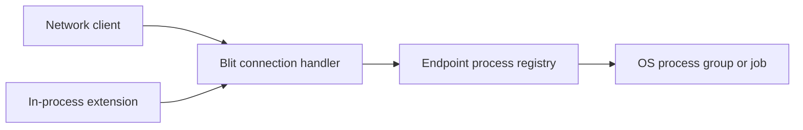

# RFC: Native non-PTY processes

- **Status:** Proposed
- **Date:** 2026-08-05

## Summary

Add a native Blit packet family for starting non-PTY child processes, writing
stdin, receiving binary stdout and stderr, and controlling the complete child
lifecycle. The protocol is available to every logical client. A network client
uses its existing transport; an in-process extension uses the same packets
without a socket.

The facility is connection-scoped and flow-controlled. It does not depend on
Wasmi, extensions, or native channels.



## Goals

- Preserve arbitrary stdin, stdout, stderr, argument, and environment bytes
  where the host platform permits them.
- Give every client the same packet API and lifecycle behavior.
- Bound process counts, queued stream payload, packet counts, arguments, and
  environment data.
- Make endpoint close reliably terminate and reap owned children.
- Support Unix process groups and Windows jobs without hiding platform-specific
  signaling behavior.

## Non-goals

- **No implicit shell.** The server executes `argv[0]` directly.
- **No terminal emulation.** Programs needing a controlling terminal continue
  to use `CREATE2(HAS_COMMAND)` and the PTY family.
- **No detached children.** Every child belongs to one logical endpoint and is
  terminated when that endpoint closes.
- **No privilege boundary.** Children run as the Blit server OS identity.
- **No new top-level CLI command in version 1.** This RFC defines a protocol and
  client-library surface; a future `blit exec` command can be designed on top.
- **No dependency on extensions.** Extension support is one consumer, not an
  implementation prerequisite.

## Wire protocol

Feature bit **13** (`FEATURE_PROCESS`) advertises non-PTY child-process
execution. The family occupies the free direction-local `0xC0` through
`0xC5` block. Git reserves `0xB5` through `0xBF`, so this RFC does not consume
that space.

This is a normal blit family. A Wasmi extension reaches it through `blit_v1.send`
and `blit_v1.recv`; a network client sends the same packets over its existing
transport. The server implementation is shared. When `FEATURE_PROCESS` is
advertised, every logical client may use it.

Process IDs are client-allocated 32-bit integers scoped to one logical
endpoint. A pending generation holds its ID until its own failed
`PROCESS_STARTED` is emitted or it becomes started; a started generation holds
it through its final `PROCESS_EXIT`. A conflicting spawn acquires no generation
and cannot infer the existing one's lifetime from its `CONFLICT` reply.
Integers are little-endian. Arguments and
environment values are arbitrary bytes without NUL; environment keys also
cannot contain `=`. That byte-preserving form applies on Unix. On Windows,
program paths, arguments, environment keys and values, and explicit cwd must be
valid UTF-8; the server converts them to the native wide-character process API
and returns `INVALID` for non-UTF-8 input. Stream payloads are unrestricted
bytes on every platform.

Admission of a decodable `PROCESS_SPAWN` first reserves a process-generation
slot and the exact retained request bytes, then atomically installs the pending
generation for its process ID before waiting for the process-family spawn
semaphore. A duplicate spawn therefore receives `CONFLICT` even while the
first is pending. Capacity failure receives correlated
`PROCESS_STARTED(status = BUDGET)` without installing the ID. The client **must
wait for `PROCESS_STARTED(status = OK)` before
sending `PROCESS_STDIN`, `PROCESS_OUTPUT_ACK`, or `PROCESS_CONTROL` for that
generation**. Before that success reply, stream packets are ignored and a
control receives `UNKNOWN_ID`; process control is not a pending-spawn
cancellation mechanism. A network client can abandon the operation by closing
its endpoint, and an extension can cancel its attempt or close its endpoint.
Failure, cancellation, or endpoint cleanup removes the pending generation and
makes the ID reusable only after its correlated spawn outcome has been emitted
or the endpoint is gone.

### Client to server

| Opcode | Name                 | Layout                                                                                                                                                                     |
| ------ | -------------------- | -------------------------------------------------------------------------------------------------------------------------------------------------------------------------- |
| `0xC0` | `PROCESS_SPAWN`      | `[nonce:2][process_id:4][flags:1][cwd_kind:1][src_pty_id:2][cwd_len:4][cwd:N][argc:2] repeated{[len:4][arg:M]}[envc:2] repeated{[key_len:2][key:K][value_len:4][value:V]}` |
| `0xC1` | `PROCESS_STDIN`      | `[process_id:4][offset:8][data:N]`                                                                                                                                         |
| `0xC2` | `PROCESS_OUTPUT_ACK` | `[process_id:4][stream:1][bytes:8]`                                                                                                                                        |
| `0xC3` | `PROCESS_CONTROL`    | `[nonce:2][process_id:4][action:1][value:4]`                                                                                                                               |

`PROCESS_SPAWN` executes `argv[0]` directly. It never invokes a shell;
clients which want shell parsing must explicitly run a shell with an argument
such as `-c`. A process ID already live or terminally draining receives
`PROCESS_STARTED(status = CONFLICT)` with zero windows and leaves that process
unchanged. `argc` must be non-zero and is capped at 1,024; each argument is
capped at 64 KiB and their combined bytes at 1 MiB. `envc` is capped at 256,
each environment key at 255 bytes, each value at 64 KiB, and combined key and
value bytes at 1 MiB. On Unix, duplicate keys are compared as exact bytes. On
Windows they are compared with the native environment's case-insensitive key
semantics after UTF-8 conversion, so spellings such as `Path` and `PATH` are
duplicates. Duplicate keys are `INVALID`.

Spawn flags are bit 0 `MERGE_STDERR` and bit 1 `CLEAR_ENV`; any other bit is
`INVALID`. Process replies reuse the common status values, including
`PERMISSION`. Process-count or stream-window reservation failure returns
`PROCESS_STARTED(status = BUDGET)` before creating a child. By default the
child receives a small server-defined baseline such as `PATH`, locale, and a
temporary directory, plus the explicit environment entries. `CLEAR_ENV`
removes that baseline. The server never implicitly forwards credentials, file
descriptors, or `BLIT_*` variables. Explicit environment entries replace
baseline entries.

`cwd_kind` is 0 for the server's default directory, 1 for the explicit
`cwd`, and 2 for the current directory of `src_pty_id`. For kind 1, `cwd` is
non-empty, contains no NUL, and is at most 4 KiB; on Unix it is otherwise raw
path bytes, while Windows applies the UTF-8 rule above. Fields unused by the
selected kind must be empty or zero. Values 3 through 255 and any invalid
unused-field combination return `PROCESS_STARTED(status = INVALID)` with zero
windows. Resolving a terminal directory happens
atomically during spawn and does not attach the new process to that terminal.
For `cwd_kind = 2`, an unknown terminal or one without a current directory,
including an exited terminal, refuses the spawn with
`PROCESS_STARTED(status = NOT_FOUND)` and zero windows. The server must not
fall back to its default directory or interpret the empty relative path as an
absolute root.

`PROCESS_OUTPUT_ACK.stream` is 1 for stdout and 2 for stderr. It acknowledges total
payload bytes delivered to the application, not merely received by a socket.
When stderr is merged, `PROCESS_STARTED.stderr_window` is zero, the server sends
merged bytes only as `PROCESS_STDOUT`, and a stderr ACK is a protocol violation
for that process. Stream values other than 1 or 2 are the same violation.

Control actions are:

| Value | Name          | Meaning                                                    |
| ----- | ------------- | ---------------------------------------------------------- |
| 1     | `CLOSE_STDIN` | Deliver EOF after all accepted stdin bytes                 |
| 2     | `TERMINATE`   | Request platform-supported graceful tree termination       |
| 3     | `KILL`        | Force termination of the process tree                      |
| 4     | `SIGNAL`      | Send the platform signal in `value`, or report unsupported |

`value` must be zero except for `SIGNAL`. On Unix, `TERMINATE` sends `SIGTERM`
to the tracked process group; on Windows it sends `CTRL_BREAK` only when the
child was successfully placed in an eligible process group with a usable
console-control path. If that Windows path is unavailable, `TERMINATE` returns
`PROCESS_CONTROLLED(status = OTHER)` with detail and leaves the process
running—there is no generic graceful job-object operation. An accepted
`TERMINATE` waits the configured grace and then uses the forceful operation.
`KILL` is the portable forceful action: `SIGKILL` to the Unix group or
`TerminateJobObject` on Windows. Signal numbers for `SIGNAL` are deliberately
platform-specific.
The initial family has no detach operation. Action value 0 and values 5 through 255 are
reserved; an unknown action receives `PROCESS_CONTROLLED(status = INVALID)` and
does not affect the process. New actions require explicit feature negotiation.
For `SIGNAL`, a malformed or invalid native signal number returns `INVALID`;
a valid signal operation which the platform cannot provide returns `OTHER`
with an explanatory detail.

### Server to client

| Opcode | Name                 | Layout                                                                                          |
| ------ | -------------------- | ----------------------------------------------------------------------------------------------- |
| `0xC0` | `PROCESS_STARTED`    | `[nonce:2][status:1][process_id:4][stdin_window:8][stdout_window:8][stderr_window:8][detail:N]` |
| `0xC1` | `PROCESS_STDOUT`     | `[process_id:4][offset:8][data:N]`                                                              |
| `0xC2` | `PROCESS_STDERR`     | `[process_id:4][offset:8][data:N]`                                                              |
| `0xC3` | `PROCESS_STDIN_ACK`  | `[process_id:4][bytes:8]` — cumulative consumed stdin bytes                                     |
| `0xC4` | `PROCESS_EXIT`       | `[process_id:4][reason:1][code:u32][detail:N]`                                                  |
| `0xC5` | `PROCESS_CONTROLLED` | `[nonce:2][status:1][process_id:4][detail:N]`                                                   |

`PROCESS_STARTED` is the single reply to `PROCESS_SPAWN`. On failure,
`status != OK`, the windows are zero, no `PROCESS_EXIT` follows, and the ID is
released after that reply **unless** the status is `CONFLICT`. A conflicting
request owns no generation: the pre-existing pending generation releases the
ID after its own failed `PROCESS_STARTED` or promotes to a started generation,
which releases it only after `PROCESS_EXIT`.
Every `PROCESS_CONTROL` receives one
`PROCESS_CONTROLLED`; accepted control is serialized with process exit so the
reply precedes an exit caused by that action.
Every process-family `detail` is UTF-8 capped at 4 KiB.

Stdout and stderr each preserve byte order but have no relative ordering with
one another. They are raw bytes, not UTF-8 and not line-framed. Offsets begin
at zero. On the normal connected path, the server reads both OS pipes
concurrently. Direct-child exit is also the automatic cleanup point for the
rest of its non-detachable process tree: the server closes stdin, sends
`SIGTERM` to a remaining Unix process group (or force-terminates a remaining
Windows job, which has no generic graceful operation), and drains output during
the configured grace. It then force-kills anything still tracked and closes
its pipe readers instead of waiting forever for inherited FDs. After the direct
child is reaped and every already-accepted output frame is delivered or dropped
with the endpoint, it emits the single terminal `PROCESS_EXIT`; no stream data
follows it. The reason and code preserve the direct child's outcome, with a
detail when residual descendants had to be terminated; failure of Blit's wait,
pipe, or tree-cleanup machinery instead reports `HOST_FAILURE`. Exit reasons
are:

| Value | Name                 | Meaning                                              |
| ----- | -------------------- | ---------------------------------------------------- |
| 0     | `RETURNED`           | The child returned normally                          |
| 1     | `SIGNALLED`          | The child died from a platform signal                |
| 2     | `KILLED`             | Blit force-killed the child or its process tree      |
| 3     | `PROTOCOL_VIOLATION` | Invalid stream sequencing forced process termination |
| 4     | `HOST_FAILURE`       | Spawn, wait, or pipe handling failed after start     |

Values 5 through 255 are reserved. An unknown reason still terminates the
process record and is preserved for diagnostics.
`PROCESS_EXIT.code` is a little-endian `u32`. It is the native exit status for
`RETURNED`, the platform signal number for `SIGNALLED`, and zero for every
other reason.

### Flow control and ownership

The three stream windows are independent cumulative byte windows. The client
may send stdin through `acked_stdin + stdin_window`; the server may send each
output stream through its client ACK plus that stream's negotiated window.
The default window is 1 MiB for each active stream and one stream-data packet
may carry at most 256 KiB; a merged or closed stderr stream has a zero window.
The first `PROCESS_STDIN.offset` is zero, and every later value must equal the
total stdin payload bytes previously accepted from that endpoint; it does not
advance merely because a malformed packet was received.
The server advances `PROCESS_STDIN_ACK` only after the bytes have been accepted
by the child's stdin pipe. Stream data is non-empty, and at most 1,024
unacknowledged packets may exist on each stream; reaching the byte window or
packet cap applies backpressure to a conforming sender. Receiving a 1,025th
unacknowledged packet, even when byte credit remains, is a protocol violation
for that process. Every ACK is monotonic and no greater than the bytes actually
sent. Offsets, ACKs, and window arithmetic use checked `u64` operations and
never wrap.
An incorrect offset, invalid ACK, or window overrun is a protocol
violation for that process. Normal backpressure stops reading or writing the
corresponding OS pipe and lets the child block; it never creates an unbounded
server queue.

The no-reply stream operations are deterministic around teardown.
`PROCESS_STDIN` or `PROCESS_OUTPUT_ACK` for an absent, failed, exited, or
terminally draining process ID is ignored. On a live process, stdin after an
accepted `CLOSE_STDIN`, an ACK for an inactive merged-stderr stream, an invalid
stream number, or any other wrong-state stream operation terminates that
process and emits `PROCESS_EXIT(PROTOCOL_VIOLATION)`. While the process record
is live, a repeated `PROCESS_CONTROL(CLOSE_STDIN)` still receives its
correlated idempotent `OK`; controls on an absent or final process receive
`UNKNOWN_ID`. Waiting for successful `PROCESS_STARTED`, connection ordering,
and the no-reuse-before-final-reply rule together keep ignored stale operations
from crossing into a later process generation.

Every child belongs to its creating logical endpoint and, for an extension, to
the current attempt. Endpoint close, attempt cancellation, a trap, or accepted
`TERMINATE`/`KILL` closes stdin, gracefully terminates the tracked process group
or Windows job when requested, waits the configured grace where applicable,
and force-kills what that primitive still contains. After the kill point,
cleanup cancels pipe-reader tasks and closes Blit's pipe ends without waiting
for EOF, so an escaped descendant which inherited an output FD cannot stall a
control, endpoint teardown, or extension replacement. The server always
reaps the direct child. Normal direct-child exit applies the same residual-tree
and pipe-reader cleanup automatically, because version 1 has no detach mode; a
background descendant cannot keep a process record or its reservations alive.
A descendant which
deliberately escapes a POSIX process group is outside this guarantee unless the
deployment supplies a cgroup or equivalent containment. A restarted extension
attempt gets no handles to the previous attempt's children. Persistent
extensions must therefore assume that an interrupted subprocess side effect
can be repeated after restart.

Children run with the blit server's OS identity. Wasm isolation does not
sandbox a native child; deployments which need that separation must sandbox
the blit server or its process runner externally.

Programs requiring a controlling terminal continue to use the terminal
family. `PROCESS_*` is intentionally pipe-based; adding PTY flags here would
create two subtly different terminal APIs.

### SDK surface

Rust clients, including the extension guest SDK, expose the same convenience
API without changing the packet protocol:

```rust
let mut child = client
    .process()
    .command("rg")
    .arg("needle")
    .cwd("/workspace")
    .spawn()?;

while let Some(event) = child.recv()? {
    match event {
        ProcessEvent::Stdout(bytes) => consume(bytes)?,
        ProcessEvent::Stderr(bytes) => report(bytes)?,
        ProcessEvent::Exit(status) => return status.into_result(),
    }
}
```

The SDK multiplexes process events with every other server packet and sends
ACKs only after the application consumes data. The extension SDK does not try
to make `std::process::Command` work transparently on a core Wasm target.

## Capacity and backpressure

Clients cannot tune resources per spawn. The server samples uniform policy at
startup:

| Resource                                       | Default | Server setting                        |
| ---------------------------------------------- | ------: | ------------------------------------- |
| Process generations per logical endpoint       |      16 | `BLIT_PROCESS_MAX_PER_CLIENT`         |
| Process generations server-wide                |      64 | `BLIT_PROCESS_MAX`                    |
| Concurrent OS spawn calls server-wide          |       8 | `BLIT_PROCESS_MAX_SPAWNING`           |
| Retained spawn-request bytes per endpoint      |  16 MiB | `BLIT_PROCESS_REQUEST_MAX_PER_CLIENT` |
| Retained spawn-request bytes server-wide       |  64 MiB | `BLIT_PROCESS_REQUEST_MAX`            |
| Reserved process-stream windows server-wide    | 192 MiB | `BLIT_PROCESS_BUFFER_MAX`             |
| Grace before force-killing a process group/job |     2 s | `BLIT_PROCESS_KILL_GRACE`             |

Generation counts include pending, running, and terminally draining records.
Admission reserves a generation slot and exact retained request bytes before
publishing a pending ID. The pending task waits on the process-family spawn
semaphore and remains registered with endpoint cleanup. It then reserves every
active 1 MiB stdin, stdout, and stderr window before creating the child; merged
stderr has no separate reservation. Admission which cannot reserve every
required count, byte, and window returns `BUDGET` and creates nothing. Storage
within a stream reservation remains lazy. Request-byte reservations are
released after `PROCESS_STARTED` is enqueued or the endpoint closes.

Reaping the direct child does not immediately release its count or byte
reservation. The process enters a terminally draining state until every
already-emitted stream frame and its final `PROCESS_EXIT` has either been
written by the endpoint writer or dropped with that endpoint. A stalled writer
therefore cannot repeatedly spawn and exit children to recycle one reservation
into unbounded queued data. The per-stream 1,024-packet cap also bounds framing
and queue-node cardinality.

The 192 MiB default is the maximum payload-window reservation for 64 children
with three active 1 MiB streams. Kernel pipe buffers, native child memory,
descendant count, and address space are outside that byte budget. Operators
which need hard descendant or memory containment must use jobs, cgroups,
rlimits, or equivalent OS facilities around the Blit server.

## Cleanup and shutdown

Each endpoint owns a bounded registry of pending, running, and terminally
draining process generations. Every queued or active spawn task is registered
in that registry. Endpoint cleanup stops admission, cancels and awaits pending
spawns, closes stdin, terminates every tracked group or job, force-kills after
the configured grace, closes Blit pipe ends, reaps each direct child, and awaits
the associated tasks before the connection handler returns. Closing pipe ends
does not wait for EOF from an escaped descendant.

A queued task observes cancellation before invoking the OS. An already-active
spawn call may finish, but if its endpoint closed in the meantime the task
immediately owns, terminates, and reaps the returned child instead of publishing
`PROCESS_STARTED(status = OK)`.

Ordinary server shutdown first stops new process admission, then closes logical
endpoints through that same cleanup path. This RFC does not add a server-wide
forced-exit deadline or change cleanup for pre-existing non-process blocking
jobs.

## Security and deployment

`PROCESS_SPAWN` is remote command execution as the Blit server OS user. This is
authority parity with the existing `CREATE2(HAS_COMMAND)` terminal operation,
not a sandbox or least-authority boundary. Anyone allowed to use the family
must be trusted with that server identity. Deployments needing stronger
separation isolate the server or place process execution behind an external
sandbox.

`BLIT_PROCESS=0` or `--no-processes` omits feature bit 13. A decodable disabled
`PROCESS_SPAWN` receives `PROCESS_STARTED(status = PERMISSION)` with zero
windows, and a decodable `PROCESS_CONTROL` receives
`PROCESS_CONTROLLED(status = PERMISSION)`. Fire-and-forget stream packets are
dropped. No ID, child, pipe, or reservation is created. The switch and the
capacity settings above are sampled once at startup; command-line settings
override their environment equivalents.

## Protocol compatibility

Clients send this family only when `HELLO` advertises feature bit 13. Older
servers leave the bit clear, and older clients ignore the S2C opcodes under the
existing unknown-opcode rule. Gateways, mux, proxy, WebRTC, WebSocket, and
WebTransport forward the packets unchanged; only the upstream Blit server
interprets them.

The family uses the common status registry in [the protocol](../protocol.md).
Its direction-local `0xC0` through `0xC5` block does not overlap existing Git
allocations or the extension/channel proposal. A Wasmi extension can use it
through the ordinary packet ABI once both independently negotiated features are
available; neither RFC changes the other ABI.

## Implementation plan

1. Add feature negotiation, packet codecs, strict field validation, endpoint
   generation reservation, count/window admission, and disabled-family replies.
2. Implement concurrent pipe I/O, checked stream accounting, writer-drain
   guards, pending-spawn cancellation, and endpoint cleanup on Unix using
   process groups.
3. Implement Windows UTF-8 conversion, case-insensitive environment-key
   validation, process groups, job ownership, signaling fallbacks, and pipe
   cleanup.
4. Add Rust client wrappers, then expose the same wrappers from the extension
   SDK without adding a Wasm host import.

Each phase has a vertical protocol test using a normal network client. Tests
cover binary output, independent stdout/stderr ordering, backpressure, stdin
EOF, missing `cwd_kind = 2` context, merged-stderr window negotiation,
explicit-cwd bounds, Windows case-insensitive duplicate environment keys,
pending-ID conflicts, ignored or rejected per-ID operations before successful
`PROCESS_STARTED`, absent/final/wrong-state operations, packet-count and payload
bounds, checked ACK arithmetic, stdin offset progression, the 1,025th-packet
violation, Windows UTF-8 rejection, spawn failure, exit-reason/code encodings,
signals where supported, tracked group/job cleanup on endpoint loss, and
repeated spawn/exit against a stalled writer without budget reuse.

A direct child which exits after spawning a background descendant that retains
stdout verifies automatic residual-tree termination, bounded pipe closure, the
root exit code, and reservation release. Where supported, a descendant which
escapes while retaining a pipe FD verifies that explicit kill and endpoint
teardown still close readers, reap the direct child, and release all guards.
