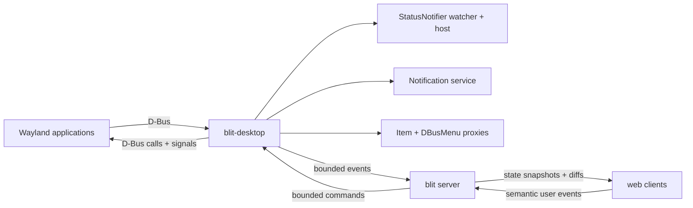

# Tray Icons and Desktop Notifications

- **Status:** Proposed
- **Date:** 2026-08-13

## Summary

Applications running on blit's headless Wayland compositor already inherit a
private D-Bus session. They can create windows and use desktop portals, but two
ordinary desktop facilities have nobody listening on that bus:

- StatusNotifierItem tray icons have no watcher or host, so they never appear.
- `org.freedesktop.Notifications` has no owner, so notification calls fail.

Blit should own both services inside the compositor-scoped D-Bus session,
normalize their state in the server, and expose it to web clients through a
small binary protocol. The full UI renders tray icons in the status bar and
notifications as in-app toasts or browser/OS notifications. User interaction
travels back to the original application as StatusNotifierItem, DBusMenu, or
notification signals.

The server is the authority. A browser reconnect receives a snapshot of the
current tray and active notifications; it never connects to D-Bus, reads a
remote icon path, parses arbitrary variants, or tries to reconstruct state from
events. This is the same server-does-more/client-does-less choice as terminal
frames and filesystem sync.

This RFC implements the
[Desktop Notifications specification](https://specifications.freedesktop.org/notification/latest-single/),
the
[Status Notifier Item specification](https://specifications.freedesktop.org/status-notifier-item/latest-single/),
the menu subset exported through
[`com.canonical.dbusmenu`](https://sources.debian.org/src/libdbusmenu/18.10.20180917~bzr492%2Brepack1-2/libdbusmenu-glib/dbus-menu.xml),
and remote icon lookup according to the
[Icon Theme specification](https://specifications.freedesktop.org/icon-theme/latest/).

## Goals

- Make tray icons and notifications from streamed Linux GUI applications
  visible and actionable in the blit web UI.
- Preserve notification replacement, expiry, close reasons, and action
  callbacks.
- Preserve StatusNotifier activation, secondary activation, scrolling,
  attention state, tooltips, overlays, and DBusMenu menus.
- Give late and reconnecting clients a coherent snapshot without replaying old
  notifications as new popups.
- Work with multiple blit connections and multiple viewers without ambiguous
  IDs or stale actions.
- Bound D-Bus input, image decoding, menu expansion, retained state, and wire
  size.
- Add no required host daemon beyond the private `dbus-daemon` blit already
  starts for the compositor.

## Non-goals

- A host-system tray icon for blit itself. This RFC presents tray items from
  applications inside blit's compositor.
- Forwarding the viewer's host notification service or session bus into the
  remote session. The two trust domains stay separate.
- XEmbed/system-tray compatibility. Blit is Wayland-only and does not run
  XWayland; StatusNotifierItem is the supported tray protocol.
- Portals, MPRIS media controls, global application menus, badges, or app-launch
  desktop files. They may reuse the D-Bus bridge later but are separate work.
- Notification history across server restarts. V1 retains active notifications
  in memory only.
- Rendering notification HTML, hyperlinks, inline body images, sounds, or
  arbitrary SVG in the browser.
- macOS or Windows application notifications. The compositor and its private
  desktop bus currently exist only on Linux.

## Architecture

The private bus remains compositor-scoped. A new Linux-only `blit-desktop`
crate uses `zbus` to connect to the address printed by `dbus-daemon` and runs
three roles on one Tokio task:



`DesktopBus` owns both the existing `dbus-daemon` child and the desktop-service
task. Its address is still the value placed in PTY environments. The desktop
task communicates with the server through bounded channels; D-Bus handlers
never write a client transport or hold the server session lock.

State belongs to the shared compositor, not a PTY and not a viewer. Closing the
terminal which launched an application does not remove its tray item while the
application remains alive. Every subscribed viewer of that compositor sees the
same state.

If `dbus-daemon` is unavailable, applications keep the current behavior: no
desktop bus is exported and `FEATURE_DESKTOP` is absent. If the daemon dies
after startup, the server sends empty `RESET | SYNC` updates, clears both
mirrors, and stops the desktop task. The old bus address cannot be repaired for
already-running applications, so blit does not silently create a second
session bus inside the same compositor.

## D-Bus services

### StatusNotifier watcher and host

Real StatusNotifier implementations use both the historical KDE namespace and
the freedesktop namespace. Blit owns these well-known names when available:

```text
org.kde.StatusNotifierWatcher
org.freedesktop.StatusNotifierWatcher
org.freedesktop.StatusNotifierHost-blit-<pid>
```

Both watcher interfaces are exported at `/StatusNotifierWatcher` and share one
registry. `IsStatusNotifierHostRegistered` is true for the lifetime of the
service, and `ProtocolVersion` is `0`. Registering the host tells applications
to use StatusNotifierItem instead of attempting an X11 tray fallback that blit
cannot display. `RegisterStatusNotifierHost` is still implemented and tracks
external host owners, although blit's own host means the property remains true.

`RegisterStatusNotifierItem(service)` accepts the two forms used in the field:

- a bus name, with the object at `/StatusNotifierItem`; or
- an object path, with the calling message's unique bus name as the service.

The registry immediately resolves every well-known name to its unique owner
and keys an item by `(unique owner, object path)`. `NameOwnerChanged` removes
all items owned by a departed connection. A later process claiming the same
well-known name is a new item, never a continuation of the old proxy.

For each item the host reads `org.kde.StatusNotifierItem` first and the
freedesktop interface as a compatibility fallback. It consumes both the
specified `NewIcon`, `NewStatus`, `NewTitle`, `NewToolTip`, and related signals
and ordinary `org.freedesktop.DBus.Properties.PropertiesChanged`. A signal is
only an invalidation: the host re-reads the affected property and publishes
the resulting state. Malformed or missing optional properties take their
specified defaults; a missing required identity/status interface removes the
item.

Each registration receives a monotonically increasing `tray_id: u32`, not
reused during the server process. Each visible state change increments a
`revision: u32`. The web protocol exposes neither bus names nor object paths.

### Tray interaction

The server maps browser input to the item as follows:

| Browser input   | D-Bus behavior                                                     |
| --------------- | ------------------------------------------------------------------ | -------------- |
| Primary click   | `Activate(0, 0)`, unless `ItemIsMenu`, in which case open the menu |
| Secondary click | `SecondaryActivate(0, 0)`                                          |
| Context click   | Open `Menu` through DBusMenu, or fall back to `ContextMenu(0, 0)`  |
| Wheel/trackpad  | `Scroll(delta, "vertical"                                          | "horizontal")` |
| Menu item       | `Event(id, "clicked", empty variant, monotonic_timestamp)`         |

The StatusNotifier coordinates are screen-position hints. A tray icon rendered
in browser chrome has no meaningful coordinate in the headless Wayland output,
so blit deliberately sends `(0, 0)`. Applications must not depend on the hint.
A window created or activated in response follows the existing surface-created
and `S2C_SURFACE_ACTIVATED` paths.

### DBusMenu

When an item advertises a `Menu` object path, blit renders the menu in browser
chrome; it does not ask the application to create a Wayland popup with no
Wayland anchor.

Opening the root calls `AboutToShow(0)`, then `GetLayout(0, -1, properties)`.
Opening a submenu calls `AboutToShow(id)` and refreshes the layout if requested.
`LayoutUpdated` and `ItemsPropertiesUpdated` invalidate the cached revision.
V1 supports the standard properties needed for a tray menu:

- `type` (`standard` or `separator`), `label`, `enabled`, and `visible`;
- `children-display=submenu`;
- `toggle-type` and `toggle-state` for checks and radio items;
- `icon-name` and `icon-data`.

Labels lose DBusMenu's mnemonic underscore while preserving doubled literal
underscores. Unsupported vendor properties are ignored. The server flattens
the returned tree to parent/position records, assigns a local menu revision,
and sends a complete bounded layout. Complete layouts are preferable here:
menus are small, while applying partial invalidations from an application that
changes a subtree during `AboutToShow` is easy to get wrong.

A menu click carries the revision the user saw. The server drops a click for a
stale revision and sends the fresh layout. This prevents a slow viewer from
activating a newly reused numeric menu ID whose label and effect no longer
match the row it displayed.

### Desktop notifications

Blit owns `org.freedesktop.Notifications` at
`/org/freedesktop/Notifications` and implements specification version 1.3:

- `GetCapabilities`
- `Notify`
- `CloseNotification`
- `GetServerInformation`
- `NotificationClosed`
- `ActionInvoked`

V1 reports these capabilities:

```text
actions
body
icon-static
```

It does not advertise `body-markup`, `body-hyperlinks`, `body-images`,
`action-icons`, `persistence`, `sound`, or activation tokens. The server strips
the notification specification's allowed markup to plain text before it
enters the mirror. URI-bearing markup never becomes a clickable browser link.

`Notify` allocates a nonzero `notification_id: u32`. A nonzero `replaces_id`
atomically replaces that ID and returns it, as required by the specification.
Every creation or replacement increments a separate `revision: u32`, so an
action from a toast built before a replacement cannot target the new action
list by accident.

The server, not the browser, owns expiry. Positive application timeouts are
clamped to the configured bounds. `-1` uses blit's default (10 seconds for low
and normal urgency, no automatic expiry for critical); `0` never expires.
Expiry continues with zero viewers and emits `NotificationClosed(id, 1)`.
`CloseNotification` emits reason `3`; an explicit user dismissal emits reason
`2`.

Invoking an action emits `ActionInvoked(id, action_key)`. Clicking the body
uses the conventional `default` key when the application supplied it. An
unknown key or stale revision is ignored. Unless the `resident` hint is true,
the notification is then removed and closed with reason `2`. A resident action
leaves it active. `transient` is retained as presentation metadata but does not
alter the active-state protocol because v1 has no durable history.

The optional 1.3 `ActivationToken` signal is omitted. Browser chrome does not
produce a Wayland seat serial, so it cannot mint a valid xdg-activation token.
Pretending otherwise would weaken activation semantics. Existing surface
activation requests still work normally.

## Icons and images

Remote paths and theme names are resolved on the server. The browser receives
only dimensions and a decoded/re-encoded PNG; it never fetches `file://` URLs
from its own machine.

For a tray item, the server selects the attention icon while status is
`NeedsAttention`, otherwise the normal icon. It resolves a usable icon name
according to the Icon Theme specification, falling back to the best pixmap by
distance from the 64 px target. `OverlayIcon*` is composited at the lower-right
of the base icon. `BLIT_ICON_THEME` chooses the theme; the default is
`hicolor`, whose lookup is required as the final fallback. `IconThemePath` is
considered only for its owning item.

StatusNotifier pixmaps are `a(iiay)` ARGB32 in network byte order. The server
validates dimensions and byte count before conversion. Theme PNG and SVG files
are decoded in a non-scriptable image pipeline and re-encoded as PNG; SVG text
is never sent to the browser. XPM is a best-effort legacy fallback, after PNG
and SVG.

Notifications can carry both an application icon and a content image. The
server preserves both:

- application icon: `app_icon`, resolved as a theme name or local path;
- content image, in specification priority order: `image-data`, `image-path`,
  then deprecated `icon_data`.

Invalid images remove only that image, not the item or notification. Decoding
runs off the server tick loop. Resolved results are cached by source identity,
mtime, target size, and overlay identity; application property changes
invalidate the relevant entry.

## Wire protocol

Desktop integration is gated by a new `S2C_HELLO` bit:

```text
FEATURE_DESKTOP = 1 << 20
```

It is advertised only when the compositor-scoped bus and desktop task are
live. Opcodes continue the compositor block. Gateway, proxy, mux, SSH, and
WebRTC transports forward them unchanged.

### Client to server

| Opcode | Name                 | Layout                                                         |
| ------ | -------------------- | -------------------------------------------------------------- |
| `0x3B` | `DESKTOP_SUBSCRIBE`  | `[flags:1]`; bit 0 tray, bit 1 notifications, `0` unsubscribes |
| `0x3C` | `TRAY_EVENT`         | `[tray_id:4][kind:1][menu_revision:4][value:4 i32][flags:1]`   |
| `0x3D` | `NOTIFICATION_EVENT` | `[notification_id:4][revision:4][kind:1][key_len:2][key:N]`    |

`TRAY_EVENT.kind` is:

| Kind | Meaning                | Extra fields                                                                    |
| ---- | ---------------------- | ------------------------------------------------------------------------------- |
| `0`  | activate               | remaining fields ignored                                                        |
| `1`  | secondary activate     | remaining fields ignored                                                        |
| `2`  | open menu/context menu | `menu_revision` is the client's known revision; `value` is parent ID (`0` root) |
| `3`  | scroll                 | `value` is signed delta; `flags & 1` means horizontal                           |
| `4`  | click menu item        | `menu_revision` must match; `value` is item ID                                  |

`NOTIFICATION_EVENT.kind` is `0` default action, `1` named action, or `2`
dismiss. `key` is present only for kind `1`. The server validates the ID,
revision, action key, and client permission before touching D-Bus.

### Server to client

| Opcode | Name                  | Layout                                                               |
| ------ | --------------------- | -------------------------------------------------------------------- |
| `0x32` | `TRAY_UPDATE`         | `[flags:1][records:LZ4]`                                             |
| `0x33` | `TRAY_MENU`           | `[tray_id:4][tray_revision:4][menu_revision:4][status:1][nodes:LZ4]` |
| `0x34` | `NOTIFICATION_UPDATE` | `[flags:1][records:LZ4]`                                             |

Update flags are bit 0 `RESET`, bit 1 `SYNC`, and bit 2 `REPLAY`. Records are
`[count:2]` followed by length-framed entries:

```text
[kind:1][record_len:4][record:record_len]
```

Unknown record kinds can therefore be skipped. A snapshot may span several
updates: `RESET` creates a staging map, `SYNC` swaps it into view, and all
snapshot chunks carry `REPLAY`. Live updates apply directly to the visible
map. A UI must not raise a toast or host notification for a `REPLAY` record.
Changes which occur during a snapshot are queued after its `SYNC` in transport
order.

Tray records are:

```text
UPSERT 0x01:
  [tray_id:4][revision:4][status:1][category:1][flags:1]
  [app_id:str16][title:str16][tooltip_title:str16][tooltip_body:str16]
  [icon_w:2][icon_h:2][icon_png:bytes32]

DELETE 0x02:
  [tray_id:4]
```

Tray flags are bit 0 `HAS_MENU` and bit 1 `ITEM_IS_MENU`. Status is 0 passive,
1 active, 2 needs attention. Category is 0 application status, 1
communications, 2 system service, 3 hardware, 255 unknown.

`TRAY_MENU.status` is 0 OK, 1 no exported menu, 2 unavailable/malformed, or 3
stale (a fresh layout follows if one can be read). Its node payload is:

```text
[count:2] repeated {
  [id:4 i32][parent_id:4 i32][position:2][flags:2][toggle_state:1 i8]
  [label:str16][icon_w:2][icon_h:2][icon_png:bytes32]
}
```

Node flags are bit 0 visible, bit 1 enabled, bit 2 separator, bit 3 submenu,
bit 4 checkmark, and bit 5 radio. Toggle state is `-1` unavailable, `0` off,
`1` on.

Notification records are:

```text
UPSERT 0x01:
  [notification_id:4][revision:4][urgency:1][flags:1][timeout_ms:4]
  [app_name:str16][desktop_entry:str16][summary:str16][body:str32]
  [icon_w:2][icon_h:2][icon_png:bytes32]
  [image_w:2][image_h:2][image_png:bytes32]
  [action_count:1] repeated { [key:str16][label:str16] }

DELETE 0x02:
  [notification_id:4][revision:4][reason:1]
```

Notification flags are bit 0 `RESIDENT` and bit 1 `TRANSIENT`. Urgency is 0
low, 1 normal, 2 critical. `timeout_ms` is the server's effective timeout; 0
means no automatic expiry. The DELETE reason uses the D-Bus specification's
1 expired, 2 dismissed, 3 closed-by-caller, and 4 undefined values.

`str16` and `str32` are UTF-8 prefixed by their respective unsigned length;
`bytes32` is a `u32` length followed by bytes. All integers remain
little-endian. `S2C_FRAGMENT` handles a message which exceeds a transport
frame, and the protocol-wide decompression ceiling still applies.

There is no desktop ACK. These updates are small, infrequent state changes on
a reliable ordered transport. A client slow enough to overflow its ordinary
outbox is disconnected and reconstructs the two maps from snapshots on
reconnect; retaining a second ACK-paced history would not improve that result.

## Client model and API

`@blit-sh/core` adds one `DesktopStore` per `BlitConnection`. It contains two
maps, snapshot staging, reducers, and methods for the three client messages.
It exposes immutable views and `onTrayChange`, `onNotificationChange`, and
`onNotificationRaised` callbacks. The last callback fires only for live
UPSERTs, never snapshot replay.

The public IDs used by `BlitWorkspace` are namespaced tuples:

```text
(connectionId, tray_id)
(connectionId, notification_id, revision)
```

Numeric IDs from two remotes are never compared directly. Native notification
tags also include the connection ID and `boot_generation`, preventing an ID
reused after a server restart from replacing a notification belonging to the
previous process.

Embedding packages expose the state and callbacks but do not prompt for host
notification permission or render chrome. Those are policy decisions for the
embedding application.

## Full web UI

### Tray

Active and needs-attention items form a compact icon group in the right end of
`StatusBar`. Passive items are hidden from the bar but remain available in the
overflow menu. Needs-attention items receive the theme's warning treatment;
there is no server-driven animation. The existing measured status-bar
compaction folds the whole group into the overflow menu when title space is
scarce.

With multiple connections, each menu row includes the connection label and
icons are grouped by connection. Stable order is `(connection order,
category, tray_id)`; property changes do not make icons jump.

Hover uses the sanitized tooltip title/body. Primary, secondary, context, and
wheel input map to `TRAY_EVENT`. A DBusMenu menu is rendered as an accessible
DOM menu with nested submenus, disabled rows, separators, and native check/radio
semantics. It never injects application markup.

### Notifications

A live notification UPSERT uses this policy:

1. If the blit page is visible, show an in-app toast with all actions.
2. If it is hidden and notification permission was granted, use the existing
   `/sw.js` registration to call `showNotification` with a namespaced tag.
3. Otherwise retain the active card behind a status-bar bell without raising
   a permission prompt.

The bell menu contains active notifications and an explicit **Enable system
notifications** action. Only that user gesture calls
`Notification.requestPermission()`. A denial is remembered by the browser and
does not degrade in-app toasts.

The service worker accepts show requests only from an unbound top-level blit
client, never from a same-origin preview frame. Clicking a host notification
focuses an existing top-level blit window and invokes the `default` action only
if the same `(connection, boot_generation, id, revision)` is still active. If
no blit window exists, the click opens blit but does not invoke a guest action;
opening a remote application is safe, guessing a stale action is not. Named
action buttons remain in the in-app toast/menu in v1.

Replacement updates the existing toast/card/native tag in place. A server
DELETE closes any matching toast and native notification. A browser-generated
native `close` event is not sent back as a D-Bus dismissal because browsers do
not reliably distinguish user dismissal from platform timeout or programmatic
closure. The explicit in-app dismiss button does send kind `2`.

## Multiple viewers and authorization

Every subscribed viewer receives the same canonical state and may present its
own host notification. This is intentional: a laptop and a phone attached to
the same remote are separate notification endpoints. Blit does not elect a
single delivery owner.

State revisions make races deterministic. For a non-resident notification,
the first valid action/dismiss removes it; a later viewer's event is stale and
does nothing. Resident actions may be invoked more than once, as permitted by
the application contract. Tray activation is naturally repeatable.

Read-only clients may subscribe and view the desktop state but may not send
`TRAY_EVENT` or `NOTIFICATION_EVENT`. The existing read-only command gate must
classify both as input/control, not passive protocol traffic. Deployments which
do not want notification text exposed to viewers can set `BLIT_DESKTOP=0`,
which suppresses the services and feature bit entirely.

## Bounds and failure handling

D-Bus peers are applications, not trusted parsers. The following defaults are
hard limits, configurable downward but not silently expanded by a client:

| Resource                               |                       Limit | Behavior at limit                                                             |
| -------------------------------------- | --------------------------: | ----------------------------------------------------------------------------- |
| Registered tray items                  |          128 per compositor | Reject further registration                                                   |
| Active notifications                   |          256 per compositor | Close oldest non-critical item with reason 4; reject only if all are critical |
| Actions per notification               |                          32 | Ignore extras                                                                 |
| Menu nodes / depth                     |                  2,048 / 16 | Return menu status 2                                                          |
| D-Bus string before sanitation         |                      64 KiB | Clip at a UTF-8 boundary; body keeps up to 64 KiB, labels/titles less         |
| Source image                           | 512 x 512 and 4 MiB decoded | Drop image                                                                    |
| Final tray icon                        |                     64 x 64 | Re-encode PNG                                                                 |
| Final notification image               |        512 x 512, 1 MiB PNG | Downscale or drop                                                             |
| One desktop update after decompression |                      16 MiB | Chunk snapshot; reject a live record which cannot fit                         |
| D-Bus property/menu call               |                   2 seconds | Keep prior state; remove after repeated identity failures                     |

Notification rate is token-bucketed per unique D-Bus owner (20 immediate, 2
per second refill). Replacement of an existing ID costs less than creation so
progress notifications remain useful. Rate-limited calls receive a D-Bus
limits error and allocate no ID.

The desktop task catches item-specific D-Bus errors. One broken icon, menu, or
application cannot terminate the watcher. Bounded channels coalesce tray
property invalidations by item and notification replacements by ID. Deletes
are never coalesced past a later create.

Image and text input is data, not browser content:

- decode and re-encode images; never pass remote SVG/XML through;
- strip notification and tooltip markup to text;
- do not expose remote file paths, bus names, or object paths;
- never interpret menu labels, action keys, app names, or categories as HTML;
- apply the existing URL-security policy if a future version adds links.

## Configuration

| Variable                           | Default                                  | Meaning                                                      |
| ---------------------------------- | ---------------------------------------- | ------------------------------------------------------------ |
| `BLIT_DESKTOP`                     | `1` when the Linux compositor is enabled | Set `0` to disable watcher, tray, and notifications          |
| `BLIT_ICON_THEME`                  | `hicolor`                                | Remote icon theme before required hicolor fallback           |
| `BLIT_NOTIFICATION_TIMEOUT_MS`     | `10000`                                  | Default timeout for low/normal notifications requesting `-1` |
| `BLIT_NOTIFICATION_TIMEOUT_MIN_MS` | `1000`                                   | Lower clamp for positive application timeouts                |
| `BLIT_NOTIFICATION_TIMEOUT_MAX_MS` | `86400000`                               | Upper clamp for positive application timeouts                |

Browser permission and presentation preferences are device-local and remain in
`localStorage`; they do not belong in server `blit.conf` and must not roam to
other viewers.

## Compatibility and rollout

An old server omits `FEATURE_DESKTOP`, so a new client shows no tray or
notification controls. An old client never sends `DESKTOP_SUBSCRIBE`; the new
server retains D-Bus state but sends it no desktop frames. Unknown opcodes are
already ignored by the JS dispatcher, and all intermediaries forward the
binary messages without interpretation.

Implementation can land in four independently testable steps:

1. Add `blit-desktop`, notification service, StatusNotifier watcher, mock D-Bus
   integration tests, and bounded normalized models.
2. Add wire codecs and golden tests in `blit-remote`, server snapshot/diff
   plumbing, and `DesktopStore` reducer tests in `@blit-sh/core`.
3. Add status-bar tray presentation, item input, and DBusMenu rendering.
4. Add in-app notifications, explicit browser permission UX, and the hardened
   service-worker message/click path.

The server must not advertise bit 20 until steps 1 and 2 are complete. The full
UI may ship tray and notification presentation independently after that; an
embedder can consume the core API immediately.

## Testing

- Unit-test all D-Bus value validation, ARGB conversion, markup stripping,
  theme lookup, rate limits, timeouts, and revision checks.
- Run a private `dbus-daemon` in integration tests with mock KDE/freedesktop
  StatusNotifier items, owner loss, property signals, lazy DBusMenu submenus,
  notification replacement, action, dismissal, and expiry.
- Add golden wire tests for every record and malformed length, plus staged
  snapshot reducer tests and unknown-record skipping.
- Test two viewers racing one notification action and two remotes reusing the
  same numeric IDs.
- Test read-only subscriptions can observe but cannot invoke.
- Test foreground toast, hidden-page host notification, denied permission,
  replacement tags, server deletion, worker messages from preview frames, and
  reconnect snapshots which do not toast.
- Add a Linux end-to-end smoke test using `notify-send` and a tiny
  StatusNotifier/DBusMenu fixture inside a blit PTY.

## Rejected alternatives

### Run a conventional panel and notification daemon

A panel has no useful place in blit's headless compositor output: the browser
owns layout and each viewer has a different viewport. A conventional daemon
would render notification surfaces into the video stream, making text less
accessible, interactions higher-latency, and notifications invisible while no
surface pane is open. It also adds runtime dependencies. Implementing the
small D-Bus service side and presenting native web chrome matches blit's
architecture better.

### Forward raw D-Bus to the browser

This makes every client implement D-Bus authentication, type signatures,
watcher ownership, icon themes, filesystem access, NameOwnerChanged, and menu
invalidation. It also exposes a general control plane far wider than tray and
notifications. Normalized state and semantic commands are smaller and safer.

### Put the bridge in the gateway

The gateway may be on a third machine and may multiplex several servers. It
does not own the compositor's private bus or application lifecycle. The blit
server is the only component that is always adjacent to the applications and
can preserve state with zero viewers.

### Treat notifications as fire-and-forget events

Events lose replacement state, make reconnect replay ambiguous, and leave
multiple viewers to race their own expiry clocks. Active notification state
plus revisioned actions is only slightly larger and has one answer after every
disconnect or replacement.

### Web Push

Web Push solves delivery from an internet service to a browser. These
notifications originate on a private D-Bus beside a running blit server, and
introducing push subscriptions, public endpoints, and browser-vendor delivery
would expand the trust boundary without helping tray state or application
callbacks.
