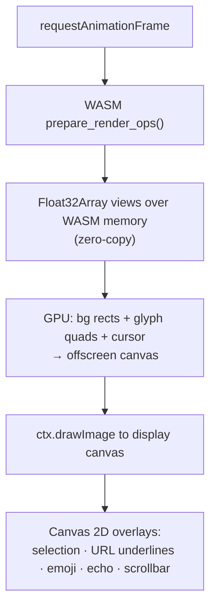
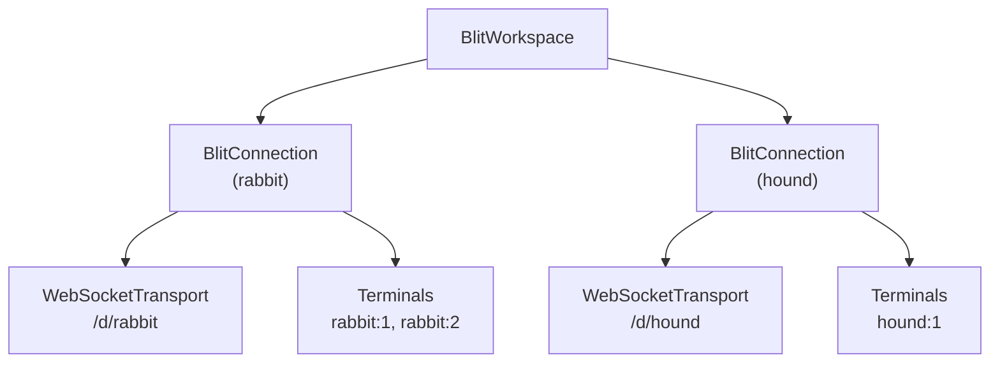

# Frontend

The browser-side of blit consists of a Rust WASM module (`blit-browser`) that applies frame diffs and produces GPU-ready vertex data, a GPU renderer (WebGPU with WebGL2 fallback), and a TypeScript layer (`@blit-sh/core`) that handles transports, workspace state, and input.

## Render pipeline overview

```mermaid
graph LR
    WS["WebSocket /\nWebTransport /\nWebRTC"] -->|compressed frame| WASM["blit-browser\n(WASM)"]
    WASM -->|vertex buffers\n(zero-copy)| GL["GPU renderer\n(WebGPU / WebGL2)"]
    GL -->|bg rects + glyphs| OC["offscreen canvas"]
    OC -->|drawImage| DC["display canvas"]
    DC -->|2D overlays| OUT["screen"]
```

## WASM runtime (`blit-browser`)

`blit-browser` compiles to `wasm32-unknown-unknown`. It maintains a `TerminalState` — the grid of 12-byte cells — and applies incoming compressed frame diffs via `feed_compressed()`.

When `prepare_render_ops()` is called for a render pass:

1. Iterates all cells in the grid.
2. Resolves foreground/background colors through the current palette (indexed colors, default colors, dim/bold/dim modifiers).
3. Coalesces adjacent cells with identical background color into merged rectangle operations.
4. For each cell with visible content, creates a `GlyphKey` (UTF-8 bytes + bold/italic/underline/wide flags), ensures the glyph exists in the atlas, and emits 6 vertices (2 triangles) with atlas texture coordinates.
5. Exposes vertex buffers to JavaScript via zero-copy WASM linear memory pointers (`bg_verts_ptr/len`, `glyph_verts_ptr/len`).

## Glyph atlas

The atlas is a **Canvas 2D `HTMLCanvasElement`**, not a GPU texture. It uses row-based bin packing to allocate glyph slots.

When a new glyph is needed:

1. A slot is allocated in the atlas canvas (power-of-two size, 2048–8192 px).
2. The Canvas 2D context sets font style (`"bold italic Npx family"`) and calls `fillText()` to render the codepoint in white.
3. Underlines are drawn with `ctx.stroke()` when the underline attribute is set.
4. The slot coordinates are cached in an `FxHashMap<GlyphKey, GlyphSlot>`.

The atlas canvas is uploaded to a WebGL texture once per frame (skipped if unchanged). The GL shader tints white glyphs with the per-vertex foreground color; color glyphs (emoji) pass through untinted.

## GPU renderer

The browser renderer has three backends, tried in order:

1. **WebGPU** — preferred when available (Chrome 113+, Edge 113+, Firefox Nightly). Async initialisation via `navigator.gpu.requestAdapter()`.
2. **WebGL2** — synchronous fallback, used while the WebGPU probe is in-flight or if WebGPU is unavailable.
3. **Canvas 2D** — software fallback when neither GPU API is available (e.g. headless environments).

All three implement the same `GlRenderer` interface and consume the same vertex buffers produced by the WASM module. `TerminalStore` kicks off the WebGPU probe eagerly in its constructor and transparently promotes the renderer once the probe resolves; frames rendered before that use the WebGL2 fallback.

### WebGPU renderer

Two WGSL render pipelines:

**RECT pipeline** — colored rectangles for cell backgrounds and the cursor.

- Vertex layout: `pos` (float32x2), `color` (float32x4) — 24-byte stride.
- Single draw call per frame (no batching needed; vertex buffer grows on demand).

**GLYPH pipeline** — textured atlas quads with per-vertex coloring.

- Vertex layout: `pos` (float32x2), `uv` (float32x2), `color` (float32x4) — 32-byte stride.
- Fragment shader uses the same gray-detection tinting as WebGL2 (grayscale → tinted, color → passthrough).
- Atlas uploaded via `copyExternalImageToTexture` with premultiplied alpha.

Both pipelines use premultiplied-alpha blending (`src: one, dst: one-minus-src-alpha`).

### WebGL2 renderer

Two shader programs handle all drawing:

**RECT shader** — colored rectangles for cell backgrounds and the cursor.

- Vertex attributes: `position` (vec2), `color` (vec4).
- Uses premultiplied alpha blending.

**GLYPH shader** — textured quads from the atlas.

- Vertex attributes: `position` (vec2), `uv` (vec2), `color` (vec4).
- Fragment shader: grayscale glyphs are tinted with the vertex color; color glyphs (emoji) render directly.

Both programs batch up to 65,532 vertices per draw call.

### Render loop (`BlitTerminalSurface`)

Demand-driven via `requestAnimationFrame`:



## Input handling

### Keyboard

Input is captured via a hidden `<textarea>` element. `keyToBytes()` converts `KeyboardEvent` to terminal escape sequences:

| Key             | Sequence                                                          |
| --------------- | ----------------------------------------------------------------- |
| Ctrl+letter     | Control code (e.g. Ctrl+C → `0x03`)                               |
| Arrow keys      | `\x1b[A`–`\x1b[D` (normal) or `\x1bOA`–`\x1bOD` (app cursor mode) |
| Function keys   | `\x1b[15~`–`\x1b[24~`                                             |
| Modifier combos | `\x1b[1;{mod}X` format                                            |
| Alt+key         | `\x1b` prefix                                                     |

IME/composition input is handled via `compositionend` to capture multi-codepoint sequences as a single input event.

### Mouse

Mouse events are sent as `C2S_MOUSE` messages. The server generates the correct escape sequence based on the PTY's current mouse mode and encoding (X10, VT200, SGR, pixel). Client-side text selection (word/line granularity, drag) and clipboard copy are handled independently of terminal mouse mode — the browser intercepts the selection before it reaches the terminal emulator.

### Predicted echo

When the PTY is in echo + canonical mode (mode bits 9 and 10), the browser shows typed characters immediately before the server confirms them. This makes typing feel instantaneous over high-latency connections. Predicted characters are displayed with a distinct style and replaced with server-confirmed output on receipt.

## Workspace and connection model



`BlitWorkspace` manages one or more `BlitConnection` instances, each with its own transport and PTY namespace. Terminal IDs are prefixed by connection name (`"rabbit:1"`) to avoid collisions when multiple servers are open simultaneously.

## Surface video decoding

GUI app surfaces (see [server.md § Headless Wayland compositor](server.md#headless-wayland-compositor)) are decoded in the browser via the **WebCodecs `VideoDecoder` API**:

- Codec is detected per-frame from the `flags` byte in `S2C_SURFACE_FRAME`: bit 0 is the keyframe flag; bits 1–2 encode the codec — H.264 (0), AV1 (1), PNG (2).
- `optimizeForLatency: true` is set on the decoder to minimize decode delay.
- Decoded `VideoFrame`s are rendered to a canvas by `BlitSurfaceView` (React/Solid component).
- Mouse and keyboard events from the surface canvas are forwarded as `C2S_SURFACE_INPUT` / `C2S_SURFACE_POINTER` messages.

## Font serving

The gateway and CLI serve system fonts to the browser as `@font-face` CSS with base64-encoded font data via the `/font/<name>` route. `blit-fonts` discovers fonts by scanning standard directories (`~/Library/Fonts`, `/usr/share/fonts`, `/System/Library/Fonts`, etc.), falling back to `fc-list`/`fc-match` on Linux. It parses TTF/OTF `name` tables for family/style metadata, `post` tables for monospace detection, and `hmtx` tables for uniform advance width verification.

The browser requests the font list from `/fonts` (JSON array of family names) and fetches individual fonts on demand. This ensures the terminal renders with the same fonts available on the server — useful for icon fonts and coding ligatures.
