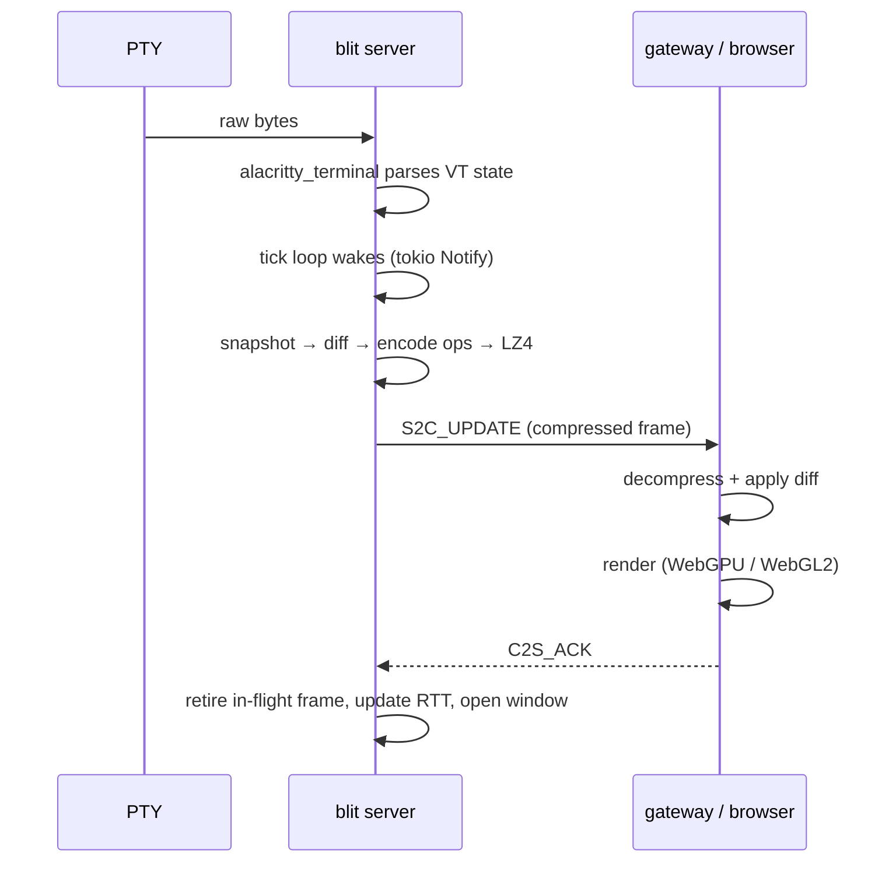
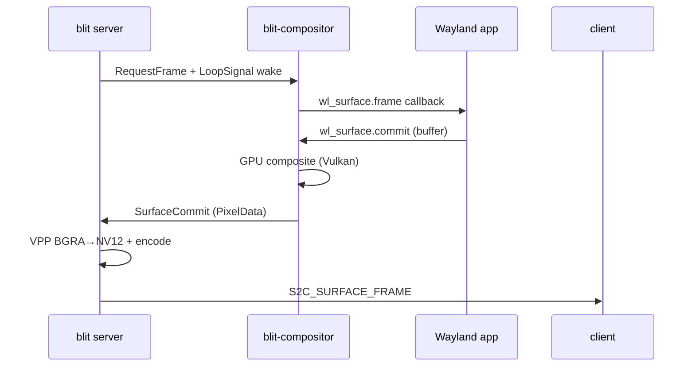
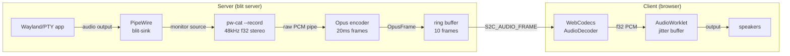
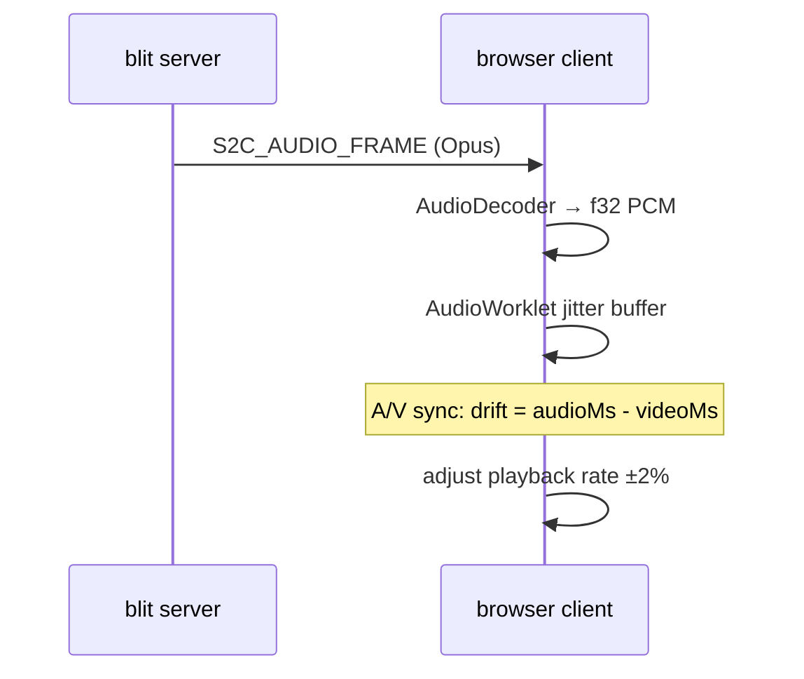

# Server Internals

`blit server` is a single async Rust binary (tokio runtime). It owns PTYs, terminal state, and per-client frame scheduling. It has no CLI subcommands and no RPC API beyond the binary protocol described in [protocol.md](protocol.md). Configuration is entirely via environment variables.

## Configuration

| Variable                | Default                                            | Purpose                          |
| ----------------------- | -------------------------------------------------- | -------------------------------- |
| `BLIT_SOCK`             | see path cascade in [transports.md](transports.md) | Unix socket listen path          |
| `SHELL`                 | `$SHELL` or `/bin/sh`                              | Shell spawned for new PTYs       |
| `BLIT_SHELL_FLAGS`      | `li` (Unix) / `` (Windows)                         | Shell invocation flags           |
| `BLIT_SCROLLBACK`       | `10000`                                            | Scrollback buffer rows per PTY   |
| `BLIT_VAAPI_DEVICE`     | `/dev/dri/renderD128`                              | VA-API render node for encoding  |
| `BLIT_CUDA_DEVICE`      | `0`                                                | CUDA device ordinal (NVENC)      |
| `BLIT_FD_CHANNEL`       | unset                                              | fd-channel file descriptor       |
| `BLIT_SURFACE_ENCODERS` | see encoder table                                  | Comma-separated encoder priority |
| `BLIT_SURFACE_QUALITY`  | `medium`                                           | Video quality preset             |

## PTY lifecycle

### Creation

PTYs are created by `C2S_CREATE` or `C2S_CREATE2`. The server:

1. Allocates a PTY pair via `openpty`.
2. Forks. The child sets the slave fd as controlling terminal (`TIOCSCTTY`), drops privileges, sets the working directory, and `exec`s the shell (or custom command from `HAS_COMMAND`).
3. The master fd is registered with the tokio reactor for async I/O.
4. PTY output is fed through the `blit-alacritty` terminal parser.
5. `S2C_CREATED` (or `S2C_CREATED_N` with nonce) is sent to the creating client.
6. All connected clients receive `S2C_LIST` reflecting the new PTY.

### Exit

When the PTY subprocess exits, `waitpid` captures the exit status:

- Normal exit: `WEXITSTATUS` (0, 1, …).
- Signal death: negative signal number (-9 = SIGKILL, -15 = SIGTERM).
- Unknown: `i32::MIN`.

`S2C_EXITED` is broadcast to all subscribed clients. The terminal state is retained — clients can still scroll and read. The PTY slot is marked exited but not freed.

`C2S_RESTART` respawns the shell in the same slot. `C2S_CLOSE` removes the PTY entirely and frees the slot.

### Multi-client state

- **Subscriptions**: clients subscribe per-PTY with `C2S_SUBSCRIBE`. The server only sends `S2C_UPDATE` frames to subscribed clients.
- **Focus**: each client has an independent focused PTY (`C2S_FOCUS`). The focused PTY gets full frame rate; subscribed-but-unfocused PTYs get a capped preview rate.
- **Sizing**: each client reports its desired dimensions per PTY via `C2S_RESIZE`. The effective PTY size is the minimum across all subscribed clients, so the terminal fits every viewer's window.

## Terminal emulation

Terminal parsing is handled by `alacritty_terminal` (v0.25), wrapped by `blit-alacritty` (`crates/alacritty-driver/`). The wrapper adds:

- **Snapshot generation** — converts `alacritty_terminal`'s `Term` into `blit-remote::FrameState` (the 12-byte cell grid). Called once per scheduled frame.
- **Scrollback frames** — generates frames at arbitrary scroll offsets into the scrollback buffer, without modifying the live terminal state.
- **Mode tracking** — a custom `ModeTracker` intercepts CSI/DCS sequences from raw PTY output to detect mode changes: `DECCKM`, `DECSCUSR`, mouse modes (`?9h`, `?1000h`, `?1002h`, `?1003h`), SGR mouse encoding (`?1006h`), synchronized output, etc. These are packed into the 16-bit mode field sent with each frame.
- **Search** — full-text search across visible content, titles, and scrollback, returning scored results with match context and scroll offsets.

The server also polls `tcgetattr` on the PTY master fd to detect echo and canonical mode flags. These are packed into mode bits 9 and 10 so the browser can implement predicted echo (showing keystrokes before the server confirms them).

## Per-client frame pacing

The server maintains detailed per-client congestion state. No client can block another.

### RTT estimation

Each `S2C_UPDATE` increments an in-flight counter. Each `C2S_ACK` retires the oldest in-flight frame and records the one-way delivery time. RTT is tracked as:

- **EWMA RTT** — exponentially weighted moving average.
- **Minimum-path RTT** — the smallest RTT seen, decayed slowly.

### Bandwidth estimation

- **Delivered rate** — EWMA of `frame_bytes / delivery_time`.
- **ACK goodput** — bytes acknowledged per ACK interval.
- **Jitter tracking** — EWMA of frame delivery time variance, with a decaying peak, feeding into a conservative bandwidth floor.

### Frame window

Frames in flight are capped by both:

- A **frame count** — bounded by RTT and display rate.
- A **byte budget** — bounded by the bandwidth-delay product.

The window adapts dynamically. High-latency links get deeper pipelines to stay fully utilized. Low-latency local links pipeline nothing beyond what the client can immediately render.

### Display pacing

The client reports:

- `C2S_DISPLAY_RATE` — the display refresh rate in Hz.
- `C2S_CLIENT_METRICS` — backlog depth, ack-ahead count, frame apply time (in 0.1 ms units).

The server spaces frame sends to match the client's actual render rate. When backlog grows (client falling behind), the server backs off.
The final transport gate is byte-aware: queued bytes and queued message count both feed outbox backpressure, so a couple of tiny terminal diffs do not stall a large surface/video frame. Bulk writes are chunked so audio can interleave while large terminal or video payloads are draining.

### Preview budgeting

Background PTYs (subscribed but not focused) share leftover bandwidth after the focused PTY's needs are met. Preview frame rate is capped to avoid starving the focused terminal.

### Probe and backoff

After a conservative backoff, the server gradually probes with additive window growth. Probe frames are discarded when queue delay rises.

**Result**: a fast client on localhost gets frames at its full display rate. A slow client on a mobile connection gets paced to its actual capacity. Neither blocks the other.

## Frame scheduling flow



## Headless Wayland compositor (experimental)

The compositor is optionally enabled for terminals that need GUI app support. It is lazily initialized and shared across all PTYs in a connection.

### Initialization

`ensure_compositor()` lazily starts a headless Wayland compositor on a dedicated OS thread, listening on a randomly-chosen `wayland-blit-*` socket. Each compositor gets a monotonic internal ID from a server-side counter, used to identify the audio pipeline instance. Surface messages carry only the `surface_id` assigned by the compositor; the server routes to the correct compositor instance internally.

All PTYs forked after the compositor starts inherit `WAYLAND_DISPLAY` pointing at the shared compositor socket. Any program — shell, TUI, or GUI app — can open Wayland surfaces from any PTY.

### Surface lifecycle

1. The app creates an `xdg_toplevel` surface; the compositor assigns it a `surface_id`.
2. The compositor sends `SurfaceCommit` events with RGBA pixel buffers via tokio channels.
3. The server converts RGBA to YUV420 or NV12 and encodes via the configured encoder chain.
4. `S2C_SURFACE_CREATED` is broadcast to subscribed clients, followed by `S2C_SURFACE_FRAME` as the app renders.
5. Input events from clients (`C2S_SURFACE_INPUT`, `C2S_SURFACE_POINTER`, `C2S_SURFACE_POINTER_AXIS`) are translated to Wayland keyboard/pointer events via the compositor.
6. When the app closes the surface, `S2C_SURFACE_DESTROYED` is broadcast.

### Frame production pipeline



`RequestFrame` is only sent for surfaces that have subscribers and no pending request, preventing busy-loops when the app hasn't painted yet.

### GPU rendering and encoding

The compositor uses a Vulkan renderer (`VulkanRenderer`) loaded at runtime via `ash` (dlopen `libvulkan.so`). Client surfaces (SHM or DMA-BUF) are composited into a Vulkan output image, read back via a staging buffer, and fed to the video encoder.

#### Output pipeline

The Vulkan renderer allocates its own output images with device-local memory and HOST_VISIBLE staging buffers for CPU readback. Each frame, all client surface layers are composited into the output image, then the result is copied to a staging buffer and mapped for CPU access. The BGRA pixel data is handed to the encoder. No GBM involvement.

- **VA-API**: The encoder imports the BGRA pixel data into a VA surface via VPP color-space conversion (BGRA to NV12). The old EGL zero-copy path (VA-API-allocated DMA-BUFs imported as EGL FBOs) no longer exists.
- **NVENC**: CUDA imports the BGRA pixel data for encoding.
- **Software**: The CPU encoder reads the staging buffer directly.

### Encoder selection

Controlled by `BLIT_SURFACE_ENCODERS` (comma-separated priority list). The server tries each in order and uses the first that succeeds at runtime. Default priority:

```
av1-nvenc, h264-nvenc, av1-vaapi, h264-vaapi, h264-software, av1-software
```

| Encoder         | Backend        | Notes                            |
| --------------- | -------------- | -------------------------------- |
| `av1-nvenc`     | NVENC (GPU)    | AV1 via CUDA                     |
| `h264-nvenc`    | NVENC (GPU)    | H.264 via CUDA                   |
| `av1-vaapi`     | VA-API (GPU)   | AV1 via libva                    |
| `h264-vaapi`    | VA-API (GPU)   | H.264 via libva                  |
| `h264-software` | openh264 (CPU) | Software H.264, always available |
| `av1-software`  | rav1e (CPU)    | Software AV1                     |

`BLIT_SURFACE_QUALITY`: `low`, `medium` (default), `high`, `lossless`.

### VA-API VPP (Video Processing Pipeline)

The VPP context (`VppContext`) handles BGRA-to-NV12 color-space conversion on the GPU. It is created alongside each VA-API encoder and shares the same `VADisplay`.

- **NV12 output pool**: 4 round-robin surfaces for the encoder's reference frame and reconstruction buffers.
- **BGRA input pool**: 3 pre-allocated surfaces for VPP color-space conversion (BGRA pixel data from the Vulkan compositor is imported per-frame).
- **PRIME import cache**: imported VASurfaces are cached by fd inode so the expensive `vaCreateSurfaces` call happens only once per unique buffer.

Fourcc mapping (AMD quirk): AMD's VA-API only accepts `VA_FOURCC_BGRA`/`VA_FOURCC_BGRX` for RGB surface operations. DRM `ABGR8888`/`XBGR8888` (which map to `VA_FOURCC_RGBA`/`VA_FOURCC_RGBX`) are remapped to their BGR counterparts for the PRIME descriptor.

### Compositor capabilities

- **Protocols**: `wl_compositor` v6, `xdg-shell` v6, `wp_viewporter`, `wp_fractional_scale_manager` v1, `xdg-decoration`, `zwp_linux_dmabuf` v3, `wp_presentation`, `zwp_pointer_constraints` v1, `zwp_relative_pointer_manager` v1, `xdg-activation` v1, `wp_cursor_shape_manager` v1.
- **Buffer types**: SHM (shared memory) and DMA-BUF (GPU). DMA-BUF accepted via `zwp_linux_dmabuf_v1`; client buffers imported via Vulkan external memory extensions (`VK_EXT_external_memory_dma_buf`) and composited as Vulkan textures.
- **Pixel formats**: ARGB8888, XRGB8888, ABGR8888, XBGR8888 with linear modifier or `DRM_FORMAT_MOD_INVALID` (treated as linear).
- **Screenshots**: `blit surface capture <surface_id>` uses CPU compositing from the pixel cache. Output format: PNG or AVIF, inferred from file extension.

Chrome/Electron work with `--ozone-platform=wayland`. mpv works with `--vo=gpu-next` (Vulkan WSI submits DMA-BUFs via `zwp_linux_dmabuf`).

## Audio

Audio capture, encoding, and playback are handled by a PipeWire-based pipeline.

### Architecture



### Capture

`AudioPipeline::spawn()` (`crates/server/src/audio.rs`) starts a private, isolated PipeWire stack per compositor instance:

| Process           | Role                                                      |
| ----------------- | --------------------------------------------------------- |
| `dbus-daemon`     | Private D-Bus session (required by PipeWire modules)      |
| `pipewire`        | Core daemon with a null sink (`blit-sink`, 48 kHz stereo) |
| `wireplumber`     | Minimal session manager (hardware monitors disabled)      |
| `pipewire-pulse`  | PulseAudio compatibility socket                           |
| `pw-cat --record` | Captures `blit-sink` monitor, writes raw PCM to stdout    |

Child processes inherit `PIPEWIRE_REMOTE` and `PULSE_SERVER` pointing at the private sockets. Audio availability is gated by `pipewire_available()` (checks for required binaries on PATH) and can be disabled with `BLIT_AUDIO=0`.

### Encoding

`reader_encoder_task()` is an async tokio task that reads the `pw-cat` stdout pipe:

1. Buffers raw PCM and frames it into 20 ms chunks (960 samples/channel, stereo).
2. Encodes each chunk with libopus at the current bitrate (default 64 kbps, adjustable per-subscriber via `C2S_AUDIO_SUBSCRIBE`).
3. Timestamps each frame using the same epoch as video frame timestamps, enabling A/V sync on the client.
4. Sends frames through an mpsc channel (capacity 20). Frames are dropped if the channel is full to avoid stalling PipeWire's realtime thread.

A ring buffer of 10 recent frames (200 ms) provides catch-up delivery when new clients subscribe.

### Transport

| Message                        | Direction       | Layout                                              |
| ------------------------------ | --------------- | --------------------------------------------------- |
| `C2S_AUDIO_SUBSCRIBE` (0x30)   | client → server | `[opcode][bitrate_kbps:u16 LE]`                     |
| `C2S_AUDIO_UNSUBSCRIBE` (0x31) | client → server | `[opcode]`                                          |
| `S2C_AUDIO_FRAME` (0x30)       | server → client | `[opcode][timestamp:u32 LE][flags:u8][opus_data:N]` |

On subscribe, the server sends ring-buffer catch-up frames and recomputes the Opus bitrate as the maximum of all subscribers' requested bitrates.

### Playback

`AudioPlayer` (`js/core/src/AudioPlayer.ts`) handles decode and render in the browser:

1. **Decode**: WebCodecs `AudioDecoder` with `codec: "opus"`, 48 kHz stereo. Decoded `AudioData` frames (f32 planar PCM) are transferred to the worklet via `MessagePort`.
2. **Render**: An `AudioWorkletProcessor` maintains a jitter buffer (target 100 ms / 4800 samples). Outputs silence until the buffer fills; re-enters buffering on underrun.
3. **A/V sync**: The worklet reports its consumed-sample position. The main thread maps this to a server timestamp via a recorded timeline, computes drift against video timestamps, and steers the playback rate within +/-2% to converge. Rate changes are exponentially smoothed (alpha 0.15) to prevent audible wow/flutter.


