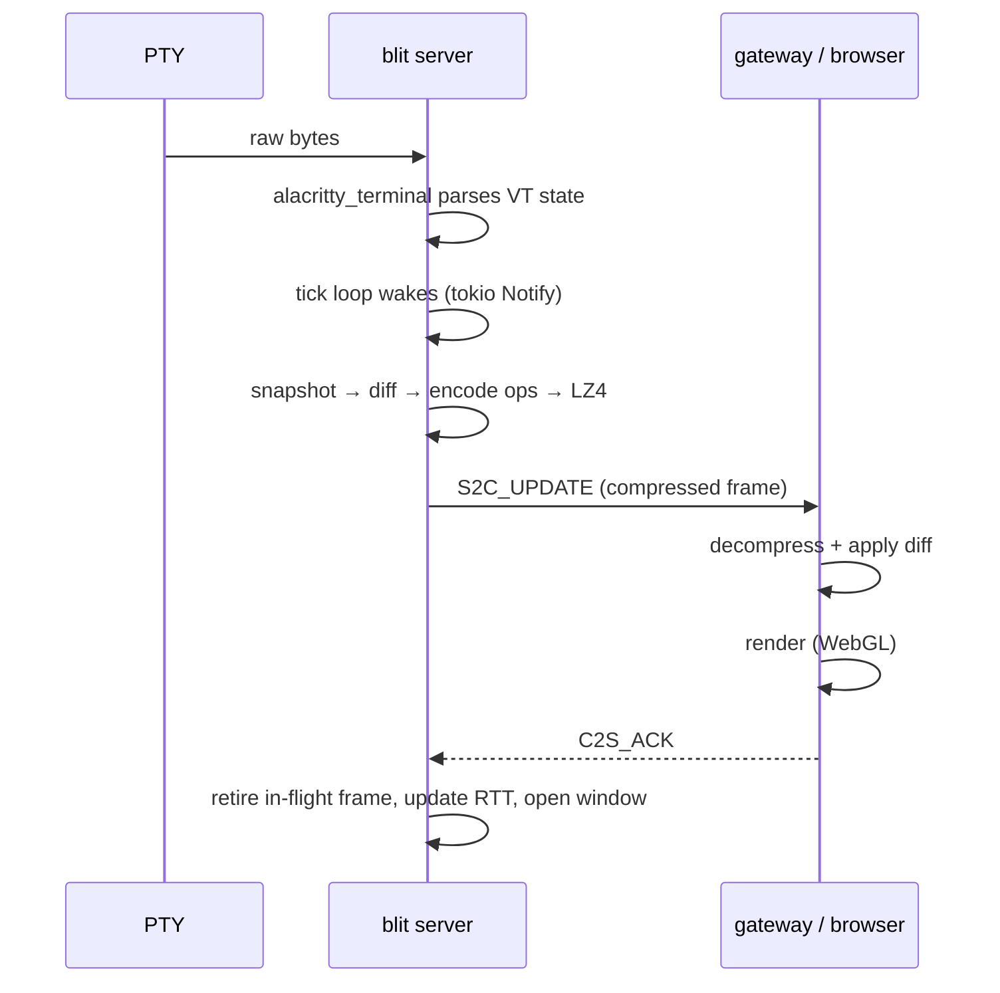
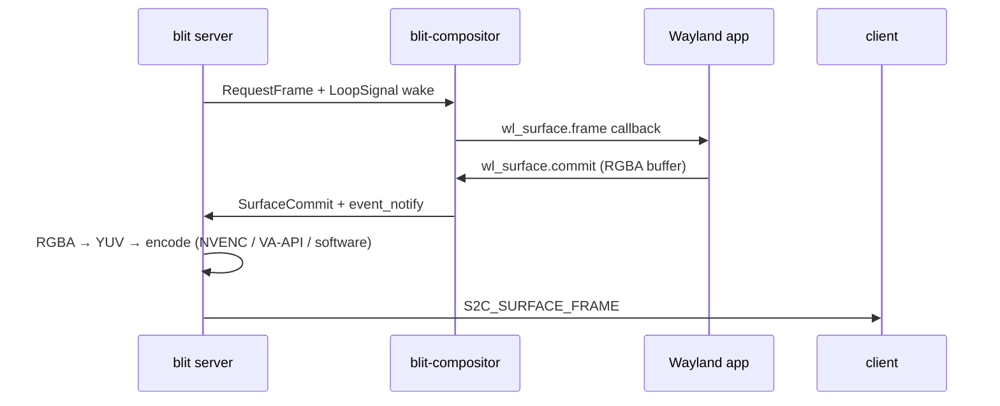

# Server Internals

`blit server` is a single async Rust binary (tokio runtime). It owns PTYs, terminal state, and per-client frame scheduling. It has no CLI subcommands and no RPC API beyond the binary protocol described in [protocol.md](protocol.md). Configuration is entirely via environment variables.

## Configuration

| Variable                | Default                                            | Purpose                          |
| ----------------------- | -------------------------------------------------- | -------------------------------- |
| `BLIT_SOCK`             | see path cascade in [transports.md](transports.md) | Unix socket listen path          |
| `SHELL`                 | `$SHELL` or `/bin/sh`                              | Shell spawned for new PTYs       |
| `BLIT_SHELL_FLAGS`      | `li` (Unix) / `` (Windows)                         | Shell invocation flags           |
| `BLIT_SCROLLBACK`       | `10000`                                            | Scrollback buffer rows per PTY   |
| `BLIT_VAAPI_DEVICE`     | `/dev/dri/renderD128`                              | VA-API render node for encoding  |
| `BLIT_CUDA_DEVICE`      | `0`                                                | CUDA device ordinal (NVENC)      |
| `BLIT_FD_CHANNEL`       | unset                                              | fd-channel file descriptor       |
| `BLIT_SURFACE_ENCODERS` | see encoder table                                  | Comma-separated encoder priority |
| `BLIT_SURFACE_QUALITY`  | `medium`                                           | Video quality preset             |

## PTY lifecycle

### Creation

PTYs are created by `C2S_CREATE` or `C2S_CREATE2`. The server:

1. Allocates a PTY pair via `openpty`.
2. Forks. The child sets the slave fd as controlling terminal (`TIOCSCTTY`), drops privileges, sets the working directory, and `exec`s the shell (or custom command from `HAS_COMMAND`).
3. The master fd is registered with the tokio reactor for async I/O.
4. PTY output is fed through the `blit-alacritty` terminal parser.
5. `S2C_CREATED` (or `S2C_CREATED_N` with nonce) is sent to the creating client.
6. All connected clients receive `S2C_LIST` reflecting the new PTY.

### Exit

When the PTY subprocess exits, `waitpid` captures the exit status:

- Normal exit: `WEXITSTATUS` (0, 1, …).
- Signal death: negative signal number (-9 = SIGKILL, -15 = SIGTERM).
- Unknown: `i32::MIN`.

`S2C_EXITED` is broadcast to all subscribed clients. The terminal state is retained — clients can still scroll and read. The PTY slot is marked exited but not freed.

`C2S_RESTART` respawns the shell in the same slot. `C2S_CLOSE` removes the PTY entirely and frees the slot.

### Multi-client state

- **Subscriptions**: clients subscribe per-PTY with `C2S_SUBSCRIBE`. The server only sends `S2C_UPDATE` frames to subscribed clients.
- **Focus**: each client has an independent focused PTY (`C2S_FOCUS`). The focused PTY gets full frame rate; subscribed-but-unfocused PTYs get a capped preview rate.
- **Sizing**: each client reports its desired dimensions per PTY via `C2S_RESIZE`. The effective PTY size is the minimum across all subscribed clients, so the terminal fits every viewer's window.

## Terminal emulation

Terminal parsing is handled by `alacritty_terminal` (v0.25), wrapped by `blit-alacritty` (`crates/alacritty-driver/`). The wrapper adds:

- **Snapshot generation** — converts `alacritty_terminal`'s `Term` into `blit-remote::FrameState` (the 12-byte cell grid). Called once per scheduled frame.
- **Scrollback frames** — generates frames at arbitrary scroll offsets into the scrollback buffer, without modifying the live terminal state.
- **Mode tracking** — a custom `ModeTracker` intercepts CSI/DCS sequences from raw PTY output to detect mode changes: `DECCKM`, `DECSCUSR`, mouse modes (`?9h`, `?1000h`, `?1002h`, `?1003h`), SGR mouse encoding (`?1006h`), synchronized output, etc. These are packed into the 16-bit mode field sent with each frame.
- **Search** — full-text search across visible content, titles, and scrollback, returning scored results with match context and scroll offsets.

The server also polls `tcgetattr` on the PTY master fd to detect echo and canonical mode flags. These are packed into mode bits 9 and 10 so the browser can implement predicted echo (showing keystrokes before the server confirms them).

## Per-client frame pacing

The server maintains detailed per-client congestion state. No client can block another.

### RTT estimation

Each `S2C_UPDATE` increments an in-flight counter. Each `C2S_ACK` retires the oldest in-flight frame and records the one-way delivery time. RTT is tracked as:

- **EWMA RTT** — exponentially weighted moving average.
- **Minimum-path RTT** — the smallest RTT seen, decayed slowly.

### Bandwidth estimation

- **Delivered rate** — EWMA of `frame_bytes / delivery_time`.
- **ACK goodput** — bytes acknowledged per ACK interval.
- **Jitter tracking** — EWMA of frame delivery time variance, with a decaying peak, feeding into a conservative bandwidth floor.

### Frame window

Frames in flight are capped by both:

- A **frame count** — bounded by RTT and display rate.
- A **byte budget** — bounded by the bandwidth-delay product.

The window adapts dynamically. High-latency links get deeper pipelines to stay fully utilized. Low-latency local links pipeline nothing beyond what the client can immediately render.

### Display pacing

The client reports:

- `C2S_DISPLAY_RATE` — the display refresh rate in Hz.
- `C2S_CLIENT_METRICS` — backlog depth, ack-ahead count, frame apply time (in 0.1 ms units).

The server spaces frame sends to match the client's actual render rate. When backlog grows (client falling behind), the server backs off.

### Preview budgeting

Background PTYs (subscribed but not focused) share leftover bandwidth after the focused PTY's needs are met. Preview frame rate is capped to avoid starving the focused session.

### Probe and backoff

After a conservative backoff, the server gradually probes with additive window growth. Probe frames are discarded when queue delay rises.

**Result**: a fast client on localhost gets frames at its full display rate. A slow client on a mobile connection gets paced to its actual capacity. Neither blocks the other.

## Frame scheduling flow



## Headless Wayland compositor (experimental)

The compositor is optionally enabled for sessions that need GUI app support. It is lazily initialized and shared across all PTYs in a connection.

### Initialization

`ensure_compositor()` lazily starts a smithay compositor on a dedicated OS thread, listening on a randomly-chosen `wayland-blit-*` socket. Each compositor gets a monotonic `session_id` from a server-side counter; this ID is carried in all surface wire messages so the server can route to the correct compositor instance.

All PTYs forked after the compositor starts inherit `WAYLAND_DISPLAY` pointing at the shared compositor socket. Any program — shell, TUI, or GUI app — can open Wayland surfaces from any PTY.

### Surface lifecycle

1. The app creates an `xdg_toplevel` surface; the compositor assigns it a `surface_id`.
2. The compositor sends `SurfaceCommit` events with RGBA pixel buffers via tokio channels.
3. The server converts RGBA to YUV420 or NV12 and encodes via the configured encoder chain.
4. `S2C_SURFACE_CREATED` is broadcast to subscribed clients, followed by `S2C_SURFACE_FRAME` as the app renders.
5. Input events from clients (`C2S_SURFACE_INPUT`, `C2S_SURFACE_POINTER`, `C2S_SURFACE_POINTER_AXIS`) are translated to Wayland keyboard/pointer events via smithay.
6. When the app closes the surface, `S2C_SURFACE_DESTROYED` is broadcast.

### Frame production pipeline



`RequestFrame` is only sent for surfaces that have subscribers and no pending request, preventing busy-loops when the app hasn't painted yet.

### Encoder selection

Controlled by `BLIT_SURFACE_ENCODERS` (comma-separated priority list). The server tries each in order and uses the first that succeeds at runtime. Default priority:

```
nvenc-h265, vaapi-h265, nvenc-av1, av1, nvenc-h264, vaapi-h264, h264
```

| Encoder      | Backend        | Notes                            |
| ------------ | -------------- | -------------------------------- |
| `nvenc-h265` | NVENC (GPU)    | H.265 via CUDA, lowest CPU usage |
| `vaapi-h265` | VA-API (GPU)   | H.265 via libva                  |
| `nvenc-av1`  | NVENC (GPU)    | AV1 via CUDA                     |
| `av1`        | rav1e (CPU)    | Software AV1                     |
| `nvenc-h264` | NVENC (GPU)    | H.264 via CUDA                   |
| `vaapi-h264` | VA-API (GPU)   | H.264 via libva                  |
| `h264`       | openh264 (CPU) | Software H.264, always available |

`BLIT_SURFACE_QUALITY`: `low`, `medium` (default), `high`, `lossless`.

### Compositor capabilities

- **Protocols**: `xdg-shell`, `wp_viewporter` (required by Chrome/Electron), `xdg-decoration` (server-side decorations).
- **Buffer types**: SHM (shared memory) and dmabuf (GPU). Dmabuf accepted via `linux-dmabuf`; planes are read by mmapping.
- **Pixel formats**: ARGB8888, XRGB8888, ABGR8888, XBGR8888, NV12, P010 with linear or implicit modifier. Explicit tiled/vendor modifiers not yet supported.
- **Screenshots**: `blit capture <surface_id>` encodes from the last committed pixel buffer — no live capture required. Output format: PNG or AVIF (rav1e backend), inferred from file extension or `--format` flag.

Chrome and Electron work out of the box with `--ozone-platform=wayland`.
