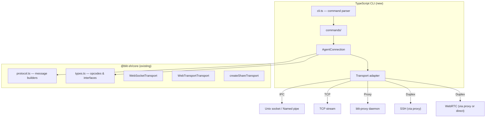
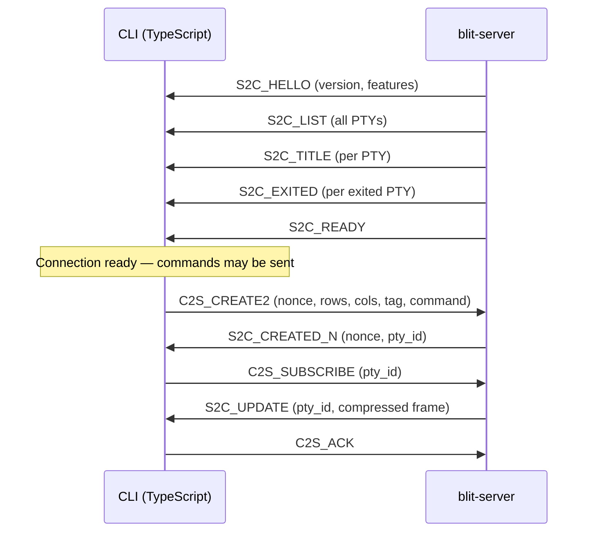

# blit CLI — TypeScript Rewrite Specification

> **Status:** Draft
> **Target:** Replace `crates/cli/` (Rust) with a TypeScript CLI that produces identical output and speaks the same wire protocol.

---

## Table of Contents

- [1. Goals and Non-Goals](#1-goals-and-non-goals)
- [2. Architecture Overview](#2-architecture-overview)
- [3. Package Structure](#3-package-structure)
- [4. Command Tree](#4-command-tree)
- [5. Global Options](#5-global-options)
- [6. Commands — Detailed Specification](#6-commands--detailed-specification)
  - [6.1 terminal](#61-terminal)
  - [6.2 surface](#62-surface)
  - [6.3 clipboard](#63-clipboard)
  - [6.4 remote](#64-remote)
  - [6.5 open](#65-open)
  - [6.6 share](#66-share)
  - [6.7 server](#67-server)
  - [6.8 gateway](#68-gateway)
  - [6.9 quit](#69-quit)
  - [6.10 install](#610-install)
  - [6.11 upgrade](#611-upgrade)
  - [6.12 learn](#612-learn)
  - [6.13 generate](#613-generate)
- [7. Wire Protocol](#7-wire-protocol)
  - [7.1 Framing](#71-framing)
  - [7.2 Message Format](#72-message-format)
  - [7.3 Client-to-Server Opcodes](#73-client-to-server-opcodes)
  - [7.4 Server-to-Client Opcodes](#74-server-to-client-opcodes)
  - [7.5 Feature Negotiation](#75-feature-negotiation)
  - [7.6 Connection Lifecycle](#76-connection-lifecycle)
  - [7.7 Frame Update Encoding](#77-frame-update-encoding)
  - [7.8 Multiplexed WebSocket](#78-multiplexed-websocket)
- [8. Transport Layer](#8-transport-layer)
  - [8.1 URI Schemes](#81-uri-schemes)
  - [8.2 Transport Interface](#82-transport-interface)
  - [8.3 Connection Resolution](#83-connection-resolution)
  - [8.4 Proxy Daemon](#84-proxy-daemon)
  - [8.5 Auto-Start Server](#85-auto-start-server)
- [9. Configuration](#9-configuration)
  - [9.1 File Locations](#91-file-locations)
  - [9.2 blit.conf](#92-blitconf)
  - [9.3 blit.remotes](#93-blitremotes)
- [10. Environment Variables](#10-environment-variables)
- [11. Output Formatting](#11-output-formatting)
- [12. Error Handling](#12-error-handling)
- [13. Recording Formats](#13-recording-formats)
- [14. Authentication](#14-authentication)
- [15. TypeScript Interfaces](#15-typescript-interfaces)
- [16. Dependency Strategy](#16-dependency-strategy)
- [17. Build, Distribution, and Compilation](#17-build-distribution-and-compilation)
- [18. Testing Strategy](#18-testing-strategy)
- [19. Migration and Compatibility](#19-migration-and-compatibility)

---

## 1. Goals and Non-Goals

### Goals

- **Behavioral parity** with the Rust CLI — identical command surface, output format, exit codes, and wire protocol.
- **Reuse `@blit-sh/core`** — the protocol codec, transport layer, and types already exist in TypeScript; the CLI should consume them rather than reimplement.
- **Single self-contained binary** — compiled via a bundler to a single-file executable (no Node.js installation required for end users).
- **Cross-platform** — Linux (x86_64, aarch64), macOS (x86_64, aarch64), Windows (x86_64).

### Non-Goals

- Reimplementing the blit **server** or **gateway** in TypeScript. The CLI is a client only; `blit server` and `blit gateway` continue to run the Rust binary. The TypeScript CLI shells out to the Rust server binary when auto-starting.
- Replacing the browser-side `@blit-sh/core` package. The CLI _depends on_ it.
- Supporting `blit open`'s embedded HTTP server for the browser SPA. This command will launch the Rust binary's `open` subcommand as a subprocess (or be deferred to a later phase).

---

## 2. Architecture Overview



The `AgentConnection` class manages the connection lifecycle (HELLO → LIST → TITLE → EXITED → READY), tracks PTY state, and provides typed request/response methods for each command.

---

## 3. Package Structure

```
cli-ts/
├── src/
│   ├── index.ts              # Entry point: parse args, dispatch
│   ├── cli.ts                # Command/flag definitions (commander or yargs)
│   ├── commands/
│   │   ├── terminal.ts       # terminal list|start|show|history|send|wait|restart|kill|close|record
│   │   ├── surface.ts        # surface list|close|capture|click|key|type|record
│   │   ├── clipboard.ts      # clipboard list|get|set
│   │   ├── remote.ts         # remote list|add|remove|set-default
│   │   ├── open.ts           # open (delegates to Rust binary)
│   │   ├── share.ts          # share
│   │   ├── server.ts         # server (delegates to Rust binary)
│   │   ├── lifecycle.ts      # quit, install, upgrade
│   │   └── learn.ts          # learn (prints reference text)
│   ├── agent.ts              # AgentConnection class
│   ├── transport.ts          # IPC/TCP framing, connect logic, proxy integration
│   ├── config.ts             # Config file read/write (blit.conf, blit.remotes)
│   ├── escapes.ts            # C-style escape parser (\n, \xHH, etc.)
│   ├── signals.ts            # Signal name ↔ number mapping
│   ├── format.ts             # TSV output helpers, exit status formatting
│   └── learn.md              # Embedded CLI reference (verbatim from Rust)
├── package.json
├── tsconfig.json
└── vitest.config.ts
```

---

## 4. Command Tree

```
blit [--on <uri>] [--hub <url>] <command>

  terminal (alias: t)
    list
    start [command...] [--tag/-t <tag>] [--rows <n>] [--cols <n>] [--wait] [--timeout <sec>]
    show <id> [--ansi] [--rows <n>] [--cols <n>]
    history <id> [--from-start <n>] [--from-end <n>] [--limit <n>] [--ansi] [--rows <n>] [--cols <n>]
    send <id> <text|->
    wait <id> --timeout <sec> [--pattern <regex>]
    restart <id>
    kill <id> [signal=TERM]
    close <id>
    record <id> [--output <path>] [--frames <n>] [--duration <sec>]

  surface (alias: s)
    list
    close <id>
    capture <id> [--output <path>] [--format png|avif] [--quality <0-100>] [--width <px>] [--height <px>] [--scale <120ths>]
    click <id> <x> <y> [--button left|right|middle]
    key <id> <key>
    type <id> <text>
    record <id> [--output <path>] [--frames <n>] [--duration <sec>] [--codec <h264,av1>]

  clipboard (alias: c)
    list
    get [--mime <type>=text/plain]
    set [--mime <type>=text/plain;charset=utf-8] [text]

  remote (alias: r)
    list [--reveal]
    add <name> [uri]
    remove <name>
    set-default <target>

  open [--port <n>]
  share [--passphrase <str>] [--quiet] [--verbose]
  server [--socket <path>] [--shell-flags <str>] [--scrollback <n>] [--fd-channel <fd>] [-v]
  gateway
  quit
  install [host]
  upgrade
  learn
  generate <output-dir>
```

`blit` with no arguments prints help and exits with code 1 (`subcommand_required`, `arg_required_else_help`).

---

## 5. Global Options

| Flag          | Env Override                                  | Default       | Description                                                                                            |
| ------------- | --------------------------------------------- | ------------- | ------------------------------------------------------------------------------------------------------ |
| `--on <uri>`  | `BLIT_TARGET` / `blit.conf` key `blit.target` | `local`       | Remote to connect to. Accepts any [URI scheme](#81-uri-schemes) or a named remote from `blit.remotes`. |
| `--hub <url>` | `BLIT_HUB`                                    | `hub.blit.sh` | WebRTC signaling hub URL.                                                                              |

**Resolution order for target:** `--on` flag → `BLIT_TARGET` env → `blit.target` in `blit.conf` → `local`.

---

## 6. Commands — Detailed Specification

### 6.1 terminal

#### `terminal list`

- Connects, waits for READY.
- Prints TSV to stdout:
  ```
  ID\tTAG\tTITLE\tCOMMAND\tSTATUS
  1\tdev\t~/project\tbash\trunning
  2\t\tmake\tmake -j8\texited(0)
  ```
- `STATUS` values: `running`, `exited(<code>)`, `signal(<num>)`, `exited(unknown)`.
- Exit code: 0 on success, 1 on connection error.

#### `terminal start`

| Arg/Flag      | Type       | Default                 | Notes                                                                 |
| ------------- | ---------- | ----------------------- | --------------------------------------------------------------------- |
| `command`     | `string[]` | (empty = default shell) | Positional, variadic. Elements joined with `\0` separator in CREATE2. |
| `--tag`, `-t` | `string`   | `""`                    | Terminal label.                                                       |
| `--rows`      | `u16`      | `24`                    | Initial rows.                                                         |
| `--cols`      | `u16`      | `80`                    | Initial columns.                                                      |
| `--wait`      | `bool`     | `false`                 | Block until process exits. Requires `--timeout`.                      |
| `--timeout`   | `u64`      | —                       | Max seconds to wait (only with `--wait`).                             |

- Sends `C2S_CREATE2` with nonce `1`.
- Waits for `S2C_CREATED_N` with matching nonce.
- Prints the PTY ID (just the number) to stdout.
- If `--wait`: subscribes to the PTY, waits for `S2C_EXITED`. Returns the exit code as the process exit code (124 on timeout).

#### `terminal show`

| Arg/Flag | Type   | Default | Notes                           |
| -------- | ------ | ------- | ------------------------------- |
| `id`     | `u16`  | —       | Required positional.            |
| `--ansi` | `bool` | `false` | Preserve ANSI escape sequences. |
| `--rows` | `u16`  | —       | Resize before reading.          |
| `--cols` | `u16`  | —       | Resize before reading.          |

- Validates PTY exists in initial LIST.
- Optionally sends `C2S_RESIZE`.
- Sends `C2S_READ` with nonce, offset=0, limit=0, flags = `READ_ANSI` if `--ansi`.
- Waits for `S2C_TEXT` with matching nonce.
- Prints text to stdout (no trailing newline added).

#### `terminal history`

| Arg/Flag       | Type   | Default | Notes                                                         |
| -------------- | ------ | ------- | ------------------------------------------------------------- |
| `id`           | `u16`  | —       | Required positional.                                          |
| `--from-start` | `u32`  | —       | Lines to skip from the top. Conflicts with `--from-end`.      |
| `--from-end`   | `u32`  | —       | Lines to skip from the bottom. Conflicts with `--from-start`. |
| `--limit`      | `u32`  | —       | Max lines to return.                                          |
| `--ansi`       | `bool` | `false` | Preserve ANSI escapes.                                        |
| `--rows`       | `u16`  | —       | Resize before reading.                                        |
| `--cols`       | `u16`  | —       | Resize before reading.                                        |

- Sends `C2S_READ` with flags composed from `READ_ANSI` (bit 0) and `READ_TAIL` (bit 1, when `--from-end` is used).
- `offset` = `from_start` or `from_end` value, `limit` = `--limit` or `0`.

#### `terminal send`

| Arg/Flag | Type     | Notes                                 |
| -------- | -------- | ------------------------------------- |
| `id`     | `u16`    | Required.                             |
| `text`   | `string` | Required. Use `-` to read from stdin. |

- Parses C-style escapes in `text`:
  - `\n` → `0x0D` (CR, not LF — matches real terminal Enter)
  - `\r` → `0x0D` (CR)
  - `\t` → `0x09`
  - `\\` → `0x5C`
  - `\0` → `0x00`
  - `\xHH` → byte with hex value `HH`
- When `text` is `-`, reads raw bytes from stdin (no escape processing).
- Validates PTY exists and has not exited.
- Sends `C2S_INPUT`.

#### `terminal wait`

| Arg/Flag    | Type     | Notes                                             |
| ----------- | -------- | ------------------------------------------------- |
| `id`        | `u16`    | Required.                                         |
| `--timeout` | `u64`    | Required. Seconds.                                |
| `--pattern` | `string` | Optional regex to match against new output lines. |

**Without `--pattern`:**

- Waits for `S2C_EXITED` with matching `pty_id`.
- Returns the exit status as the process exit code.
- If already exited at connect time (in initial EXITED burst), returns immediately.
- Exit code 124 on timeout.

**With `--pattern`:**

- Sends `C2S_SUBSCRIBE` to the PTY.
- Feeds incoming `S2C_UPDATE` frames through `TerminalState`.
- After each update, extracts viewport text and tests each line against the regex.
- On match: prints the matched line to stdout, exits 0.
- Exit code 124 on timeout.

#### `terminal restart`

- Validates PTY exists and has exited.
- Sends `C2S_RESTART`.
- Exits 0 on success.

#### `terminal kill`

| Arg/Flag | Type     | Default  | Notes                                                          |
| -------- | -------- | -------- | -------------------------------------------------------------- |
| `id`     | `u16`    | —        | Required.                                                      |
| `signal` | `string` | `"TERM"` | Signal name (e.g. `TERM`, `KILL`, `INT`) or number (e.g. `9`). |

- Resolves signal name to number using POSIX signal map.
- Validates PTY exists and has not exited.
- Sends `C2S_KILL`.

#### `terminal close`

- Validates PTY exists.
- Sends `C2S_CLOSE`.

#### `terminal record`

| Arg/Flag           | Type     | Default            | Notes                  |
| ------------------ | -------- | ------------------ | ---------------------- |
| `id`               | `u16`    | —                  | Required.              |
| `--output`, `-o`   | `string` | `pty-<id>.blitrec` | Output file path.      |
| `--frames`, `-f`   | `u32`    | `0` (unlimited)    | Max frames to record.  |
| `--duration`, `-d` | `f64`    | `0.0` (unlimited)  | Max seconds to record. |

- Subscribes to the PTY.
- Writes BLITREC format (see [Recording Formats](#13-recording-formats)).
- Terminates on frame/duration limit or SIGINT.

---

### 6.2 surface

#### `surface list`

- Sends `C2S_SURFACE_LIST`.
- Waits for `S2C_SURFACE_LIST`.
- Prints TSV:
  ```
  ID\tTITLE\tSIZE\tAPP_ID
  1\tFirefox\t1920x1080\torg.mozilla.firefox
  ```

#### `surface close`

- Sends `C2S_SURFACE_CLOSE` with `surface_id`.

#### `surface capture`

| Arg/Flag          | Type     | Default             | Notes                                        |
| ----------------- | -------- | ------------------- | -------------------------------------------- |
| `id`              | `u16`    | —                   | Required.                                    |
| `--output`, `-o`  | `string` | `surface-<id>.png`  | Output path. Format inferred from extension. |
| `--format`, `-f`  | `string` | (inferred or `png`) | `png` or `avif`.                             |
| `--quality`, `-q` | `u8`     | `0` (lossless)      | 0 = lossless, 1-100 = lossy (AVIF only).     |
| `--width`         | `u16`    | —                   | Resize surface width before capture.         |
| `--height`        | `u16`    | —                   | Resize surface height before capture.        |
| `--scale`         | `u16`    | `0` (current)       | Scale in 120ths (120=1x, 240=2x).            |

- If `--width` or `--height` given, sends `C2S_SURFACE_RESIZE`.
- Sends `C2S_SURFACE_CAPTURE` with format byte (`0`=PNG, `1`=AVIF) and quality.
- Waits for `S2C_SURFACE_CAPTURE`.
- Writes raw image data to file.

#### `surface click`

| Arg/Flag   | Type     | Default  |
| ---------- | -------- | -------- |
| `id`       | `u16`    | —        |
| `x`        | `u16`    | —        |
| `y`        | `u16`    | —        |
| `--button` | `string` | `"left"` |

- Maps button string to protocol value: `left`=1, `right`=3, `middle`=2.
- Sends three `C2S_SURFACE_POINTER` messages: move (type=0), press (type=1), release (type=2).

#### `surface key`

| Arg/Flag | Type     |
| -------- | -------- |
| `id`     | `u16`    |
| `key`    | `string` |

- Parses key string into Linux keycode(s). Supports modifiers (`ctrl+a`, `shift+Tab`, `ctrl+shift+c`).
- Sends `C2S_SURFACE_INPUT` with `pressed=1` then `pressed=0` for each key. Modifier keys are pressed first, released last.

#### `surface type`

| Arg/Flag | Type     |
| -------- | -------- |
| `id`     | `u16`    |
| `text`   | `string` |

- Sends `C2S_SURFACE_TEXT` for plain text segments.
- Parses `{Return}`, `{Escape}`, `{ctrl+a}` etc. as key presses (via `surface key` logic).

#### `surface record`

| Arg/Flag           | Type       | Default                |
| ------------------ | ---------- | ---------------------- | ------------------------------- |
| `id`               | `u16`      | —                      |
| `--output`, `-o`   | `string`   | `surface-<id>.<codec>` |
| `--frames`, `-f`   | `u32`      | `0`                    |
| `--duration`, `-d` | `f64`      | `0.0`                  |
| `--codec`, `-c`    | `string[]` | all                    | Comma-separated: `h264`, `av1`. |

- Maps codec strings to bitmask: `h264`=0x01, `av1`=0x02.
- Sends `C2S_SURFACE_SUBSCRIBE` (with codec/quality extension bytes).
- Writes raw Annex B (H.264) or OBU (AV1) stream to file.
- Sends `C2S_SURFACE_ACK` after each frame.
- Terminates on frame/duration limit or SIGINT.

---

### 6.3 clipboard

#### `clipboard list`

- Sends `C2S_CLIPBOARD_LIST`.
- Waits for `S2C_CLIPBOARD_LIST`.
- Prints one MIME type per line.

#### `clipboard get`

| Arg/Flag | Type     | Default      |
| -------- | -------- | ------------ |
| `--mime` | `string` | `text/plain` |

- Sends `C2S_CLIPBOARD_GET` with MIME type.
- Waits for `S2C_CLIPBOARD_CONTENT`.
- Writes data to stdout (raw bytes).

#### `clipboard set`

| Arg/Flag | Type      | Default                    |
| -------- | --------- | -------------------------- |
| `--mime` | `string`  | `text/plain;charset=utf-8` |
| `text`   | `string?` | —                          |

- If `text` is omitted, reads from stdin.
- Sends `C2S_CLIPBOARD_SET` with MIME type and data.

---

### 6.4 remote

#### `remote list`

| Arg/Flag   | Type   | Default |
| ---------- | ------ | ------- |
| `--reveal` | `bool` | `false` |

- Reads `blit.remotes` file.
- Prints tab-separated `name\turi`.
- Masks `share:` passphrases as `share:****` unless `--reveal`.

#### `remote add`

| Arg/Flag | Type      | Notes                                        |
| -------- | --------- | -------------------------------------------- |
| `name`   | `string`  | Required.                                    |
| `uri`    | `string?` | If omitted, prompts interactively on stderr. |

- Validates URI scheme (ssh:, tcp:, socket:, share:, local, or bare name).
- Writes entry to `blit.remotes` atomically (temp file + rename).
- Protected by file lock on `blit.lock`.

#### `remote remove`

- Removes the named entry from `blit.remotes`.
- Atomic write, file lock.

#### `remote set-default`

- Sets `blit.target = <target>` in `blit.conf`.
- `""` or `"local"` removes the key (resets to local).

---

### 6.5 open

- **Phase 1:** Delegates to the Rust `blit open` binary as a subprocess.
- **Phase 2 (future):** Native TypeScript HTTP server serving the embedded SPA.

Behavior:

- Auto-starts the blit server if not running.
- Starts an embedded HTTP gateway on `--port` (or random port).
- Opens the default browser via `xdg-open` / `open` / `cmd start`.
- Serves the SPA with all named remotes from `blit.remotes` plus `local`.

---

### 6.6 share

| Arg/Flag       | Type     | Default                          |
| -------------- | -------- | -------------------------------- |
| `--passphrase` | `string` | Random 26-char (base32 alphabet) |
| `--quiet`      | `bool`   | `false`                          |
| `--verbose`    | `bool`   | `false`                          |

- Generates random passphrase if not provided.
- Derives Ed25519 key pair from passphrase via PBKDF2-SHA256 (100k rounds, salt `"https://blit.sh"`).
- Connects to signaling hub as producer (`/channel/<pubkey_hex>/producer`).
- Accepts WebRTC peer connections, forwarding traffic to the local blit server.
- Unless `--quiet`, prints the sharing URL to stderr: `https://blit.sh/s#<passphrase>`.
- `--verbose` prints connection diagnostics to stderr.
- Runs until SIGINT.

---

### 6.7 server

**Delegates to the Rust binary.** The TypeScript CLI spawns `blit-server` (the Rust binary) with the provided flags. This is because the server hosts PTYs and the Wayland compositor, which require native code.

| Flag              | Env                | Default                      |
| ----------------- | ------------------ | ---------------------------- |
| `--socket`        | `BLIT_SOCK`        | Platform default             |
| `--shell-flags`   | `BLIT_SHELL_FLAGS` | `li` (Unix), empty (Windows) |
| `--scrollback`    | `BLIT_SCROLLBACK`  | `10000`                      |
| `--fd-channel`    | `BLIT_FD_CHANNEL`  | — (Unix only)                |
| `-v`, `--verbose` | `BLIT_VERBOSE`     | `false`                      |

---

### 6.8 gateway

**Delegates to the Rust binary.** Configuration is entirely via environment variables.

---

### 6.9 quit

- Connects to the server.
- Sends `C2S_QUIT`.
- Also sends `shutdown\n` to the proxy daemon if running.

---

### 6.10 install

| Arg    | Type      | Notes                                            |
| ------ | --------- | ------------------------------------------------ |
| `host` | `string?` | SSH target. If omitted, prints install commands. |

**Without host:** prints platform-specific install one-liners to stdout:

```
# Linux / macOS
curl -sf https://install.blit.sh | sh

# Windows (PowerShell)
irm https://install.blit.sh/install.ps1 | iex
```

**With host:** connects via SSH and runs the installer remotely.

---

### 6.11 upgrade

- Fetches and runs the install script (`https://install.blit.sh`).
- Uses `curl` or `wget`.

---

### 6.12 learn

- Prints the contents of `learn.md` to stdout.
- Exits 0.

---

### 6.13 generate

| Arg      | Type     |
| -------- | -------- |
| `output` | `string` |

- Writes man pages and shell completions (fish, bash, zsh) to the output directory.

---

## 7. Wire Protocol

The blit wire protocol is a custom binary format. There is no protobuf, JSON, or external schema. The protocol is symmetric in framing but asymmetric in message types. It is version-stable: new message types get new opcodes; existing opcodes never change layout.

### 7.1 Framing

**Non-WebSocket transports** (Unix socket, named pipe, TCP):

```
[len:4 LE][payload:len]
```

**WebSocket:** each binary frame = one blit message (no length prefix).

**Maximum frame size:** 16 MiB.

### 7.2 Message Format

Every message begins with a **1-byte opcode**. All multi-byte fields are little-endian. Fields are tightly packed with no padding. PTY and surface identifiers are `u16`.

### 7.3 Client-to-Server Opcodes

| Opcode | Name                   | Layout                                                                           |
| ------ | ---------------------- | -------------------------------------------------------------------------------- |
| `0x00` | `INPUT`                | `[pty_id:2][data:N]`                                                             |
| `0x01` | `RESIZE`               | `[pty_id:2][rows:2][cols:2]…` (batch: repeating triplets)                        |
| `0x02` | `SCROLL`               | `[pty_id:2][offset:4]`                                                           |
| `0x03` | `ACK`                  | (no payload)                                                                     |
| `0x04` | `DISPLAY_RATE`         | `[fps:2]`                                                                        |
| `0x05` | `CLIENT_METRICS`       | `[backlog:2][ack_ahead:2][apply_ms_x10:2]`                                       |
| `0x06` | `MOUSE`                | `[pty_id:2][type:1][button:1][col:2][row:2]`                                     |
| `0x07` | `RESTART`              | `[pty_id:2]`                                                                     |
| `0x08` | `PING`                 | (empty)                                                                          |
| `0x0F` | `QUIT`                 | (empty)                                                                          |
| `0x10` | `CREATE`               | `[rows:2][cols:2][tag_len:2][tag:N]`                                             |
| `0x11` | `FOCUS`                | `[pty_id:2]`                                                                     |
| `0x12` | `CLOSE`                | `[pty_id:2]`                                                                     |
| `0x13` | `SUBSCRIBE`            | `[pty_id:2]`                                                                     |
| `0x14` | `UNSUBSCRIBE`          | `[pty_id:2]`                                                                     |
| `0x15` | `SEARCH`               | `[request_id:2][query:N]`                                                        |
| `0x16` | `CREATE_AT`            | `[rows:2][cols:2][src_pty_id:2][tag_len:2][tag:N]`                               |
| `0x17` | `CREATE_N`             | `[nonce:2][rows:2][cols:2][tag_len:2][tag:N]`                                    |
| `0x18` | `CREATE2`              | `[nonce:2][rows:2][cols:2][features:1][tag_len:2][tag:N][optional…]`             |
| `0x19` | `READ`                 | `[nonce:2][pty_id:2][offset:4][limit:4][flags:1]`                                |
| `0x1A` | `KILL`                 | `[pty_id:2][signal:4]`                                                           |
| `0x1B` | `COPY_RANGE`           | `[nonce:2][pty_id:2][start_tail:4][start_col:2][end_tail:4][end_col:2][flags:1]` |
| `0x20` | `SURFACE_INPUT`        | `[surface_id:2][keycode:4][pressed:1]`                                           |
| `0x21` | `SURFACE_POINTER`      | `[surface_id:2][type:1][button:1][x:2][y:2]`                                     |
| `0x22` | `SURFACE_POINTER_AXIS` | `[surface_id:2][axis:1][value:4]`                                                |
| `0x23` | `SURFACE_RESIZE`       | `[surface_id:2][width:2][height:2][scale_120:2]`                                 |
| `0x24` | `SURFACE_FOCUS`        | `[surface_id:2]`                                                                 |
| `0x25` | `CLIPBOARD_SET`        | `[mime_len:2][mime:N][data_len:4][data:M]`                                       |
| `0x26` | `SURFACE_LIST`         | (empty)                                                                          |
| `0x27` | `SURFACE_CAPTURE`      | `[surface_id:2][format:1][quality:1]`                                            |
| `0x28` | `SURFACE_SUBSCRIBE`    | `[surface_id:2][codec:1][quality:1]` (trailing bytes optional)                   |
| `0x29` | `SURFACE_UNSUBSCRIBE`  | `[surface_id:2]`                                                                 |
| `0x2A` | `SURFACE_ACK`          | `[surface_id:2]`                                                                 |
| `0x2B` | `SURFACE_CLOSE`        | `[surface_id:2]`                                                                 |
| `0x2C` | `CLIPBOARD_LIST`       | (no payload)                                                                     |
| `0x2D` | `CLIENT_FEATURES`      | `[codec_support:1]`                                                              |
| `0x2E` | `CLIPBOARD_GET`        | `[mime_len:2][mime:N]`                                                           |
| `0x2F` | `SURFACE_TEXT`         | `[surface_id:2][text:N]`                                                         |
| `0x30` | `AUDIO_SUBSCRIBE`      | `[bitrate_kbps:2]`                                                               |
| `0x31` | `AUDIO_UNSUBSCRIBE`    | (no payload)                                                                     |

**CREATE2 feature bits:**

- Bit 0 (`HAS_SRC_PTY`): followed by `[src_pty_id:2]`.
- Bit 1 (`HAS_COMMAND`): remaining bytes after tag are the UTF-8 command string.

**READ flags:**

- Bit 0 (`READ_ANSI`): include ANSI escape sequences.
- Bit 1 (`READ_TAIL`): count offset from the end.

**RESIZE batching:** after the opcode, payload contains one or more `[pty_id:2][rows:2][cols:2]` triplets. Requires `FEATURE_RESIZE_BATCH` in HELLO.

### 7.4 Server-to-Client Opcodes

| Opcode | Name                | Layout                                                                                                     |
| ------ | ------------------- | ---------------------------------------------------------------------------------------------------------- |
| `0x00` | `UPDATE`            | `[pty_id:2][lz4-compressed-frame]`                                                                         |
| `0x01` | `CREATED`           | `[pty_id:2][tag:N]`                                                                                        |
| `0x02` | `CLOSED`            | `[pty_id:2]`                                                                                               |
| `0x03` | `LIST`              | `[count:2][entries…]` — entry: `[pty_id:2][cols:2][rows:2][tag_len:2][tag:N]`                              |
| `0x04` | `TITLE`             | `[pty_id:2][title:N]`                                                                                      |
| `0x05` | `SEARCH_RESULTS`    | `[request_id:2][results…]`                                                                                 |
| `0x06` | `CREATED_N`         | `[nonce:2][pty_id:2][tag:N]`                                                                               |
| `0x07` | `HELLO`             | `[version:2][features:4]`                                                                                  |
| `0x08` | `EXITED`            | `[pty_id:2][exit_status:4]`                                                                                |
| `0x09` | `READY`             | (no payload)                                                                                               |
| `0x0A` | `TEXT`              | `[nonce:2][pty_id:2][total_lines:4][offset:4][text:N]`                                                     |
| `0x0B` | `PING`              | (empty)                                                                                                    |
| `0x0C` | `QUIT`              | (empty)                                                                                                    |
| `0x20` | `SURFACE_CREATED`   | `[surface_id:2][parent_id:2][w:2][h:2][title_len:2][title:N][app_id_len:2][app_id:M]`                      |
| `0x21` | `SURFACE_DESTROYED` | `[surface_id:2]`                                                                                           |
| `0x22` | `SURFACE_FRAME`     | `[surface_id:2][timestamp:4][flags:1][w:2][h:2][data:N]`                                                   |
| `0x23` | `SURFACE_TITLE`     | `[surface_id:2][title:N]`                                                                                  |
| `0x24` | `SURFACE_RESIZED`   | `[surface_id:2][w:2][h:2]`                                                                                 |
| `0x25` | `CLIPBOARD_CONTENT` | `[mime_len:2][mime:N][data_len:4][data:M]`                                                                 |
| `0x26` | `SURFACE_LIST`      | `[count:2]` repeated `[surface_id:2][parent_id:2][w:2][h:2][title_len:2][title:N][app_id_len:2][app_id:M]` |
| `0x27` | `SURFACE_CAPTURE`   | `[surface_id:2][width:4][height:4][image_data:N]`                                                          |
| `0x28` | `SURFACE_APP_ID`    | `[surface_id:2][app_id:N]`                                                                                 |
| `0x29` | `SURFACE_CURSOR`    | `[surface_id:2][shape_len:1][shape:N]`                                                                     |
| `0x2A` | `SURFACE_ENCODER`   | `[surface_id:2][encoder:N]`                                                                                |
| `0x2C` | `CLIPBOARD_LIST`    | `[count:2]` repeated `[mime_len:2][mime:N]`                                                                |
| `0x30` | `AUDIO_FRAME`       | `[timestamp:4][flags:1][data:N]`                                                                           |

**EXITED exit_status:** `WEXITSTATUS` for normal exits; negative signal number for signal deaths (e.g. `-9` = SIGKILL); `i32.MIN` (`-2147483648`) when unknown.

**SURFACE_FRAME flags:** bit 0 = keyframe; bits 1–2 = codec (0=H.264, 1=AV1, 2=PNG).

**AUDIO_FRAME:** `timestamp` is a sample offset in 48 kHz ticks. Bits 1–2 of `flags` encode codec (0=Opus).

### 7.5 Feature Negotiation

`S2C_HELLO` carries a 4-byte `features` bitmask:

| Bit | Name           | Meaning                                                        |
| --- | -------------- | -------------------------------------------------------------- |
| 0   | `CREATE_NONCE` | Server supports `CREATE2` / `CREATED_N` with nonce correlation |
| 1   | `RESTART`      | Server supports `C2S_RESTART`                                  |
| 2   | `RESIZE_BATCH` | Server accepts batched resize triplets                         |
| 3   | `COPY_RANGE`   | Server supports range-based text copy                          |
| 4   | `COMPOSITOR`   | Server has headless Wayland compositor                         |
| 5   | `AUDIO`        | Server supports audio forwarding                               |

### 7.6 Connection Lifecycle

```
S2C_HELLO       ← version + feature bits
S2C_LIST        ← all existing PTYs
S2C_TITLE       ← one per PTY (if title is set)
S2C_EXITED      ← one per exited-but-retained PTY
S2C_READY       ← end of initial burst
```

After `S2C_READY`, the client can send commands. `S2C_UPDATE` frames are not sent until the client subscribes to a PTY with `C2S_SUBSCRIBE`.



### 7.7 Frame Update Encoding

`S2C_UPDATE` payload (after opcode + pty_id) is LZ4-compressed. Decompressed layout:

**Header (12 bytes):**

```
[rows:2][cols:2][cursor_row:2][cursor_col:2][mode:2][title_field:2]
```

`title_field` upper 4 bits are flags:

| Bit  | Flag                    |
| ---- | ----------------------- |
| 15   | `TITLE_PRESENT`         |
| 14   | `OPS_PRESENT`           |
| 13   | `STRINGS_PRESENT`       |
| 12   | `LINE_FLAGS_PRESENT`    |
| 0–11 | Title UTF-8 byte length |

**Cell operations** (when `OPS_PRESENT`):

- `OP_COPY_RECT (0x01)` — copy rectangle (encodes scrolling).
- `OP_FILL_RECT (0x02)` — fill rectangle with single cell.
- `OP_PATCH_CELLS (0x03)` — bitmask-indexed cell updates.

**Cell format (12 bytes):**

```
Byte 0 (flags0): fg_type[2] | bg_type[2] | bold | dim | italic | underline
Byte 1 (flags1): inverse | wide | wide_continuation | content_len[3] | reserved
Bytes 2–4:       fg color (r,g,b) or palette index
Bytes 5–7:       bg color (r,g,b) or palette index
Bytes 8–11:      UTF-8 content (up to 4 bytes; FNV-1a hash if content_len==7)
```

Color type: 0=default, 1=indexed (256), 2=RGB.

**Mode bits (16-bit):** cursor style, `DECCKM`, app keypad, alternate screen, mouse modes, `ECHO`, `ICANON`.

### 7.8 Multiplexed WebSocket

The `/mux` endpoint carries traffic for all gateway destinations over a single connection.

**Auth:** browser sends passphrase as text frame; server responds `"mux"` (not `"ok"`).

**Framing (after auth):**

```
[channel_id:2 LE][payload:N]          channel_id < 0xFFFF → data
[0xFFFF][control_opcode:1][...]       channel_id = 0xFFFF → control
```

**Control messages:**

| Direction | Opcode | Name   | Layout                               |
| --------- | ------ | ------ | ------------------------------------ |
| C→S       | `0x01` | OPEN   | `[channel_id:2][name_len:2][name:N]` |
| C→S       | `0x02` | CLOSE  | `[channel_id:2]`                     |
| S→C       | `0x81` | OPENED | `[channel_id:2]`                     |
| S→C       | `0x82` | CLOSED | `[channel_id:2]`                     |
| S→C       | `0x83` | ERROR  | `[channel_id:2][msg_len:2][msg:N]`   |

---

## 8. Transport Layer

### 8.1 URI Schemes

| Scheme             | Example                 | Description                                                                   |
| ------------------ | ----------------------- | ----------------------------------------------------------------------------- |
| `local`            | `local`                 | Local blit server via Unix socket / named pipe. Auto-starts if not running.   |
| `ssh:`             | `ssh:user@host`         | SSH tunnel to remote blit server. Supports `~/.ssh/config`.                   |
| `tcp:`             | `tcp:host:3264`         | Raw TCP connection.                                                           |
| `socket:`          | `socket:/tmp/blit.sock` | Explicit IPC socket / named pipe.                                             |
| `share:`           | `share:mypassphrase`    | WebRTC peer-to-peer via signaling hub.                                        |
| `ws://` / `wss://` | `wss://gw.example.com`  | WebSocket (proxy-only).                                                       |
| `wt://`            | `wt://gw.example.com`   | WebTransport (proxy-only).                                                    |
| `proxy:`           | `proxy:ssh:host`        | Explicitly route via blit-proxy.                                              |
| `<name>`           | `prod`                  | Named remote from `blit.remotes` (resolved recursively with cycle detection). |

### 8.2 Transport Interface

```typescript
interface IpcTransport {
  read(): Promise<Uint8Array | null>; // Read one length-prefixed frame
  write(payload: Uint8Array): Promise<void>;
  close(): Promise<void>;
}
```

Implementations:

- **UnixSocketTransport** — `net.Socket` connection to Unix domain socket.
- **NamedPipeTransport** — `net.Socket` connection to `\\.\pipe\blit-*` (Windows).
- **TcpTransport** — `net.Socket` with TCP_NODELAY.
- **ProxyTransport** — connects to blit-proxy, performs `target <uri>\n` / `ok\n` handshake, then acts as IPC.

All implementations use 4-byte LE length-prefix framing.

### 8.3 Connection Resolution

```typescript
async function connect(
  on: string | undefined,
  hub: string,
): Promise<IpcTransport>;
```

1. Determine effective target: `--on` → `BLIT_TARGET` → `blit.conf[blit.target]` → `"local"`.
2. If URI matches a known scheme, connect directly (or via proxy if `BLIT_PROXY !== "0"`).
3. If bare name, look up in `blit.remotes`; recurse with cycle detection.
4. For `local`: auto-start server if socket doesn't exist.

### 8.4 Proxy Daemon

The proxy daemon (`blit proxy-daemon`) is a long-running background process that pools connections. The TypeScript CLI interacts with it identically to the Rust CLI:

1. Check if proxy is alive (connect to `$BLIT_PROXY_SOCK` or default path).
2. If not alive, spawn `blit proxy-daemon` as a detached process.
3. Wait up to 5s for socket readiness (poll every 50ms).
4. Send `target <uri>\n`, wait for `ok\n` or `error <msg>\n`.
5. After handshake, the proxy connection carries raw blit protocol frames.

**Shutdown:** send `shutdown\n` to the proxy socket.

### 8.5 Auto-Start Server

When connecting to `local` and no server is running:

1. Spawn the Rust `blit server` binary with default config.
2. Wait up to 5s for socket to appear (poll every 50ms).
3. Connect.

---

## 9. Configuration

### 9.1 File Locations

| File    | Default Path                  | Env Override   |
| ------- | ----------------------------- | -------------- |
| Config  | `~/.config/blit/blit.conf`    | `BLIT_CONFIG`  |
| Remotes | `~/.config/blit/blit.remotes` | `BLIT_REMOTES` |
| Lock    | `~/.config/blit/blit.lock`    | —              |

On Windows: `%APPDATA%\blit\`.
XDG: `$XDG_CONFIG_HOME/blit/`.

### 9.2 blit.conf

Simple `key = value` format with `#` comments.

```ini
# blit.conf
blit.target = prod
```

Read with a line parser. Written atomically (temp file + rename).

### 9.3 blit.remotes

Same `name = uri` format, mode `0o600`. Protected by exclusive `flock` on `blit.lock`.

```ini
local = local
prod = ssh:alice@prod.example.com
dev = ssh:dev-server
```

Auto-provisioned with `local = local` on first read if missing.

---

## 10. Environment Variables

| Variable                | Default                                                   | Purpose                              |
| ----------------------- | --------------------------------------------------------- | ------------------------------------ |
| `BLIT_SOCK`             | Platform-dependent                                        | Unix socket / named pipe path        |
| `BLIT_TARGET`           | —                                                         | Default remote (overrides blit.conf) |
| `BLIT_REMOTES`          | `~/.config/blit/blit.remotes`                             | Remotes file path                    |
| `BLIT_CONFIG`           | `~/.config/blit/blit.conf`                                | Config file path                     |
| `BLIT_HUB`              | `hub.blit.sh`                                             | WebRTC signaling hub URL             |
| `BLIT_PASSPHRASE`       | —                                                         | Share/gateway passphrase             |
| `BLIT_SCROLLBACK`       | `10000`                                                   | Scrollback rows per PTY              |
| `BLIT_SHELL_FLAGS`      | `li` (Unix) / empty (Windows)                             | Shell flags                          |
| `BLIT_PROXY`            | enabled                                                   | Set to `0` to disable proxy          |
| `BLIT_PROXY_SOCK`       | `$XDG_RUNTIME_DIR/blit-proxy.sock`                        | Proxy socket path                    |
| `BLIT_PROXY_IDLE`       | —                                                         | Proxy idle timeout (seconds)         |
| `BLIT_PROXY_POOL`       | `4`                                                       | Pre-warmed connections per pool      |
| `BLIT_SURFACE_ENCODERS` | hw-before-sw                                              | Encoder priority                     |
| `BLIT_SURFACE_QUALITY`  | `medium`                                                  | Video quality                        |
| `BLIT_VAAPI_DEVICE`     | `/dev/dri/renderD128`                                     | VA-API render node                   |
| `BLIT_CUDA_DEVICE`      | `0`                                                       | CUDA device for NVENC                |
| `BLIT_ADDR`             | `0.0.0.0:3264`                                            | Gateway listen address               |
| `BLIT_QUIC`             | —                                                         | Set to `1` for WebTransport          |
| `BLIT_TLS_CERT`         | —                                                         | TLS cert path (WebTransport)         |
| `BLIT_TLS_KEY`          | —                                                         | TLS key path (WebTransport)          |
| `BLIT_GATEWAY_WEBRTC`   | —                                                         | Set to `1` to proxy WebRTC remotes   |
| `BLIT_STORE_CONFIG`     | —                                                         | Set to `1` to sync browser settings  |
| `BLIT_INSTALL_DIR`      | `/usr/local/bin` (Unix) / `%LOCALAPPDATA%\blit\bin` (Win) | Install location                     |
| `BLIT_FD_CHANNEL`       | —                                                         | fd-passing channel fd (Unix)         |
| `BLIT_VERBOSE`          | `0`                                                       | Verbose logging                      |
| `BLIT_FONT_DIRS`        | —                                                         | Extra font dirs (colon-separated)    |
| `BLIT_CORS`             | —                                                         | CORS origin for font routes          |
| `SHELL` / `COMSPEC`     | `/bin/sh` / `cmd.exe`                                     | Default shell                        |
| `SSH_AUTH_SOCK`         | —                                                         | SSH agent socket                     |

---

## 11. Output Formatting

All structured output uses **tab-separated values (TSV)** with a header row. This is deliberate — it's trivially parsed by `cut`, `awk`, and LLM agents.

| Command                 | Format                                     |
| ----------------------- | ------------------------------------------ |
| `terminal list`         | `ID\tTAG\tTITLE\tCOMMAND\tSTATUS`          |
| `surface list`          | `ID\tTITLE\tSIZE\tAPP_ID`                  |
| `clipboard list`        | One MIME type per line                     |
| `terminal start`        | Just the PTY ID (integer)                  |
| `terminal show/history` | Raw text (with ANSI if `--ansi`)           |
| `terminal wait`         | Matched line (with `--pattern`) or nothing |
| `remote list`           | `name\turi` (tab-separated)                |

Status messages go to **stderr** with a `blit: ` prefix:

```
blit: server started on /tmp/blit-1000.sock
blit: cannot connect to ssh:broken: connection refused
```

---

## 12. Error Handling

- All errors are printed to **stderr** with `blit: ` prefix.
- Process exits with code **1** on any error.
- **Timeouts:** 10-second default for server responses. `terminal wait` uses `--timeout`. Exit code **124** on timeout (matching `timeout(1)` convention).
- **Connection errors:** caught at the transport layer, printed as `blit: cannot connect to <target>: <reason>`.
- **PTY validation:** before send/kill, check that PTY exists and has not exited.
- **Signal handling:** SIGINT triggers graceful shutdown — flush writes, close connections, then exit.

---

## 13. Recording Formats

### BLITREC (terminal recording)

```
Magic:   "BLITREC\n"   (8 bytes)
Records: [timestamp_us:8 LE][len:4 LE][data:len]
```

- `timestamp_us` — microsecond-precision timestamp (absolute or relative to start).
- `len` — byte count of the data payload.
- `data` — raw terminal output bytes (what the PTY produced).

Default filename: `pty-<id>.blitrec`.

### Surface recording

Raw video stream:

- **H.264:** Annex B NAL units (playable with `ffplay`).
- **AV1:** OBU stream (playable with `ffplay`).

Default filename: `surface-<id>.<codec>` (e.g. `surface-1.h264`).

---

## 14. Authentication

### Gateway (WebSocket)

1. Client sends passphrase as a text WebSocket frame.
2. Server responds `"ok"` (accepted) or closes connection (rejected).
3. Constant-time comparison (XOR-diff).

### Gateway (WebTransport / QUIC)

1. Client sends `[passphrase_len:2 LE][passphrase:N]`.
2. Server responds `0x01` (accepted) or `0x00` (rejected).

### WebRTC Signaling (hub.blit.sh)

1. Passphrase → PBKDF2-SHA256 (100k rounds, salt `"https://blit.sh"`) → Ed25519 key pair.
2. Public key hex = channel ID on hub.
3. All SDP/ICE messages signed with Ed25519 signing key.
4. Hub verifies signatures before relaying.
5. SDP payloads encrypted with NaCl box (X25519 key exchange).

### `blit open` (browser ↔ gateway)

Passphrase is a random 32-char alphanumeric token, passed via URL fragment (`#token`). Not exposed to the server.

---

## 15. TypeScript Interfaces

### Core Types (reuse from `@blit-sh/core/types`)

```typescript
// Re-exported from @blit-sh/core
export {
  C2S,
  S2C, // Opcode namespaces
  FEATURE_CREATE_NONCE,
  FEATURE_RESTART,
  FEATURE_RESIZE_BATCH,
  FEATURE_COPY_RANGE,
  FEATURE_COMPOSITOR,
  FEATURE_AUDIO,
  CODEC_SUPPORT_H264,
  CODEC_SUPPORT_AV1,
  READ_ANSI,
  READ_TAIL,
  CAPTURE_FORMAT_PNG,
  CAPTURE_FORMAT_AVIF,
  SURFACE_QUALITY_DEFAULT,
  SURFACE_QUALITY_LOW,
  SURFACE_QUALITY_MEDIUM,
  SURFACE_QUALITY_HIGH,
  SURFACE_QUALITY_ULTRA,
} from "@blit-sh/core/types";
```

### CLI-Specific Types

```typescript
/** Parsed PTY info from S2C_LIST */
interface PtyInfo {
  id: number; // u16
  tag: string;
  command: string;
  cols: number; // u16
  rows: number; // u16
}

/** Parsed surface info from S2C_SURFACE_LIST */
interface SurfaceInfo {
  id: number; // u16
  parentId: number;
  width: number;
  height: number;
  title: string;
  appId: string;
}

/** Connection state after handshake */
interface AgentConnection {
  ptys: PtyInfo[];
  titles: Map<number, string>;
  exited: Map<number, number>; // pty_id → exit_status (i32)
  features: number; // u32 bitmask from S2C_HELLO
  version: number; // u16 from S2C_HELLO

  send(msg: Uint8Array): Promise<void>;
  recv(timeoutMs?: number): Promise<Uint8Array>;
  recvDeadline(deadline: number): Promise<Uint8Array>;
  hasPty(id: number): boolean;
  isExited(id: number): boolean;
  finish(): Promise<void>;
}

/** Config file entry */
interface RemoteEntry {
  name: string;
  uri: string;
}

/** Parsed C-style escape result */
type EscapeResult = Uint8Array;

/** POSIX signal map */
type SignalMap = Record<string, number>;
```

### Message Builders (reuse from `@blit-sh/core`)

The CLI should import `build*Message()` functions from `@blit-sh/core/protocol`:

```typescript
import {
  buildInputMessage,
  buildResizeMessage,
  buildCreate2Message,
  buildCloseMessage,
  buildSubscribeMessage,
  buildUnsubscribeMessage,
  buildReadMessage,
  buildKillMessage,
  buildRestartMessage,
  buildQuitMessage,
  buildAckMessage,
  buildSurfaceListMessage,
  buildSurfaceCaptureMessage,
  buildSurfaceCloseMessage,
  buildSurfaceInputMessage,
  buildSurfacePointerMessage,
  buildSurfaceSubscribeMessage,
  buildSurfaceSubscribeExtMessage,
  buildSurfaceAckMessage,
  buildSurfaceResizeMessage,
  buildSurfaceTextMessage,
  buildClipboardListMessage,
  buildClipboardGetMessage,
  buildClipboardSetMessage,
} from "@blit-sh/core";
```

### Server Message Parser (new, for CLI)

```typescript
type ServerMessage =
  | { type: "hello"; version: number; features: number }
  | { type: "list"; entries: PtyInfo[] }
  | { type: "created"; ptyId: number; tag: string }
  | { type: "createdN"; nonce: number; ptyId: number; tag: string }
  | { type: "closed"; ptyId: number }
  | { type: "exited"; ptyId: number; exitStatus: number }
  | { type: "title"; ptyId: number; title: string }
  | { type: "ready" }
  | {
      type: "text";
      nonce: number;
      ptyId: number;
      totalLines: number;
      offset: number;
      text: string;
    }
  | { type: "quit" }
  | { type: "ping" }
  | { type: "update"; ptyId: number; payload: Uint8Array }
  | { type: "surfaceList"; entries: SurfaceInfo[] }
  | {
      type: "surfaceCapture";
      surfaceId: number;
      width: number;
      height: number;
      data: Uint8Array;
    }
  | {
      type: "surfaceFrame";
      surfaceId: number;
      timestamp: number;
      flags: number;
      width: number;
      height: number;
      data: Uint8Array;
    }
  | { type: "clipboardContent"; mimeType: string; data: Uint8Array }
  | { type: "clipboardList"; mimeTypes: string[] }
  | { type: "unknown"; opcode: number; raw: Uint8Array };

function parseServerMessage(data: Uint8Array): ServerMessage;
```

---

## 16. Dependency Strategy

### Runtime Dependencies

| Package                | Purpose                                    | Notes                                     |
| ---------------------- | ------------------------------------------ | ----------------------------------------- |
| `@blit-sh/core`        | Protocol codec, types, message builders    | Already exists                            |
| `commander` or `yargs` | CLI argument parsing                       | Commander preferred for smaller bundle    |
| `lz4js` or `lz4-wasm`  | LZ4 decompression for `S2C_UPDATE`         | Only needed for `terminal wait --pattern` |
| `tweetnacl`            | Ed25519/X25519 crypto for WebRTC signaling | Already a dep of `@blit-sh/core`          |

### Build Dependencies

| Package                  | Purpose                  |
| ------------------------ | ------------------------ |
| `typescript`             | Type checking            |
| `esbuild` or `bun build` | Bundling to single file  |
| `vitest`                 | Testing                  |
| `@types/node`            | Node.js type definitions |

### Avoided

- No `node-pty` (CLI is a _client_, not a server).
- No `ssh2` (SSH is handled by blit-proxy or the Rust binary).
- No heavy frameworks.

---

## 17. Build, Distribution, and Compilation

### Single Executable

The CLI is compiled to a single self-contained binary using one of:

1. **Bun compile** — `bun build --compile --target=<platform>` produces a standalone binary with Bun runtime embedded.
2. **Node SEA** — Node.js Single Executable Application.
3. **pkg** — `@vercel/pkg` (less preferred, maintenance mode).

**Recommendation:** Bun compile, for smallest binary size and fastest startup.

### Build Matrix

| Platform       | Target             | Binary Name |
| -------------- | ------------------ | ----------- |
| Linux x86_64   | `bun-linux-x64`    | `blit`      |
| Linux aarch64  | `bun-linux-arm64`  | `blit`      |
| macOS x86_64   | `bun-darwin-x64`   | `blit`      |
| macOS aarch64  | `bun-darwin-arm64` | `blit`      |
| Windows x86_64 | `bun-windows-x64`  | `blit.exe`  |

### Distribution

Same channels as the Rust CLI:

- GitHub Releases (tarballs + zips + debs)
- `curl -sf https://install.blit.sh | sh`
- Homebrew tap
- APT repository
- npm (`@blit-sh/cli` — for `npx blit` usage)

---

## 18. Testing Strategy

### Unit Tests

- **Escape parser:** every escape sequence (`\n`, `\r`, `\t`, `\\`, `\0`, `\xHH`) and edge cases.
- **Signal map:** name ↔ number round-trips, unknown signal handling.
- **Config parser:** key-value parsing, comments, empty lines, whitespace.
- **Message builders:** verify byte-exact output against known-good values from the Rust implementation.
- **Server message parser:** round-trip: build → parse, plus fuzz with invalid data.
- **Output formatting:** TSV correctness, exit status formatting.

### Integration Tests

- **Loopback tests:** start a real blit-server, run CLI commands against it, assert output.
  - `terminal start` → `terminal list` → `terminal show` → `terminal send` → `terminal wait` → `terminal close`
  - `clipboard set` → `clipboard get`
  - `remote add` → `remote list` → `remote remove`
- **Config file tests:** write/read round-trips for `blit.conf` and `blit.remotes`.
- **Proxy tests:** ensure auto-start and handshake work.

### Compatibility Tests

- Run the same integration test suite against both the Rust and TypeScript CLIs.
- Diff stdout/stderr output for behavioral parity.
- Verify identical exit codes.

---

## 19. Migration and Compatibility

### Wire Protocol

The TypeScript CLI must speak the **exact same wire protocol** as the Rust CLI. There are no protocol changes. The server does not know or care whether the client is Rust or TypeScript.

### Output Compatibility

Stdout output must be **byte-identical** for all commands. This includes:

- TSV delimiters (tabs, not spaces).
- Header row casing and column order.
- Exit status formatting (`exited(0)`, `signal(9)`, `exited(unknown)`).
- PTY ID output from `terminal start` (just the number, newline-terminated).

### Behavioral Compatibility

- Same timeout values (10s default, 5s proxy wait, 50ms poll interval).
- Same escape processing (`\n` → CR, not LF).
- Same SIGINT behavior (graceful shutdown).
- Same auto-start logic for server and proxy.

### Phased Rollout

| Phase | Scope                                                                 |
| ----- | --------------------------------------------------------------------- |
| 1     | `terminal` subcommands + `quit` + `remote` — the core agent interface |
| 2     | `clipboard` + `surface` subcommands                                   |
| 3     | `share` (WebRTC producer)                                             |
| 4     | `open` (embedded HTTP server for browser SPA)                         |
| 5     | `install`, `upgrade`, `generate`                                      |
| 6     | Deprecate and remove Rust CLI binary                                  |
