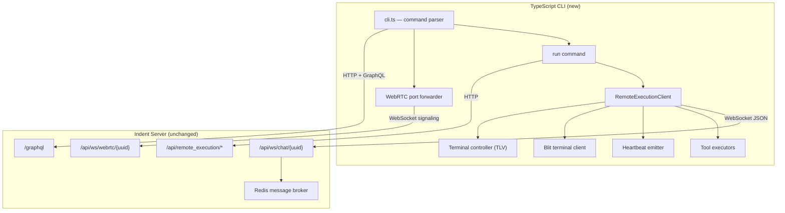
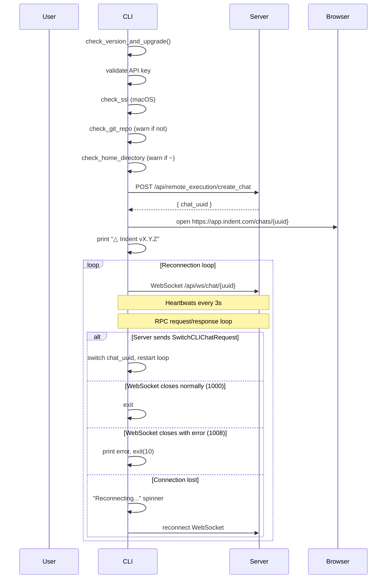
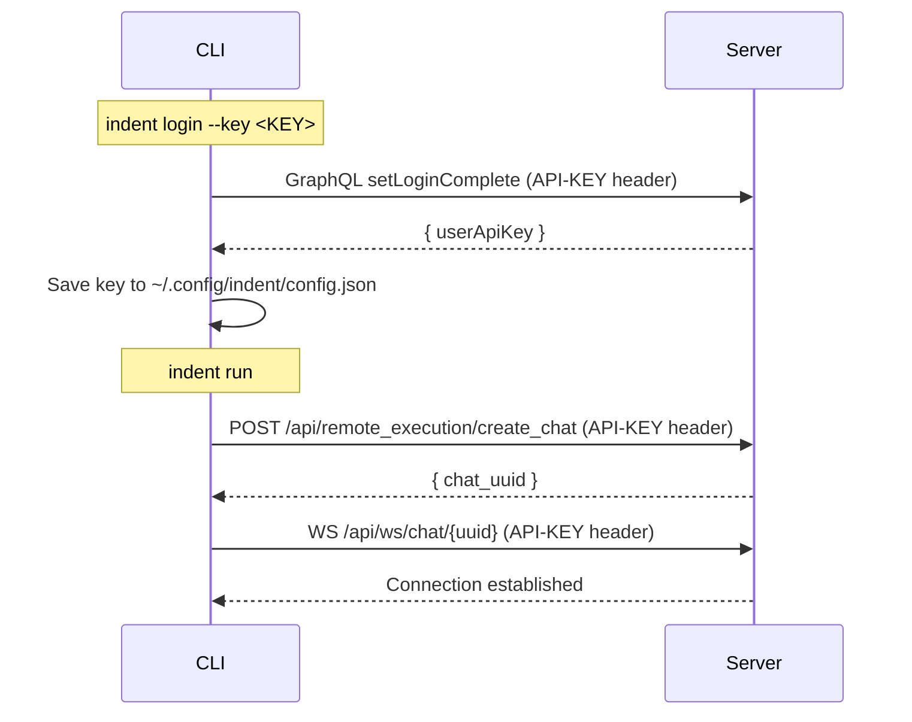
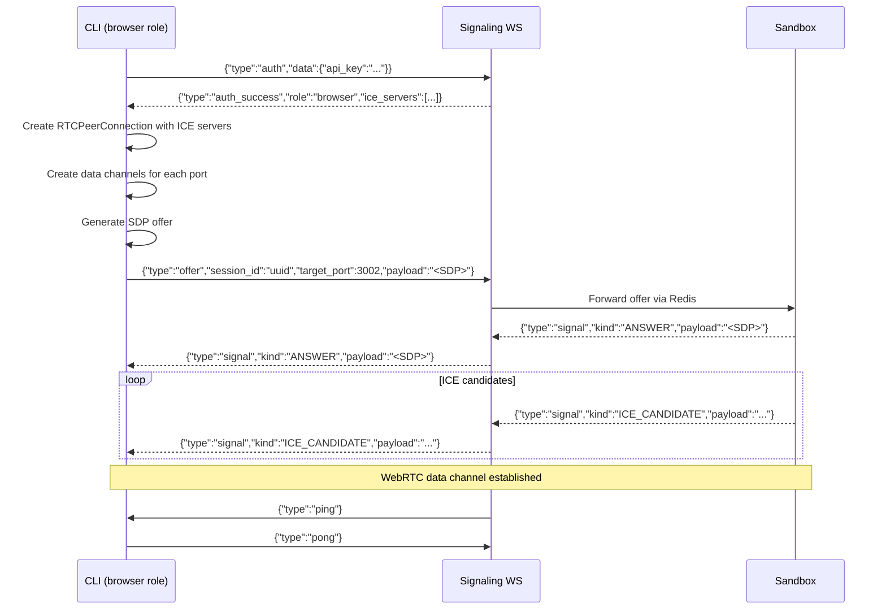

# Indent CLI — TypeScript Rewrite Specification

> **Status:** Draft
> **Source:** `python_modules/exponent/` in `indent-com/indent`
> **Target:** Replace the Python (Click + asyncio) CLI with a TypeScript implementation that is behaviorally identical.

---

## Table of Contents

- [1. Goals and Non-Goals](#1-goals-and-non-goals)
- [2. Architecture Overview](#2-architecture-overview)
- [3. Package Structure](#3-package-structure)
- [4. Command Tree](#4-command-tree)
- [5. Commands — Detailed Specification](#5-commands--detailed-specification)
  - [5.1 run (default)](#51-run-default)
  - [5.2 login](#52-login)
  - [5.3 config](#53-config)
  - [5.4 upgrade](#54-upgrade)
  - [5.5 checkout](#55-checkout)
  - [5.6 port-forward](#56-port-forward)
  - [5.7 Cloud Commands (hidden)](#57-cloud-commands-hidden)
  - [5.8 Debug/Diagnostic (hidden)](#58-debugdiagnostic-hidden)
- [6. Configuration System](#6-configuration-system)
  - [6.1 File Locations](#61-file-locations)
  - [6.2 Settings Resolution](#62-settings-resolution)
  - [6.3 Environment Selection](#63-environment-selection)
  - [6.4 Config File Schema](#64-config-file-schema)
- [7. Authentication](#7-authentication)
- [8. WebSocket RPC Protocol](#8-websocket-rpc-protocol)
  - [8.1 Connection Lifecycle](#81-connection-lifecycle)
  - [8.2 Frame Format](#82-frame-format)
  - [8.3 Message Types (CLI → Server)](#83-message-types-cli--server)
  - [8.4 Message Types (Server → CLI)](#84-message-types-server--cli)
  - [8.5 Heartbeat Protocol](#85-heartbeat-protocol)
  - [8.6 Idempotency](#86-idempotency)
  - [8.7 Reconnection](#87-reconnection)
- [9. RPC Tool System](#9-rpc-tool-system)
  - [9.1 Tool Input/Result Types](#91-tool-inputresult-types)
  - [9.2 Request Envelope](#92-request-envelope)
  - [9.3 Response Envelope](#93-response-envelope)
  - [9.4 Batch Execution](#94-batch-execution)
  - [9.5 Streaming Execution](#95-streaming-execution)
  - [9.6 Background Process Tracking](#96-background-process-tracking)
- [10. Terminal Management](#10-terminal-management)
  - [10.1 Blit Terminal Server](#101-blit-terminal-server)
  - [10.2 Terminal Controller (TLV Protocol)](#102-terminal-controller-tlv-protocol)
- [11. REST API Endpoints](#11-rest-api-endpoints)
- [12. GraphQL Operations](#12-graphql-operations)
- [13. WebRTC Port Forwarding](#13-webrtc-port-forwarding)
  - [13.1 Signaling Protocol](#131-signaling-protocol)
  - [13.2 Data Channel Bridge](#132-data-channel-bridge)
- [14. UI and Output](#14-ui-and-output)
- [15. Environment Variables](#15-environment-variables)
- [16. TypeScript Interfaces](#16-typescript-interfaces)
- [17. Dependency Strategy](#17-dependency-strategy)
- [18. Build, Distribution, and Compilation](#18-build-distribution-and-compilation)
- [19. Testing Strategy](#19-testing-strategy)
- [20. Migration Plan](#20-migration-plan)

---

## 1. Goals and Non-Goals

### Goals

- **Behavioral parity** with the Python CLI — identical command surface, RPC protocol, heartbeat behavior, and user-facing output.
- **Single self-contained binary** — compiled to a standalone executable (no Python/Node.js runtime required for end users).
- **Cross-platform** — Linux, macOS, Windows.
- **Faster startup** — eliminate Python interpreter overhead and pip dependency resolution.

### Non-Goals

- Reimplementing server-side components (the RPC server, message broker, WebSocket handler stay in Python — though server-side changes to support the new CLI are in scope).
- Blind wire-level compatibility — the server is allowed to know it's talking to the TypeScript CLI. The protocol can evolve; this is a clean room rewrite, not a shim.
- **SSH helper is explicitly out of scope.** The `indent-ssh-helper` binary (SSH-over-WebRTC) will not be ported. If SSH access to sandboxes is needed in the future, it should be redesigned as a feature of blit rather than a standalone binary.

---

## 2. Architecture Overview



The `RemoteExecutionClient` is the heart of the CLI. It maintains a persistent WebSocket connection to the server, multiplexing async channels: incoming requests, outgoing results, and heartbeats. Terminal management is fully delegated to blit via Unix socket.

---

## 3. Package Structure

```
indent-cli-ts/
├── src/
│   ├── index.ts                    # Entry point: parse args, dispatch
│   ├── cli.ts                      # Command/flag definitions
│   ├── commands/
│   │   ├── run.ts                  # run (default command)
│   │   ├── login.ts                # login
│   │   ├── config.ts               # config
│   │   ├── upgrade.ts              # upgrade
│   │   ├── checkout.ts             # checkout (hidden)
│   │   ├── cloud.ts                # list-repos, create-chat (hidden)
│   │   ├── port-forward.ts         # port-forward
│   │   └── debug.ts                # debug, get-chats, etc. (hidden)
│   ├── client/
│   │   ├── remote-execution.ts     # RemoteExecutionClient
│   │   ├── session.ts              # HTTP client session
│   │   ├── connection-tracker.ts   # ConnectionTracker
│   │   └── ws-connect.ts           # WebSocket connect with backoff
│   ├── rpc/
│   │   ├── types.ts                # All RPC request/response types (msgspec → zod/ts)
│   │   ├── tool-execution.ts       # Tool dispatch and execution
│   │   ├── tools/
│   │   │   ├── bash.ts             # Bash tool executor
│   │   │   ├── read.ts             # Read tool executor
│   │   │   ├── write.ts            # Write tool executor
│   │   │   ├── edit.ts             # Edit tool executor
│   │   │   ├── glob.ts             # Glob tool executor
│   │   │   ├── grep.ts             # Grep tool executor
│   │   │   ├── apply-patch.ts      # Patch tool executor
│   │   │   ├── artifacts.ts        # Upload/download/store artifact tools
│   │   │   └── http-fetch.ts       # HTTP content fetch tool
│   │   ├── streaming.ts            # Streaming code execution
│   │   └── background-tracker.ts   # Background process tracking
│   ├── terminal/
│   │   ├── blit-client.ts          # Blit terminal server client (all PTY via blit)
│   │   └── controller.ts           # TLV terminal controller server
│   ├── graphql/
│   │   ├── client.ts               # GraphQL client
│   │   └── operations.ts           # Query/mutation strings
│   ├── webrtc/
│   │   ├── port-forward.ts         # Port forwarding logic
│   │   └── signaling.ts            # Signaling protocol
│   ├── config.ts                   # Settings, config file I/O
│   ├── version.ts                  # Version check, auto-upgrade
│   ├── system-context.ts           # System info collector
│   ├── files.ts                    # File walk, glob, grep
│   ├── git.ts                      # Git info, .gitignore
│   └── ui.ts                       # Spinner, colors, formatting
├── package.json
├── tsconfig.json
└── vitest.config.ts
```

---

## 4. Command Tree

```
indent [options] [command]

  run              [default] Start or reconnect to an Indent session
                   --chat-id <uuid>          Reconnect to existing chat
                   --prompt <text>           Start with initial prompt
                   --workflow-id <id>        (hidden) Run a workflow
                   --timeout-seconds <n>     Inactivity timeout (env: INDENT_TIMEOUT_SECONDS)

  login            Log in to Indent
                   --key <api-key>           API key (or opens browser)

  config           View/modify CLI configuration (hidden)
                   --set-git-warning-disabled / --set-git-warning-enabled
                   --set-auto-upgrade-enabled / --set-auto-upgrade-disabled
                   --set-base-api-url-override <url> (hidden)
                   --set-base-ws-url-override <url> (hidden)
                   --clear-base-api-url-override (hidden)
                   --clear-base-ws-url-override (hidden)
                   --set-use-default-colors / --clear-use-default-colors

  upgrade          Upgrade Indent CLI to latest version
                   --force                   Skip confirmation

  checkout         Checkout a PR from a cloud chat (hidden)
                   [chat-id]                 Optional chat UUID
                   -l, --live                Live-sync mode
                   --poll-interval <sec>     Polling interval for live sync

  port-forward     Forward local ports to a cloud sandbox (hidden)
                   <chat-uuid>               Chat to forward to
                   <ports...>                Port specs: 3002, 8000:8080, 2222:/tmp/sock

  list-repos       List GitHub repositories (hidden)
  create-chat      Create a cloud chat from a repository (hidden)
                   --org-name <name>
                   --repo-name <name>
                   --prompt <text>

  debug            Print diagnostic information (hidden)
  get-chats        List organization chats (hidden)
  get-authenticated-user  Show current user (hidden)
  refresh-key      Refresh API key (hidden)
  hidden           Show all commands including hidden ones (hidden)

Global hidden flags (via @use_settings decorator):
  --prod           Force production environment
  --staging        Force staging environment
  --shadow-prod    Shadow production mode
```

When `indent` is invoked with no subcommand, it dispatches to `run`.

---

## 5. Commands — Detailed Specification

### 5.1 run (default)

The primary command. Starts or reconnects to an Indent AI chat session.

**Flow:**



**Key behaviors:**

- Does NOT open browser if: inside SSH session (`SSH_TTY`/`SSH_CONNECTION` set), `--workflow-id` provided, or `--chat-id` provided.
- Connection tracker: shows spinner if connection takes >5 seconds, prints `✓ Ready in X.XXs` on connect, `✓ Reconnected` on reconnect.
- Signal handling: SIGINT, SIGTERM, SIGQUIT → graceful shutdown, cancel all tasks, exit(130).
- The WebSocket connection uses exponential backoff: initial 0.1s, multiply by 1.5, cap at 2s, first retry at 0.5s.
- On Linux, configures TCP keepalive: `TCP_KEEPIDLE=5`, `TCP_KEEPINTVL=3`, `TCP_KEEPCNT=3`, `TCP_USER_TIMEOUT=14000`.
- 10 concurrent executor workers process incoming RPC requests in parallel.
- Heartbeat task runs every 3 seconds.

### 5.2 login

```
indent login [--key <API_KEY>]
```

**With `--key`:**

1. Call `setLoginComplete` GraphQL mutation to verify the key.
2. Save key to `~/.config/indent/config.json`.
3. Print success.

**Without `--key`:**

- If in SSH session: print "Use `indent login --key <API_KEY>`" with instructions.
- Otherwise: open `{base_url}/settings` in browser.

### 5.3 config

Hidden command. When invoked with no flags, dumps current config as JSON. Otherwise applies the specified setting.

Settings are persisted to `~/.config/indent/config.json` under the `options` key.

### 5.4 upgrade

```
indent upgrade [--force]
```

1. Fetch latest version from PyPI (`https://pypi.org/pypi/indent/json`).
   - **TypeScript rewrite:** replace with own release channel (GitHub Releases or similar).
2. Compare with installed version.
3. If newer: show diff, confirm (unless `--force`), download and replace binary.

**Auto-upgrade:** when `auto_upgrade` is enabled in settings, a background upgrade check runs at the end of each `indent run` invocation.

### 5.5 checkout

Hidden command. Checks out a PR branch from a cloud Indent chat.

**Flow:**

1. Fetch user's chats via `Chats` GraphQL query.
2. Collect open PRs from chats (filters by `PullRequestStatusType.OPEN`).
3. Interactive selection via `questionary.select`-style prompt.
4. Validate `gh` CLI is installed.
5. Warn about local changes, ask confirmation.
6. `gh pr checkout <number> --force`.

**Live sync (`-l`):** polls for remote changes every `--poll-interval` seconds, auto-pulls when remote HEAD changes.

### 5.6 port-forward

Hidden command. Forwards local TCP ports to a cloud sandbox via WebRTC.

**Port spec format:**

| Format           | Meaning                                             |
| ---------------- | --------------------------------------------------- |
| `3002`           | Forward local:3002 → remote:3002 (TCP)              |
| `8000:8080`      | Forward local:8000 → remote:8080 (TCP)              |
| `2222:/tmp/sock` | Forward local:2222 → remote Unix socket `/tmp/sock` |

See [WebRTC Port Forwarding](#13-webrtc-port-forwarding) for protocol details.

### 5.7 Cloud Commands (hidden)

**`list-repos`:** Calls `GithubRepositories` GraphQL query, prints repository list.

**`create-chat`:** Interactive flow — select org → select repo → `CreateCloudChatFromRepository` mutation → optionally send initial prompt via `StartChatTurn` → open browser.

### 5.8 Debug/Diagnostic (hidden)

**`debug`:** Prints settings, version, Python path (→ runtime path), installer info, metadata.

**`get-chats`:** Lists chats via `Chats` GraphQL query.

**`get-authenticated-user`:** Calls `CurrentUser` GraphQL query.

**`refresh-key`:** Calls `RefreshApiKey` mutation, saves new key.

---

## 6. Configuration System

### 6.1 File Locations

| Path                                    | Purpose                         | Override      |
| --------------------------------------- | ------------------------------- | ------------- |
| `~/.config/indent/config.json`          | Settings (API keys, options)    | —             |
| `~/.indent/`                            | Data directory (chat artifacts) | `INDENT_HOME` |
| `~/.indent/chats/{uuid}/`               | Per-chat directory              | —             |
| `~/.indent/chats/{uuid}/bash_results/`  | Bash output files               | —             |
| `~/.indent/chats/{uuid}/query_results/` | Query result files              | —             |
| `~/.indent/chats/{uuid}/artifacts/`     | Generated artifacts             | —             |
| `~/.indent/chats/{uuid}/user_uploads/`  | User-uploaded files             | —             |

### 6.2 Settings Resolution

Priority (highest first):

1. Environment variables (prefix `EXPONENT_`)
2. JSON config file (`~/.config/indent/config.json`)
3. Defaults

### 6.3 Environment Selection

| Environment   | `base_url`                       | `base_api_url`                   | `base_ws_url`                     |
| ------------- | -------------------------------- | -------------------------------- | --------------------------------- |
| `development` | `http://localhost:3000`          | `http://localhost:8000`          | `ws://localhost:8000`             |
| `staging`     | `https://app.staging.indent.com` | `https://staging-api.indent.com` | `wss://ws-staging-api.indent.com` |
| `production`  | `https://app.indent.com`         | `https://api.indent.com`         | `wss://ws-api.indent.com`         |

Overridable via `options.base_api_url_override` and `options.base_ws_url_override` in config.

### 6.4 Config File Schema

```jsonc
{
  "exponent_api_key": "uuid-string", // Production API key
  "extra_exponent_api_keys": {
    // Per-environment keys
    "development": "uuid-string",
    "staging": "uuid-string",
  },
  "options": {
    "git_warning_disabled": false,
    "auto_upgrade": true,
    "base_api_url_override": null, // string | null
    "base_ws_url_override": null, // string | null
    "use_default_colors": false,
  },
}
```

---

## 7. Authentication

### API Key Authentication

The CLI authenticates using a user-scoped UUID API key. The key is sent as:

- **HTTP requests:** `API-KEY` header
- **GraphQL HTTP:** `API-KEY` header
- **GraphQL WebSocket:** `connectionParams.apiKey`
- **WebSocket (chat):** `API-KEY` header (on initial HTTP upgrade)
- **WebSocket (first-message auth, sandbox mode):** `{"type": "auth", "data": {"api_key": "...", "token": "..."}}`

### Auth Flow



### Server-side Auth (for reference)

The server accepts these credential types (tried in order):

1. Chat-scoped API key (`chat_api_key` on the chat record)
2. Preload sandbox API key
3. User API key (from `API-KEY` / `x-api-key` header)
4. WorkOS JWT bearer token

The CLI exclusively uses user API keys.

---

## 8. WebSocket RPC Protocol

### 8.1 Connection Lifecycle

```
CLI                                     Server
 |                                        |
 |-- WS /api/ws/chat/{chat_uuid} ------->|  (API-KEY header)
 |                                        |
 |<------ auth_success (if first-msg) ----|  (sandbox mode only)
 |                                        |
 |-- {"type":"heartbeat","data":{...}} -->|  (every 3s)
 |                                        |
 |<-- {"type":"request","data":{...}} ----|  (server sends RPC request)
 |-- {"type":"result","data":{...}} ----->|  (CLI sends result)
 |                                        |
 |<-- close(1000) -----------------------|  (graceful disconnect)
 |<-- close(1008, reason) ---------------|  (auth error / forced disconnect)
```

### 8.2 Frame Format

All messages are JSON text frames over WebSocket. Every frame has the shape:

```typescript
{
  type: "request" |
    "result" |
    "heartbeat" |
    "background_process_completed" |
    "auth" |
    "auth_success" |
    "auth_failed";
  data: object;
}
```

### 8.3 Message Types (CLI → Server)

| `type`                           | `data` shape                             | When                                                   |
| -------------------------------- | ---------------------------------------- | ------------------------------------------------------ |
| `"heartbeat"`                    | `HeartbeatInfo`                          | Every 3 seconds                                        |
| `"result"`                       | `CliRpcResponse`                         | After executing a request                              |
| `"background_process_completed"` | `BackgroundProcessCompletedNotification` | When a background bash process exits                   |
| `"request"`                      | `CliRpcRequest`                          | Only for `GenerateUploadUrlRequest` (client-initiated) |

### 8.4 Message Types (Server → CLI)

| `type`      | `data` shape     | Purpose                                                |
| ----------- | ---------------- | ------------------------------------------------------ |
| `"request"` | `CliRpcRequest`  | Server asks CLI to execute a tool                      |
| `"result"`  | `CliRpcResponse` | Response to client-initiated request (e.g. upload URL) |

### 8.5 Heartbeat Protocol

Every 3 seconds, the CLI sends:

```json
{
  "type": "heartbeat",
  "data": {
    "exponent_version": "1.2.3",
    "editable_installation": false,
    "system_info": {
      "name": "alice",
      "cwd": "/home/alice/project",
      "os": "Linux 6.1.0",
      "shell": "/bin/bash",
      "git": {
        "branch": "main",
        "remote": "https://github.com/org/repo.git"
      },
      "python_env": {
        "interpreter": "/usr/bin/python3",
        "version": "3.12.4",
        "provider": "system"
      },
      "port_usage": [
        {
          "process_name": "node",
          "port": 3000,
          "protocol": "tcp",
          "pid": 12345,
          "uptime": 3600
        }
      ]
    },
    "timestamp": "2025-01-01T00:00:00Z",
    "cli_uuid": "uuid-v4",
    "config_dir": "/home/alice/.indent"
  }
}
```

**Server-side behavior:**

- Stores in Redis with 24h TTL (`heartbeat:{chat_uuid}` key).
- If a different `cli_uuid` sent a heartbeat within the last 18 seconds → conflict, server returns `False` → CLI disconnects (another CLI took over).
- Server has a configurable heartbeat timeout; if no heartbeat arrives within the timeout, the CLI is considered disconnected.

### 8.6 Idempotency

Requests may carry an `idempotency_key` field. The CLI must:

1. Track all executed idempotency keys in a `Set<string>`.
2. If a request arrives with an already-seen key, skip execution silently.
3. This prevents duplicate work when the server retries after a transient disconnect.

### 8.7 Reconnection

The WebSocket connection uses exponential backoff via `websockets` library's built-in reconnect:

| Parameter          | Value  |
| ------------------ | ------ |
| Initial delay      | `0.1s` |
| First retry delay  | `0.5s` |
| Backoff multiplier | `1.5`  |
| Maximum delay      | `2s`   |
| Ping timeout       | `10s`  |
| Open timeout       | `10s`  |

On reconnect, the CLI resumes sending heartbeats and processing requests. The connection tracker emits disconnect/reconnect events for UI updates.

---

## 9. RPC Tool System

### 9.1 Tool Input/Result Types

All types are tagged unions using `tool_name` as the discriminator field.

| `tool_name`           | Input Type                  | Result Type                                  | Description             |
| --------------------- | --------------------------- | -------------------------------------------- | ----------------------- |
| `"bash"`              | `BashToolInput`             | `BashToolResult`                             | Execute shell command   |
| `"read"`              | `ReadToolInput`             | `ReadToolResult` or `ReadToolArtifactResult` | Read file content       |
| `"write"`             | `WriteToolInput`            | `WriteToolResult`                            | Write file              |
| `"edit"`              | `EditToolInput`             | `EditToolResult`                             | Search-and-replace edit |
| `"glob"`              | `GlobToolInput`             | `GlobToolResult`                             | Find files by pattern   |
| `"grep"`              | `GrepToolInput`             | `GrepToolResult`                             | Search file contents    |
| `"apply_patch"`       | `ApplyPatchToolInput`       | `ApplyPatchToolResult`                       | Apply unified diff      |
| `"download_artifact"` | `DownloadArtifactToolInput` | `DownloadArtifactToolResult`                 | Download from S3        |
| `"upload_artifact"`   | `UploadArtifactToolInput`   | `UploadArtifactToolResult`                   | Upload to S3            |
| `"store_artifact"`    | `StoreArtifactToolInput`    | `StoreArtifactToolResult`                    | Store artifact locally  |
| `"error"`             | —                           | `ErrorToolResult`                            | Error response          |

**Key fields per tool:**

```typescript
// BashToolInput
{
  tool_name: "bash";
  command: string;
  timeout: number; // seconds
  description: string;
  background: boolean;
  bash_id: string; // 8-char random ID
  agent_cli: boolean; // true for agent-initiated bash
  is_read_only: boolean;
}

// BashToolResult
{
  tool_name: "bash";
  output: string;
  duration_ms: number;
  exit_code: number;
  timed_out: boolean;
  stopped_by_user: boolean;
  pid: number | null;
  output_file: string; // path to output file
  bash_id: string;
}

// ReadToolInput
{
  tool_name: "read";
  file_path: string;
  offset: number | null; // line offset
  limit: number | null; // line limit
  character_limit: number | null;
  max_file_size_bytes: number | null;
}

// EditToolInput
{
  tool_name: "edit";
  file_path: string;
  old_string: string;
  new_string: string;
  replace_all: boolean;
  old_string_end: string | null;
  last_known_modified_timestamp: number | null;
}

// GrepToolInput
{
  tool_name: "grep";
  pattern: string;
  path: string | null;
  include: string | null; // file pattern filter
  multiline: boolean;
}

// GlobToolInput
{
  tool_name: "glob";
  pattern: string;
  path: string | null;
}
```

### 9.2 Request Envelope

```typescript
interface CliRpcRequest {
  request_id: string;
  request:
    | ToolExecutionRequest // { tool_input: ToolInput }
    | BatchToolExecutionRequest // { tool_inputs: ToolInput[] }
    | GetAllFilesRequest
    | TerminateRequest
    | SwitchCLIChatRequest // { new_chat_uuid: string }
    | HttpRequest // { url, method, headers, timeout }
    | GenerateUploadUrlRequest // { s3_key, content_type }
    | DownloadFromUrlRequest // { url, file_path, timeout }
    | StartBlitTerminalRequest
    | TerminalInputRequest
    | TerminalResizeRequest
    | StopTerminalRequest
    | ListTerminalsRequest
    | StreamingCodeExecutionRequest;
  idempotency_key: string | null;
}
```

Each variant is tagged with a `tag` field for deserialization (matching Python's `msgspec.Struct` tag behavior).

### 9.3 Response Envelope

```typescript
interface CliRpcResponse {
  request_id: string;
  response:
    | ToolExecutionResponse // { tool_result: ToolResult }
    | BatchToolExecutionResponse // { tool_results: ToolResult[] }
    | GetAllFilesResponse // { files: string[] }
    | ErrorResponse // { error_message: string }
    | TimeoutResponse
    | TerminateResponse
    | SwitchCLIChatResponse
    | HttpResponse
    | GenerateUploadUrlResponse // { upload_url, s3_uri }
    | DownloadFromUrlResponse
    | StartBlitTerminalResponse
    | TerminalInputResponse
    | TerminalResizeResponse
    | StopTerminalResponse
    | ListTerminalsResponse
    | StreamingCodeExecutionResponseChunk
    | StreamingCodeExecutionResponse
    | StreamingErrorResponse;
}
```

### 9.4 Batch Execution

`BatchToolExecutionRequest` contains `tool_inputs: ToolInput[]`. The CLI executes all tools concurrently (via `Promise.all` / parallel async) and returns `BatchToolExecutionResponse` with results in the same order.

### 9.5 Streaming Execution

For `StreamingCodeExecutionRequest`:

```typescript
{
  tag: "streaming_code_execution";
  correlation_id: string;
  language: "shell" | "python";
  content: string; // command/code to execute
  timeout: number; // seconds
}
```

The CLI sends multiple `CliRpcResponse` frames for a single request:

1. **Chunks:** `StreamingCodeExecutionResponseChunk` — partial output as it arrives.
2. **Final:** `StreamingCodeExecutionResponse` — complete output with exit code.
3. **Error:** `StreamingErrorResponse` — if execution fails.

### 9.6 Background Process Tracking

When `BashToolInput.background = true`:

1. The CLI spawns the process detached.
2. Returns `BashToolResult` immediately with the `pid` and `output_file` path.
3. A `BackgroundProcessTracker` monitors the process.
4. When the process exits, the CLI sends:

```json
{
  "type": "background_process_completed",
  "data": {
    "pid": 12345,
    "command": "npm run build",
    "exit_code": 0,
    "output": "...",
    "output_file": "/home/user/.indent/chats/.../bash_results/abc123.txt",
    "correlation_id": "uuid",
    "truncated": false,
    "duration_ms": 5000
  }
}
```

---

## 10. Terminal Management

All terminal/PTY management is handled exclusively through blit. There is no legacy `node-pty` / `os.openpty()` path — blit is the sole PTY backend.

### 10.1 Blit Terminal Server

The CLI delegates all terminal creation and management to the blit server process. Communicates via Unix socket using the blit binary protocol:

- Socket path resolution: `INDENT_TERMINAL_CONTROLLER_BLIT_SOCKET` → `$TMPDIR/blit.sock` → `$XDG_RUNTIME_DIR/blit.sock` → `/tmp/blit-{user}.sock`
- Auto-spawns `blit-server` if no existing socket found.
- Uses `C2S_CREATE` (opcode `0x10`) with `[rows:2][cols:2][tag_len:2][tag:N]` layout.
- Parses `S2C_CREATED` (opcode `0x01`) response to get `pty_id`.

**Request type:** `StartBlitTerminalRequest { command, tag, cols, rows }`
**Response type:** `StartBlitTerminalResponse { success, pty_id, error_message }`

### 10.2 Terminal Controller (TLV Protocol)

When `INDENT_TERMINAL_CONTROLLER_SOCKET` is set, the CLI starts a Unix socket server that the Indent desktop app connects to for live terminal viewing.

**TLV wire format:** `[tag:4 LE][length:4 LE][value:length]`

| Tag  | Name                 | Direction | Description                |
| ---- | -------------------- | --------- | -------------------------- |
| `0`  | `SYNC_COMPLETE`      | S→C       | Initial state burst done   |
| `1`  | `TERMINAL_STATE`     | S→C       | Full terminal state        |
| `2`  | `TERMINAL_SNAPSHOT`  | S→C       | Terminal snapshot          |
| `3`  | `TERMINAL_STREAM`    | S→C       | Terminal output stream     |
| `4`  | `START_STREAMING`    | C→S       | Start streaming a terminal |
| `5`  | `STOP_STREAMING`     | C→S       | Stop streaming a terminal  |
| `6`  | `BG_TERMINAL_STATE`  | S→C       | Background terminal state  |
| `7`  | `TERMINAL_INPUT`     | C→S       | Send input to terminal     |
| `8`  | `TERMINAL_RESIZE`    | C→S       | Resize terminal            |
| `9`  | `START_TERMINAL`     | C→S       | Start a new terminal       |
| `11` | `TERMINAL_CELL_DIFF` | S→C       | Incremental cell diff      |
| `12` | `TERMINAL_CELLS`     | S→C       | Full cell contents         |
| `13` | `TERMINAL_SCROLL`    | C→S       | Scroll request             |
| `14` | `TERMINAL_CLEAR`     | C→S       | Clear terminal             |

Uses `vt100wasm.Screen` for terminal emulation with scrollback. Output debounced at 250fps (4ms). Supports DEC synchronized update mode.

---

## 11. REST API Endpoints

| Method | Path                                | Auth    | Request                | Response                | Purpose             |
| ------ | ----------------------------------- | ------- | ---------------------- | ----------------------- | ------------------- |
| `POST` | `/api/remote_execution/create_chat` | API key | `?chat_source=cli_run` | `{ chat_uuid: string }` | Create new CLI chat |
| `POST` | `/api/remote_execution/log_error`   | API key | `CLIErrorLog` body     | —                       | Report CLI errors   |

### `CLIErrorLog` body:

```typescript
{
  event_data: string;
  timestamp: string; // ISO 8601
  attachment_data: string | null;
  version: string | null;
  chat_uuid: string | null;
}
```

---

## 12. GraphQL Operations

All GraphQL is sent to `{base_api_url}/graphql` with the `API-KEY` header.

| Operation                       | Type     | Used By                                | Key Input            | Key Output             |
| ------------------------------- | -------- | -------------------------------------- | -------------------- | ---------------------- |
| `SetLoginComplete`              | Mutation | `login`                                | —                    | `userApiKey`           |
| `RefreshApiKey`                 | Mutation | `refresh-key`                          | —                    | `userApiKey`           |
| `CurrentUser`                   | Query    | `get-authenticated-user`               | —                    | `uuid`                 |
| `Chats`                         | Query    | `get-chats`, `checkout`                | `userUuids`          | Chat list with PR info |
| `GithubRepositories`            | Query    | `list-repos`, `create-chat`            | —                    | Repository list        |
| `CreateCloudChatFromRepository` | Mutation | `create-chat`                          | `repositoryUuid`     | `chatUuid`             |
| `StartChatTurn`                 | Mutation | `run --prompt`, `create-chat --prompt` | `chatUuid`, `prompt` | Chat object            |
| `HaltChatStream`                | Mutation | (server-side, for reference)           | `chatUuid`           | Chat object            |

### StartChatTurn Input Shape (key fields):

```typescript
{
  chatInput: {
    promptInput: {
      message: string;
      attachments: Attachment[];
    } | null;
    timezone: string | null;
  };
  chatConfig: {
    chatUuid: string;
    model: string | null;
    requireConfirmation: boolean;
    depthLimit: number;
    reasoningLevel: string | null;
  };
}
```

---

## 13. WebRTC Port Forwarding

### 13.1 Signaling Protocol

Signaling happens over `WS /api/ws/webrtc/{chat_uuid}`.



**ICE servers:** fetched from Cloudflare TURN API, returned in the `auth_success` message.

### 13.2 Data Channel Bridge

Each port mapping creates a data channel labeled:

- TCP: `tcp:{remote_port}` (protocol: `bridge-v1`)
- Unix socket: `unix:{remote_path}` (protocol: `bridge-v1`)

When a local TCP connection is accepted:

1. Open a new data channel for the connection.
2. Sandbox opens connection to the target port/socket.
3. Sandbox sends `0x00` byte = success, `0x01` = error.
4. Bridge bidirectionally: TCP socket ↔ data channel.

### 13.3 SSH Helper — Dropped

The Python CLI's `indent-ssh-helper` binary (SSH-over-WebRTC) is **explicitly not included** in the TypeScript rewrite. It will not be ported, wrapped, or reimplemented. If SSH access to cloud sandboxes is needed in the future, it should be designed as a blit feature rather than a standalone binary.

---

## 14. UI and Output

### Startup Banner

```
△ Indent v1.2.3
https://app.indent.com/chats/{uuid}
bash in ~/project
```

- Triangle `△` in purple RGB `(180, 150, 255)`.
- URL in blue RGB `(100, 200, 255)`.
- Shows shell name and current directory.

### Connection States

| State                      | Output                                                               |
| -------------------------- | -------------------------------------------------------------------- |
| Connected quickly (<5s)    | `✓ Ready in 1.23s` (green ✓)                                         |
| Slow connect (>5s)         | Spinner → `✓ Ready in 7.45s`                                         |
| Disconnected               | `Disconnected...` → Spinner `Reconnecting...`                        |
| Reconnected                | `✓ Reconnected` (bold green, clears after 1s)                        |
| Interrupt (SIGINT)         | `Received interrupt signal, shutting down gracefully...` → exit(130) |
| Auth error (WS 1008)       | `Error: <reason>` → exit(10)                                         |
| Clean disconnect (WS 1000) | `Disconnected upon user request, shutting down...`                   |
| Chat switch                | `Switching chats...`                                                 |

### Spinner

Braille character animation: `⣷⣯⣟⡿⢿⣻⣽⣾` at 10 frames/second, with configurable RGB color.

### Interactive Prompts

- **`questionary.autocomplete`** — used for strategy selection (autocomplete with fuzzy matching).
- **`questionary.select`** — used for PR checkout selection (numbered list with arrow keys).
- **`click.confirm`** — used for upgrade confirmation, destructive operations.

---

## 15. Environment Variables

| Variable                                 | Default      | Purpose                             |
| ---------------------------------------- | ------------ | ----------------------------------- |
| `EXPONENT_API_KEY`                       | —            | Override API key                    |
| `EXPONENT_LOG_LEVEL`                     | —            | Set log level                       |
| `EXPONENT_TEST_AUTO_UPGRADE`             | —            | Force test upgrade path             |
| `ENVIRONMENT`                            | `production` | Set environment                     |
| `INDENT_HOME`                            | `~/.indent`  | Data directory                      |
| `INDENT_TIMEOUT_SECONDS`                 | —            | Inactivity timeout for `run`        |
| `INDENT_TERMINAL_CONTROLLER_SOCKET`      | —            | TLV terminal controller socket path |
| `INDENT_TERMINAL_CONTROLLER_BLIT_SOCKET` | —            | Blit server socket path             |

| `SSH_TTY` | — | Detect SSH session (read-only) |
| `SSH_CONNECTION` | — | Detect SSH session (read-only) |
| `SHELL` | `/bin/sh` | User's shell |
| `TMPDIR` | `/tmp` | Blit socket path fallback |
| `XDG_RUNTIME_DIR` | — | Blit socket path fallback |
| `USER` | — | Blit socket path fallback |

---

## 16. TypeScript Interfaces

### Core Client

```typescript
interface RemoteExecutionClient {
  runConnection(
    chatUuid: string,
    connectionTracker?: ConnectionTracker,
    timeoutSeconds?: number,
    terminalControllerSocketPath?: string,
  ): Promise<ExitInfo>;
}

type ExitInfo = WSDisconnected | SwitchCLIChat;

interface WSDisconnected {
  type: "ws_disconnected";
  errorMessage?: string;
}

interface SwitchCLIChat {
  type: "switch_cli_chat";
  newChatUuid: string;
}
```

### Connection Tracker

```typescript
interface ConnectionTracker {
  setConnected(connected: boolean): Promise<void>;
  nextChange(): Promise<boolean>; // true = connected, false = disconnected
  waitForReconnection(): Promise<void>;
}
```

### Session

```typescript
interface RemoteExecutionClientSession {
  chatUuid: string | null;
  workingDirectory: string;
  apiClient: HttpClient; // base_api_url, API-KEY header
  wsClient: HttpClient; // base_ws_url, API-KEY header

  setChatUuid(uuid: string): void;
}
```

### Heartbeat

```typescript
interface HeartbeatInfo {
  exponent_version: string | null;
  editable_installation: boolean;
  system_info: SystemInfo | null;
  timestamp: string; // ISO 8601
  timestamp_received: string | null;
  cli_uuid: string;
  config_dir: string;
}

interface SystemInfo {
  name: string; // username
  cwd: string;
  os: string;
  shell: string;
  git: { branch: string; remote: string } | null;
  python_env: { interpreter: string; version: string; provider: string } | null;
  port_usage: PortInfo[];
}

interface PortInfo {
  process_name: string;
  port: number;
  protocol: string;
  pid: number;
  uptime: number; // seconds
}
```

### Terminal

```typescript
interface TerminalInfo {
  session_id: string;
  name: string;
  status: "running" | "exited";
  exit_code: number | null;
}

interface TerminalMessage {
  session_id: string;
  type: "output" | "exit" | "error";
  data: string;
  exit_code?: number;
}
```

### File Metadata

```typescript
interface FileMetadata {
  modified_timestamp: number; // Unix epoch float
  file_mode: string; // e.g. "-rw-r--r--"
}
```

---

## 17. Dependency Strategy

### Runtime Dependencies

| Package                                | Purpose              | Notes                               |
| -------------------------------------- | -------------------- | ----------------------------------- |
| `commander` or `clipanion`             | CLI argument parsing | Match Click's behavior              |
| `ws`                                   | WebSocket client     | Match `websockets` library          |
| `glob` / `fast-glob`                   | File globbing        | Replace Python `glob`               |
| `@aspect-build/ripgrep` or native      | Grep                 | Replace `python-ripgrep`            |
| `msgspec`-compatible serializer        | RPC serialization    | Match `msgspec.Struct` tag behavior |
| `graphql-request`                      | GraphQL client       | Replace `gql[httpx]`                |
| `@aspect-build/inquirer` or `inquirer` | Interactive prompts  | Replace `questionary`               |
| `node-datachannel` or `wrtc`           | WebRTC               | Replace `aiortc`                    |
| `xterm-headless` or `vt100wasm`        | Terminal emulation   | Replace `vt100wasm`                 |

### Build Dependencies

| Package                  | Purpose                  |
| ------------------------ | ------------------------ |
| `typescript`             | Type checking            |
| `esbuild` or `bun build` | Bundling                 |
| `vitest`                 | Testing                  |
| `@types/node`            | Node.js type definitions |

### Avoided

- No `psutil` equivalent needed at startup — use Node.js `os` module + `child_process` for port scanning.
- No `pygit2` — use `simple-git` or shell out to `git`.
- No `beautifulsoup4` — use `cheerio` if HTML parsing is needed.
- No `sentry-sdk` — use `@sentry/node`.

---

## 18. Build, Distribution, and Compilation

### Single Executable

**Recommendation:** Bun compile (`bun build --compile`). Alternatives: Node.js SEA, `pkg`.

### Build Matrix

| Platform       | Target             | Binary Name  |
| -------------- | ------------------ | ------------ |
| Linux x86_64   | `bun-linux-x64`    | `indent`     |
| Linux aarch64  | `bun-linux-arm64`  | `indent`     |
| macOS x86_64   | `bun-darwin-x64`   | `indent`     |
| macOS aarch64  | `bun-darwin-arm64` | `indent`     |
| Windows x86_64 | `bun-windows-x64`  | `indent.exe` |

### Distribution

| Channel         | Method                                               |
| --------------- | ---------------------------------------------------- |
| PyPI (current)  | Continue publishing Python package during transition |
| GitHub Releases | Standalone binaries per platform                     |
| npm             | `@indent-com/cli` for `npx indent`                   |
| Homebrew        | Formula or tap                                       |
| curl installer  | Shell script: `curl -sf https://install.indent.com`  |

---

## 19. Testing Strategy

### Unit Tests

- **Config parser:** JSON read/write, environment selection, option merging.
- **RPC type serialization:** round-trip all `CliRpcRequest` / `CliRpcResponse` variants — verify byte-compatibility with Python `msgspec` output.
- **Tool executors:** bash (foreground, background, timeout), read (with offset/limit), write (with timestamp check), edit (replace, replace_all, old_string_end), glob, grep.
- **Escape handling:** C-style escapes in terminal input.
- **System context:** system info collection, port scanning.
- **Heartbeat:** correct shape, 3-second interval.
- **Connection tracker:** state transitions.

### Integration Tests

- **End-to-end with server:** start a real server instance, create chat, connect WebSocket, execute tool requests, verify results.
- **Terminal management:** start blit terminal, send input, read output, resize, stop.
- **Config file operations:** login → save key → read key → refresh key.
- **Git integration:** detect repo, read branch/remote.

### Compatibility Tests

- **Server integration:** verify the TypeScript CLI can connect, authenticate, execute tools, and stream results against the real server.
- **Tool result correctness:** execute tool inputs and verify the server accepts and processes the responses correctly.

### E2E Tests

- **Full flow:** `indent run --prompt "hello"` → verify chat created, WebSocket connected, prompt sent.
- **Login flow:** `indent login --key <key>` → verify key saved.
- **Port forwarding:** bind local port, verify WebRTC signaling messages.

---

## 20. Migration Plan

| Phase | Scope                                                                                                            | Milestone                            |
| ----- | ---------------------------------------------------------------------------------------------------------------- | ------------------------------------ |
| 1     | Core client: WebSocket connection, heartbeat, RPC dispatch, tool execution (bash, read, write, edit, glob, grep) | CLI can run a basic chat session     |
| 2     | Terminal management: blit terminal client (sole PTY backend), terminal controller (TLV)                          | Full terminal support                |
| 3     | `run` command complete: config, login, auto-upgrade, browser launch, connection UI                               | Drop-in replacement for `indent run` |
| 4     | Hidden commands: checkout, cloud, debug, port-forward                                                            | Full command parity                  |
| 5     | Distribution pipeline, installer                                                                                 | Ship standalone binaries             |
| 6     | Deprecate Python CLI, remove from PyPI                                                                           | Complete migration                   |

### Compatibility Contract

This is a clean room rewrite — there is no requirement for wire-level indistinguishability from the Python CLI. The server is free to identify and differentiate the TypeScript client (e.g. via heartbeat `exponent_version` or a new client identifier field). The protocol can evolve alongside the rewrite; server-side changes to support the new CLI are expected and welcome.
