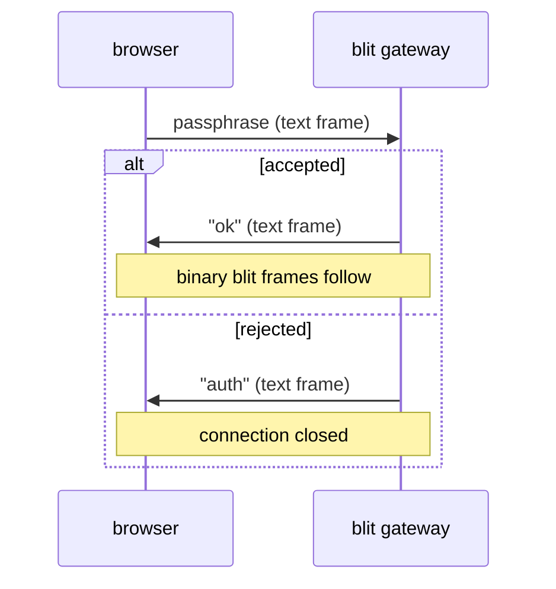
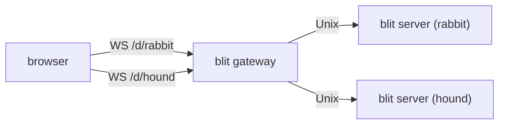
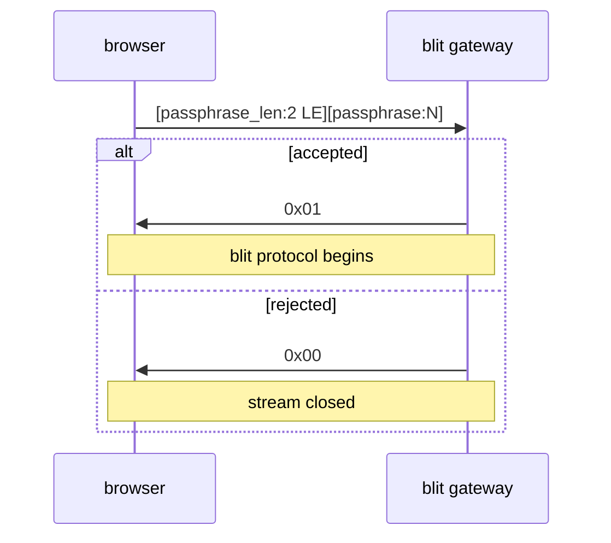
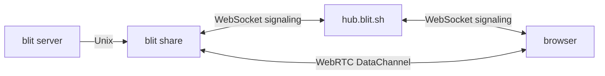
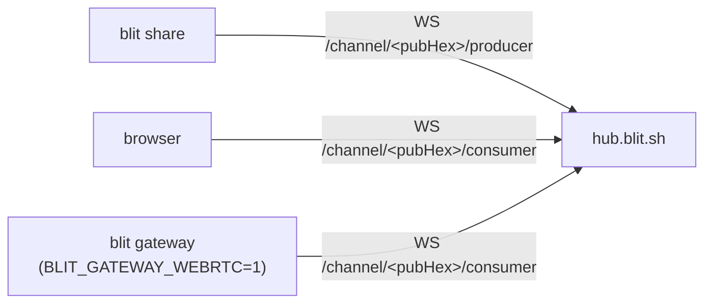
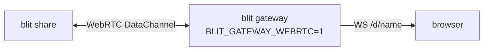
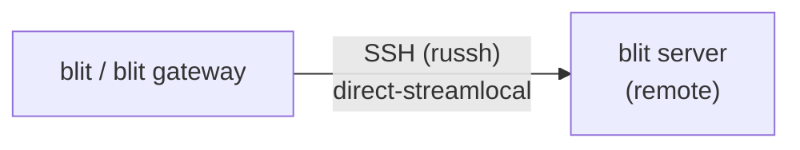
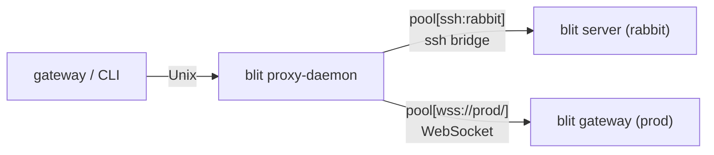

# Transports

The blit wire protocol (see [protocol.md](protocol.md)) is defined purely in terms of ordered, reliable byte streams. Any transport providing that can host a blit connection. This document covers all supported transports, how they connect, and their deployment topologies.

## Transport abstraction

### Rust (`blit-cli`)

`crates/cli/src/transport.rs` defines a `Transport` enum:

```rust
enum Transport {
    Unix(tokio::net::UnixStream),
    Tcp(tokio::net::TcpStream),
    Duplex(tokio::io::DuplexStream),  // SSH channels, WebRTC, etc.
}
```

All variants expose split `(Box<dyn AsyncRead>, Box<dyn AsyncWrite>)` via `.split()`. The rest of the CLI is transport-agnostic.

### TypeScript (`@blit-sh/core`)

The `BlitTransport` interface abstracts over WebSocket, WebTransport, and WebRTC:

```typescript
interface BlitTransport {
  connect(): void;
  send(data: Uint8Array): void;
  close(): void;
  readonly status: ConnectionStatus;
  addEventListener(
    type: "message",
    listener: (data: ArrayBuffer) => void,
  ): void;
  addEventListener(
    type: "statuschange",
    listener: (status: ConnectionStatus) => void,
  ): void;
  removeEventListener(type: string, listener: Function): void;
}
```

Any implementation of this interface can be passed to `BlitWorkspace`.

---

## Unix domain socket

The primary transport. `blit server` binds a `UnixListener`. All other transports ultimately proxy to this socket.

**Socket path resolution** (in order):

1. `$BLIT_SOCK` environment variable
2. `$TMPDIR/blit.sock`
3. `$XDG_RUNTIME_DIR/blit.sock`
4. `/tmp/blit-$USER.sock`
5. `/run/blit/$USER.sock`
6. `/tmp/blit.sock`

The CLI and gateway also try `$TMPDIR` and `$XDG_RUNTIME_DIR` variants before falling back, so the same path is found regardless of whether the process is a user service, a session daemon, or an ad-hoc background process.

### systemd socket activation

When `LISTEN_FDS=1` is set, the server adopts fd 3 as its listening socket instead of binding. Provided units:

| Unit                                           | Scope                | Socket                              |
| ---------------------------------------------- | -------------------- | ----------------------------------- |
| `blit-server.socket` / `blit-server.service`   | user                 | `%t/blit.sock` (runs `blit server`) |
| `blit.socket` / `blit.service`                 | user                 | `%t/blit.sock` (runs `blit server`) |
| `blit-server@.socket` / `blit-server@.service` | system, per-user     | `/run/blit/%i.sock`                 |
| `blit-share@.service`                          | system, per-instance | reads `/etc/blit/share-%i.env`      |

### fd-channel

An external process can pass pre-connected client file descriptors to the server via `SCM_RIGHTS` ancillary messages. Configure with `--fd-channel FD` or `BLIT_FD_CHANNEL=<fd>`. The server calls `recvmsg()` and treats each received fd as an already-connected client stream. This is the integration point for embedding blit server inside a custom service manager or sandbox.

---

## WebSocket

`blit gateway` (and the CLI's embedded gateway) accept WebSocket connections from browsers.

### Auth handshake



After `"ok"`, all subsequent messages are binary WebSocket frames. Each frame is one blit message with no additional length prefix.

### Multi-destination routing

Both the standalone gateway and the CLI's embedded gateway support multiple named upstream destinations. The browser selects a destination via the WebSocket URL path:

- `/d/{name}` — connect to the named destination
- `/` (root path) — connect to the first destination (alphabetically), for backward compatibility with single-server deployments



Terminal IDs are namespaced by connection (`"rabbit:1"`, `"hound:2"`) so they never collide across servers.

### Destination configuration

| Mechanism      | Format                                            | Notes                                         |
| -------------- | ------------------------------------------------- | --------------------------------------------- |
| `blit.remotes` | `name = uri` file (`~/.config/blit/blit.remotes`) | Live-reloaded, 0600, pushed to browser via WS |
| `BLIT_REMOTES` | Path to a `blit.remotes`-format file              | Overrides the default file location           |

`blit.remotes` and the config WebSocket push live destination updates to connected browsers without requiring a page reload. See [ARCHITECTURE.md § Config WebSocket protocol](../ARCHITECTURE.md#config-websocket-protocol).

---

## WebTransport (QUIC / HTTP3)

Enabled with `BLIT_QUIC=1`. The gateway listens for QUIC connections on the same port and address as WebSocket.

### Certificate management

Self-signed certificates are auto-generated at startup and rotated every 13 days (the WebTransport `serverCertificateHashes` API requires `notAfter - notBefore ≤ 14 days`). The certificate's SHA-256 hash is:

1. Stored in the gateway's in-memory `wt_cert_hash` field.
2. Served in the initial `remotes:` WebSocket message as a `certHash` field (browsers reading from the config WS get it automatically).
3. Available at the `/config` endpoint for backward compatibility.

The browser constructs `new WebTransport(url, { serverCertificateHashes: [{ algorithm: "sha-256", value: hash }] })`.

### Stream framing

A single bidirectional QUIC stream carries the blit protocol, using the standard 4-byte LE length-prefixed framing (same as Unix socket). The auth handshake before the blit protocol:



### External TLS certificates

For production deployments with a real CA certificate:

```bash
BLIT_QUIC=1 BLIT_TLS_CERT=/path/to/cert.pem BLIT_TLS_KEY=/path/to/key.pem blit gateway
```

When explicit certs are provided, the browser does not need `serverCertificateHashes` and standard TLS verification applies.

---

## WebRTC DataChannel

`blit share` bridges a blit server to browsers over WebRTC using `str0m` (a sans-I/O WebRTC library). No gateway is involved — the browser connects directly to the forwarder via the signaling hub.



### DataChannel framing

An ordered, reliable DataChannel labeled `"blit"` carries 4-byte LE length-prefixed frames, identical to the Unix socket protocol. The forwarder connects to blit server via Unix socket when the data channel opens.

### Signaling



Both **producer** and **consumers** connect to the same channel. `pubHex` is the Ed25519 verifying key derived from the passphrase via PBKDF2-SHA256 (100,000 rounds, salt `"https://blit.sh"`). The hub assigns each connection a unique sessionId (UUID), so multiple consumers can connect concurrently without colliding.

All SDP offers/answers and ICE candidates transmitted through the hub are signed with the passphrase-derived Ed25519 signing key (whose public key is the channel ID). The hub verifies signatures before relaying. The hub routes by session UUID and never sees the passphrase.

### NAT traversal

The forwarder gathers three candidate types:

1. **Host candidates** — direct local network addresses.
2. **Server-reflexive candidates** — public IP/port from STUN binding (`stun.blit.sh`).
3. **Relay candidates** — TURN allocations (UDP first, then TCP/TLS) from `turn.blit.sh`.

TURN allocations are refreshed every 4 minutes. TURN permissions are re-established on the same interval.

### Lifecycle

WebRTC peer connections are decoupled from the signaling WebSocket. An `established` flag per peer prevents tearing down active data channel sessions on WebSocket reconnect — only peers still in the signaling phase are aborted on reconnect.

### Entry points

```bash
blit share                         # auto-start server, run forwarder, print passphrase
blit share --passphrase mysecret   # deterministic passphrase
blit share                         # subcommand (BLIT_PASSPHRASE, BLIT_HUB)
```

### Gateway-proxied WebRTC

When `BLIT_GATEWAY_WEBRTC=1`, `blit gateway` connects to `share:` entries in `blit.remotes` as a WebRTC consumer and re-exposes them over its normal WebSocket/WebTransport path:



```bash
BLIT_GATEWAY_WEBRTC=1 BLIT_HUB=hub.blit.sh blit gateway
```

`blit.remotes` entries:

```
hound = share:mysecret
hound = share:mysecret?hub=wss://custom.hub   # per-remote hub override
```

The gateway appends `?proxiable=true` to `share:` URIs in the config WebSocket `remotes:` message so the browser uses `WS /d/<name>` instead of attempting a direct WebRTC connection. Without `BLIT_GATEWAY_WEBRTC=1`, `share:` entries are ignored by the gateway and the browser connects directly via WebRTC.

---

## SSH tunneling

`blit-cli` and `blit gateway` connect to remote `blit server` instances over SSH
using an embedded SSH client (`russh` — pure Rust, no system `ssh` required).



The embedded client authenticates via ssh-agent (primary) and key files (fallback),
resolves `~/.ssh/config` (Hostname, User, Port, IdentityFile), and opens
`direct-streamlocal@openssh.com` channels to the remote blit socket. Multiple
channels share a single TCP+SSH connection per host (native SSH multiplexing).

The remote socket path is resolved on the remote host using the standard cascade
(see [Unix domain socket](#unix-domain-socket)). If blit is not installed on the
remote, it is auto-installed to `~/.local/bin`. If the server is not running, it
is auto-started. Connection retries with back-off handle the startup window.

---

## blit proxy-daemon

### Why it exists

Every browser WebSocket connection to `blit gateway` requires the gateway to open a fresh connection to the upstream `blit server`. When the server is remote — reached over TCP or WebSocket — that connection involves a round-trip or more: TCP handshake, gateway auth.

`blit proxy-daemon` eliminates that latency by maintaining a pool of pre-warmed, already-authenticated connections to each upstream. When a browser tab opens, the gateway gets a live connection from the pool instantly. The pool refills in the background so the next tab is equally fast.

### Why it auto-starts

`blit proxy-daemon` is a persistent daemon: one process per user session, shared across all CLI invocations. It auto-starts transparently on Unix and Windows when the CLI or `blit gateway` (with `BLIT_PROXY=1`) needs it. No configuration required — it just works, and restarts automatically if it ever stops.



### Proxy handshake

After connecting to the proxy socket (`$XDG_RUNTIME_DIR/blit-proxy.sock` on Unix, `\\.\pipe\blit-proxy` on Windows), the client sends one line before the blit protocol begins:

```mermaid
sequenceDiagram
    participant C as client
    participant P as blit proxy-daemon
    participant U as upstream

    C->>P: target &lt;uri&gt;\n
    P->>U: connect (pooled or fresh)
    alt success
        P->>C: ok\n
        note over C,U: blit protocol flows transparently
    else failure
        P->>C: error &lt;msg&gt;\n
        note over C,P: connection closed
    end
```

### Pool mechanics

- One `Pool` per distinct upstream URI seen.
- Each pool pre-connects `BLIT_PROXY_POOL` (default: 4) idle connections.
- When a client is handed a pooled connection, the refill task immediately opens a replacement.
- If the pool is empty at request time, the proxy connects directly (no queuing).
- Activity tracking per pool: `last_activity` is `i64::MAX` while any client is connected; set to the current timestamp when the last client disconnects.

### Idle timeout

`BLIT_PROXY_IDLE=<seconds>` causes the proxy to exit when all pools have been idle for that many seconds. A watcher task checks every 5 seconds, ignoring pools with active clients. By default no idle timeout is set and the daemon runs indefinitely.

### Auto-start

The CLI auto-starts `blit proxy-daemon` when needed:

1. Check if the proxy socket/pipe exists and accepts connections.
2. If not, re-exec the current `blit` binary as `blit proxy-daemon` in a detached background process:
   - Unix: `setsid()` + null stdio so the daemon survives terminal close
   - Windows: `DETACHED_PROCESS | CREATE_NO_WINDOW` creation flags
3. Poll until the socket/pipe accepts connections (up to 5 seconds, 50 ms intervals).

The daemon survives the spawning process exiting and is shared across all `blit` CLI invocations in the same user session.

### Upstream URI formats

| Scheme    | Example                                     | Auth                   |
| --------- | ------------------------------------------- | ---------------------- |
| `socket:` | `socket:/run/blit/server.sock`              | none (trusted local)   |
| `tcp:`    | `tcp:host:3264`                             | none                   |
| `ws://`   | `ws://host:3264/?passphrase=secret`         | gateway WS auth        |
| `wss://`  | `wss://host:3264/?passphrase=secret`        | gateway WS auth + TLS  |
| `wt://`   | `wt://host:4433/?passphrase=s&certHash=aa…` | gateway WT auth + QUIC |

Passphrase and cert hash are embedded as query parameters so the pool can reconnect without additional state. The proxy performs the auth handshake once per pooled connection and hands the authenticated stream to the client.

---

## Default target resolution

When no explicit connection flags are given, the CLI resolves the remote in this order:

1. `--on <uri-or-name>` CLI flag
2. `BLIT_TARGET` environment variable
3. `target = <uri-or-name>` key in `~/.config/blit/blit.conf`
4. Local blit server (auto-start)

Named targets (bare names with no `:`) are looked up in `~/.config/blit/blit.remotes`. A bare name in `blit.remotes` is not allowed (no recursive resolution).

```bash
# Save a remote and set it as default
blit remote add prod ssh:prod.example.com
blit remote set-default prod

# All agent subcommands and blit open now target prod
blit terminal list
blit open
blit --on staging terminal list       # one-off override
```

---

## Transport selection summary

| Scenario                   | Default transport               | Override                           |
| -------------------------- | ------------------------------- | ---------------------------------- |
| Local                      | Unix socket (auto-start)        | `--on socket:/path`                |
| Remote via SSH             | blit proxy-daemon → SSH         | `BLIT_PROXY=0` → direct russh      |
| Remote via TCP             | blit proxy-daemon → TCP         | `BLIT_PROXY=0` → direct TCP        |
| Gateway → server (local)   | blit proxy-daemon → Unix socket | `BLIT_PROXY=0` → direct            |
| Gateway → server (remote)  | Embedded SSH (russh)            | Configure in `blit.remotes`        |
| Shareable browser terminal | WebRTC DataChannel              | —                                  |
| Browser → gateway          | WebSocket                       | `BLIT_QUIC=1` enables WebTransport |
