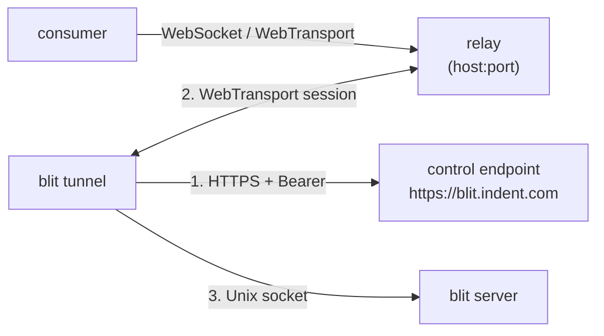
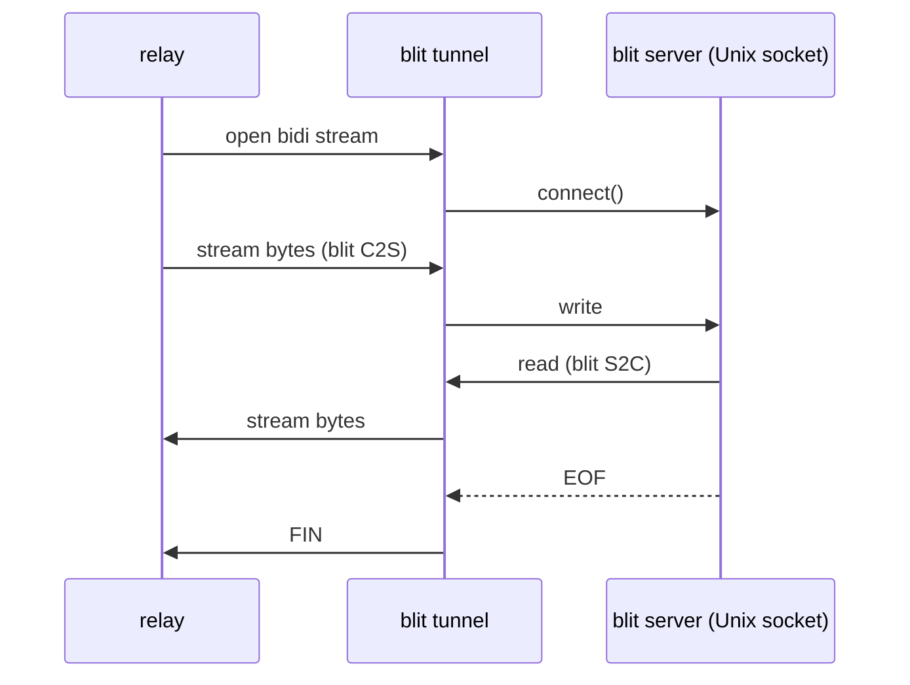

# RFC: `blit tunnel` — outbound WebTransport relay

**Status:** Draft
**Author:** —
**Created:** 2026-07-20

## Summary

`blit tunnel` exposes a local blit server through a relay when the host cannot
accept inbound connections (NAT, firewalled cloud sandbox, ephemeral CI
runner). The tunnel client authenticates to an HTTPS control endpoint with a
bearer token, receives a pool of relay endpoints, establishes a WebTransport
session with one of them, and bridges relay-initiated streams onto the local
blit server socket.

```
BLIT_TUNNEL_TOKEN=<token> blit tunnel https://blit.indent.com
```



There is no custom multiplexing, reliability, or keepalive protocol:
WebTransport (QUIC + TLS 1.3) provides stream multiplexing with per-stream
flow control, loss recovery, congestion control, connection migration, and
encryption. One relay-initiated bidirectional stream = one connection to the
local blit server. The blit wire protocol rides each stream unchanged.

This is the inverse of the gateway topology in [transports.md](transports.md):
the gateway accepts inbound WebTransport and proxies it to the Unix socket;
the tunnel dials out and lets the relay originate streams.

## Motivation

`blit share` already solves outbound exposure via WebRTC, but it requires a
signaling hub, ICE connectivity, and a browser-grade peer on the other end.
Environments like e2b sandboxes or locked-down build hosts need something
simpler and operator-routable: one outbound QUIC flow to a relay run by the
same party that owns the control plane, with authentication handled there
(token in, credentials out).

WebTransport specifically (rather than a bespoke protocol) because the stack
is already in the tree — the gateway's `BLIT_QUIC=1` mode uses
`web-transport-quinn`, which also provides the client side — and because
browsers speak it natively, leaving the door open for relays that splice
consumer streams to tunnel streams without protocol translation.

## Terminology

| Term             | Meaning                                                             |
| ---------------- | ------------------------------------------------------------------- |
| control endpoint | The HTTPS URL passed to `blit tunnel`                               |
| relay            | One `host:port` from the pool; WebTransport server that originates streams |
| tunnel client    | The `blit tunnel` process                                           |
| session          | One established WebTransport session between tunnel client and relay |
| stream           | One bidirectional QUIC stream, bridged to one Unix-socket connection |
| consumer         | Whatever connects to the relay on the far side (out of scope here)  |

## Control plane

### Request

The tunnel client issues:

```
GET <url> HTTP/1.1
Authorization: Bearer <BLIT_TUNNEL_TOKEN>
Accept: application/json
```

`BLIT_TUNNEL_TOKEN` is required; `blit tunnel` exits with an error if it is
unset or empty.

### Response

`200 OK` with an `application/json` body:

```json
{
  "relays": [
    { "host": "relay-1.indent.com", "port": 4443, "passphrase": "kfV3…" },
    { "host": "2001:db8::7", "port": 4443, "passphrase": "9bQx…",
      "certHash": "R7lb…" }
  ]
}
```

| Field        | Type   | Required | Meaning                                        |
| ------------ | ------ | -------- | ---------------------------------------------- |
| `host`       | string | yes      | DNS name or IP address (IPv6 unbracketed; the client brackets it when building the URL) |
| `port`       | number | yes      | UDP port (WebTransport runs over QUIC)         |
| `passphrase` | string | yes      | opaque credential for that relay; restricted to base64url characters (`A–Z a–z 0–9 - _`) so it is URL-safe (see connection URL below) |
| `certHash`   | string | no       | base64url SHA-256 of the relay's certificate (DER); when present the client pins this hash instead of using system trust roots, like the gateway's `serverCertificateHashes` flow |

Unknown fields are ignored, so the control plane can add e.g. region,
priority, or expiry without a format break. The `relays` array MUST contain
at least one entry; an empty array is treated as a retryable error.

Status handling:

| Status      | Behavior                                                        |
| ----------- | --------------------------------------------------------------- |
| 200         | parse pool, proceed                                             |
| 401, 403    | fatal — bad or expired token; exit non-zero with a clear error  |
| 429, 5xx    | retry with backoff; honor `Retry-After` when present            |
| other       | retry with backoff                                              |

### Pool semantics

The client shuffles the pool and tries entries in order. A failed connection
(QUIC handshake failure, CONNECT rejection) moves to the next entry. When the
pool is exhausted, the client re-queries the control endpoint (fresh pool,
fresh passphrases) with exponential backoff and jitter (proposed: 1s initial,
×2, 60s cap).

Passphrases are single-session credentials tied to the pool response; the
client never persists them and always re-queries after a session dies rather
than reusing an old entry.

## Relay session

### Connection

The tunnel client opens a WebTransport session to:

```
https://<host>:<port>/t/<passphrase>
```

Standard TLS verification applies (system trust roots, SNI = `host`) unless
the pool entry carries a `certHash`, in which case the client verifies the
relay's certificate against that pinned hash instead — for relays that
can't carry publicly-trusted certificates. Either way the control-plane
operator owns the relay certificates. The passphrase in the
URL path is the session credential — it is carried inside TLS and
authenticated by the relay during the extended CONNECT. Rejection surfaces
as an HTTP error status on the CONNECT response (`403` for a bad
passphrase); the client moves to the next pool entry.

The passphrase-in-path placement matches what a browser-side `new
WebTransport(url)` can express, keeping the tunnel and future browser
consumers symmetrical from the relay's point of view.

### Streams

After the session is established:

- **The relay opens one bidirectional stream per consumer connection.** The
  tunnel client never opens streams. On each incoming stream, the tunnel
  client connects to the local blit server socket (resolved via the
  [transports.md](transports.md) path cascade, `$BLIT_SOCK` first) and pumps
  bytes in both directions.
- **Stream payload is the blit wire protocol, unchanged** — the standard
  4-byte LE length-prefixed framing, exactly as on the Unix socket and on
  the gateway's WebTransport streams. The tunnel client does not parse it.
- **Graceful close** — Unix-socket EOF is forwarded as a stream FIN, and a
  peer FIN causes a socket shutdown, in each direction independently.
- **Abortive close** — errors are forwarded as `RESET_STREAM` /
  `STOP_SENDING` with an application error code:

  | Code | Meaning                                  |
  | ---- | ---------------------------------------- |
  | `1`  | local blit server unavailable            |
  | `2`  | tunnel shutting down                     |
  | `3`  | local socket error mid-stream            |

  In particular, if the local socket connect fails, the incoming stream is
  reset with code `1` — that is how the relay learns a session could not be
  bridged.
- **Unidirectional streams and WebTransport datagrams are unused.** A peer
  that opens a unidirectional stream is violating the protocol; the stream
  is stopped and ignored.

### Liveness

QUIC's own keepalive and idle timeout replace any custom mechanism.
Proposed quinn configuration: keepalive interval 10s, max idle timeout 30s.
NAT rebinding is handled by QUIC connection migration.

### Stream lifecycle



## Reconnect

The WebTransport session is the unit of state: when it dies (idle timeout,
connection error, relay shutdown), every stream on it is implicitly closed.
The tunnel client:

1. Tears down all local Unix-socket bridges.
2. Re-runs the control-plane request (the "https dance") — it does not retry
   the old pool, since passphrases are tied to a pool response.
3. Establishes a session with a relay from the fresh pool.

Consumers see their connections drop and reconnect through the relay as they
would with any proxy; the blit protocol's session model (`S2C_EXITED`,
re-subscribe on connect) already tolerates this.

`blit tunnel` runs until killed; control-plane and relay failures are retried
indefinitely with backoff. Only a fatal token rejection (401/403) exits.

## Security considerations

- **Token** — `BLIT_TUNNEL_TOKEN` is read from the environment only (no CLI
  flag, to keep it out of `ps` and shell history). It is sent solely to the
  control endpoint, over HTTPS, and never to relays.
- **Transport security** — TLS 1.3 is mandatory in QUIC: the passphrase and
  all terminal traffic are encrypted and integrity-protected on the wire,
  and injection requires breaking TLS. The relay itself still terminates
  TLS and sees plaintext blit traffic (unlike `blit share`'s end-to-end
  DTLS); relay and control plane are assumed to be operated by the same
  party that owns the servers being exposed.
- **Passphrase in URL** — carried inside TLS, so not exposed on the wire,
  but it will appear in relay-side request logs unless the relay redacts
  the path. Relays MUST NOT log the CONNECT path; single-use passphrases
  bound this exposure regardless.
- **Local access** — every relay stream becomes a full client of the local
  blit server, equivalent to local socket access (terminal creation, command
  execution). The control plane's token check is the entire authorization
  boundary; operate it accordingly.

## Implementation notes

- New `tunnel` subcommand in `crates/cli` (`cli.rs` + a `tunnel.rs` module):
  reqwest for the control plane, `web-transport-quinn` (already a
  `blit-gateway` dependency, client API included) for the relay session.
- The per-stream Unix-socket bridge is the same shape as the per-connection
  bridge in `crates/webrtc-forwarder` — two `tokio::io::copy` pumps. The
  server sees ordinary socket clients; no server or protocol changes.
- The relay side is any off-the-shelf WebTransport server; no bespoke
  protocol implementation is required of it beyond passphrase checking and
  stream splicing. Consumers reach the relay over WebSocket or WebTransport
  (see diagram): WebTransport consumers can be spliced stream-to-stream,
  while WebSocket consumers need the relay to bridge framing — one WS binary
  message per blit frame, as the gateway does, vs. the stream's 4-byte LE
  prefixes.
