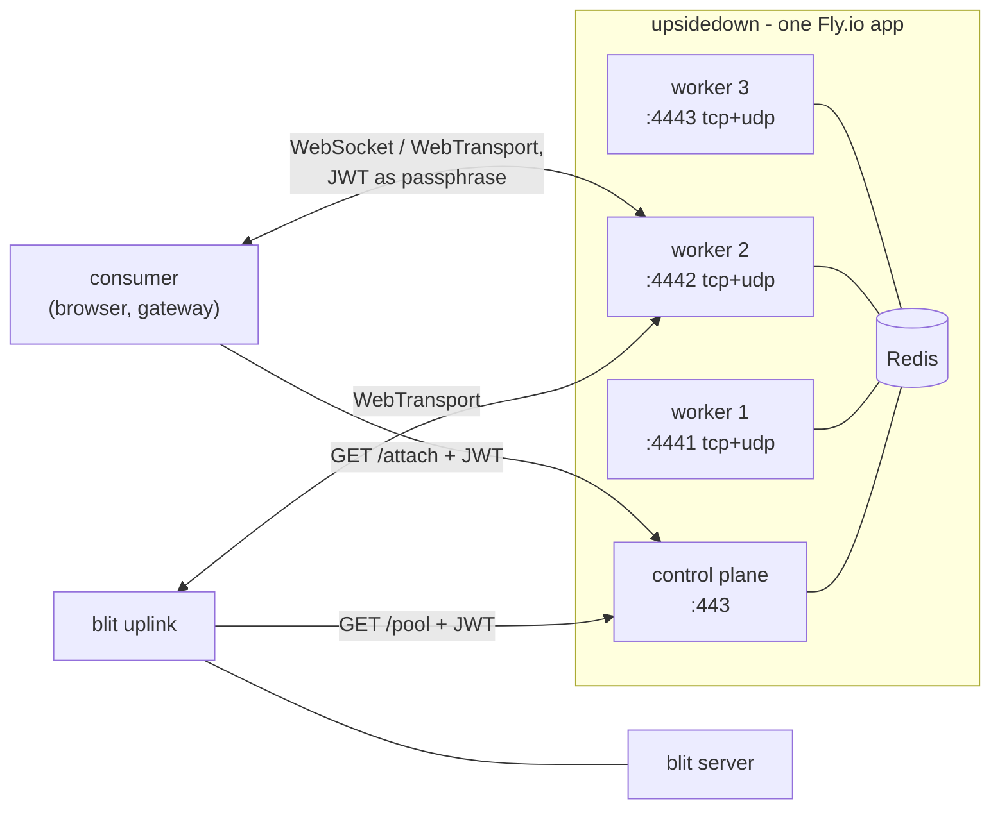
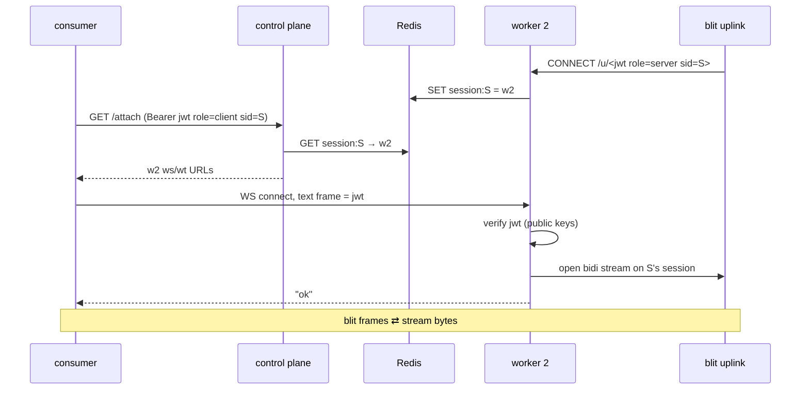

# upsidedown — hosted relay for `blit uplink`

upsidedown is the deployed relay service behind `blit uplink`
([uplink.md](uplink.md)). This document describes its architecture and
operation; deployment and secrets live in [`upsidedown/README.md`](../upsidedown/README.md).

## Summary

upsidedown is the service on the other end of `blit uplink`
([uplink.md](uplink.md)): a Fly.io app, structured and deployed like hub,
that relays consumers to blit servers hiding behind NAT. It has two halves
plus a small shared store:

- a **control plane** that authenticates JWTs, allocates a worker for each
  uplink (spreading load across the registered workers), tells consumers
  where their session's uplink is connected — over both WebSocket and
  WebTransport — and drives ACME, holding the app's Let's Encrypt
  certificate;
- three **workers**, each speaking WebTransport (uplink sessions, browser
  consumers) and WebSocket (browser and gateway consumers), splicing
  consumer connections onto uplink streams;
- **Redis**, holding the state that binds them: which workers are alive,
  which worker each live session is connected to, and the Let's Encrypt
  certificate every listener serves.

Tokens are JWTs signed by one of _n_ configured Ed25519 public keys. Each
carries a **blit session ID** and a **role** (`server` or `client`).
Verification is stateless, so every component checks tokens independently —
and a JWT doubles as the auth passphrase in **unmodified blit clients**: the
existing WebSocket and WebTransport handshakes carry it as an opaque string.



## Motivation

The uplink protocol ([uplink.md](uplink.md)) deliberately leaves the relay
side abstract ("any off-the-shelf WebTransport server"). upsidedown is the
concrete, operated implementation: multi-tenant, cheap to run, with exactly
one piece of shared state. The design goals:

- **Minimal shared state.** Redis holds ephemeral routing facts — worker
  registrations and session→worker bindings, all TTL'd — plus the one
  durable thing every listener needs: the TLS certificate. Tokens are
  verified statelessly by whichever component receives them and are never
  stored.
- **Unmodified clients.** Consumers are ordinary blit clients pointed at a
  worker URL with a JWT where a passphrase normally goes. No new client
  protocol.
- **Key custody stays with the operator.** upsidedown holds only public
  keys; whoever mints tokens (e.g. the indent.com backend) keeps the
  private keys.

## Terminology

| Term          | Meaning                                                                |
| ------------- | ---------------------------------------------------------------------- |
| control plane | HTTPS API on `usd.blit.sh:443`                                         |
| worker        | One relay process, addressed by port (`4441`–`4443`)                   |
| uplink        | A `blit uplink` process exposing one blit server                       |
| consumer      | A blit client (browser or `blit gateway`) attaching to a session       |
| session ID    | JWT claim `sid` — the blit session linking an uplink and its consumers |
| registered    | Present in Redis with a live heartbeat                                 |

## Tokens

A token is a compact JWT, `base64url(header).base64url(claims).base64url(sig)`,
signed with **EdDSA (Ed25519)**.

### Keys

`UPSIDEDOWN_PUBLIC_KEYS` (a Fly secret) holds _n_ comma-separated base64url
Ed25519 public keys (32 bytes each). A token verifies if its signature
matches **any** configured key; an optional `kid` header claim holding the
0-based key index skips the trial loop. Rotation is: add the new key, start
minting with it, drop the old key once its tokens have expired.

### Claims

| Claim  | Required | Meaning                                                                           |
| ------ | -------- | --------------------------------------------------------------------------------- |
| `sid`  | yes      | Blit session ID — the session this token grants access to                         |
| `role` | yes      | `"server"` (may connect the uplink for `sid`) or `"client"` (may attach to `sid`) |
| `exp`  | yes      | Expiry (unix seconds); verified with 60s leeway                                   |

Unknown claims are ignored. Recommended lifetimes: minutes for `client`
tokens, **one year** for `server` tokens — the uplink re-queries `/pool`
with the same env token on every reconnect, and an exposed sandbox should
not stop being reachable because a short token lapsed. Expiry gates
**connection establishment only**: an established session is never severed
when its token's `exp` passes; the token is re-verified on the next
connect.

### Tokens as passphrases

The blit client auth handshakes ([transports.md](transports.md)) carry an
opaque passphrase string: a WebSocket text frame answered `"ok"`/`"auth"`,
or a WebTransport stream preamble `[len:2 LE][passphrase]` answered
`0x01`/`0x00`. A JWT is just such a string. Workers replace the gateway's
passphrase comparison with JWT verification; nothing changes on the client:

```
BLIT_PASSPHRASE=<jwt> blit gateway   # or paste the JWT into the browser prompt
```

## Redis

The single shared store, holding only TTL'd routing state:

| Key                | Value                                         | Written by                                                   | TTL  |
| ------------------ | --------------------------------------------- | ------------------------------------------------------------ | ---- |
| `worker:<name>`    | JSON: `{ "port": 4442, "uplinks": 17 }`       | worker heartbeat, every 5s                                   | 15s  |
| `session:<sid>`    | worker name                                   | worker, on uplink registration; refreshed with the heartbeat | 15s  |
| `acme:account`     | ACME account key, sealed                      | control plane, first boot                                    | none |
| `acme:cert`        | certificate chain + private key (PEM), sealed | control plane, on issue/renew                                | none |
| `acme:challenge:*` | pending TLS-ALPN-01 challenge certificate     | renewing instance                                            | 5m   |
| `acme:lock`        | renewal lock (`SET NX EX 300`)                | renewing instance                                            | 300s |

- A worker is **registered** iff its `worker:<name>` key exists. Graceful
  shutdown deregisters explicitly (see Workers § Shutdown); the TTLs are
  the backstop for crashes, aging a dead worker and its session bindings
  out within 15s.
- `session:<sid>` is written with plain `SET` (latest-wins, matching the
  worker-side session semantics below). On session close the worker
  deletes it **only if it still points at itself** (compare-and-delete via
  a small Lua script), so a stale worker tearing down a zombie can never
  clobber a fresh binding made by another worker.
- Session registrations are also announced on a `session-up` pub/sub
  channel (payload: the `sid`), which is how `/attach` blocks
  event-driven instead of polling; see [`GET /attach`](#get-attach-role-client).
- Tokens never touch Redis. The TLS private key does (see
  [Certificates](#certificates)) — the security section weighs this.

## Control plane

All endpoints take `Authorization: Bearer <jwt>` and return `401` for a
missing/invalid/expired token, `403` for a wrong `role`.

### `GET /pool` (role: `server`)

The control endpoint for `blit uplink https://usd.blit.sh/pool`.
The control plane lists the registered workers from Redis and picks
uniformly at random among those within a small margin of the minimum
active-uplink count (heartbeat counts are up to 5s stale, so a strict
minimum would herd a burst of arrivals onto one worker). It returns the
uplink pool response — a single relay URL with the presented JWT embedded as
the credential:

```json
{ "relays": ["https://usd.blit.sh:4442/u/<jwt>"] }
```

No `#sha256=` pin is needed: workers serve the app's Let's Encrypt
certificate (see [Certificates](#certificates)), so the uplink verifies
against system roots.

No registered workers → `503` with `Retry-After` (the uplink's backoff
handles it). The relay URL is valid for as long as the embedded JWT is;
the uplink re-queries on every reconnect per the uplink protocol, so allocation is
re-balanced at each reconnect. The `session:<sid>` binding is **not**
written here — it becomes true only when the uplink actually connects to
the worker.

### `GET /attach` (role: `client`)

Looks up `session:<sid>` in Redis and returns where that worker is
reachable:

```json
{
  "ws": "wss://usd.blit.sh:4442/",
  "wt": "https://usd.blit.sh:4442/"
}
```

Both endpoints present the app's Let's Encrypt certificate, so browsers
need no `serverCertificateHashes` for WebTransport and no pins anywhere.

If `session:<sid>` is not yet bound, the request **blocks** rather than
failing — so attaching moments before (or during) the uplink's reconnect
just waits. The handler subscribes to the session-registration channel
(Redis pub/sub; an in-process broadcast for the `memory://` store),
re-checks the binding to close the subscribe/check race, then sleeps
until the worker publishes this `sid` on registering its uplink — at
which point it resolves and returns immediately. Only if no uplink
appears within 30s does it return `404` with `Retry-After`. The binding
can still go stale in the instant between resolution and the consumer's
connect, so presence is always re-checked at the worker.

Workers publish the `sid` (and write `session:<sid>`) the moment an uplink
registers; the pub/sub wake is what makes `/attach` event-driven rather
than a busy poll.

## Workers

Each worker owns one external port, serving TCP and UDP on it, and
terminates TLS itself on both with the shared Let's Encrypt certificate
from Redis (see [Certificates](#certificates)):

- **UDP: QUIC/WebTransport** — uplink sessions and browser consumers.
- **TCP: WebSocket** — browser and gateway consumers (raw pass-through
  from the Fly proxy; no Fly TLS handler).

Workers load `acme:cert` at boot, re-check it on every heartbeat, and
hot-swap their rustls/quinn configuration when it changes. A worker only
registers once it holds a certificate, so `/pool` never routes to a
worker that cannot serve TLS. Workers heartbeat `worker:<name>` every 5
seconds with their port and active-uplink count.

### Shutdown

On SIGINT/SIGTERM (deploys restart machines one group at a time) a worker
cleans up rather than letting state age out:

1. `DEL worker:<name>` — immediately stops `/pool` from routing new
   uplinks to it.
2. Compare-and-delete every `session:<sid>` it owns — `/attach` stops
   sending consumers, returning `404` until the uplink re-registers
   elsewhere.
3. Close consumer connections, then each uplink session with a session
   close code; the uplink's reconnect loop re-queries `/pool` right away
   and lands on a surviving worker, instead of discovering the death by
   QUIC idle timeout.

Consumers reconnect through `/attach` and find the new worker within a
heartbeat. A crash skips all of this and the TTLs cover it: bindings
vanish within 15 seconds, and uplinks notice within their 30-second idle
timeout.

### Uplink sessions (WebTransport)

A CONNECT to `/u/<jwt>` with a valid `role: "server"` token registers the
session as `sid`'s uplink; anything else is rejected with `403`. On
registration the worker writes `session:<sid> → <its name>` to Redis. One
active uplink per `sid`: a new registration closes the previous session on
the same worker (latest-wins, so a reconnecting uplink never fights its
own zombie), and a plain `SET` supersedes a binding held by another
worker — the superseded worker's session dies on QUIC idle timeout and
its compare-and-delete is a no-op. The worker opens one bidirectional
stream on this session per consumer, per the uplink protocol.

### Consumers

Blit's own clients reach a session through the `uplink:` remote scheme:
`uplink:<jwt>` (optionally `uplink:<jwt>?control=<url>`, defaulting to
`https://usd.blit.sh`). blit-proxy resolves it — `GET /attach`
with the token, then the WebSocket flow below with the token as
passphrase — so the CLI, `blit gateway`, and `blit.remotes` entries all
work: `blit remote add sandbox uplink:<jwt>`. Under the hood:

- **WebSocket**: connect to `/`, send the JWT as the first text frame.
  Valid `role: "client"` token and `sid`'s uplink present → `"ok"`, then
  binary WS frames are bridged to a fresh uplink stream (one WS message
  per blit frame ↔ the stream's 4-byte LE prefixes, exactly as the
  gateway bridges).
- **WebTransport**: connect a session to `/`, open a bidi stream, send the
  `[len:2 LE][jwt]` preamble. Accepted → `0x01`, then the stream is
  spliced byte-for-byte onto a fresh uplink stream (both sides carry
  4-byte LE framing; no re-framing).

Rejections: invalid token → `"auth"` / `0x00`, as today. Valid token but
no uplink for `sid` on this worker → WS close code `4404` / WT session
close code `404`; the consumer should re-`/attach`, since the uplink may
have reconnected onto a different worker. When the uplink stream resets
(codes 1–3 from the uplink protocol) or the uplink session drops, the consumer
connection is closed.

### Attach flow



## Certificates

The control plane owns ACME against Let's Encrypt, coordinated through
Redis so every process serves the same certificate for
`usd.blit.sh`:

- **Challenge**: TLS-ALPN-01 on port 443. The control plane terminates its
  own TLS (raw TCP pass-through from the Fly proxy, no Fly-managed
  certificate anywhere in the app), so the `acme-tls/1` handshake needs no
  port 80 and no HTTP challenge routes.
- **Storage**: the ACME account key, the issued chain, and its private key
  live in Redis (`acme:account`, `acme:cert`), **sealed** with
  ChaCha20-Poly1305 under a symmetric key from the `UPSIDEDOWN_SEAL_KEY`
  Fly secret (every process holds it; Redis alone yields nothing, the
  secret alone yields nothing). A restarted or redeployed control plane
  reuses them instead of re-issuing — Let's Encrypt rate limits make this
  mandatory, not an optimization.
- **Coordination**: renewal (at < 30 days remaining, checked daily) runs
  under `acme:lock` (`SET NX EX 300`) so concurrent control-plane
  instances never race an order. Pending TLS-ALPN-01 challenge
  certificates are published at `acme:challenge:*` so _any_ instance can
  answer a validation connection, wherever Fly routes it.
- **Distribution**: workers poll `acme:cert` with their heartbeat and
  hot-swap listeners on change. One issuance path covers the control
  plane's HTTPS, the workers' WebSocket TLS, and the workers' QUIC — which
  is why no `serverCertificateHashes`, `#sha256=` pins, or 13-day
  self-signed rotation appear anywhere in upsidedown.
- **Bootstrap**: on first boot the control plane issues before serving;
  `/pool` and `/attach` return `503` until workers hold the certificate
  and register. Steady-state renewal is invisible.

## Deployment

One Fly.io app, laid out and shipped like hub:

- `upsidedown/` at the repo root (mirroring `js/hub/`): `Dockerfile`,
  `fly.toml`, `README.md`. The crate is `crates/upsidedown`; the build
  context is the repo root (the Cargo workspace), so the ENTRYPOINT is the
  `upsidedown` binary and each process group passes only its subcommand.
- `fly.toml` (abridged; full file in `upsidedown/fly.toml`):

  ```toml
  app = "blit-upsidedown"
  primary_region = "iad"

  [build]
    context = "."
    dockerfile = "upsidedown/Dockerfile"

  [processes]
    cp = "control-plane"
    w1 = "worker --name w1 --port 4441"
    w2 = "worker --name w2 --port 4442"
    w3 = "worker --name w3 --port 4443"

  [[services]]                  # control plane HTTPS (app-terminated TLS, ACME)
    processes = ["cp"]
    protocol = "tcp"
    internal_port = 8443
    [[services.ports]]
      port = 443

  [[services]]                  # worker 1 WebSocket (app-terminated TLS)
    processes = ["w1"]
    protocol = "tcp"
    internal_port = 4441
    [[services.ports]]
      port = 4441

  [[services]]                  # worker 1 WebTransport
    processes = ["w1"]
    protocol = "udp"
    internal_port = 4441
    [[services.ports]]
      port = 4441
  # …w2/w3 repeat with 4442/4443
  ```

  One machine per worker group makes each port deterministically one
  worker. UDP requires the app to hold a dedicated IPv4 and workers to
  bind the `fly-global-services` address. Every listener terminates its
  own TLS, so no `fly certs` setup is needed — DNS for
  `usd.blit.sh` points at the app's IPs and ACME does the rest.
  Scaling beyond three workers is a `fly.toml` edit plus nothing else —
  new workers register themselves.

- **CD**: `nix run .#deploy-upsidedown` (a `flyctl deploy` task alongside
  `deploy-hub`) with the repo root as build context.
- **Redis**: managed Redis via Fly (`fly redis create`), reached over
  private networking; the URL lands in the `REDIS_URL` secret.
- **CD**: `deploy-upsidedown.yml` mirrors `deploy-hub.yml` — on push to
  `main` touching the app path, `nix run .#deploy-upsidedown` (a
  `flyctl deploy` task like `deploy-hub`) with `FLY_API_TOKEN`.
- **Secrets**: `UPSIDEDOWN_PUBLIC_KEYS`, `UPSIDEDOWN_SEAL_KEY` (32
  random bytes, base64url), and `REDIS_URL` via `fly secrets set`.

## Security considerations

- **Bearer tokens.** Possession is authorization; there is no revocation
  in v1. Keep `client` tokens short-lived; rotation happens at the key
  level (drop a compromised key and every token it signed dies).
- **Role separation.** `role: "client"` cannot connect an uplink, so a
  consumer token can never impersonate the server side of its session.
- **Tokens in URLs.** The uplink relay URL embeds a JWT (uplink protocol:
  relay URLs are credentials). Workers and control plane MUST NOT log
  CONNECT paths or bearer headers; log `sid` instead.
- **Redis holds routing state and sealed TLS material.** A compromised
  Redis cannot forge access — workers verify every JWT themselves and
  tokens are never stored — but it could misroute or deny sessions. The
  TLS private key it holds is sealed under `UPSIDEDOWN_SEAL_KEY`, so
  recovering it requires compromising both Redis and the Fly secrets.
  The JWT signing keys are unaffected — they live with the operator.
- **Workers see plaintext.** TLS terminates at the worker; blit traffic
  is in the clear inside it. Same trust statement as the uplink protocol:
  relay and control plane are operated by the party the servers already
  trust.
- **Private keys are elsewhere.** upsidedown can authenticate anyone but
  mint no one; compromising it yields sessions, not credentials.
- **Clock skew.** `exp` verified with 60 seconds of leeway; workers run
  NTP-synced (Fly hosts).

## Implementation

The service is the `crates/upsidedown` crate: one binary (`upsidedown`)
with `control-plane`, `worker`, `keygen`, `mint`, and `dev` subcommands.

- The worker reuses the gateway's machinery — `web-transport-quinn` server
  setup and WS↔stream frame bridging mirror `crates/gateway`.
- ACME uses `rustls-acme` (pure-rustls TLS-ALPN-01) with its cache trait
  implemented over Redis (`certs.rs` `SealedCache`) for the account key
  and certificate, sealed with ChaCha20-Poly1305 under `UPSIDEDOWN_SEAL_KEY`.
- JWT verification (`jwt.rs`) uses `ed25519-dalek` directly: split on dots,
  base64url-decode, verify the signature over `header.claims`, parse claims
  with `serde_json`. Only EdDSA is accepted and `alg` is ignored entirely,
  so `alg`-confusion attacks are moot.
- The store (`store.rs`) abstracts Redis and an in-process `memory://`
  backend (used by `dev` and tests) behind one interface: `SET … EX`,
  `GET`, `SCAN`, a Lua compare-and-delete for session teardown, and the
  `session-up` pub/sub channel.
- The control plane (`control.rs`) is a small axum service: two
  authenticated GETs backed by Redis, least-loaded worker selection, and
  the ACME driver.
- `cargo run -p blit-upsidedown -- dev` runs the control plane and workers
  in one process against `memory://` for local testing; see
  [`upsidedown/README.md`](../upsidedown/README.md).
