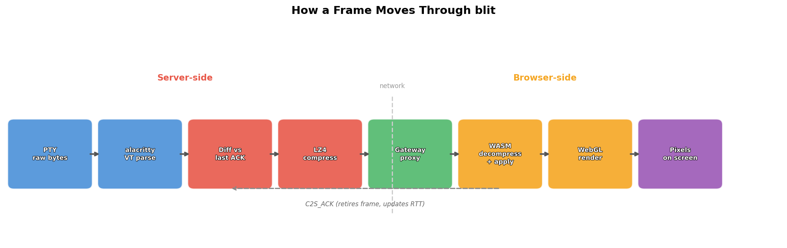
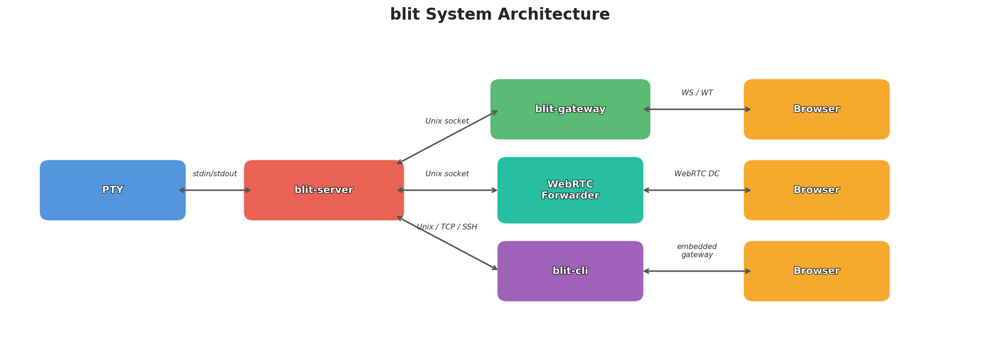
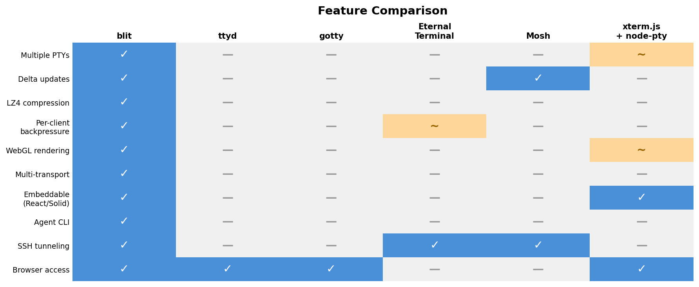

# Why We Built blit: terminal state, not terminal replay

*About a 10 minute read.*

If you only have 30 seconds, here is the whole argument:

- Indent previously used `xterm.js`, but in our setup, attaching to a live terminal meant replaying terminal bytes and history to reconstruct current state.
- That created startup-time and latency problems exactly where a remote terminal should feel instant.
- `blit` flips the model: the server owns parsed PTY state, and clients attach to current state plus incremental diffs instead of rebuilding the world from raw output.
- That turns out to be the right primitive for a product where terminals need to work for humans, browsers, and agents at the same time.

Grounded facts for this post:

- Indent previously used `xterm.js`.
- Replaying terminal byte history to reconstruct state caused real startup and latency issues in our setup.
- The current Indent client integrates `blit` over a WebRTC data channel and presents separate interactive and background terminal session views.

## The bug was architectural

Imagine the worst possible moment to refresh a browser tab.

A build has been streaming output for twenty minutes. Another terminal is running interactively. Logs are noisy. You reconnect. And instead of attaching to the terminal as it exists *now*, the browser has to earn the present by chewing through the past.

That is the core problem.

A remote terminal is not just a byte pipe with a text renderer hanging off the end. A terminal is a state machine. It has a grid of cells, scrollback, cursor position, cursor mode, alternate screen state, mouse modes, colors, styles, wide character behavior, title changes, and a pile of escape-sequence-driven semantics that only exist after parsing the stream.

If you store only bytes, every new client has to re-derive that state. If you store state, new clients can attach to something current.

That distinction stops being abstract the moment the terminal is long-lived, shared, remote, multi-session, or agent-driven. Then the past stops being just history. It becomes part of your startup path.

That was the failure mode for us with `xterm.js`. The issue was not that `xterm.js` is bad. It is the standard for a reason. The issue was that, in our setup, reconstructing current terminal state by replaying terminal bytes and history was work we kept making fresh clients pay for.

> The past should not be your startup path.

That sentence is the shortest explanation of why `blit` exists.

## What blit actually is

From the outside, `blit` looks pleasantly small:

```bash
curl -sf https://install.blit.sh | sh
blit open
blit share
blit open --ssh myhost
blit start htop
blit show 1
blit send 1 "q"
```

From the inside, it is a full terminal streaming stack.

At the center is `blit-server`, which owns PTYs, scrollback, parsed terminal state, and per-client frame pacing. Around it sit:

- `blit-gateway` for browser access over WebSocket and WebTransport
- `blit-webrtc-forwarder` for peer-to-peer sharing over WebRTC DataChannels
- a CLI that can speak Unix sockets, TCP, SSH, and WebRTC
- a browser runtime that applies frame diffs in WASM and renders with WebGL
- React and Solid bindings for embedding the terminal surface in your own UI

The whole system is built around one idea: **the server should understand what is on screen, not just shuttle bytes**.

Traditional browser terminals usually look like this: the backend reads raw bytes from a PTY and forwards them; the browser runs a terminal emulator, parses VT escape sequences, and reconstructs the state for itself. The server is mostly a dumb pipe.

`blit` inverts that model. The server parses PTY output through `alacritty_terminal` and maintains the full parsed terminal state: cell grid, styles, cursor, scrollback, title, modes, the lot. When it is time to update a client, the server does not dump the raw byte stream. It diffs the current terminal state against what that specific client last acknowledged, encodes only the delta, LZ4-compresses it, and sends the result.

That changes both startup cost and product shape.

## How a frame moves

The PTY-to-pixels path looks like this:



1. **PTY emits raw bytes** — program output, escape sequences, the works.
2. **`alacritty_terminal` parses** — the VT state machine converts bytes into a structured cell grid.
3. **Server diffs against last ACK** — for each connected client, the server compares the current grid to what that client last confirmed it received.
4. **Encode + LZ4 compress** — the diff is encoded as `COPY_RECT`, `FILL_RECT`, and `PATCH_CELLS`, then compressed.
5. **Gateway proxies** — the stateless gateway handles browser auth and forwards binary frames.
6. **WASM decompresses and applies** — a Rust WASM module patches the browser's local cell grid. No VT parsing in browser JavaScript.
7. **WebGL renders** — shader programs draw backgrounds, glyph quads, and cursor state from zero-copy vertex buffers exposed out of WASM memory.
8. **Browser ACKs** — acknowledgements retire in-flight frames and feed RTT estimation.

Each cell is encoded in a compact fixed-width layout with overflow handling for larger Unicode content. The wire format is not protobuf, not JSON, and not an external schema layered over the terminal. It is a hand-rolled binary protocol because the system wants to ship terminal state efficiently, not narrate it politely.

The important detail is not just compression. It is *what* gets compressed. The unit of transmission is not “whatever bytes the PTY just emitted.” It is “what changed in the terminal state for this particular client.”

That is the difference between replaying history and attaching to truth.

## Why it feels fast

There are several wins stacked on top of each other.

First, new clients do not replay the whole past. The browser is not paying a reconstruction tax every time it joins a busy session.

Second, only changed cells are shipped. Scrolling can be encoded as copy-rect operations instead of resending the whole visible region. Clears can become fill operations. That is much closer to a graphics protocol than a log transport.

Third, `blit` is explicitly per-client. It tracks acknowledgements, RTT, backlog depth, display rate, and frame apply time. That lets the server pace each viewer independently.

This is the part almost nobody ships well.

When multiple clients are watching the same terminal, they should not all be forced to move at the speed of the slowest one. If a developer on a fast machine is actively focused on a session, that experience should stay hot. If another viewer is slow, remote, or just watching a background terminal, that client should get updates paced to what it can actually handle. If an agent is consuming state more conservatively, it should not accidentally drag the human user's live terminal down with it.

`blit` tracks detailed per-client congestion state:

- **RTT estimation** via ACK round-trips
- **bandwidth estimation** from delivery rates and ACK cadence
- **frame windows** bounded by the bandwidth-delay product
- **display pacing** based on the client's refresh rate, backlog depth, and frame apply time
- **preview budgeting** so focused PTYs get priority while background sessions share leftover bandwidth

This is why a fast client on localhost can get frames as fast as it can render them, while a thinner client gets paced to its capacity, and neither secretly becomes the global bottleneck.

The README has a line I like because it captures the whole feature in one sentence: a phone on a slower connection should not stall a workstation on localhost.

## Five transports, one protocol

The wire protocol is defined in terms of reliable ordered byte streams, not in terms of one favored network API.

| Transport | Use case |
|---|---|
| **Unix socket** | Primary. Server ↔ gateway, server ↔ CLI. |
| **WebSocket** | Browser connections through the gateway. |
| **WebTransport** | QUIC/HTTP3 for lower-latency browser connections. Self-signed certs with hash pinning. |
| **WebRTC DataChannel** | Peer-to-peer. `blit share` prints a URL; anyone with the passphrase can connect. Ed25519-signed signaling. |
| **SSH** | `blit open --ssh myhost` tunnels the protocol over SSH. |

On the Rust side, the transport becomes `AsyncRead` + `AsyncWrite`. On the TypeScript side, anything implementing the `BlitTransport` interface can plug into a workspace. The transport is a layer, not the architecture.

## Agent subcommands: terminals as an API

This is one of the most distinctive parts of `blit`, and one of the biggest reasons it fits Indent well.

```bash
ID=$(blit start --cols 200 -t build make -j8)
blit wait "$ID" --timeout 120 --pattern 'BUILD OK'
blit history "$ID" --from-end 40 --limit 40
blit send "$ID" ""
blit restart "$ID"
blit close "$ID"
```

Every subcommand opens a connection, does one thing, and exits. Output is plain text: TSV for `list`, raw terminal text for `show` and `history`. Exit codes are meaningful. Errors go to stderr. There is no custom SDK, no long-lived browser client to manage, and no pretense that screen scraping is an API.

`show` gives you the current viewport — what a human would see right now. `history` gives you scrollback with pagination. `send` pushes keystrokes with C-style escapes. `wait` blocks until the process exits or a regex matches new output.

For AI agents, this is huge. An agent does not necessarily want to speak terminal protocol directly. It wants to start a process, read the latest output, wait for a condition, send some input, and move on. `blit` turns the terminal into a first-class control surface instead of leaving it as a visual side effect.

That is a different ambition than “terminal in browser.” It is closer to “terminal as infrastructure.”

## More than a renderer: the full feature set

One reason `blit` is compelling is that it is not a point solution. It covers the terminal lifecycle end to end.

- **Local browser terminal** via `blit open`, with gateway-backed browser access over WebSocket or WebTransport.
- **Shareable sessions** via `blit share`, using WebRTC DataChannels, signed signaling, and STUN/TURN-assisted NAT traversal.
- **Remote access over SSH** without changing the user model.
- **Multiple PTYs as first-class objects**, with focus, subscriptions, visibility, and independent resizing.
- **Search, readback, and precise copy behavior**, including scrollback access and copy-range semantics.
- **Embedding** through `@blit-sh/core`, `@blit-sh/react`, and `@blit-sh/solid`.
- **A reference web app** with layouts, overlays, palette and font controls, disconnected-state UX, and debug views.
- **Operational hooks** like systemd socket activation, Homebrew services, Debian service templates, Nix modules, and `fd-channel` embedding.
- **Packaging that respects reality**, including curl install, Homebrew, APT, Nix, Windows, and static Linux binaries via musl.

There are also quieter features that matter once a system graduates from demo to infrastructure: predicted echo informed by PTY mode bits, server font serving to the browser, careful Unicode handling, and an explicit audit document for the non-obvious unsafe code in the project. A repo with an `UNSAFE.md` that documents invariants is the kind of repo that expects the code to matter operationally.

## Architecture: stateful server, stateless edges



The design falls out of one decision: **the server owns the state**.

`blit-server` hosts PTYs, scrollback, parsed terminal state, and per-client pacing. `blit-gateway` is stateless: it authenticates browser clients and proxies binary messages. That means PTYs survive gateway restarts, the gateway can sit behind a reverse proxy, and the CLI can embed a temporary gateway when it wants browser access without requiring a permanent deployment.

For embedding in another service, `fd-channel` mode lets an external process pass pre-connected client file descriptors into `blit-server` via `SCM_RIGHTS`. Your service can own auth and connection acceptance; `blit` owns the terminal machinery. On the frontend, the framework bindings are intentionally thin:

```tsx
import { BlitTerminal, BlitWorkspace, BlitWorkspaceProvider } from "@blit-sh/react";

<BlitWorkspaceProvider workspace={workspace}>
  <BlitTerminal sessionId={session.id} style={{ width: "100%", height: "100vh" }} />
</BlitWorkspaceProvider>
```

The workspace manages connections, sessions, focus, visibility, and lifecycle. The terminal surface renders a session by ID. That is a clean API boundary for embedding a real remote terminal rather than a toy widget.

## Why this is the right answer for Indent

Here is the narrow, accurate claim:

For Indent, `blit` is a better primitive than replaying terminal history into browser state.

Because the terminal in Indent is not serving one audience.

It has to work for:

- a human user who wants fast attach, low input latency, readable output, resizing, and selection
- a browser UI that needs current state instead of a byte log it must reconstruct from scratch
- an agent that benefits from stateless terminal operations like `start`, `show`, `history`, `send`, and `wait`

That is already enough to eliminate a lot of simpler designs.

It also matters that Indent explicitly distinguishes interactive and background terminal sessions. `blit`'s focus and visibility model fits that reality well. Focused sessions can get the budget. Background sessions can stay alive and observable without being treated as equal-priority rendering work.

And there is one more important point: `blit` is transport-agnostic all the way up the stack. In the current Indent client, the integration uses a WebRTC data channel transport. That is not a bolt-on curiosity. It is a sign that the underlying abstraction is right. The same terminal system can be local, remote, browser-facing, shareable, and agent-driven without changing its core mental model.

That is what makes `blit` feel like infrastructure rather than a widget.

## How it compares



Every tool in this space made a reasonable set of tradeoffs. `ttyd` and `gotty` are simple and direct. `Mosh` understood state diffs early, but has no browser story. `Eternal Terminal` solves persistence over flaky links, again without a browser story. `xterm.js` is extremely flexible precisely because it is a library, not a full product stack.

`blit` is unusual because it is opinionated about the whole stack at once: server-side parsing, binary diffs, per-client pacing, multiple transports, browser rendering, and agent-friendly CLI semantics. The tradeoff is that it is a bigger thing to understand than the simplest browser-terminal servers, and a less blank canvas than `xterm.js`. For the use case it targets, that tradeoff is the point.

## The reconnect problem, solved

This is the issue that started everything for us, and it is still the cleanest proof that the architecture matters.

With `xterm.js`, when a user reconnects — browser refresh, network blip, new tab — the server has to replay raw PTY byte history so the browser can reconstruct terminal state by parsing every byte from scratch. A build that has been running for twenty minutes means twenty minutes of bytes to replay, or else truncation and lost context. Either way, you are choosing between latency and correctness.

`blit` removes that tradeoff. Because the server holds parsed terminal state, a reconnecting client gets a compressed snapshot of *what is true right now*. Session age is mostly irrelevant. A terminal that has been running for six hours reconnects on the basis of current state, not on the basis of all the bytes that led there.

This also makes consistency structural, not aspirational. When the browser runs its own VT parser, it can drift around Unicode width edge cases, incomplete escape sequences, or timing-dependent mode changes. In `blit`, the server is the single source of truth and the browser applies patches. If anything diverges, the next delta snaps it back.

## What almost everybody should learn here

Even if you never use `blit`, there is a useful lesson here: “terminal in the browser” is not one problem. It is terminal emulation, state ownership, and transport policy. If you solve only the first one, you can still end up with something that technically works but product-wise feels slow or fragile. `blit` is interesting because it starts with the second and third questions. Where should truth live? How should clients attach to it? Once that answer is solid, the rest of the stack gets cleaner.

## Try it

No install needed:

```bash
docker run --rm grab/blit-demo
```

This starts a sandboxed container with `blit share`, fish, neovim, htop, and the usual suspects. It prints a URL. Open it — you are in a terminal. Open it in a second tab — both update independently, paced to their own render speed. That is per-client congestion control made visible.

Or install it:

```bash
curl -sf https://install.blit.sh | sh
blit open                              # local browser terminal
blit share                             # share over WebRTC — prints a URL
blit open --ssh myhost                 # remote terminal in your browser
blit start htop && blit show 1         # start a session, read what's on screen
```

Also available via [Homebrew](https://github.com/indent-com/homebrew-tap), [APT](https://install.blit.sh), and [Nix](https://github.com/indent-com/blit#nix). The code is at [github.com/indent-com/blit](https://github.com/indent-com/blit).

## Closing

The best thing about `blit` is not just that it is written in Rust, or uses WASM, or renders with WebGL, or can share a terminal over WebRTC.

Those are all good choices.

The best thing is the underlying decision:

> a terminal session is a stateful product primitive, not a historical byte stream that every client must replay to deserve the present.

For Indent, that is the right answer.
